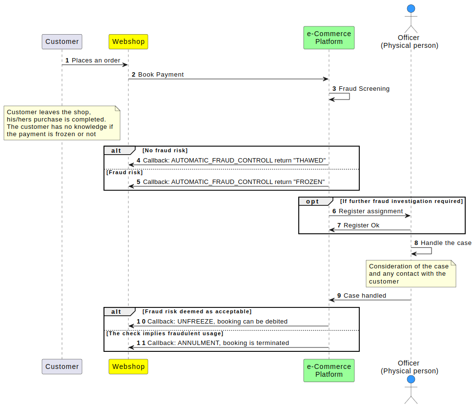

# Concepts and Domain 

Like any other system, Resurs Bank eCommerce has a couple of concepts
defining its domain. Understanding this domain reduces the risk of
misunderstanding what functions do, and speeds up development. Thus we
would recommend that you scroll through these pages before starting the
final integration.
##### On this page:
- [High level chart of shop
  flow](#ConceptsandDomain-Highlevelchartofshopflow)
- [Annulment and crediting](#ConceptsandDomain-Annulmentandcrediting)
- [Associated metadata](#ConceptsandDomain-Associatedmetadata)
- [Credit cost information](#ConceptsandDomain-Creditcostinformation)
- [Fraud screening](#ConceptsandDomain-Fraudscreening)
- [Invoices and credit notes](#ConceptsandDomain-Invoicesandcreditnotes)
- [Payment methods](#ConceptsandDomain-Paymentmethods)
- [Payments](#ConceptsandDomain-Payments)
- [Signing](#ConceptsandDomain-Signing)
  
### High level chart of shop flow
**Simplified Shop Flow**

### Annulment and crediting
Descrition when to use annulment and when to use crediting...
  
This document describes when to use annulment and when to use crediting.
The table below shows a scenario that is probably far from an ordinary
situation but is perfect for understanding the concepts.
  
| Step | Action                                   | Amount  | Order Value | Available Purchase Amount | Annulable/Charged | Creditable    |
|------|------------------------------------------|---------|-------------|---------------------------|-------------------|---------------|
| 1    | Creating limit                           | 2.000 € | 0 €         | 2.000 €                   | No                | No            |
| 2    | Book Payment                             | 1.000 € | 1.000 €     | 1.000 €                   | Yes - 1.000 €     | No            |
| 3    | Sell the entire order / Finalize Payment | 1.000 € | 1.000 €     | 1.000 €                   | No                | Yes - 1.000 € |
| 4    | Crediting half order                     | 500 €   | 500 €       | 1.500 €                   | No                | Yes - 500 €   |
| 5    | Additional purchases                     | 300 €   | 800 €       | 1.200 €                   | Yes - 300 €       | Yes - 500 €   |
  
An unspecified withdrawal can be made with the result that 300 € is
removed from the payment by annulment and an unspecified withdrawal can
be made with the result that 500 € is removed from the payment by
crediting.
  
Annulment vs. Crediting
  
|                  | Annulment                                                                       | Crediting                                                                                                                                                                                                                                                                                                                                                                                     |
|------------------|---------------------------------------------------------------------------------|-----------------------------------------------------------------------------------------------------------------------------------------------------------------------------------------------------------------------------------------------------------------------------------------------------------------------------------------------------------------------------------------------|
| Basic rule       | Annulment can only be made on (part) payments that have not yet been finalized. | Crediting can only be made on (part) payments that has been finalized.                                                                                                                                                                                                                                                                                                                        |
| Money management | No money needs to be paid to the agent and no adjustment needs to be made.      | Since the agent actually got paid from (part) payment when it was finalized, it must be regulated by money waiting to be paid to the agent, to be withdrawn. (Doesn't have to be the same for the customer)                                                                                                                                                                                   |
| Authorization    | No transactions has been made at this point.                                    | It recorded a credit transaction on the client/customer for the current agent.                                                                                                                                                                                                                                                                                                                |
| Money, customer  | No money has been shifted at this point, hence no impact.                       | Credit transaction means that the money is returned to the customer's account, or the customer's potential debt has been reduced by the same amount.                                                                                                                                                                                                                                          |
| Money, agent     | No money has been shifted at this point, hence no impact.                       | When the agent actually has got paid for a (part) payment when it was finalized, a credit means that a correction must be made by taking money waiting to be paid to the agent and pay to the customer. (Doesn't have to be the same for the customer.) If there are no such payments to the agent then the correction will wait until one comes, or the correction must be handled manually. |
  
  
Completely or partially, annulment / credit.
whether if it´s a annulment or credit, it can be made either completely
or partially.
- AfterShopService.annulPayment(...) - full - or part annulment of a
  payment, with or without specification (only the amount is required)
- AfterShopService.creditPayment(...) - full - or part crediting of a
  payment, with or without specification (only the amount is required)
  

  
  
### Associated metadata 
Additional information in an order...
#### What & why
The metadata is key/value data and its additional information in an
order, determined by the e-retailer. It can be added to the order and
can later be useful when [searching](Find-Payments_1474966.html) for a
payment. It can be anything, like information about the shipment. You
can manage metadata through
[**PaymentAdmin**](Payment-administration-GUI_327748.html) or using the
**[aftershop webservice](After-Shop-Service-API_327799.html)**
#### Special metadata types
While we generally don't look at the metadata *there are* some keys we
keep a lookout for: [Recognized
metadata](Recognized-metadata_3440674.html)
  
  
### Credit cost information
Mandatory information in the checkout...
You are obliged to show credit information and link to Resurs Bank when
showing prices based on credit, like a monthly cost.
#### Introduction
Credit cost information is information on cost elements (interest, fees,
etc.) and total cost of our credits/loans. You have two options on how
to show this information:
1.  Download price information through our web service.
2.  [Link to us](#ConceptsandDomain-Anchor-LinkToUs) - we have a simple
    web-application showing the price information.
**Download Credit cost information**
This is done by a call to the
[getCostOfPurchaceHtml](getCostOfPurchaseHtml_4653091.html) API method
of the web service
This chunk of HTML should be shown in a modal window. As you can see it
is styleable and we consider the element classes used to be part of our
interface; we won't change them.
#### Link to us
With ` `[`getPaymentMethods`](getPaymentMethods_950328.html)` ` we
return three links. The third of these goes to a simple web application
which displays price information. Wanna know how it looks? [Here's a
norwegian
example](https://secure.resurs.se/priceinfo/prisskyltning.html?countryCode=NO&authorizedBankproductId=NN120069&representativeId=105400&creditAmount=30000).
#### Annuity
ECommerce can return a number of factors which when multiplied with a
price represents a monthly cost for the product. See
[getAnnuityFactors](getAnnuityFactors_4653093.html) method.
For example.
***LED TV 4.995:- SEK, partial payments interest free for 24 months for
237 kr month.***
You as the agent are forced to link to us for further price information
when you show this kind of "prices".
  
 
### Fraud screening
What is fraud screening...
Fraud screening is about asserting the identity of the buyer, while the
[limit applications](#ConceptsandDomain-Anchor_LimitApplications)
controls whether the buyer is eligible for the required credit. Fraud
screening exists so neither party gets cheated and to increase security.
Fraud screening is performed when a purchase is made. If the automated
routine finds suspicious patterns the payment will be **frozen** and
Resurs Bank will assign a fraud officer to *ensure that the purchase is
made by assumed buyer*.
When frozen, the payment cannot be
[finalized](Finalize-Payment_1474883.html). The payment will eventually
be **unfrozen** or **annulled.** Since manual handling is done in
daytime the unfreeze event can happen serveral days after the payment
was frozen.
The status FROZEN is to be transparent to the customer. For all
purposes, to the customer, the purchase has been made.
Purchase [finalization](Finalize-Payment_1474883.html) and delivery are
affected and stalled until the payment turns UNFROZEN. Thus, the
merchant is responsible to monitor the status of the purchase, which can
be done by either the [Payment Administration web
GUI](Payment-administration-GUI_327748.html) or via registering and
handling [Callbacks](Callbacks_327724.html) .
#### Status
The status of the payment fraud control.
  
| Value               | Description                                                                                                                                                                                                             |
|---------------------|-------------------------------------------------------------------------------------------------------------------------------------------------------------------------------------------------------------------------|
| FROZEN              | The payment is currently frozen. This typically means that there is something that needs further investigation before the payment can be finalized.                                                                     |
| BOOKED              | The payment is not frozen, and may be finalized at any time.                                                                                                                                                            |
| CONTROL_IN_PROGRESS | *The deprecated flow*: the **automatic** fraud control is still in progress. It will result in FROZEN or BOOKED.In the simplified flow you will get an intermediate status of FROZEN when the control is still running. |
  
Agent represent both agent and customer in this flow
  
  

  
### Invoices and credit notes
Click here to expand...
#### Invoice settings
You can get and set next invoiceNumber in the After Shop service. Learn
more about this **[here...](Peek-Invoice-Sequence_1475487.html)**
#### Get invoice
You can retreive a invoice document in the After Shop Service. Learn
more about this **[here...](1474974.html)**
### Payment methods
Available types of payment methodes...
A payment method is a way to finance a purchase. The payment methods
available to choose from are:
- Invoice *(multiple)*
- Revolving credit (new card)
- Card payment
- Part payment
#### Limit
Every paymentmethod except card has a limit. The limit, the
amount/payment span + standard increment, must be within for example
5,000 - 50,000 SEK. Note that the limit of the payment methods differs
from each other. Read more about** [limit
applications](#ConceptsandDomain-Anchor_LimitApplications)**
#### Invoices
We support multiple types/settings of invoices: invoice for an
individual customer or companies and we also provide invoices with part
payment. The invoice will be sent by email to the customer. The invoice
is generated when the payment has been finalized. If you prefere to
handle the generation of the invoice yourself, you do this by not
supplying an invoice number when finalizing the payment. However, the
invoice must be pointing at us because we are creditors.
### Payments
Payment vs. payment diff...
What is the difference between a payment and a payment-diff and how are
they related? The simpliest answer is that **a payment is a group of
payment-diffs**.
#### Payment vs. Order
As defined above, payment sounds quite similar to ordergroups, and
installment quite similar as orders, but there are some significant
differences in how they are handled. Assume the following series of
events:
1.  Creating new order for 2,000 SEK
2.  Sell half warrant (1000 SEK)
3.  Annul half (500 SEK)
4.  Credit of 25% of the sold portion (250 SEK)
5.  Buy additional things for 300 SEK
 
#### The type of payment part.
  
| Value     | Description                                   |
|-----------|-----------------------------------------------|
| AUTHORIZE | The payment part is an authorization request. |
| DEBIT     | The payment part is a debit request.          |
| CREDIT    | The payment part is a credit request.         |
| ANNUL     | The payment part is an annulment request.     |
  
#### Types of payment diffs
Today, the system supports the following types of payment diffs:
  
| Type      | Description                                        | Banking system                                                                  | Order value | When is it used?                        | Comments                                                                                   |
|-----------|----------------------------------------------------|---------------------------------------------------------------------------------|-------------|-----------------------------------------|--------------------------------------------------------------------------------------------|
| AUTHORIZE | Reservation of part / whole of the allotted limit. | Authorization of amounts in accounts.                                           | Increases   | When a purchase is booked.              | In earlier drafts DEBIT has had dual functions, authorization and billing has been done by |
| DEBIT     | Making of a debit.                                 | Transaction of the amount on account.New authorization on the remaining amount. | Unchanged   | When goods are shipped to the customer. | See above                                                                                  |
| CREDIT    | Effecting a crediting.                             | Crediting the amount of the account.                                            | Reduced     | When a return is received.              |                                                                                            |
| ANNUL     | Annulment of the reservation amount.               | New authorization on the remaining amount.                                      | Reduced     | When a booked purchase is canceled.     |                                                                                            |
  
#### Payment Status
  
| Status Code | Description      |
|-------------|------------------|
| DEBITABLE   | Can be debited.  |
| CREDITABLE  | Can be credited. |
| IS_DEBITED  | Is debited.      |
| IS_CREDITED | Is credited.     |
| IS_ANNULLED | Is annulled      |
  
### Signing
Whether or not signing is required...
Signing is a way for the buyer to identify him-/herself and therefor
reduces risk for **[fraud
screening](#ConceptsandDomain-Anchor_FraudScreening).** When signing is
required varies depending on the purchase amount and other
circumstances. Below you can see how the signing works.
