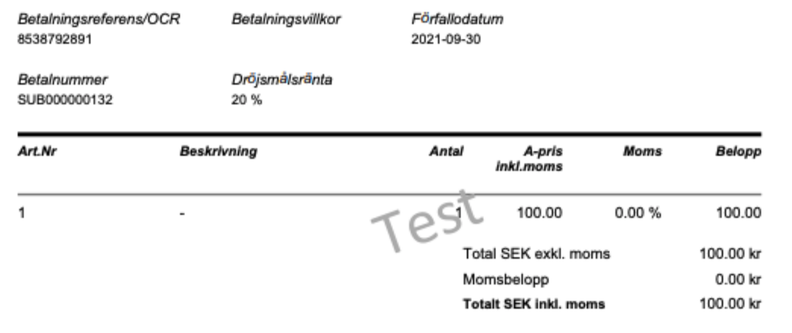

# EComPHP: DEBIT, CREDIT, ANNUL \[afterShopFlow\] 

- [Aftershop
  Setup](#ecomphp:debit,credit,annul%5Baftershopflow%5D-aftershopsetup)
  - [Payment specs and
    finalizations](#ecomphp:debit,credit,annul%5Baftershopflow%5D-paymentspecsandfinalizations)
  - [skipSpecValidation
    (\*\*)](#ecomphp:debit,credit,annul%5Baftershopflow%5D-skipspecvalidation(**))

- [How to use
  this](#ecomphp:debit,credit,annul%5Baftershopflow%5D-howtousethis)
  - [Example](#ecomphp:debit,credit,annul%5Baftershopflow%5D-example)
  - [Partial handling
    example](#ecomphp:debit,credit,annul%5Baftershopflow%5D-partialhandlingexample)

- [Customizing
  invoice](#ecomphp:debit,credit,annul%5Baftershopflow%5D-customizinginvoice)
- [Cancelling full
  orders](#ecomphp:debit,credit,annul%5Baftershopflow%5D-cancellingfullorders)

[Forcefully change orderlines with other
prices](#ecomphp:debit,credit,annul%5Baftershopflow%5D-forcefullychangeorderlineswithotherprices)
[Helper
functions](#ecomphp:debit,credit,annul%5Baftershopflow%5D-helperfunctions)
[Bad invoiceId
setup](#ecomphp:debit,credit,annul%5Baftershopflow%5D-badinvoiceidsetup)
[Backward compatible functionality (Unsupported - Do no
use)](#ecomphp:debit,credit,annul%5Baftershopflow%5D-backwardcompatiblefunctionality(unsupported-donouse))

This is a document on how to use the afterShopFlow in EComPHP. 

> Best practicesIt is a good idea to surround all calls with try- and
> catch methods, since the NetCurl-library may throw more serious errors
> during the aftershop handling; i.e. if something goes really wrong,
> this will happen.No second parameter with payload data is required if
> you plan to use the addOrderLine() functions. Doing this, EcomPHP will
> render own customized orderRows (so, yes, addOrderLine can be used
> both for booking and aftershop functions).

## Aftershop Setup

| Old method      | MaxParm | Parameters                                                                                                                       | Extra information                                                                                                                                                                                        |
|-----------------|---------|----------------------------------------------------------------------------------------------------------------------------------|----------------------------------------------------------------------------------------------------------------------------------------------------------------------------------------------------------|
| paymentFinalize | 4       | paymentId (string, required)customizedOrderRows (array, optional)runOnce (boolean, optional)skipSpecValidation(boolen, optional) | **runOnce**=Tell EComPHP to only run finalization once. Default is false (\*).**skipSpecValidation**=Allows developers to override the getPayment orderRow validation (v1.3.23+) during aftershop (\*\*) |
| paymentAnnul    | 3       | paymentId (string, required)customizedOrderRows (array, optional)skipSpecValidation(boolen, optional)                            | **skipSpecValidation**=Allows developers to override the getPayment orderRow validation (v1.3.23+) during aftershop (\*\*)                                                                               |
| paymentCredit   | 3       | paymentId (string, required)customizedOrderRows (array, optional)skipSpecValidation(boolen, optional)                            | **skipSpecValidation**=Allows developers to override the getPayment orderRow validation (v1.3.23+) during aftershop (\*\*)                                                                               |
| paymentCancel   | 3       | paymentId (string, required)customizedOrderRows (array, optional)skipSpecValidation(boolen, optional)                            | **skipSpecValidation**=Allows developers to override the getPayment orderRow validation (v1.3.23+) during aftershop (\*\*)                                                                               |

\* = The runOnce parameter is default false, which normally is used to
prevent invoice numbering issues. Running once means that EComPHP will
throw an exception if finalization throws an exception in the first run,
and the error code is 29=invoice already exists. Running this twice
(default) will make EComPHP try to correct the invoice numbering
problem.

### Payment specs and finalizations
Normally when finalizing orders, Resurs Bank API explicitly wants each
order row set properly on finalization and the API don't accept
"anonymous order row finalizations" even though that it is possible to
send a finalization request without the orderlines. When this is done in
the API, an extra order row will be forced on Resurs Bank side. Invoices
handled this way will look like the image below.



By default EComPHP won't accept this either. But if there are
circumstances that really require this, it is possible to enforce this
in EComPHP from version 1.3.56 like this - with a flag set with
**setFinalizeWithoutSpec()**:

```xml
// Perform partial debit.
if ($this->isPartial($commandSubject, $data)) {
    // Flag ECom to drop specLine data (remove payment lines).
    $connection->setFinalizeWithoutSpec();
    // Add payment line for entire amount to debit.
    $connection->addOrderLine(
        '',
        '',
        $this->getAmount($commandSubject)
    );
}
// Capture payment.
$connection->finalizePayment($paymentId);
```

### skipSpecValidation (\*\*)
When running payment credit/annul/debit, we usually want to use a
getPayment-object to validate the order content. This means you can run
the above functions in a minimalistic mode (**like:
paymentCredit(orderid)**). EComPHP handles the rest of the order and
credits the correct orderrows in the payment, by validating quantity and
articles in the order. If you run the same function with a custom set of
articles, EComPHP will still validate that you are allowed to credit a
payment, with proper quantity and price. However, some ecommerce
platforms has customized discounts that is rather spread as a one-row
discount, where the order in "payment admin" differs from the payment in
the platform orderview. With the skipSpecValidation EComPHP enters a
sloppy mode where it allows you to change the price and quantity to
whatever you need to perform the action with minor interferences with
the payment.

All methods are set to return a boolean - true for successful and false
for failed. However, it is a good idea to try and catch the calls.

The new methods works basically the same as the prior versions. We've
removed all unnecessary parameters from the function (creditParams,
quantityMatch, useSpecifiedQuantity do no longer have any effect on the
calls). This means, finalizePayment() will only pass necessary
parameters to the replacements and the trust, that ordrows are sent
properly, lies at the developer. The goal is to handle the calls as
wrapper, where we pass what you want, to Resurs e-commerce.

During the deprecation period, the old methods will keep the current
syntax. From v1.2.0 **both xPayment() and paymentX() will act in the
same way**.

## How to use this
The new way to handle the aftershop can be done in two ways:

1.  Use the internal functions, the same way as createPayment are
    executed (with addOrderLine, then send your wishes to each function)
2.  Run the flow with a custom order array (backward compatibility),
    where you put your specrow as before, in an array, and send it (both
    can be combined, however, unexpected result **may** occur)
To run "safe" with the afterShopflow, it is currently recommended, that
you use internal functions. The aftershop flow supports following
aftershop behaviours:

- Handling of the full order (this is the simplest way, to
  finalize-credit-annul a complete order)
- Handling partial orders (finalize-credit-annul parts of an order,
  based on order rows)
- Handling partial orders (finalize-credit-annul parts of a row, based
  on quantity)

> Payload noticeAs of v1.1.22 (+1.0.22), the payload will reset after
> each successful call to this method. This opens for multiple calls in
> the same "EComPHP session".

###  Example
Since the functions act the same, independently on the request you're
making, here's a short example on how to use the finalize function. If
you need more inspiration, should take a look at the test suite, where
there's a lot of tests for this flow.  
To finalize one order, regardless of the content, the only command you
need to run, is this (with the payment id):

```xml
// Finalization
$this->rb->paymentFinalize($paymentId);
// Annul
$this->rb->paymentAnnul($paymentId);
// Credit
$this->rb->paymentCredit($paymentId);
// Let ecom decide (if the payment contains partially various statuses)
$this->rb->paymentCancel($paymentId);
```
In this case, EComPHP will finalize whatever it finds in the current
payment, based on what's not already finalized.

### Partial handling example
To finalize a part of an order, you can add the rows you'd like to
finalize like in the example below. EComPHP will in this case handle the
orderLine-array for you - and your code might look a little bit more
structured:

```xml
$this->rb->addOrderLine( "myAdditionalManualFirstOrderLine", "One orderline added with addOrderLine", 100, 25, 'st', 'ORDER_LINE', 2 );
$this->rb->addOrderLine( "myAdditionalManualSecondOrderLine", "One orderline added with addOrderLine", 100, 25, 'st', 'ORDER_LINE', 2 );
// Finalization
$this->rb->paymentFinalize($paymentId);
// Annul
$this->rb->paymentAnnul($paymentId);
// Credit
$this->rb->paymentCredit($paymentId);
```
## Customizing invoice
If you need to customize the customer invoice with for example a
customer id, you can use setCustomerId(), before running the commands
listed here. Basically, adding any metadata could be used through the
addMetaData()-function, but setCustomerId() makes all necessary moves on
fly.

## Cancelling full orders
It is still possible to cancel orders, though the special function
paymentCancel (**cancelPayment** in the old versions). In the contrary
to the other three functions (debit, credit, annul), this function
validates the content you send into the payload. Mostly since this
function is made for annulling rows that has only been authorized and
credit rows that have been debited.

# Forcefully change orderlines with other prices
The above example shows how to "just push in orderdata into a
finalization". But what happens when the orderlines only should be
partially updated? Like this:

```xml
$this->rb->addOrderLine( "myAdditionalManualFirstOrderLine", "One orderline added with addOrderLine", 50, 25, 'st', 'ORDER_LINE', 1 );
$this->rb->addOrderLine( "myAdditionalManualSecondOrderLine", "One orderline added with addOrderLine", 50, 25, 'st', 'ORDER_LINE', 1 );
```
Normally a finalization in this state, where the original orderrows has
another values, EComPHP will try to fix this problem and change the
amounts to corrected values. However, in this special case, the price is
also different to the original above. EComPHP normally tries to correct
this to, so to force new price values into a payload like this you can
instead do this:

```xml
$finalizeResult = $this->rb->paymentFinalize( $paymentId, null, false, true );
```
As one of the parameters in the finalization is different to
credit/annul, there's an extra boolean value to pass over to EComPHP
(the false value).

         * @param $paymentId
         * @param array $customPayloadItemList
         * @param bool $runOnce Only run this once, throw second time
         * @param bool $skipSpecValidation Set to true, you're skipping validation of orderrows.
But as you can see at the in-parameters above, since v1.3.23, a new
parameter (\$skipSpecValidation) is added. Using this you can bypass
internal validation and push in your own values.

**This works with both crediting/annulling too, but the
\$runOnce-parameter is not required for the other calls.**

# Helper functions
There are a bunch of helper function available in EComPHP to find out
the status of a payment. This helps the developer, for example, to
quickly find out if a payment is debitable or not. The function are
listed below

| Function      | Description                                                                                                                                   |
|---------------|-----------------------------------------------------------------------------------------------------------------------------------------------|
| canCredit     | Returns true if a payment is still creditable                                                                                                 |
| canDebit      | Returns true if a payment is still debitable                                                                                                  |
| canAnnul      | Returns true if a payment is stull annullableThis function is based on canDebit - if a payment is debitable, the order can also be annullable |
| getIsDebited  | Returns true if a payment is debited                                                                                                          |
| getIsCredited | Returns true if a payment is credited                                                                                                         |
| getIsAnnulled | Returns true if a payment is annulled                                                                                                         |

# Bad invoiceId setup
As of EComPHP v1.3.27, due to some discovered problems with how invoice
id's sometimes are handled we change the way how this is set during
afterShop. In 1.3.7, we will in default mode drop much of the support of
how invoice Id's are set in the flow. Prior versions statically located
an invoice id by [Peek Invoice Sequence](peek-invoice-sequence). When,
i.e., finalization was running and ECom got a SoapException (code 29),
ECom also tried to heal itself by looking for a new invoice id
automatically. This behaviour is now changed and ECom will only try to
set the ID if no prior ID's are set before. If something goes wrong,
ecom is dependent on exceptions, and we believe that it is safer to run
this way. Besides, normally, merchants should not touch basic settings
in the portals. However, if you really require ECom to do the prior
checkups and set static invoice ids in the payload, you can easily do
this by flagging the steps. The flags follow below. The values are
always boolean.

| setFlag(key)             | Behaviour                                                                                                                                                                                                                                                    |
|--------------------------|--------------------------------------------------------------------------------------------------------------------------------------------------------------------------------------------------------------------------------------------------------------|
| AFTERSHOP_STATIC_INVOICE | Fall back to basic behaviour. Find invoice id, set it, run afterShop with this. On exception code 29, ECom tries to repair by looking up prior invoice id's and go with it. Once. If this fails, a major exception are thrown back. And then it stops there. |
| AFTERSHOP_RESCUE_INVOICE | Failsafe mode for AFTERSHOP_STATIC_INVOICE. Aftershop acts the same above, but till try to search and rescue for a second id.                                                                                                                                |

# Backward compatible functionality (**Unsupported - Do no use**)
If you decide to go with the backward compatibility way, more
responsibility lands on the integrator that has to make sure that the
orderlines are correct. Using this method, a payment finalization, can
look like this (**not best practice**). This example is based on
finalization:

```xml
$orderLineArray = array(
   array(
      'artNo'                => 'myAdditionalManualFirstOrderLine',
      'description'          => "One orderline added with addOrderLine",
      'unitAmountWithoutVat' => 100,
      'vatPct'               => 25,
      'quantity'             => 1
   ),
   array(
      'artNo'                => 'myAdditionalManualSecondOrderLine',
      'description'          => "One orderline added with addOrderLine",
      'unitAmountWithoutVat' => 100,
      'vatPct'               => 25,
      'quantity'             => 1
   ),
);
$this->rb->paymentFinalize($paymentId, $orderLineArray);
```
The \$orderLineArray in this example do support recursive arrays as
above. If you by mistake miss this (when you only have one article to
finalize for example) EComPHP will handle this too, by first convert the
array into recursion.

> Can I do both?Yes. This method, can be combined with the above
> examples with addOrderLine()

