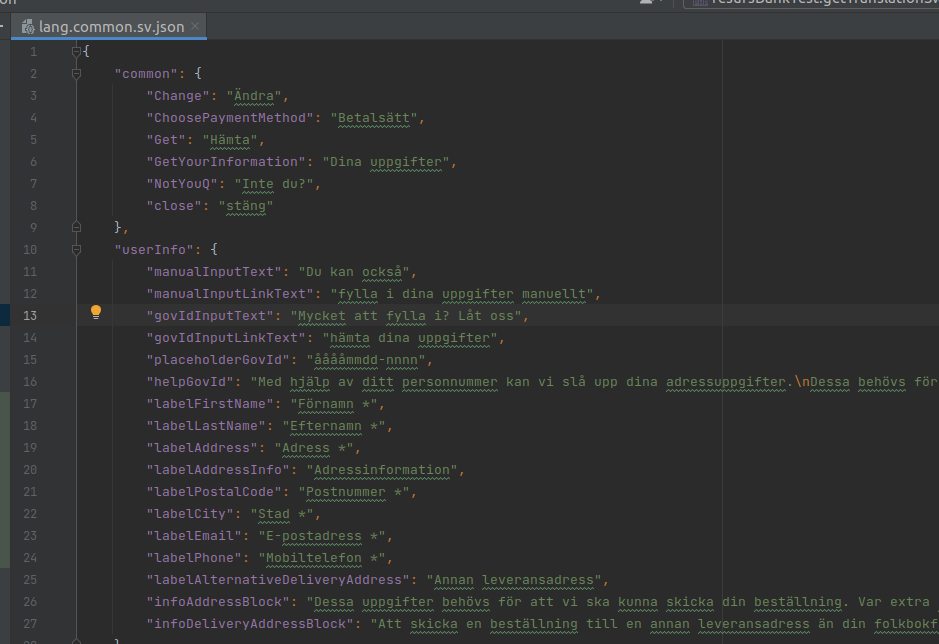

# EComPHP and localization 
Created by Thomas Tornevall, last modified on 2022-05-10
**Table of contents**

- [Current (May 2022) translation string
  buildup](#ecomphpandlocalization-current(may2022)translationstringbuildup)
  - [Keywords to look for](#ecomphpandlocalization-keywordstolookfor)

- [Description](#ecomphpandlocalization-description)
- [Language Names](#ecomphpandlocalization-languagenames)
- [How to use](#ecomphpandlocalization-howtouse)

## Current (May 2022) translation string buildup
The translation segment in EComPHP is very complex. From an external
point of view, translations may look hardcoded as phrases and keying in
the language files looks quite inconsistent. There **is** a
non-hardcoded-ish structure, but it is mostly driven internally and it
is therefore impossible to statically decide which payment method is
connected to a specific phrase, since they are probable to move around
during development. Also, the phrases are mainly built for Resurs
Checkout, so internally this will never become a problem. There are
plans to restructure this lineup of code, so in an ECom aspect, this has
to be taken care with caution. If the languages in future releases are
changing it is highly important that the requesting methods can handle
them as of today.

Below is an explanation of how the phrases are built *today*. The
translation place is entirely depending on the internal location,
country and system in use:

- Resurs-owned payment methods is used to be built on subTitle.
  Normally, ecomphp is extracting **infoText1** and **infoText2**, which
  is sometimes not the correct keys to use when it comes to the
  internals. The characteristics of an internal method is based on the
  initial name RESURS. For example, part payments comes both as
  RESURS_PART_PAYMENT and partPayment in the language files now. To
  extract the proper phrase, the best way is to match type with what's
  not PAYMENT_PROVIDER and when not, use RESURS_PART_PAYMENT as the
  proper payment method.
- The above method leads us into the PAYMENT_PROVIDER handing. Most of
  the named payment methods contains psp as an initial string. Like
  pspTrustly, pspCard, pspSwish, etc. For pspTrustly there are however
  some very specific rules applied, at least for when we use
  getPaymentMethods; Trustly are identified as specificType INTERNET,
  not TRUSTLY. But since there are also a pspInternet defined in the
  language files there may be inaccurate hits on that phrase collection.
  For those currently checking payment methods, the phrase should be
  easiest to fetch from pspTrustly.
- During translation fetching, we look for data stored based by
  **specificType**. There was an idea to also check **type**, when
  specificType does not return data. But in the most cases methods based
  on type is also returning empty data when specificType is not present.
  But we usually do a failovercheck on this too, in case there is
  changes for this in the future.
- Is the payment trustly? Go for pspTrustly instead of pspInternet,
  since the info string is **currently** located in the
  pspTrustly-block.

For more information of how this is digged through, most of the above
(and below) is described in swedish at
[P17-307](https://resursbankplugins.atlassian.net/browse/P17-307?src=confmacro) -
Synka betalmetodernas texter del 3 Done where it was discovered first.

### Keywords to look for
As this text is written, we are working on the PrestaShop module
(simplified) for this to work properly. Normally when we're looking for
phrases we use ecom internals, which is using infoText1 and infoText2 to
find the strings. However, the key **info** is also sometimes necessary
(pspTrustly is using that for SE, but not for the other countries).
Also, for internal methods, we look for subTitle. So to sum up this we
collect:

- infoText1
- infoText2
- info
- subTitle

## Description
Resurs Bank is giving us the opportunity to export a bunch of locales
with help from language files where phrases are stored. We've picked
this feature up, and those language files are embedded in the EComPHP
source. The files are stored in src/Service/Container and for Swedish,
Norwegian and Finnish phrases are stored in json containers. Danish is
stored as XML.



## Language Names
Resurs are using ISO 639-1 based locale names (sv, da, no, fi, etc),
instead of ISO 3166 (SE, DK, NO, FI, etc). The translation class is
however covers both of the formats when requesting a locale (see below).

## How to use
Our testsuite is covering two ways fetching translation phrases. The
simplest way is to just request for a key and to make ECom choose the
proper language you instantiate a class called Translation.

```xml
        $helper = new Translation();
        $helper->setLanguage('sv');
```
When the locale is selected, you can start request a phrase by doing one
of the below:

```xml
        $closePhrase = $helper->getPhrase('Change');
        $validationForEmptyGovId = $helper->getPhrase('forEmpty', ['validation', 'govId']);
```
By looking at the json files you can also see where the data is stored
and if you find (like the above example) that the phrases are stored
recursively where ECom can not find the phrases itself (it won't do the
recursion for you), the second argument helps you define a array-path to
the phrase location.

If you know what you are looking for, like payment methods, there's
however faster ways getting some of the phrases, by the customized
getMethodInfo and getPhraseByMethod. getPhraseByMethod will look for a
payment method and return a block of data relating to that method (very
often based by type or specificType). getPaymentMethdInfo if a very
strict checker and will only return data on very specific keys.
Currently the keys are based on "infoText1" and "infoText2".

```xml
$partPaymentInfo1 = $helper->getMethodInfo('partPayment');
$partPaymentInfo2 = $helper->getMethodInfo('partPayment', 2);
$pspTrustly = $helper->getPhraseByMethod('pspTrustly');
```
