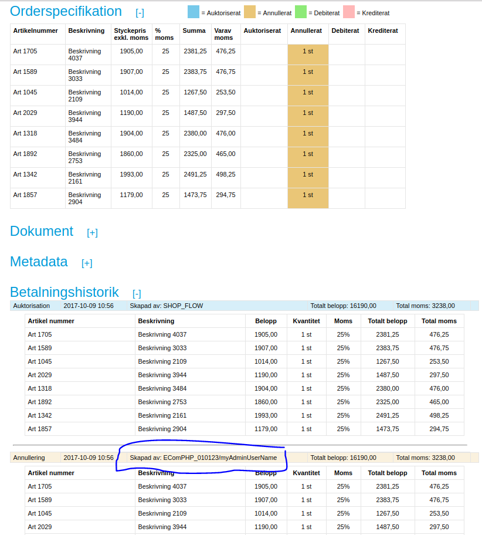

# EComPHP features and tips 

This page will contain all special features that is not always obvious
that EComPHP supports

- [This is EComPHP](#ecomphpfeaturesandtips-thisisecomphp)
- [List of special
  features](#ecomphpfeaturesandtips-listofspecialfeatures)
  - [Opening for more order line
    freedom](#ecomphpfeaturesandtips-openingformoreorderlinefreedom)
  - [Tweaking](#ecomphpfeaturesandtips-tweaking)
  - [Feature list](#ecomphpfeaturesandtips-featurelist)
    - [Payment methods in simplified shopflow vs Resurs
      Checkout](#ecomphpfeaturesandtips-paymentmethodsinsimplifiedshopflowvsresurscheckout)
    - [SOAP-calls is
      cachable](#ecomphpfeaturesandtips-soap-callsiscachable)
      - [getPayment is
        cached](#ecomphpfeaturesandtips-getpaymentiscached)

    - [getCostOfPriceInformation alternative to
      getCostOfPurchaseHtml](#ecomphpfeaturesandtips-getcostofpriceinformationalternativetogetcostofpurchasehtml)
      - [Showing price information for
        denmark](#ecomphpfeaturesandtips-showingpriceinformationfordenmark)

    - [Invoice sequence handling are
      changed](#ecomphpfeaturesandtips-invoicesequencehandlingarechanged)
    - [Reachable curl
      handle](#ecomphpfeaturesandtips-reachablecurlhandle)
    - [Units](#ecomphpfeaturesandtips-units)
    - [Other fixes](#ecomphpfeaturesandtips-otherfixes)
    - [Debugging
      createPayment](#ecomphpfeaturesandtips-debuggingcreatepayment)
    - [Custom shopUrl for Resurs
      Checkout](#ecomphpfeaturesandtips-customshopurlforresurscheckout)
    - [Preferred payment
      ID's](#ecomphpfeaturesandtips-preferredpaymentid's)
      - [setPreferredId(\<string\>)](#ecomphpfeaturesandtips-setpreferredid(%3Cstring%3E))
      - [getPreferredPaymentId()](#ecomphpfeaturesandtips-getpreferredpaymentid())

    - [setCountry](#ecomphpfeaturesandtips-setcountry)

  - [Special payment functions and aftershop
    features](#ecomphpfeaturesandtips-specialpaymentfunctionsandaftershopfeatures)
    - [getAnnuityPriceByDuration](#ecomphpfeaturesandtips-getannuitypricebyduration)
    - [getPaymentDiffByStatus](#ecomphpfeaturesandtips-getpaymentdiffbystatus)
    - [getPaymentSpecCount](#ecomphpfeaturesandtips-getpaymentspeccount)
    - [sanitizeAfterShopSpec](#ecomphpfeaturesandtips-sanitizeaftershopspec)

  - [User and client](#ecomphpfeaturesandtips-userandclient)
    - [EComPHP Client
      identification](#ecomphpfeaturesandtips-ecomphpclientidentification)
      - [Client Identification -
        SubFeature](#ecomphpfeaturesandtips-clientidentification-subfeature)
      - [User and application
        identification](#ecomphpfeaturesandtips-userandapplicationidentification)

  - [Resurs Bank payment order Statuses, how do I handle
    them?](#ecomphpfeaturesandtips-resursbankpaymentorderstatuses,howdoihandlethem?)
    - [getOrderStatusByPayment](#ecomphpfeaturesandtips-getorderstatusbypayment)
    - [RESURS_PAYMENT_STATUS_RETURNCODES and how they are
      used](#ecomphpfeaturesandtips-resurs)

  - [Callbacks](#ecomphpfeaturesandtips-callbacks)
  - [Multiple stores](#ecomphpfeaturesandtips-multiplestores)
    - [Extended features](#ecomphpfeaturesandtips-extendedfeatures)
    - [getCostOfPurchase](#ecomphpfeaturesandtips-getcostofpurchase)
      - [setCostOfPurchaseHtmlBefore and
        setCostOfPurchaseHtmlAfter](#ecomphpfeaturesandtips-setcostofpurchasehtmlbeforeandsetcostofpurchasehtmlafter)

    - [External extended URL
      validation](#ecomphpfeaturesandtips-externalextendedurlvalidation)

  - [Invoice sequence
    numbering](#ecomphpfeaturesandtips-invoicesequencenumbering)

- [Undocumented features](#ecomphpfeaturesandtips-undocumentedfeatures)
  - [setCustomerIpProxy](#ecomphpfeaturesandtips-setcustomeripproxy)

- [ShopFlow cloned features
  (deprecated)](#ecomphpfeaturesandtips-shopflowclonedfeatures(deprecated))
  - [setFormTemplateRules](#ecomphpfeaturesandtips-setformtemplaterules)
  - [getRegEx](#ecomphpfeaturesandtips-getregex)
  - [canHideFormField](#ecomphpfeaturesandtips-canhideformfield)
  - [getTemplateFieldsByMethodType](#ecomphpfeaturesandtips-gettemplatefieldsbymethodtype)
  - [getTemplateFieldsByMethod](#ecomphpfeaturesandtips-gettemplatefieldsbymethod)
  - [getFormFieldsByMethod](#ecomphpfeaturesandtips-getformfieldsbymethod)

# This is EComPHP
- EComPHP is a wrapper that transforms data into the right format before
  handling it. The library of curl used is side-by-side-compatible with
  both rest and soap so EComPHP can utilize and jump freely between both
  old and new services.
- In some cases, for example when working with aftershop features,
  EComPHP runs multiple commands with Resurs Bank to get current states
  (i.e. getPayment, getPaymentMethods)
- Some aftershop functions have shopflow overriders (Example: Running in
  Resurs Checkout-mode, still requires parts of the simplified flow,
  when running aftershop - ecomphp have overrides to handle this
  automatically)
- Many features are cross-flow based
  - Like above example: the afterShopFlow webservice is using
    simplifiedShopFlow to find out states in the payments
  - Registering callbacks in checkout rest mode is sometimes using SOAP
    and configurationService to handle callbacks

# List of special features
## Opening for more order line freedom
As of v1.3.76 we've been opening the ability to manipulate order rows
outside the ruleset of ECom's own business logics. There are moments
when you really need to push data through the API without the
validations the ECom does on each order row (which is built in to
prevent bad actions). There are an example in the test suite that we
have been running manually to confirm moments when this is required
(named **afterShopOverride**) and includes two specific methods to
disable internal validation rows:

| Function                     | Description                                                                                                                                                                                                                                                                                                                                                                                                                                       |
|------------------------------|---------------------------------------------------------------------------------------------------------------------------------------------------------------------------------------------------------------------------------------------------------------------------------------------------------------------------------------------------------------------------------------------------------------------------------------------------|
| **setGetPaymentValidation**  | Feature designed for afterShop actions like creditPayment, annulPayment, etc. Disables order row validation entirely so that any data will be accepted as valid.                                                                                                                                                                                                                                                                                  |
| **setBookPaymentValidation** | Feature designed for bookPayment. Disables validations on duplicate rows, where the duplicate validator usually merges identical order rows into one, with updated quantity and order totals. This is more or less a fix from a legacy system where the specLine-setup was built differently and where PHP could not handle identical product lines properly. By disabling this validation, you can push through whatever you need, line by line. |

## Tweaking
EComPHP is tweakable by its internal flagset. When initializing the
library you can use a \$library-\>setFlag(), to enable features that is
normally not active. Here's a list of those flags.

As of 1.0.23, 1.1.23 and 1.2.0, the ECom library supports setup of
configurable flags that could be picked up again, in external
applications. This makes it prossible to control parts of ECom from time
to time and from 1.2.2/1.3.2 (1.1.29/1.0.29), we've started up to use
those flag internally too. From those versions of the library we also
starting to use session variables, so some of the flags can be passed
between different calls in a web application. The internal flags and
their usage are presented below, and can be set by **setFlag(\$key,
\$value)**, **getFlag(\$key)**, **deleteFlag(\$key)**. Using session
variables, is being made with **setSessionVar(\$key,  \$value)**,
**getSessionVar(\$key)** and **deleteSessionVar(\$key)**.

*As NetCURL 6.1 was released a "generation 2 flagset" became available
through the Flag::class.*

|                                | inValue   | Information/Since | Description                                                                                                                                                                                                                                                                                                                                                |
|--------------------------------|-----------|-------------------|------------------------------------------------------------------------------------------------------------------------------------------------------------------------------------------------------------------------------------------------------------------------------------------------------------------------------------------------------------|
| PREVENT_EXEC_FLOOD             | *true*    | DEPRECATED        | This flag prevents the createPayment()-method to run too fast. It uses session variables (PHP: \$\_SESSION) to set a timestamp for which createPayment was last runned, and throttles the payment creation if next createPayment is executed within 5 seconds (default)                                                                                    |
| PREVENT_EXEC_FLOOD_TIME        | *integer* | DEPRECATED        | If 5 seconds is to little to prevent createPayment()-execution, this flag will replace the default of 5 seconds to another value.Example: setFlag('PREVENT_EXEC_FLOOD_TIME', 10);In this example, next createPayment() for the current session might not be executed during a time of 10 seconds instead.                                                  |
| PREVENT_EXEC_FLOOD_EXCEPTIONS  | *true*    | DEPRECATED        | Activating this flag with true, will allow exceptions to be thrown during createPayment() - otherwise, the next createPayment() if it is in the range of PREVENT_EXEC_FLOOD_TIME, will be dropped silently.**If you do set this value to true, you must handle exceptions yourself.**                                                                      |
| SKIP_AFTERSHOP_INVOICE_CONTROL | *false*   | N/A               | (**Default**: false) Prevents - if set to true - afterShop functions finalize, annul and credit to repair invoice numbering if [error 29](328078) occurs during the process. If enabled ALREADY_EXISTS_INVOICE_ID is checked, and EComPHP will try to find the last increment value and set things right.                                                  |
| GET_PAYMENT_BY_REST            | *true*    | N/A               | Asks EComPHP to use getPayment via REST instead of afterShop-SOAP. In prior versions this setting was reverse (GET_PAYMENT_BY_SOAP), but as there was too much backfires in the errorhandling, we chose to use SOAP as default instead.                                                                                                                    |
| CREATED_BY_NO_CLIENT_NAME      | *true*    | N/A               | Allow clients to skip clientname (if the client name is confusing in payment admin) by setting flag CREATED_BY_NO_CLIENT_NAME. If flag is unset ecomphp\_\<DECIMAL_VERSION_NUMBER\_ will be shown. If unset EComPHP will first try to use a name by a logged in user (if set by client) and then fall back to the username **EComPHP-RemoteClientAction**. |
| ALWAYS_RENDER_TOTALS           | *true*    | N/A               | Makes EComPHP, in renderPaymentSpec(), to always render new total amounts instead of trusting inbound payload data. However, the new functions that handles paymentDiffs usually also recalculates the totals (since 1.3.23) since quantity often tend to change during aftershop actions.                                                                 |
| USE_AFTERSHOP_RENDERING        | *true*    | N/A               | Internally used by EComPHP to be able to skip exceptions when there are no payload set, where the internal methods still needs the rest of the payload (specLines, etc).                                                                                                                                                                                   |
| KEEP_RCO_BILLING               | *true*    | N/A               | In Resurs Checkout mode, make EComPHP not strip off \['customer'=\>\['billing'\]\] from the payload. Currently not in use, just prepared. The fields used is the same as those that you can find in the simplified flow.                                                                                                                                   |
| KEEP_RCO_DELIVERY              | *true*    | N/A               | In Resurs Checkout mode, make EComPHP not strip off \['customer'=\>\['deliveryAddress'\]\] from the payload. Use to prefill (push in own customer information) the iframe.The fields used is the same as those that you can find in the simplified flow.                                                                                                   |
| SKIP_AFTERSHOP_VALIDATION      | *true*    | N/A               | Used to override getPayment orderrows during aftershop handling (for example, when you have own prices on prior rows that has to be forcefully changed).                                                                                                                                                                                                   |
| HEAL_URL                       | *true*    | 1.3.47            | If you during a payment creation in hosted flow gets a landingpage-url from the API that contains http instead of https, this flag will rewrite the url to a proper https-link before returning it to the client. The features is currently only for hosted flow as we've only seen it there.                                                              |

## Feature list
### Payment methods in simplified shopflow vs Resurs Checkout
Historically (for ecom 1.3 at least), simplified shopflow has not always
supported payment providers. To not break standard compatibility by
displaying unsupported methods in a checkout, EComPHP chose to hide them
by default. Today, this is different but the getPaymentMethods-method
called from ECom is still honoring PSP methods. This happens since
payment providers supports government-id-less submission forms, which
Resurs internals require. To activate full support for all payment
methods (requires that you can handle the lack of government id), you
can use **setSimplifiedPsp(true)**.

```xml
$connection->setSimplifiedPsp(true);
```
if you'd like to follow the prior restrictions in simplified even when
you run RCO-mode, you can use the **setStrictPsp(true)** instead. As we
today support PSP in the simplified shopflow, those parts are deprecated
but still active. This could change in future releases.

### SOAP-calls is cachable
With start at 1.3.40, the communication interface with Resurs Bank is
updated, which means there is a big raise in performance. Support for
cached wsdl is enabled with this kind of method call:

```xml
$connection->setWsdlCache(true);
```
Furthermore the ECom will be able to set itself in production- or
testmode, which means cached SOAP calls will be enabled in production
environments, while test will still run uncached in case of updates in
the webservices.

#### getPayment is cached
In EComPHP a bigger optimization has been done with the getPayment
method. This means that if you do a regular getPayment out of the box,
the response is stored unless you request specifically to make a whole
new request. The primary reason for this is to limit request per browser
lookup. In WooCommerce for example getPayment are being made in several
places during one load, making EComPHP make at least 8 requests to the
API. If EComPHP store cached payment information this won't happen. This
is considered a performance fix. To make uncached requests, the call
should look like this:

```xml
$ecom->getPayment('paymentid', false);
```
- Observe that this does not apply to new instatiated calls. For each
  instance of EComPHP that is created, a new request will be sent
  through the API.
- Also observe that each cal to status update features in ecom is not
  cached.

### getCostOfPriceInformation alternative to getCostOfPurchaseHtml
As of 1.3.30, we are starting to utilize priceInfo as an alternative to
getCostOfPurchaseHtml. Three standard templates are added to the library
that executes a similar view as getCostOfPurchase. The function itself
looks like this:

```xml
    /*
     * @param string $paymentMethod Payment method as string or object (multiple methods allowed, due to DK).
     * @param int $amount The amount to show the priceInformation with.
     * @param bool $fetch If ecom should try to download the content from the priceinfolink.
     * @param bool $iframe Pushes the priceinfolink into an iframe. You should preferrably have $fetch false here.
     * @param bool $limitByMinMax By default, ecom only shows priceinformation based on the $amount.
     */
public function getCostOfPriceInformation(
        $paymentMethod = '',
        $amount = 0,
        $fetch = false,
        $iframe = false,
        $limitByMinMax = true
    )
```
This means that you can display the priceinformation in different ways.

- Priceinfo is extracted from the legal-links block in
  getPaymentMethods.
- The first parameter allows you to send in the payment method as a
  string or the object directly. Do not forget to add the amount to the
  request as the second argument.
- The third and fourth arguments allows you to either get the url or the
  content of the priceInfo. With the fourth argument you can choose to
  contain the urls in an iframe so the modal data fits better in your
  store as the css and design resides remotely at Resurs Bank.
- If both third and fourth arguments are true, iframe is chosen instead
  of colliding the view.
- The firth argument is by default true, so the method follows the rules
  of minAmount and maxAmount. This means the priceinformation will be
  rendered with compatible payment methods within the range of min and
  max. Normally, we'd be happy with this, but this can be overridden in
  corner cases where all methods should be shown regardless of their
  limits.
- To remember: All views are based on a single payment methods. If you
  want to show price information for denmark it is recommended to push
  all payment methods in the call (see below).

#### Showing price information for denmark
The example below renders a full "tabbed view" for denmark based on all
payment methods available that has price information available.

```xml
$costOfPurchaseHtml = $flow->getCostOfPriceInformation($flow->getPaymentMethods(), $amount);
```
### Invoice sequence handling are changed
Due to limitations in the API, invoice id's are now handled differntly
to prior versions. Invoice id's are set one time - if the ID is
unexisten on the side of Resurs Bank. Next time aftershop are running,
ECom won't force any more invoice id into the system as it this could
potentially stop stores not increment id's properly. To restore the old
behaviour you could use the practically undocumented flag
features AFTERSHOP_RESCUE_INVOICE and AFTERSHOP_RESCUE_INCREMENT but
normally, this should not be necessary.

### Reachable curl handle
If any changes has to be made directly to the curl library, the support
for this is opened further. Test environment is no longer a required
parameter.

### Units
Besides of this, pipeline tests should now work properly with each
version of phpunit without backward compatible installations (as setUp()
function in the units changes after PHP 7.1).

```xml
public function setUp(): void {
    // This is not compatible with prior versions of PHP.
}
public function __setUp() {
    // The replacement that unfortunately need to be added in each test case.
}
```

### Other fixes
The full changelog could be found here: [EComPHP: ChangeLog](5015031).

### Debugging createPayment
You can do a createPayment() without really creating it - by simply
pause the final exectue of bookPayment/creating the iframe. This section
has however its own documentation, that you may find interesting:
[Important notes and troubleshooting/exceptions (EComPHP)](7438497)

### Custom shopUrl for Resurs Checkout
Normally, when creating the iframe for Resurs Checkout, not setting
shopUrl will render a default URL that defines how the iframe handles
the communication between the end user and the iframe. This is
absolutely not necessary, but to make the features constantly open and
reachable for developers EComPHP sets up this for you, in the format:
**PROTOCOL://HTTP_HOST**. The protocol is based on what's returned in
the web server HTTPS-variable, and if it is set, the URL might for
example look like this **https://test.com** - you shoule here note that
trailing slashed and eventually the following full uri is stripped from
the url, så even if you have a site laying on
https://test.com/this/sub/structure the shopUrl should still be
https://test.com.

You can customize this URL to point to another domain name. For example,
your site should be test.org instad of test.com:

```xml
$rb->setShopUrl("https://test.org/");
```
Take a not on the bad formatted trailing slash. This will be stripped
off in the final result.  
In a near future, host validation (by resolvers, to make sure that the
shopUrl is by DNS confirmed as valid) will become available.

Another thing to take not of here, is that the shopUrl should be
validated even when the payload are sent into EComPHP manually. This is
currenly not done by default, so by setting up following code,
validation will become active at payload level too:

```xml
$rb->setValidateCheckoutShopUrl();
// ... code ...
$myPayLoad = array('shopUrl' => 'https://test.com/badly/formed/uri/link');
// ... code ...
$rb->createPayment( /* Your data here */ );
```
### Preferred payment ID's
EComPHP is designed to handle payment/order id's where such ids is not
important for the store to be correct. In a normal scenario, the payment
id is created by the shop, and just transferred through to EComPHP and
then the order can be fulfilled. However, if this is ignored by
developers or the store, EComPHP creates this by default.

#### setPreferredId(\<string\>)
This function is used when there is a prepared order id, that EComPHP
should use.

#### getPreferredPaymentId()
This function returns a payment id. If it is pre-set by client, it will
return the set id. Otherwise, it returns a randomly generated id, based
on the current timestamp and a random number (to avoid conflicts between
many end users).

### setCountry
Setting up a default country by setCountry might help a bit with things
like default unitMeasure-data. While using addOrderLine, the unitMeasure
is set to be "st" (styck). However, setting up the country with this
function allows you to pass \$unitMeasure empty. Doing this, will change
(try) the values of unitMeasure to a proper measure for each country.

| Country value             | Default unitMeasure |
|---------------------------|---------------------|
| ResursCountry::COUNTRY_DK | st                  |
| ResursCountry::COUNTRY_NO | st                  |
| ResursCountry::COUNTRY_FI | kpl                 |
| ResursCountry::COUNTRY_SE | st (**default**)    |

## Special payment functions and aftershop features
This section is mostly made for the aftershop functions. You might also
take a look at the bottom section for [EComPHP: DEBIT, CREDIT, ANNUL
\[afterShopFlow\]](12189822), where there are some functions listed for
which you can find out which status an order is set in.

### getAnnuityPriceByDuration
EComPHP has special features that should make it easy to show how much a
customer needs to pay monthly (usually shown at single-product
pageviews). This method is called getAnnuityPriceByDuration and is in
details described at the section [Calculations with
getAnnuityFactors/part payments (EComPHP)](22183993).

### getPaymentDiffByStatus 
This is a master renderer and has replaced the prior method name
**getPaymentSpecByStatus**, which sorts out what happened to each
paymentDiff in the getPayment service API. It will list all authorized,
debited, credited and annulled orderrows separately. The newer release
not only give you statuses from the paymentDiff (of what happened to the
order). It also renders a per-product-row-table where it shows what's
left in the order referring to debiting, annulling and crediting.
Together with **getPaymentDiffByAbility** it has a high value when it
comes to partially crediting and annulling orders which EComPHP hasn't
entirely supported before. This comes to a reality in v1.3.23+
(1.0.48/1.1.48) for prior setups.

It looks like this:

\$orderLinesByStatus = array(  
 'AUTHORIZE' =\> array(),  
 'DEBIT' =\> array(),  
 'CREDIT' =\> array(),  
 'ANNUL' =\> array(),  
);  

The formatted table itself can look like the table below, where the new
values ANNULLABLE, DEBITABLE and CREDITABLE keys shows up which quantity
that is left in for each item row. So, if you plan to credit PR01, this
table tells you that there are 50 more in the quantity that you can
credit, etc. There's also a bunch of new features for which ECom can
handle paymentdiffs and compare items. We primarily
use [array_intersect](https://www.php.net/manual/en/function.array-intersect.php)
to compare valid orderrows those days instead of the prior
"removeFromArray" that is from v1.3.23 completely removed from the
source.  

    Array
    (
        [0] => Array
            (
                [artNo] => PR01
                [description] => PR01
                [unitMeasure] => st
                [unitAmountWithoutVat] => 37.00000
                [vatPct] => 25.00000
                [AUTHORIZE] => 100.00000
                [DEBIT] => 50.00000
                [CREDIT] => 0
                [ANNUL] => 50.00000
                [ANNULLABLE] => 0
                [DEBITABLE] => 0
                [CREDITABLE] => 50
            )
        [1] => Array
            (
                [artNo] => PR02
                [description] => PR02
                [unitMeasure] => st
                [unitAmountWithoutVat] => 57.00000
                [vatPct] => 25.00000
                [AUTHORIZE] => 100.00000
                [DEBIT] => 0
                [CREDIT] => 0
                [ANNUL] => 0
                [ANNULLABLE] => 100
                [DEBITABLE] => 100
                [CREDITABLE] => 0
            )
        [2] => Array
            (
                [artNo] => PR03
                [description] => PR03
                [unitMeasure] => st
                [unitAmountWithoutVat] => 55.00000
                [vatPct] => 25.00000
                [AUTHORIZE] => 100.00000
                [DEBIT] => 0
                [CREDIT] => 0
                [ANNUL] => 0
                [ANNULLABLE] => 100
                [DEBITABLE] => 100
                [CREDITABLE] => 0
            )
        [3] => Array
            (
                [artNo] => PR04
                [description] => PR04
                [unitMeasure] => st
                [unitAmountWithoutVat] => 68.00000
                [vatPct] => 25.00000
                [AUTHORIZE] => 100.00000
                [DEBIT] => 0
                [CREDIT] => 0
                [ANNUL] => 0
                [ANNULLABLE] => 100
                [DEBITABLE] => 100
                [CREDITABLE] => 0
            )
    )

### getPaymentSpecCount
This function was built primarily for unittesting. It uses
getPaymentSpecByStatus() and instead of returning the order rows,
returns each diff-status-object with the total count of rows for each
status:

    $orderLinesByStatus = array(
     'AUTHORIZE' => count,
     'DEBIT' => count,
     'CREDIT' => count,
     'ANNUL' => count,
    );
### sanitizeAfterShopSpec
Sanitizes a payment spec from a payment id or a prepared getPayment
object and return filtered depending on the requested aftershop type

## User and client
There are several functions in EComPHP that is used to identify users
and clients. This is some of them, listed.

### EComPHP Client identification
When communicating with Resurs Bank webservices and rest, you can tell
EComPHP to identify itself with a customized USER_AGENT-header. This
opens for the possibility to identify your plugin name, the web store
name/version and any other variable you need to use to simplify error
checking and so.

```xml
$rb->setUserAgent('MyPlugin-2.1.77 Magento-XXX.YYY');
```
#### Client Identification - SubFeature
If you have great needs of also transmitting the end user web-browser
with this USER-AGENT-header, you can also activate another feature by
using setPushCustomerUserAgent(true). In this case, EComPHP will also
add the end user HTTP_USER_AGENT into the user-agent string, as a
compressed string, base64-encoded.

#### User and application identification
This function is mostly used by AfterShop features in EComPHP. If there
are any needs of identifying who annulled, credited or debited a payment
setLoggedInUser() can be used for setting more data than just "EComPHP
-versionNumber-". The data can be seen, amongst others, in Resurs
Payment Admin. The following example will render what's shown in the
screen capture below (except for the realClientName parts as this has
been built in after the screenshots, which by the way also needs to be
renewed to match MP).

Note: setRealClientName is used to assign a name in the aftershop parts,
which identifies an application if the aftershop process has been
automated.

```xml
$rb->setLoggedInUser('myAdminUserName');
$rb->setRealClientName('myApplicationName');
$rb->annulPayment($paymentId);
```



## Resurs Bank payment order Statuses, how do I handle them?
### getOrderStatusByPayment
How you configure your store is very individual and are often also
dependent on what your store can handle. However, there is a suggested
"best practice" you could follow when setting up how to handle local
order statusen during for example receiving callbacks or updating orders
depending on the status of the order at Resurs Bank side. There is
fragment of code in EComPHP that suggests how to update the orders, via
**getOrderStatusByPayment**. Here's a small example (taken out of its
context) on how to use it.

```xml
$storeOrderId = "1337";
$paymentIdOrPaymentObject = "1337";
$byCallbackEvent = RESURS_CALLBACK_TYPES::CALLBACK_TYPE_AUTOMATIC_FRAUD_CONTROL;
$callbackResult = "THAWED";
// Callback AUTOMATIC_FRAUD_CONTROL arrives here
$suggestedStatus = $ecom->getOrderStatusByPayment($paymentIdOrPaymentObject, $byCallbackEvent, $callbackResult);
switch ($suggestedStatus) {
   case RESURS_PAYMENT_STATUS_RETURNCODES::PAYMENT_PROCESSING:
      setStoreLocalStatus($storeOrderId, "processing");
   default:
      setStoreLocalStatus($storeOrderId, "on-hold");
}
```
To use this without the callback control, you can just run this:

```xml
$suggestedStatus = $ecom->getOrderStatusByPayment($paymentIdOrPaymentObject);
```
In this case, the control will process lesser analyzing on the current
order. However, it is not always interesting to run this control with
the callback control. The returned value is based on
**RESURS_PAYMENT_STATUS_RETURNCODES**.

### RESURS_PAYMENT_STATUS_RETURNCODES and how they are used
The calculations below are based on [the advices from the aftershop
service API here](after-shop-service-api) (scroll to the bottom). From
around v1.3.16 the behaviour of the return codes has changed to bitwise
data, as SWISH payment method practically introduced a new kind of
status: Instant debits. The means of this is that when you get the
status DEBITED from a getPayment, you won't be able to determine if the
finalization has been instant or if someone manually fired a
finalization. EComPHP tries to find out this on its own, by comparing
the payment with the payment method.

If the payment method is based on SWISH (this is configurable) or other
"instant payment methods" (INTERNET or "direkt banköverföring" is also
based on this) EComPHP must have the ability to set to statuses in the
same time. By using bitwise masking in this setup you can either use the
values as before - separately - or check for a combined set of data. For
example, if this feature is enabled with SWISH, the return code will be
4 & 32 (36) rather than just 4 according to the table below.

[TABLE]

## Callbacks
When callbacks are handled, you can either code the digest validation
yourself by, something like this (examples is from the WooCommerce
plugin):

```xml
                       $currentSalt = get_transient( 'resurs_bank_digest_salt' );
                       if ( $event_type == 'AUTOMATIC_FRAUD_CONTROL' ) {
                               $check_digest = $request['paymentId'] . $request['result'] . $currentSalt;
                       } else {
                               $check_digest = $request['paymentId'] . $currentSalt;
                       }
                       $check_digest = sha1( $check_digest );
                       $check_digest = strtoupper( $check_digest );
                       $resursPaymentData = null;
                       try {
                               $resursPaymentData = $this->flow->getPayment( $request['paymentId'] );
                       } catch (\Exception $ignorePaymentExceptions) {}
                       if ( $request['digest'] === $check_digest ) {
                               // Do whatever you need with the callback, on correct matches
                       }
```
Or you can use EComPHP internal validation (available
from 1.0.33/1.1.33/1.2.6/1.3.6):

```xml
$currentSalt = get_transient( 'resurs_bank_digest_salt' );
if ( !$this->flow->getValidatedCallbackDigest(isset($request['paymentId']) ? $request['paymentId'] : null, $currentSalt, isset($request['digest']) ? $request['digest'] : null, isset($request['result']) ? $request['result'] : null) ) {
  // Digest mismatche, so stop handle the callback from here
  die;
}
```

## Multiple stores
If you have multiple stores in a single merchant, you can set up a deal
with Resurs Bank to use storeId's. In this case, you can add an extra
row in the payload sent with createPayment: **setStoreId(\<integer\>)**.

### Extended features
This section contains a list of features that either has been extended
or is very specific for EComPHP as helpers.

### getCostOfPurchase
The getCostOfPurchase-function is based on Resurs Bank webservice
getCostOfPurcaseHtml. However, instead of just returning the html-code
generated by Resurs Bank, the internal function also returns a properly
set html-body and - if requested - a linked CSS that referers to the
page content, so it could be easily designed with a standard look.

| Parameter     | Type    | Description                                                                                                                                                                                                                                                                            |
|---------------|---------|----------------------------------------------------------------------------------------------------------------------------------------------------------------------------------------------------------------------------------------------------------------------------------------|
| paymentMethod | string  | The basic set up, requred to generate the correct data                                                                                                                                                                                                                                 |
| amount        | int     | The base amount for which Resurs Bank will build the costOfPurchase-page                                                                                                                                                                                                               |
| returnBody    | boolean | Setting this to true, will add the proper \<html\>-tags in the returned html code                                                                                                                                                                                                      |
| callCss       | string  | URL to the CSS layout                                                                                                                                                                                                                                                                  |
| hrefTarget    | string  | Sets up, for each href element in the html body, a target="\_blank" (default) so that each click in the information box opens a new window rather that just redirects them.To change the \_blank-behaviour to somehing else, the string can just simple be replaced to a custom value. |

#### setCostOfPurchaseHtmlBefore and setCostOfPurchaseHtmlAfter
If you have greater needs to add data into the getCostOfPurchase, that
is prepended or appended to the returned body you can use those two
functions to add additional data to the returned html body.

### External extended URL validation
This feature is very out of the box of EComPHP and uses a third party
API, that do not belong to Resurs Bank. In some cases, there have been
problems with site reachability - for example, when callbacks are
running  there is a web hosting company that blocks the connectivity to
your store. Or, another one, where you use internal links that is
normally not reachable at all for our callback services. For such cases,
you can run this function to find out whether your site is reachable or
not.

Usage example (partially taken from our unittest suite):

```xml
$testUrl = "https://test.resurs.com/signdummy/index.php?isCallback=1?event=ANNULMENT&digest={digest}&paymentId={paymentId}&lastReg=171009083933";
$validateResponse = $rb->setValidateExternalCallbackUrl( $testUrl );
if ( $Reachable !== ResursCallbackReachability::IS_FULLY_REACHABLE ) {
   // Our site is not fully reachable on this response
}
```
The API used for this function supports **IPv6**.

## Invoice sequence numbering
Using our aftershop flow means you can handle all of your orders on your
ecommerce-site instead of via our merchant portals, like payment admin.
The first time you run through those functions - you can read about them
here [EComPHP: DEBIT, CREDIT, ANNUL \[afterShopFlow\]](12189822) - there
will be a need for an invoice number on Resurs side. This is
automatically set up by EComPHP if not already set. As of v1.0.27/1.1.27
(and 1.2.0) you can reset the invoice sequence (it will be nullified),
with the function call **resetInvoiceNumber()**. If this is being made
by mistake, the prior invoice sequence numbering might be restored again
with the help from **getNextInvoiceNumberByDebits()** - which is a
function that scans through a number of already debited payments, from
which it uses the last invoice number it can find and restores the
invoice sequence number with this value (+1).

# Undocumented features
### setCustomerIpProxy
## ShopFlow cloned features (deprecated)
The methods in this section is "long time deprecated". They have a
history in our deprecated shopflow that, in startPaymentSession, got
most of the form data from Resurs Bank, neceassy to create a proper
order. To make things easier in early versions of our
WooCommerce-plugin, this part of EComPHP was used to simlate the
behaviour from the flow. EComPHP is here set up to return customer field
data, required by end users to complete orders. It can also return
default regexes for which developers can validate proper customer fields
like phone numbers, e-mail, etc. In future version it is completely up
to developers to make this right.

> Class changesAs of newer releases of EComPHP, the deprecated form
> controller has been moved to its own class.

*This documentation section is incomplete.*

### setFormTemplateRules
### getRegEx
### canHideFormField
### getTemplateFieldsByMethodType
### getTemplateFieldsByMethod
### getFormFieldsByMethod

