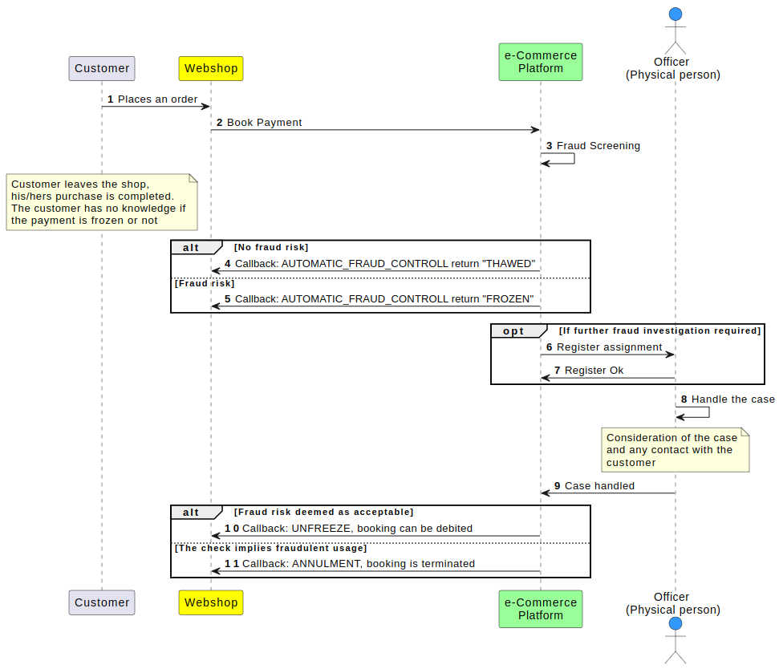
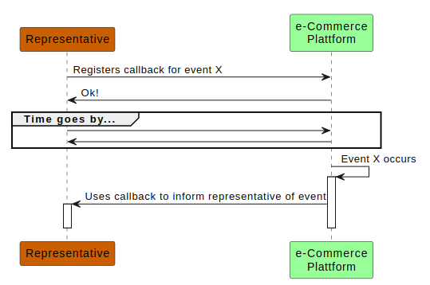
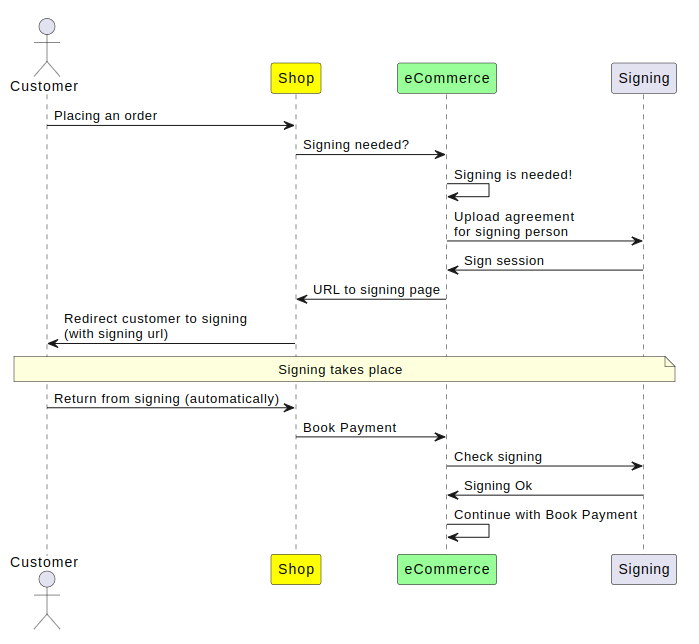
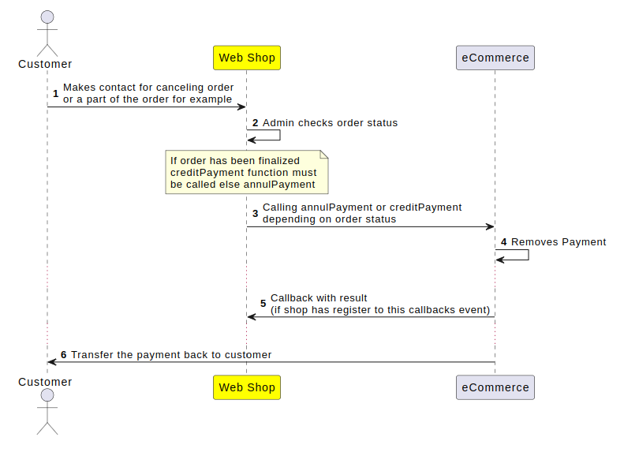
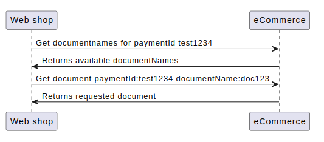

# Flow Chart Library 

Here are all the flow charts for the e-Commerce. Flow charts are a
perfect way to get a better understanding on how the e-Commerce works,
how to implement and consume its services.
 
# Web Shop Flow
The flow over the Web Shop part from when a customer enters the shop to
checkout
 
See full flow for the web shop
 
 
# Fraud Control
The fraud control is made when the bookPayment is called from the shop
flow.  
Book Payment is called when the customer in the web shop completes the
check out.
 
See the flow for fraud control
Agent represent both agent and customer in this flow
  
  

  
 
 
# Callbacks
Registration on callbacks is made from the [Configuration
Service](Configuration-Service_1475161.html), more information about our
callbacks is **[here](Callbacks_327724.html)**
**  
**
The overall flow chart for callbacks
  

  
 
 
# Signing
Signing of a payment
 
Overall flow chart for signing
  

  
 
 
# Annullment & Crediting
 
See the flow for annulment & crediting

  
 
 
# Get documentNames & document
See the flow for retrieving documentnames and paymentDocument
  

  
 
