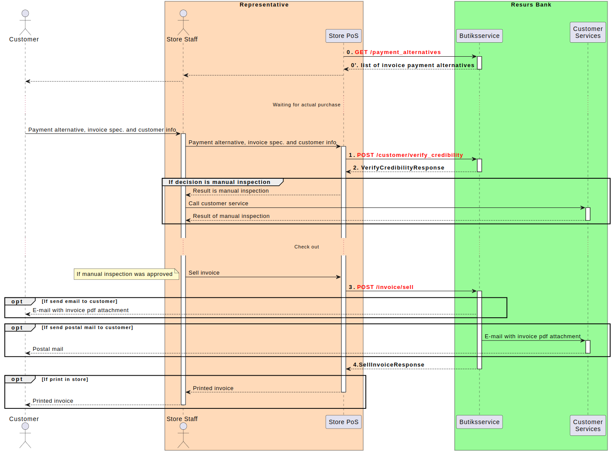
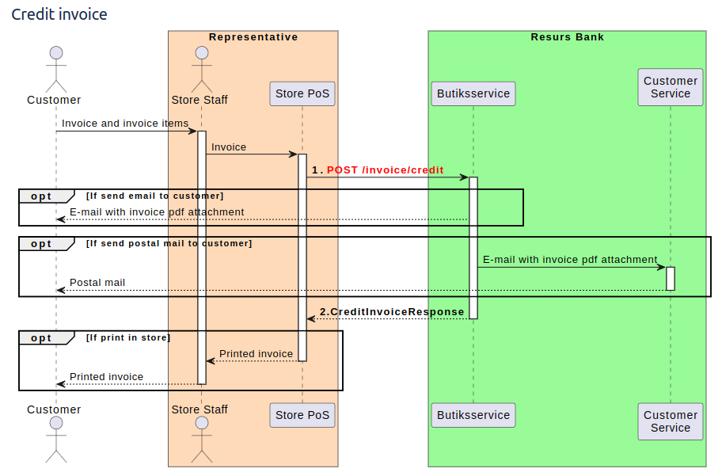

# Invoice Service 2.0 

The invoice web service offers an API to sell and credit invoice
payments from Resurs Bank.
## Authentication
The Resurs shop service is protected by the simple [http basic
authentication
mechanism](http://en.wikipedia.org/wiki/Basic_access_authentication).
Behind a TLS/SSL protected channel this can be considered secure.
## Credit check (in infodisk) and purchase at checkout

  
## Credit invoice

  
