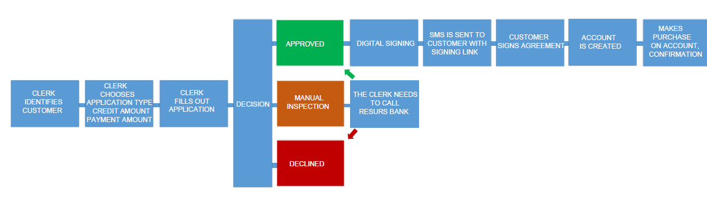

# Credit Application and Payment 

The credit application and payment flow is used when a customer wants to
apply for an account and making a purchase at the same time. 

### **Authentication**
Every request requires an authorization header with a Bearer-token. A
token lasts for 3600 seconds (1 hour). To get a token you may use your
test-credentials received from Resurs Bank: 
client_id  
client_secret  
scope= mock-merchant-api
**Curl to get token**
``` syntaxhighlighter-pre
curl --location --request POST 'https://apigw.integration.resurs.com/api/oauth2/token' \
--header 'accept: application/json' \
--header 'Content-Type: application/x-www-form-urlencoded' \
--data-urlencode 'client_id=' \
--data-urlencode 'client_secret=' \
--data-urlencode 'scope=mock-merchant-api' \
--data-urlencode 'grant_type=client_credentials'
```
