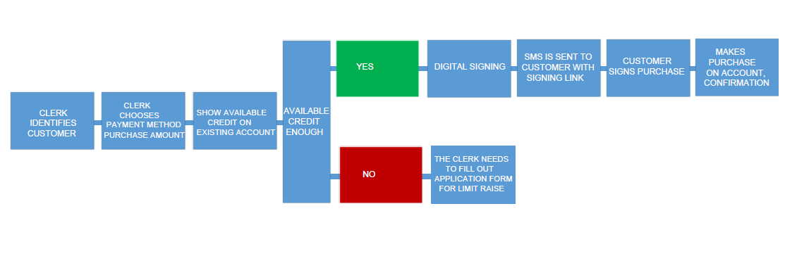

# Payment with Existing Account 


## **Typical flow **
### **Authentication**
Every request requires an authorization header with a Bearer-token. A
token lasts for 3600 seconds (1 hour). To get a token you may use your
test-credentials received from Resurs Bank: 
client_id  
client_secret  
scope= mock-merchant-api
**Curl to get token**
``` syntaxhighlighter-pre
curl --location --request POST 'https://apigw.integration.resurs.com/api/oauth2/token' \
--header 'accept: application/json' \
--header 'Content-Type: application/x-www-form-urlencoded' \
--data-urlencode 'client_id=se_netonnet' \
--data-urlencode 'client_secret=fsNwJ93CGc2LkXfJ' \
--data-urlencode 'scope=mock-merchant-api' \
--data-urlencode 'grant_type=client_credentials'
```
### Step-by-step for creating, authorizing and debiting an account after authentication
**1.Get available stores  
**A client may have access to multiple stores, therefore we need to know
which store to make the application or payment for. This can be done by
getting the available stores. Each store has a store-id. This id will be
used in the next step to specify for which store we would like to get
the payment methods.
**Curl to get available stores**
``` syntaxhighlighter-pre
curl --location --request GET 'https://apigw.integration.resurs.com/api/mock_merchant_api_
--header 'Authorization: Bearer <TOKEN>'
```
  
**2. Get available payment methods  
**A store may have multiple payment methods available. The list of
available payment methods will show what payment methods there are to
apply from at the chosen store. Each payment method has a paymentmethod
id, wich will be used in the next step, when the application is
created. 
**Curl to get available payment methods**
``` syntaxhighlighter-pre
curl --location --request POST 'https://apigw.integration.resurs.com/api/mock_merchant_api
--header 'Content-Type: application/json' \
--header 'Authorization: Bearer <TOKEN>' \
--data-raw '{
"countryCode": "SE, FI, NO, DK",
"customerType": "NATURAL"
}
```
  
**3. Create a payment  
**Supply the storeId and paymentmethodid from previous steps. Take note
of the id returned in the response. We can use it to debit, anull or
authorize the payment.
**Curl to create a payment**
``` syntaxhighlighter-pre
curl --location --request POST 'https://apigw.integration.resurs.com/api/mock_merchant_payment_service/payments' \
--header 'Content-Type: application/json' \
--header 'Authorization: Bearer {{merchant-api-token}}' \
--data-raw '{
"cart": {
"cartItems": [
{
"quantity": "1",
"totalAmountIncVat": "750",
"totalAmountVat": "125",
"type": "NORMAL",
"unitPriceIncVat": "750",
"vatRate": "0.2",
"description": "TV",
"externalId": "tv_123"
}
],
"orderId": "order-ref",
"totalAmountIncVat": "750",
"totalAmountVat": "125",
"totalExVat": "625"
},
"customer": {
"countryCode": "SE, NO, FI, DK",
"customerType": "NATURAL",
"governmentId": "",
"email": "test@test.com",
"mobile": "012345678"
},
"externalId": "payment-ref",
"paymentMethodId": "",
"storeId": ""
}
```
  
**4. Debit the payment  
**This means that we are ready to complete the payment and charge the
customer for the purchased goods. Creator is for example the clerk
debiting customer.
**Curl to debit a payment**
``` syntaxhighlighter-pre
curl --location --request POST 'https://apigw.integration.resurs.com/api/mock_merchant_payment_service/payments/e6f67bac-64b8-4790-b52e-724348503c1b/--header 'Content-Type: application/json' \
--header 'Authorization: Bearer {{merchant-api-token}}' \
--data-raw '{
"creator": "John"
}
```
  
**4. Redirect to e-signing  
  
**
