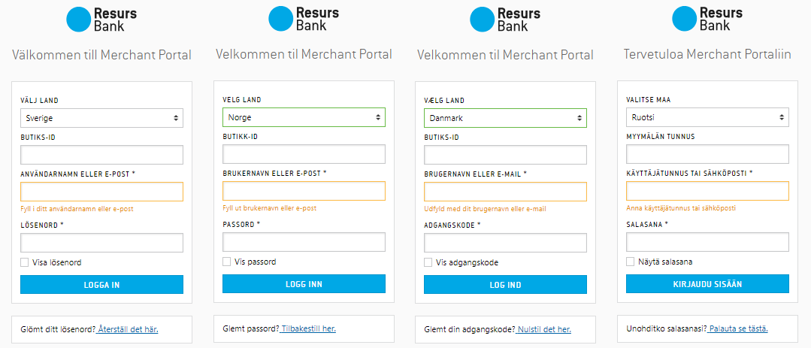

# Payment administration GUI 

Merchant Portal is Resurs Banks new web-GUI for administrating orders.
Merchant Portal has been built with an omni-state of mind where you can
have information regarding both e-commerce orders and your in
store-sales.
A few new fatures in Merchant Portal are that the Super User can add
his/her own users, one can switch the order which the payment methods
are seen by the customer in the Resurs Checkout and an FAQ with the most
common questions.
  
  
  
  
[**Merchant Portal**](Merchant-Portal_16057099.html)

Merchant Portal is offered in Swedish, Finnish, Norwegian and Danish.
If you prefer to use your own business system, you can choose to
integrate our** [after shop
webservices](After-Shop-Service-API_327799.html).**
