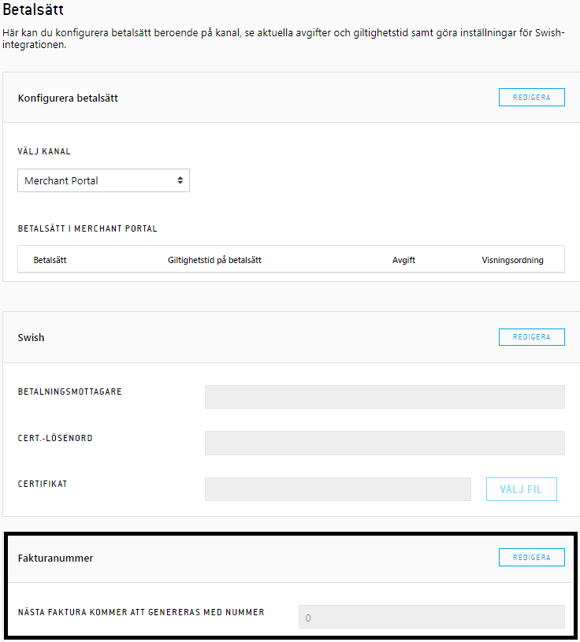
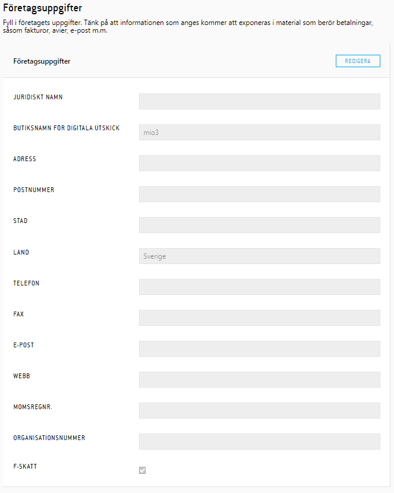

# Configuration Merchant Portal 

### Invoice number (Fakturanummer)
This is an invoice sequence that can help the store to generate unique
invoice numbers. If you choose to use this, you set a desired start
number. Once the sequence is activated you no longer have the option to
fill in desired invoice number when debiting an order.
The setting is found at Settings → Payment methods→ Invoice number
(Inställningar → Betalsätt → Fakturanummer)
### Invoice data (Fakturadata)
This is the data that will be used when your invoices are created. When
you click save a note saying "saved "will appear at the top of the page
and indicate that the data is saved. To add a logotype to your invoice
click the choose file button (Välj filer...) and choose the image you
want to use (.png and .jpg is supported). When you click the upload
button the logotype should appear next to the form if the upload was
successful.
The setting is found at Settings → Business→
Business information (Inställningar → Företaget → Företagsuppgifter)
  
  
If the buttons dont work as expected try to clear your browser's cache
using "Ctrl + F5" and try again.
**Invoice number**

**  
**
**  
**
**Invoice data**

