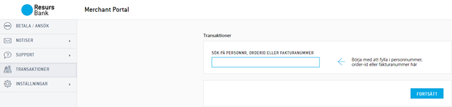
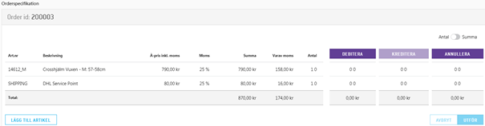
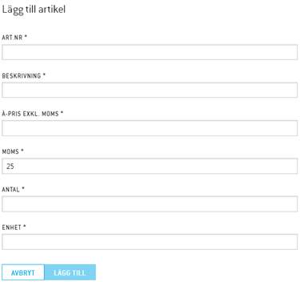

# Manipulate Payments in Merchant Portal 

The Merchant Portal web-GUI is offered in Swedish, Norwegian, Finnish
and Danish.
  
When the customer completes a purchase, a payment is created. In order
for the money to be transferred to the merchants bank account, the order
has to be finalized. This page describes how a payment can be changed
after its creation and how you finalize the order. You can do all this
from your platform, Resurs Banks web-based interface, or by using the
[Aftershop
Flow](https://test.resurs.com/docs/display/ecom/After+Shop+Service+API)
With Merchant Portal, you can adjust the Resurs payment after an order
has been made. The adjustments that are supported are described below.
  
**Annull**  
Annulment can only be done on non-finalized order rows. If a payment is
partially finalized, you can still annul the row-/s that is/are
authorized.
You can annul in the following ways;  
1. Select “Annul”, (choose which order lines to annul) and press
“Submit”  
2. Change from “Quantity” to “Amount” and manually type in your wanted
description, VAT-percentage and amount. Press “Submit”.
  
**Debit**  
Debiting can be made on a non-annulled payment and can be done either on
selected order rows or the whole order.
You can debit in the following ways;  
1. Select “Debit”, (choose which order lines to finalize) and press
“Submit”  
2. Change from “Quantity” to “Amount” and manually type in your wanted
description, VAT-percentage and amount. Press “Submit”.
  
**Credit**  
Crediting can be made on the part of the order rows which already has
been debited, either partially or the whole order.
You can credit in the following ways:  
1. Select “Credit”, (choose which order lines to credit) and press
“Submit”  
2. Change from “Quantity” to “Amount” and manually type in your wanted
description, VAT-percentage and amount. Press “Submit”.
  
**Additional authorization of payment**  
Normally, you cannot add an order row since this would mean that the
total amount is above the initial approved amount. However, in some
cases the merchant and Resurs Account manager have agreed upon setting
an extralimit that is based on a percentage (or a fixed amount) of the
initial amount. If so, you can add an order row to the existing payment
instead of the customer making a completely new order for that one/few
product-/s.
In addition, a new authorization can always be made if a product has
been annulled by accident.
This feature **only** applies to Resurs Bank payment methods.
You can add an order row in the following ways:  
1. Select “Add an article”, put in the required fields and press “Add”  
2. The order row is now authorized. If you want to debit the added order
row, follow the instructions above.
  
*Try it out
here: [https://merchantportal.integration.resurs.com/login](https://merchantportal.integration.resurs.com/login)*
**Search bar**

  
  
  
**Order example**

  
  
  
**Additional authorization of payment**

