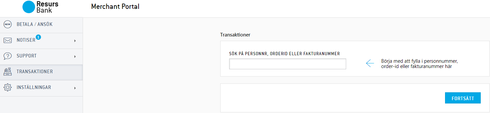
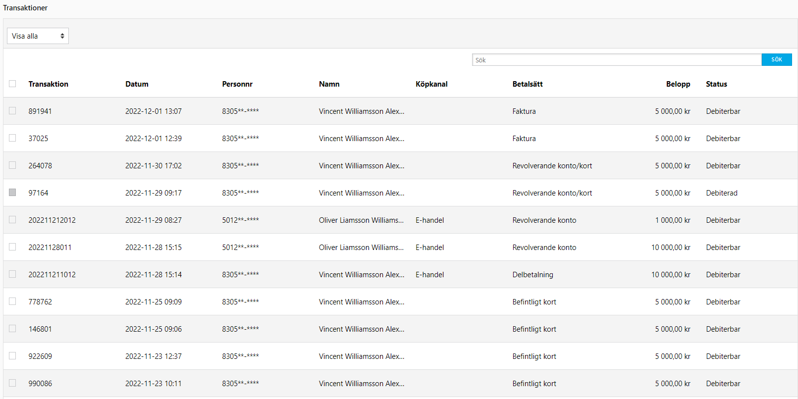

# Search Payments in Merchant Portal 

### Search payments
To search for a specific order, simply enter the customers civic number
(social security number), order-Id or invoice number.
The search bar is found under "*Transactions*" in the main bar to the
left.
###  **Sort by column**
Information can easily be sorted by column. When you have the search bar
visible, press "Continue" without entering any information in the bar.
Then, simply press the desired column name once and the transactions are
now sorted the way you requested. All columns are sortable.

  

