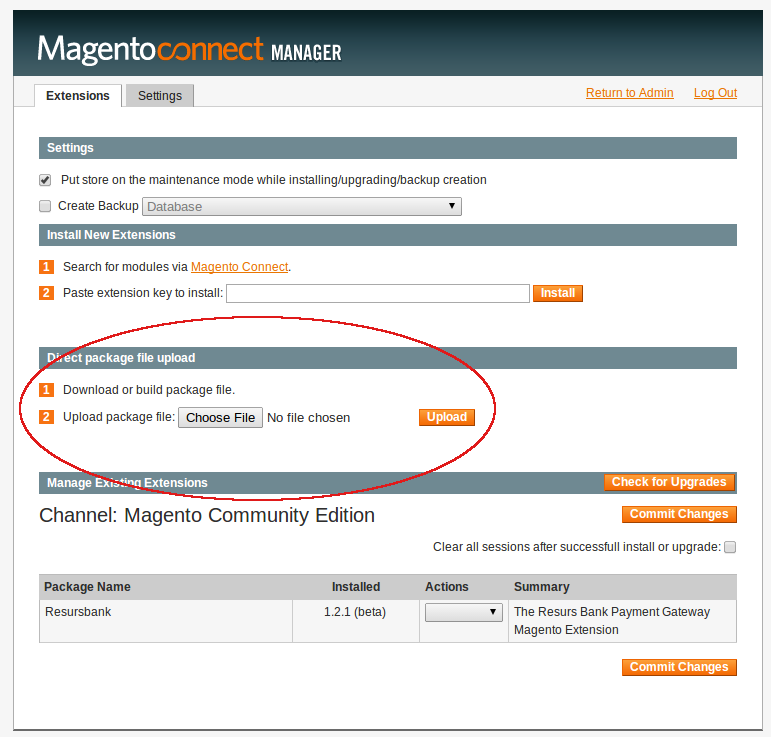
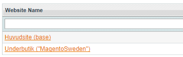
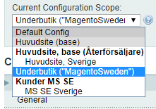

# Magento Plugin - OldFlow version 

The "OldFlow version" is a plugin for Magento CE 1.7-1.9.2 that works
with Resurs Bank deprecated flow. This page covers information about
that plugin, features and installation instructions.

## Checkout Compatibility
- Standard checkout (This is what we call "Vanilla")
- [Templates master](http://templates-master.com/) Fire Checkout
- [One step checkout](http://www.onestepcheckout.com/)

## Features
- Merchant can configure dynamic Resurs Bank payment methods from
  Backend

- Extension will display dynamic Resurs Bank payment methods pulled from
  Resurs Bank Server.

- Extension will fetch customer address via API and update their cart
  billing address if a customer is from Sweden.

- Extension is compatible with the standard Magento
  Checkout, [Firecheckout](http://firecheckout.com/) third party
  extension and [OneStepCheckout](http://www.onestepcheckout.com/) third
  party extension.

- Merchant can configure additional "Payment Fee" to each payment
  method.

- The Invoice Fee rate can be applied to all the payment methods.

- Customized Payment description can be added to each payment method by
  Merchant from back end

- This extension supports five languages – English, Danish, Finnish,
  Norwegian and Swedish

- Bundled product support

- Multiple webshops (scopes)

- Flow for finalize, annul, credit from Magento instead of
  Betalningsadmin/Payment admin (Read more about this at [Magento:
  Finalize-, credit- and annulpayment details (v1.3.8.1)](3441540))

## Current flow
Magento uses Resurs' [deprecated
flow](https://test.resurs.com/docs/display/DD/Shop+Flow+Chart), be sure
to understand this. Also read about the [concepts and
domain](concepts-and-domain), order status FROZEN and its handling are
important in the fraud and order concept.

## Installation (Package Content)

> Installation notes, error logging and developmentImportant
> installation and development notices has moved to a separate page:Have
> a look at "Release- and installation notes, error logging and
> development for Magento OldFlow", since many problems that may occur
> due to Magento internal routines, configuration, bugs, etc, can be
> solved by reading there.

The ZIP archive package will have the content below:  
The extension archive file named **Resursbank-X.X.X.tgz** and patches
are located in the patch-path.  
This can be installed directly using Magento Connect option in back end
(which is recommended since we do not support manual installations).
However, the plugin does also work, even if the plugin has been
installed manually.  
After installation, give write permissions to this Resurs Bank Payment
extension directory:  
/patch directory

> Patch checkout filesAll the necessary steps have been taken in order
> to bring all functionalities without core modification but using
> overriding features into the extension. However several of the items
> were not able to implement via override as they were from third party
> extensions. They must be patched.Back up the original files of those
> extensions (OneStepCheckout and FireCheckout) and then choose one of
> the checkouts below to see how to patch them. Due to licensing, we
> will not distribute full content of the files, just the code for the
> patch.OneStepCheckout: See Manually patching Onestep
> checkoutFireCheckout: See Manually patching Firecheckout

.

  

This extension can be seamlessly installed (and should) as a Magento
extension through Magento Connect (recommended). It can also be
installed manually but we do not officially support this, since you are
responsible yourself for setting up all file permissions correctly, etc

- Extract the extension archive file under the root directory,
- Click overwrite option to yes, 
- Now the extension has been installed successfully. 
- After manual installation, the first time the website may take some
  time for loading of the extension as it needs to set up database
  tables and all other default configurations. 
- After installation, provide proper write permissions to this Resurs
  Bank Extension directory. 
- Then clear Magento and Browser Cache once from back end.

### Upgrade
Since no files can be overwritten, these steps has to be done on
upgrading/reinstallation of the plugin, if using Magento Connect
Manager. *See Package Content above for other details about patches*

- Uninstall Resurs Bank plugin
- Check if there are any files left in app/code/local/Resursbank (this
  path must be removed, and usually is if the uninstall works properly
  all the way)
- Now, upload the plugin through "Magento Connect Manager"

## Settings and Configurations
The following are the admin settings in the Resurs Bank Magento
Extension that are required to configure by Merchant/ Admin.

*Those settings can be accessed from Back end System -\> Configuration
-\> Payment Methods*

[TABLE]

##  Updating payment methods
Updating payment methods in a multi-channel store (a store with multiple
shops) should always be done in the top level of the store (using
"website name"), since settings are inherited through the scopes. To
completely save payment methods, you also have to save settings after
updating them. Since version 1.2.8, salt keys for the callbacks are
updated each time an update or a save occurs.

## Updating the base URL and callbacks
If you for some reason change the base URL you must reload and save the
payment methods again, this is so the plugin will re-register the
callbacks with the new URL.

