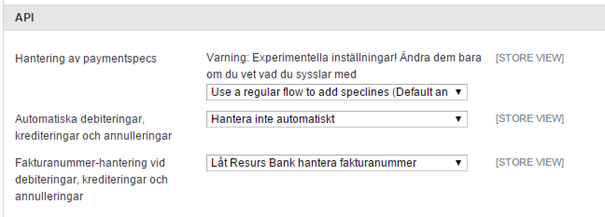
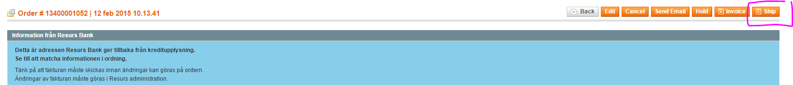
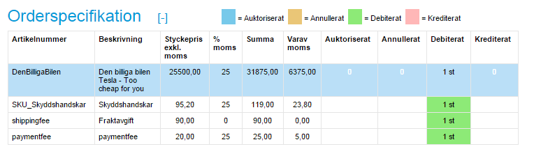
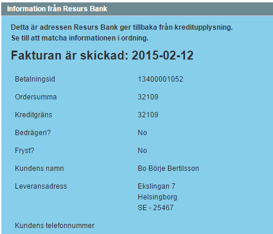
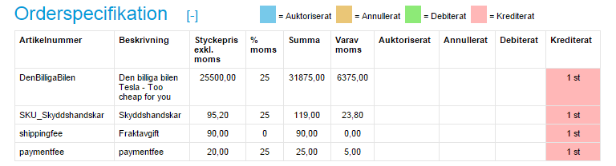
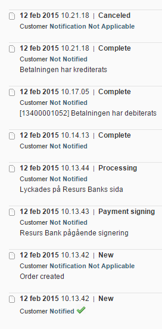

# Magento: Finalize-, credit- and annulpayment details (v1.3.8.1) 

From version 1.3.8.1, automated finalizepayment, creditpayment and
annulpayment are supported. Functionality related to the aftershopflow
is by default disabled, since the new flow also affects the
booking-stage for some product types. The settings can however be
activated from the administration panel in Magento (in the payment
methods section).

It is also very important to use the “regular flow”, since the extended
handler for bundled products is not yet fully supported.

By default, the settings looks like this:

 

As you also can see at the image, this flow currently only accepts that
invoice ID's are handled by Resurs Bank and can not be switched over to
Magento-handling.

As soon as the flow is activated the shopflow will start working as
follows:

- Finalizepayment/debit are only invoked when the order is fully shipped
  to the customer. This means that partial debits are currently not
  possible.
- Finalizepayment/debit will invoke immediately after booking, if the
  order only contains virtual or downloadable products, since they are
  not able to ship through Magento
- Creditpayment and annulpayment are invoked on order cancellations and
  the plugin automatically detects, depending on the order, which method
  it will use

# Where and when it happens
Finalizing, credits and annulments are all methods controlled from
Magento Orderview, and are activated when you begin your shipping
process.

### Finalize/Debit order

Currently, no finalization are envoked before the full order has been
shipped. If you are only partially delivering your order, nothing is
going to happen.

As you are submitting your shipment in full, Betalningsadmin is also
updated together with your order.

### Credit and annulments
Crediting and annulling orders are made through Magento's cancellation
button, and depending on the current order it will either annul or
credit the payment.

In the above example, a creditpayment will invoke since the order has
been debited (shipped). If it has not been shipped, the order will
instead get annulled.

Orders are also, always, logged in the order history of Magento

