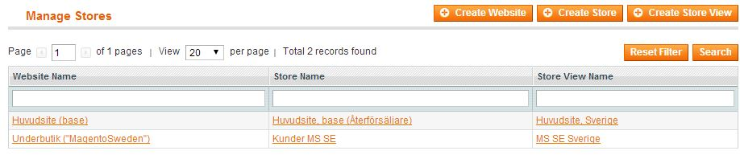
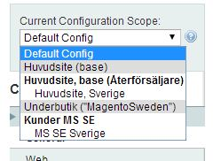
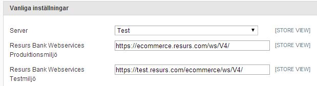
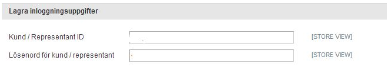
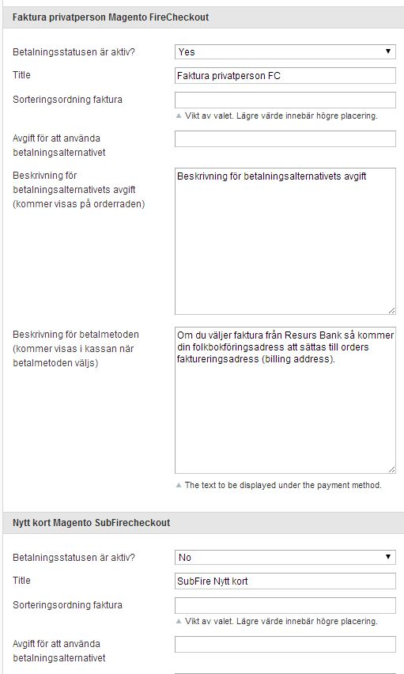
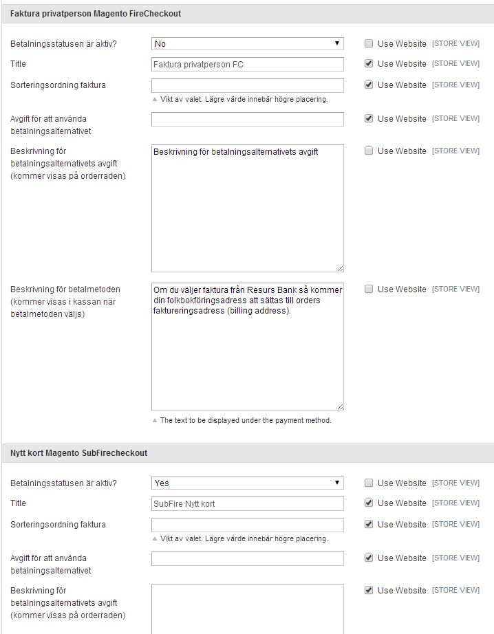

# Multiple stores with the plugin 

Since Resurs Bank plugin v1.2.0 the behaviour has changed to support
more than one scope/channel/store - here is some information on how it
works.

In this example, we have set up one main store and one substore.

From now, all payment methods are shown from all sites configured from
the store-editor, so it is important that you change your configuration
for each store (each store *view* actually), since each store probably
have their own payment methods and Resurs Bank only supports one
representative per site. When configuring representatives you should
loop through all your sites and fix them, starting with the default/main
config.

## **Important note:**
It is highly important that each store has it's own environment,
callback credentials and representative data configured, so make sure
you check all settings for each store you are configuring!

*And: Don't forget to save confiuguration! Updating payment methods is
not enough.*

## Payment methods
In the main configuration for the plugin, the settings should look
something like this. In the illustration below the
"SubFirecheckout"-method is a payment method that does not belong to the
representative in this store. Therefore, we set that to "No" (inactive).
This should be fixed in the sub-store-views after handling the main
configuration. When everything needed is set here, it should be okay to
go on with the next store.

In the sub-view, the settings look a little bit different. Now, you have
checkboxes to the right in all forms. Uncheck those, that need to be
different, like payment methods and representative data (including salt
keys).

You should now disable all payment methods that do not belong to the
representative and enable the rest, that you want to use. Don't forget
salt keys, representative data, the environment and save!

