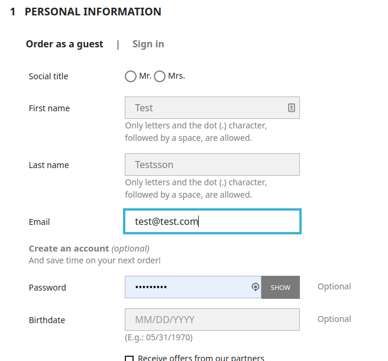
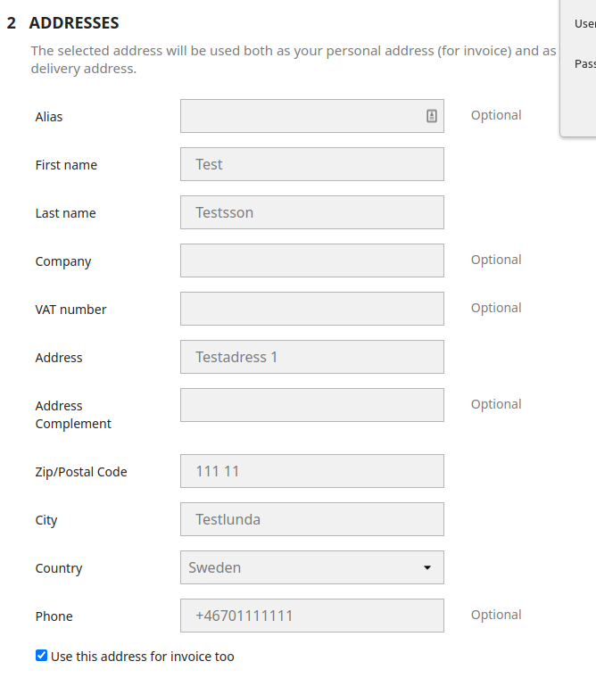
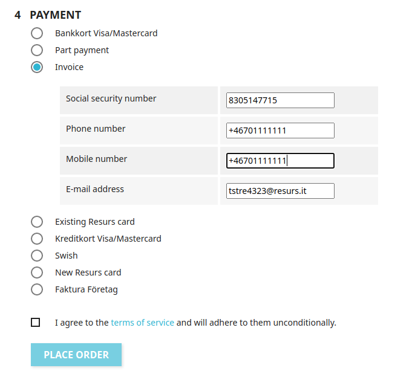

# PrestaShop Simplified Described 
Created by Thomas Tornevall, last modified on 2021-11-25
The simplified shopflow is from an integration perspective much more
friendlier to apply to PrestaShop than Resurs Checkout since the payment
flow itself does not require much frontend editing. When credentials and
payment methods are in place, it is very much straight forward and this
page explains how. The described flow is based on a multi-step checkout.
  
1.  Initiallly (at least as guest) you will reach a checkout page where
    you fill in some of your own basic customer information. If you are
    logged in, you will instead of a form to fill in get a list of
    addresses to choose between. At this moment, the plugin is idle.  
    
2.  Next page is a bigger form field where you are entering (and if you
    become a customer also saving) the customer data to use to confirm
    your order.  
    
3.  As a third step you pick a preferred shipping method for where you
    want your products (could be different do digital orders).
4.  At the final step the customer is now about to choose which payment
    method to use in the payment.  
      
    This is where the plugin activates at the first time. In
    psrbsimplified.php, a first hook named paymentOptions is executed
    (as hookPaymentOptions()). This method renders an array with the
    available payment methods in the checkout. The renderer is preparing
    everything necessary to proceed with the payment, like the payment
    method name, action link (validate.php, which very much translates
    to "validate cart to order"). It also renders additional information
    (through setAdditionalInformation() which is used by PaymentOption()
    in prestashop). This function renders the form data that is required
    at Resurs to fulfill the order. The final result of this is, as you
    can see in the screen dump a complete list of payment methods with
    the required form data for each method. There are different forms
    depending on which payment method you are using.
## Placing the order
When customers are placing the order, it redirects the customer to
controllers/front/validate.php, where the purchase process starts. From
the above perspective, the validate.php-link is set in the
PaymentOption() with set setAction()-method.
The first thing that happens in the validation process, is that we
validate all data that is required for an order to be completed in
PrestaShop. There are several exceptions in this part of the code, with
different exception codes depending on what went wrong. If everything
works fine in the postProcess-method, we will pick up the current order
created and extract the order reference from it. This is the reference
being used to create the order within Resurs simplified API.
  
