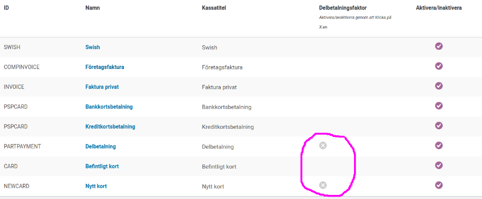
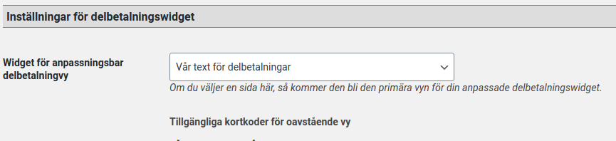
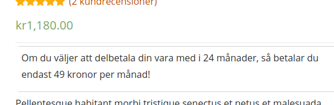

# Customized part payment information on product pages (WooCommerce)

When you set up your woocommerce platform there may be payment methods
available for part payments. They could be easily activated by clicking
on the method you prefer display on separate product pages.

## The customization

If this text isn't enough for you (note that this is not a multilingual
feature today), you can customize this text by creating your own page
(WordPress page), like this:

When this page is saved and ready to push up to the store, update the
configuration to point to this page:

And your store will now instead display this text:

