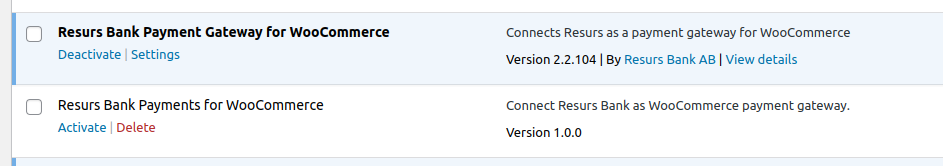

# Manually installing plugin 
Created by Thomas Tornevall, last modified on 2023-04-27
If you plan to install a development version **or** not directly from
WordPress plugin manager, this is the place to look at. If you plan to
run this plugin in a "production state", please install it properly
within the WordPress plugin manager. This page currently only has
information for git installs.
- [Installations with zip file (most similar to the WordPress Plugin
  Repository)](#Manuallyinstallingplugin-Installationswithzipfile(mostsimilartotheWordPressPluginRepository))
- [Installations with
  git](#Manuallyinstallingplugin-Installationswithgit)
  - [Dual plugins (how to act on
    it)](#Manuallyinstallingplugin-Dualplugins(howtoactonit))
  - [Creating your own zip-release from
    git](#Manuallyinstallingplugin-Creatingyourownzip-releasefromgit)
# Installations with zip file (most similar to the WordPress Plugin Repository)
About the current-zip file
Currently, there are no stable tag present in the repository. When there
is a stable tag, the "current" file will always contain the most recent
release. While waiting, the code structure in this zip is based on the
master branch.
  
1\. Upload the plugin
([resurs-bank-payment-gateway-for-woocommerce-current.zip](../../../../attachments/91029909/91030034.zip) -
1.0.0, **last update 2023-04-27**) archive to the "/wp-content/plugins/"
directory.  
2. Activate the plugin through the "Plugins" menu in WordPress.  
3. Configure the plugin via Resurs Bank control panel in admin.
# Installations with git
Go to your WordPress plugin structure (normally located in
**\[WP-ROOT\]**/wp-content/plugins and run this command:
``` syntaxhighlighter-pre
git clone --recurse-submodules -j8 https://bitbucket.org/resursbankplugins/resursbank-woocommerce.git
```
The slug (path) used by this repository is not the proper name standard
for the module. While writing this, the official slug is not entirely
set yet, but there should be no problems installing it with another slug
name than the default. However, if you use another path than the
default, [be aware of the security issues that may come with
this](https://vavkamil.cz/2021/11/25/wordpress-plugin-confusion-update-can-get-you-pwned/).
The above command will ensure you get all requirements installed in your
structure, but primarily with the master branch installed. You should
consider checking out a stable tag if you really need to use this
install method. In this case you'll also need to check for updates
manually and do manual checkouts.
This kind of installation neither guarantee that submodules are updated
properly. In some cases, you'll need to update lib/ecom manually, with
an extra git pull.
## Dual plugins (how to act on it)
This is how it may look if you run the old version and just installed
the new one. It is always recommended to deactivate the old one before
activating the new one (and vice versa) before you start running them.
The namespaces in the plugins are different to each other, so they
should not crash the platform **if** you enable both of them in the same
time.

## Creating your own zip-release from git
Clone the repository as shown above. Run a script similar like this. You
need rsync and git installed. Observe that this is only a simplified
example. The important thing is to make sure that the codebase has both
the module and lib/ecom merged. The script below will do this, and also
make sure that the latest ecom2-release is present. **Currently, ecom2
don't have any stable tag!**
**Example script**
``` syntaxhighlighter-pre
#!/bin/bash
branch="master"
if [ "" = "$1" ] ; then
    branch="$1"
fi
src="resurs-bank-payments-for-woocommerce-bitbucket"
dest="zip/resurs-bank-payment-gateway-for-woocommerce"
if [ ! -d $dest ] ; then
    mkdir $dest
fi
echo "Synchronize $src with $dest"
rsync -a --info=progress1,progress2 --delete $src/ $dest
cd $dest
git checkout $branch
git pull
cd lib/ecom
git pull origin master
cd ../..
echo "Bundle by cleanup ..."
find . -name .gitignore -exec rm -v {} \; >/dev/null 2>&1
find . -type d -name .git -exec rm -rvf {} \; >/dev/null 2>&1
cd ..
echo "Archiving ..."
zip -r resurs-bank-payment-gateway-for-woocommerce.zip resurs-bank-payment-gateway-for-woocommerce
```
  
  
