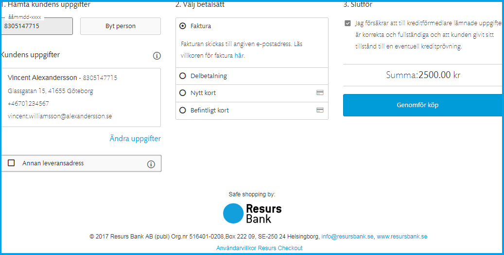
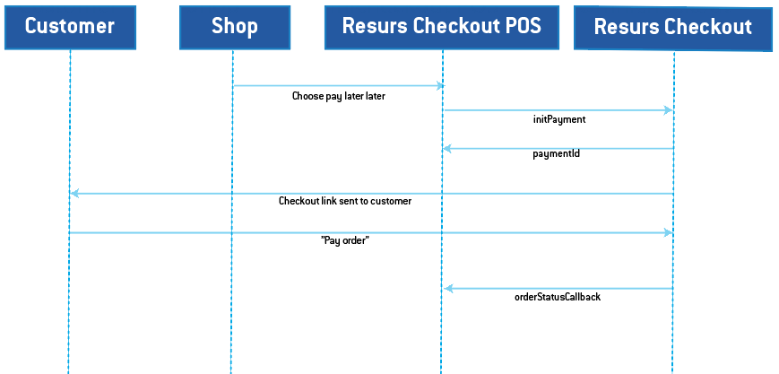

# Resurs Checkout POS 

------
# Overview
Resurs Checkout POS is an iFrame browser-based payment gateway that can
be used in a Point of Sale-system (POS). Payments  are finalized
automatically since the customer is to be expected to recieve the
product directly. If you however submit an offer "Betala Senare" (will
be explained in depth below), the payment will only be authorized and
will need to be finalized.  Note that all purchases in the
POS-environment require e-signing. The Resurs Checkout POS part is
marked with a blue frame in the screenshot below.
## Try Resurs Checkout POS for yourself
[Demo-shop](https://demoshop.resurs.com/)
  
*Screenshot from the iFrame*

**What can I find here?**
- [Overview](#ResursCheckoutPOS-Overview)
  - [Try Resurs Checkout POS for
    yourself](#ResursCheckoutPOS-TryResursCheckoutPOSforyourself)
  - [Payment methods offered within the
    checkout](#ResursCheckoutPOS-Paymentmethodsofferedwithinthecheckout)
- [Resurs Checkout
  Implementation](#ResursCheckoutPOS-ResursCheckoutImplementation)
  - [Authentication](#ResursCheckoutPOS-Authentication)
  - [End points (URLs)](#ResursCheckoutPOS-Endpoints(URLs))
  - [Errors](#ResursCheckoutPOS-Errors)
  - [Test Data](#ResursCheckoutPOS-TestData)
  - [API Overview](#ResursCheckoutPOS-APIOverview)
    - [1. Initiate Resurs CheckOut
      POS](#ResursCheckoutPOS-1.InitiateResursCheckOutPOS)
    - [3. Get information regarding the
      payment](#ResursCheckoutPOS-3.Getinformationregardingthepayment)
    - [4. Retrieve the Order](#ResursCheckoutPOS-4.RetrievetheOrder)
    - [5. Manage Order](#ResursCheckoutPOS-5.ManageOrder)
  - [API - HTTP Request](#ResursCheckoutPOS-API-HTTPRequest)
    - [POST
      /payments/{orderReference}](#ResursCheckoutPOS-initPosPOST/payments/%7BorderReference%7D)
      - [orderLines](#ResursCheckoutPOS-orderLines)
      - [metaData](#ResursCheckoutPOS-metaData)
      - [successUrl](#ResursCheckoutPOS-successUrl)
      - [backUrl](#ResursCheckoutPOS-backUrl)
      - [paymentCreatedCallbackUrl](#ResursCheckoutPOS-paymentCreatedCallbackUrl)
      - [shopUrl](#ResursCheckoutPOS-shopUrl)
    - [Response](#ResursCheckoutPOS-Response)
    - [Errors](#ResursCheckoutPOS-Errors.1)
  - [GET
    /payments/{orderReference}](#ResursCheckoutPOS-getPaymentPOSGET/payments/%7BorderReference%7D)
- [Delayed Checkout - "Betala
  sen"](#ResursCheckoutPOS-DelayedCheckout-%22Betalasen%22)
  - [Sequence diagram Resurs Bank Checkout POS - Delayed
    Checkout](#ResursCheckoutPOS-SequencediagramResursBankCheckoutPOS-DelayedCheckout)
- [Restrictions](#ResursCheckoutPOS-Restrictions)
## Payment methods offered within the checkout
Resurs Checkout provides an easy to use checkout for payment methods
such as invoice and partial payments, . The cashier enters the
customer's personal identity number (government ID) to retrieve address
details which will populate the address fields automatically. Other
mandatory information that needs to be entered are cellphone number and
email address.
Supported payment methods are;
- Invoice
- Partial payment
- Credit cards
- Branded credit cards and application for a new credit card
- VISA/Mastercard (Delayed Checkout only)
- Swish (Delayed Checkout only - Sweden)
Note that all payment methods are to be discussed through the merchant
and Resurs account manager. Onboarding can never setup a payment method
without an order from the account manager.
  
# Resurs Checkout Implementation
To use Resurs Checkout you first have to set up an agreement with Resurs
bank. This is when you get your merchant ID and your credentials.
This tutorial how to render the Resurs Checkout HTML snippet on your
checkout page. 
  
TLS
Resurs Bank does not support Transport Layer Security (TLS) prior to
Version 1.2
  
## Authentication
Resurs Checkout API uses HTTP Basic Auth for authentication. To call the
services you need to provide the credentials you received when setting
up the agreement with Resurs Bank. [Read more
here](https://test.resurs.com/docs/x/a4IW).
## End points (URLs)
- [https://poscheckout.resurs.com/pos](https://poscheckout.resurs.com/pos)
    - Production Environment
&nbsp;
- [https://postest.resurs.com/pos](https://postest.resurs.com/pos) -
  Test Environment
## Errors
Resurs APIs use HTTP 4xx 5xx status codes together with error messages
to handle errors.
## Test Data
For testing your implementation, follow the below link to test civic
numbers with different scenarios:
[Sweden](https://test.resurs.com/docs/x/aQAg)
## API Overview
  
[TABLE]
  
Want to run DELETE on payment session?
``` c-mrkdwn__pre
Running a POST with the same orderReference a second time will overwrite the first payment session, making the previous one obsolete.
```
### 1. Initiate Resurs CheckOut POS
When you want to display Resurs Checkout you need to initiate the
payment. For details about this see [/pos/payments/ - **POST**
](#ResursCheckoutPOS-initPos) .  
When you initiate the payment you may choose to [pre-filling data about
the
customer](Pre-filling-customer-data-in-Resurs-Checkout-POS_24641680.html). We
recommended this feature to optimize the Checkout for Returning
Customers.
The JSON response from the *POST payments* call contains a
unique *paymentSessionId* generated by Resurs Bank The JSON response
payload also contains the HTML snippet that you need to include on your
page to render the checkout.
### 3. Get information regarding the payment
To receive information regarding the payment whether the customer has
completed the purchase or not, you can GET-poll with paymentSessionId as
the ID which is received in the initializePayment-response. [Read
more...](#ResursCheckoutPOS-getPullPOS)  
### 4. Retrieve the Order
Use *orderReference* to fetch the order from Resurs Bank. [Read
more...](#ResursCheckoutPOS-getPaymentPOS)
### 5. Manage Order
Now you can choose to manage the order by implement APIs in [After Shop
Service API](After-Shop-Service-API_327799.html) or manually in Resurs
GUI [Manipulate Payments in Merchant
Portal](Manipulate-Payments-in-Merchant-Portal_16057107.html).  
Note that the payments are automatically finalized. You will only need
to implement the creditPayment for the After Shop API (see Delayed
Checkout - "Betala sen" for exception).
## API - HTTP Request
###  POST /payments/{orderReference}
This service sets up the payment session and should be called whenever
you want to display the checkout. It will return the paymentId and html
to be included in the online shop.
  
**Request parameters**
``` syntaxhighlighter-pre
{
    "orderLines": [
        {              
                "artNo" : "1",     
                "description" : "Order line:1",     
                "quantity" : 1.0,                
                "unitMeasure" : "pcs",     
                "unitAmountWithoutVat" : 500.0,     
                "vatPct" : 25.0,
                "totalAmountWithVat": "625",
                "totalVatAmount": "125"
         },               
         {        
                "artNo" : "2",     
                "description" : "Order line:2",     
                "quantity" : 1.0,          
                "unitMeasure" : "pcs",            
                "unitAmountWithoutVat" : 10.0,     
                "vatPct" : 25.0,
                "totalAmountWithVat": "12.5",
                "totalVatAmount": "2.5",
                "type": "ORDER_LINE"
          },             
          {        
                "artNo" : "80",     
                "description" : "Discount",     
                "quantity" : 1.0,          
                "unitMeasure" : "pcs",            
                "unitAmountWithoutVat" : -5.0,     
                "vatPct" : 0.0,
                "totalAmountWithVat": "-5.0",
                "totalVatAmount": "0.0",
                "type": "DISCOUNT"
          },             
          {        
                "artNo" : "90",     
                "description" : "Shipping & Handling",     
                "quantity" : 1.0,                 
                "unitMeasure" : "pcs",     
                "unitAmountWithoutVat" : 5.0,     
                "vatPct" : 0.0,
                "totalAmountWithVat": "5.0",
                "totalVatAmount": "0.0",
                "type": "SHIPPING_FEE"
           }  
    ],
  "metaData" : [
    {
        "key":"key1",
        "value":"value1"
    },
    {
        "key":"key2",
        "value":"value2"
    },
    {
        "key":"CustomerId",
        "value":"String 20 chars"
    },
    {
        "key":"invoiceExtRef",
        "value":"String 46 chars"
    }
       ],
    "customer": {
        "governmentId": "",
        "mobile": "0707123456",
        "email": "test@resurs.se",
        "deliveryAddress": {
            "firstName": "Daniel",
            "lastName": "Johnsson",
            "addressRow1": "Ekslingan 8",
            "addressRow2": null,
            "postalArea": "Helsingborg",
            "postalCode": "25467",
            "countryCode": "SE"
        }
    },
    "successUrl": "https://shop.representative.com/order/12345/success/",
    "backUrl": "https://shop.representative.com/order/12345/checkout/",
    "paymentCreatedCallbackUrl": "https://shop.representative.com/backend/order/12345/",
    "storeId": "9012",
    "shopUrl": "https://mystore.test.com"
}
```
  
[TABLE]
  
#### Response
**Response**
``` syntaxhighlighter-pre
{
  "paymentSessionId": "ebffab5a-3746-41c6-a020-f0cf11949897",
  "html": "<iframe id=\"rco-checkout-app-frame\" src=\"https://postest.resurs.com/web/dist/omni-checkout.html?ebffab5a-3746-41c6-a020-f0cf11949897\" frameBorder=\"0\" width=\"100%\" scrolling=\"no\" ></iframe><script type=\"text/javascript\" src=\"https://postest.resurs.com/web/dist/js/oc-shop.js\"></script>"
}
```
  
| Attribute        | Description                                                                              |     |
|------------------|------------------------------------------------------------------------------------------|-----|
| paymentSessionId | The ID for the payment session.                                                          |     |
| html             | The html snippet that must be displayed by the shop in order to display Resurs Checkout. |     |
  
#### Errors
  
| HTTP status code | Type             | Example                                        |
|------------------|------------------|------------------------------------------------|
| 400              | Application/json | { "message": "OrderReference already exists" } |
| 401              | Application/json | { "message": "Bad credentials" }               |
| 500              | Application/json | { "message": "Internal error" }                |
  
  
  
### GET /payments/{orderReference} 
**Response**
``` syntaxhighlighter-pre
{
    "id": "Omni-Session_2342345",
    "totalAmount": 500,
    "metaData": [
        {
            "key": "advertisement",
            "value": "false"
        }
    ],
    "limit": 500,
    "paymentDiffs": [
        {
            "type": "AUTHORIZE",
            "transactionId": null,
            "created": -5648895212887551616,
            "createdBy": "SHOP_FLOW",
            "paymentSpec": {
                "specLines": [
                    {
                        "id": "0",
                        "artNo": "ART123",
                        "description": "Product description",
                        "quantity": 2,
                        "unitMeasure": "kg",
                        "unitAmountWithoutVat": 200,
                        "vatPct": 25,
                        "totalVatAmount": 100,
                        "totalAmount": 500
                    }
                ],
                "totalAmount": 500,
                "totalVatAmount": 100,
                "bonusPoints": 0
            },
            "orderId": null,
            "invoiceId": null,
            "documentNames": []
        }
    ],
    "customer": {
        "governmentId": "8305147715",
        "address": {
            "fullName": "William Williamsson Eliassson",
            "firstName": "William",
            "lastName": "Eliassson",
            "addressRow1": "Ekslingan 13",
            "addressRow2": null,
            "postalArea": "Helsingborg",
            "postalCode": "25024",
            "country": "SE"
        },
        "phone": "+46701234567",
        "email": "info@resurs.se",
        "type": "NATURAL"
    },
    "deliveryAddress": {
        "fullName": "Testsson Test",
        "firstName": "Test",
        "lastName": "Testsson",
        "addressRow1": "Ekslingan 9",
        "addressRow2": null,
        "postalArea": "Helsingborg",
        "postalCode": "254 67",
        "country": "SE"
    },
    "booked": -5648516529463551616,
    "finalized": null,
    "paymentMethodId": "VISA SUPER CARD",
    "paymentMethodName": "Mocked PSP",
    "fraud": false,
    "frozen": false,
    "status": [
        "DEBITABLE"
    ],
    "storeId": "107999",
    "paymentMethodType": "PAYMENT_PROVIDER",
    "totalBonusPoints": 0
}
```
  
| HTTP status code | Type             | Example                                  |
|------------------|------------------|------------------------------------------|
| 200              | Application/json | OK                                       |
| 401              | Application/json | { "message": "Bad credentials" }         |
| 404              | Application/json | { "message": "The order does not exist"} |
| 500              | Application/json | { "message": "Internal error." }         |
  
  
##  Delayed Checkout - "Betala sen"
  
NOTE!
This feature is only available if this has been agreed to with Resurs
salesperson
  
A feature in the Resurs Checkout POS is to send out what we call a
"delayed checkout", via "Betala sen". The cashier is only to insert the
customer's information and set a valid to-date. Then, a sms/email with a
URL to the iFrame containing the cart is sent to the customer. The
customer can then choose to make purchase whenever they want. 
The payment/order is not created at Resurs Bank by this point, Resurs
Bank simply keeps the payment session alive for a period of time of the
cashiers choice, default 24 hours.
Using this feature, you will need to finalize the payment via
finalizePayment in the [After Shop
API](https://test.resurs.com/docs/x/Q4EW).
### Sequence diagram Resurs Bank Checkout POS - Delayed Checkout

  
## Restrictions
Payment is possible for persons, but not for companies.
Resurs Checkout has no IPv6 support.
If card payment via Nets is to be offered in the Delayed Checkout, a
requirement from Nets is max 32 characters for {orderReference}.
If Delayed Checkout is to be offered, each store has to provide their
own shop terms, e-mailed to Onboarding Support in a public URL, prior to
going live
When going live, you have to host your own public success- and backUrl
to where the customers/clerk are to go when the payment is completed or
failed
The orderReference-sequence is per webservice account, not per storeId.
As a solution, if you are running storeId, you can add the store number
as a prefix to the sequence
  
