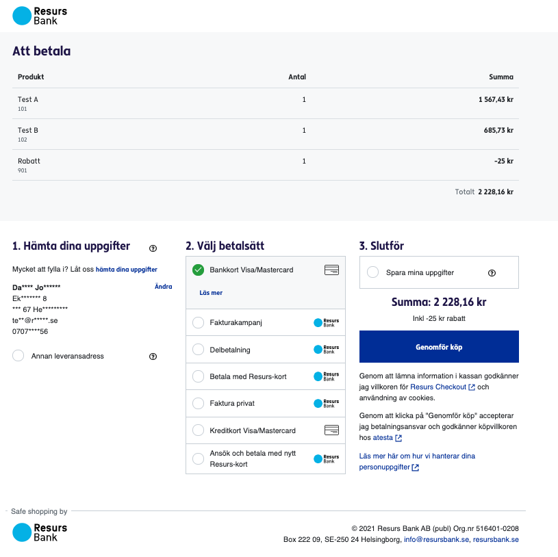

# Resurs Checkout PUSH 

------
# Overview
Resurs self service Checkout is a POS-service where you send in the cart
to Resurs, where Resurs provide the URI for the iFrame and the partner
sends the link to the customer themselves, via for example text message
or email. With this solution, there is no need to open a browser in the
POS to send out the payment link.

**What can I find here?**
- [Overview](#ResursCheckoutPUSH-Overview)
  - [Payment methods offered within the
    checkout](#ResursCheckoutPUSH-Paymentmethodsofferedwithinthecheckout)
- [Resurs self service checkout
  implementation](#ResursCheckoutPUSH-Resursselfservicecheckoutimplementation)
  - [Authentication](#ResursCheckoutPUSH-Authentication)
  - [End points (URLs)](#ResursCheckoutPUSH-Endpoints(URLs))
  - [Errors](#ResursCheckoutPUSH-Errors)
  - [Test Data](#ResursCheckoutPUSH-TestData)
  - [API Overview](#ResursCheckoutPUSH-APIOverview)
    - [1. Initiate Resurs self service
      checkout](#ResursCheckoutPUSH-1.InitiateResursselfservicecheckout)
    - [2. Retrieve the Order](#ResursCheckoutPUSH-2.RetrievetheOrder)
    - [3. Manage Order](#ResursCheckoutPUSH-3.ManageOrder)
  - [API - HTTP Request](#ResursCheckoutPUSH-API-HTTPRequest)
    - [POST
      /payments/{orderReference}](#ResursCheckoutPUSH-initPosPOST/payments/%7BorderReference%7D)
      - [orderLines](#ResursCheckoutPUSH-orderLines)
      - [metaData](#ResursCheckoutPUSH-metaData)
      - [successUrl](#ResursCheckoutPUSH-successUrl)
      - [backUrl](#ResursCheckoutPUSH-backUrl)
    - [Response](#ResursCheckoutPUSH-Response)
    - [Errors](#ResursCheckoutPUSH-Errors.1)
  - [GET
    /payments/{orderReference}](#ResursCheckoutPUSH-getPaymentPOSGET/payments/%7BorderReference%7D)
    - [Response](#ResursCheckoutPUSH-Response.1)
- [Restrictions/prerequisites](#ResursCheckoutPUSH-Restrictions/prerequisites)
## Payment methods offered within the checkout
Resurs Checkout provides an easy to use checkout for payment methods
such as invoice and partial payments. The customer enters personal
identity number (government ID) to retrieve address details which will
populate the address fields automatically. Other mandatory information
that needs to be entered are cellphone number and email address.
Supported payment methods are;
- Invoice
- Partial payment
- Credit cards
- Branded credit cards and application for a new credit card
- VISA/Mastercard 
- Swish (Sweden)
Note that all payment methods are to be discussed through the merchant
and Resurs account manager. Onboarding can never setup a payment method
without an order from the account manager.
  
# Resurs self service checkout implementation
To use Resurs self service checkout you first have to set up an
agreement with Resurs bank. This is when you get your merchant ID and
your credentials.
This tutorial is how to render the Resurs self service checkout link
which can be sent via SMS or email by you.
  
TLS
Resurs Bank does not support Transport Layer Security (TLS) prior to
Version 1.2
  
## Authentication
Resurs Checkout API uses HTTP Basic Auth for authentication. To call the
services you need to provide the credentials you received when setting
up the agreement with Resurs Bank. [Read more
here](https://test.resurs.com/docs/x/a4IW).
## End points (URLs)
- [https://poscheckout.resurs.com/pos](https://poscheckout.resurs.com/pos)
    - Production Environment
&nbsp;
- [https://postest.resurs.com/pos](https://postest.resurs.com/pos) -
  Test Environment
## Errors
Resurs APIs use HTTP 4xx 5xx status codes together with error messages
to handle errors.
## Test Data
For testing your implementation, follow the below link to test civic
numbers with different scenarios:
[Sweden](https://test.resurs.com/docs/x/aQAg)
## API Overview
  
[TABLE]
  
Want to run DELETE on payment session?
``` c-mrkdwn__pre
Running a POST with the same orderReference a second time will overwrite the first payment session, making the previous one obsolete.
```
### 1. Initiate Resurs self service checkout
First you have to initiate the payment. For details about this see
[/checkout/payments/ - **POST** ](#ResursCheckoutPUSH-initPos) .  
When you initiate the payment you may choose to [pre-filling data about
the customer](Pre-filling-customer-data_39190557.html). We recommended
this feature to optimize the Checkout for Returning Customers.
The JSON response from the *POST payments* call contains a
unique *paymentSessionId* generated by Resurs Bank The JSON response
payload also contains the checkout location that you need to include in
sms or email.
### 2. Retrieve the Order
To retrieve information whether the customer has completed his/hers
purchase you have two choices;
- Poll the *orderReference* to fetch the order from Resurs Bank via GET
  in REST ([Read more...](#ResursCheckoutPUSH-getPaymentPOS)) or via
  getPayment from AfterShopService ([Read
  more...](https://test.resurs.com/docs/display/ecom/Get+Payment))
- Implement callbacks ([Read
  more...](https://test.resurs.com/docs/display/ecom/Callbacks)) where
  the BOOKED-callback will give you confirmation that the order is
  booked at Resurs end.
Note that you can only have one set of callbacks per production account.
If you are unsure of the amount of production accounts you are to use,
please contact us. 
### 3. Manage Order
If the payment has been booked at Resurs - you can now choose to manage
the order by implementing APIs in [After Shop Service
API](After-Shop-Service-API_327799.html) or manually in Resurs
GUI [Manipulate Payments in Merchant
Portal](Manipulate-Payments-in-Merchant-Portal_16057107.html).  
Note that for the moment, the payments are automatically finalized.
Therefore the only action available when payment is done is crediting
(creditPayment in AfterShopService).
Soon, when the flag for finalizeIfBooked true/false is released and you
are sending in *false* as the value, you can use debiting
(finalizePayment) and annulling (annullPayment) as well as addition
(additionalDebitOfPayment).  
Note that crediting (creditPayment) only can be done when the payment
has been finalized.
To see what actions you can take on a payment depending on its status,
[Read more
here...](https://test.resurs.com/docs/display/ecom/After+Shop+Service+API#AfterShopServiceAPI-Availableactions,dependingonstatusandamount.)  
To further understand what the Resurs-status means, [Read more
here...](https://test.resurs.com/docs/display/ecom/After+Shop+Service+API#AfterShopServiceAPI-GeneralsetupfororderstatusatResursBank.)
## API - HTTP Request
###  POST /payments/{orderReference} 
This service sets up the payment session and should be called whenever
you want to display the checkout. It will return the paymentId and html
to be included in the online shop.
  
**Request parameters**
``` syntaxhighlighter-pre
{
    "orderLines": [
        {              
                "artNo" : "1",     
                "description" : "Order line:1",     
                "quantity" : 1.0,                
                "unitMeasure" : "pcs",     
                "unitAmountWithoutVat" : 500.0,     
                "vatPct" : 25.0,
                "totalAmountWithVat": "625",
                "totalVatAmount": "125" 
                "link" : "https://www.linktoproductpage1.se"
         },               
         {        
                "artNo" : "2",     
                "description" : "Order line:2",     
                "quantity" : 1.0,          
                "unitMeasure" : "pcs",            
                "unitAmountWithoutVat" : 10.0,     
                "vatPct" : 25.0,
                "totalAmountWithVat": "12.5",
                "totalVatAmount": "1.25" 
                "link" : "https://www.linktoproductpage2.se",
                "type": "ORDER_LINE"
          },             
          {        
                "artNo" : "80",     
                "description" : "Discount",     
                "quantity" : 1.0,          
                "unitMeasure" : "pcs",            
                "unitAmountWithoutVat" : -5.0,     
                "vatPct" : 0.0,
                "totalAmountWithVat": "-5.0",
                "totalVatAmount": "0.0"
                "type": "DISCOUNT"
          },             
          {        
                "artNo" : "90",     
                "description" : "Shipping & Handling",     
                "quantity" : 1.0,                 
                "unitMeasure" : "pcs",     
                "unitAmountWithoutVat" : 5.0,     
                "vatPct" : 0.0,
                "totalAmountWithVat": "5.0",
                "totalVatAmount": "0.0"
                "type": "SHIPPING_FEE"
           }  
    ],
  "metaData" : [
    {
        "key":"key1",
        "value":"value1"
    },
    {
        "key":"key2",
        "value":"value2"
    },
    {
        "key":"CustomerId",
        "value":"String 20 chars"
    },
    {
        "key":"invoiceExtRef",
        "value":"String 46 chars"
    }
       ],
    "customer": {
        "governmentId": "",
        "mobile": "0707123456",
        "email": "test@resurs.se",
        "deliveryAddress": {
            "firstName": "Daniel",
            "lastName": "Johnsson",
            "addressRow1": "Ekslingan 8",
            "addressRow2": null,
            "postalArea": "Helsingborg",
            "postalCode": "25467",
            "countryCode": "SE"
        }
    },
   "delayedCheckoutOptions" : {
      "useDelayed" : true,
      "expiresAfterNumberOfDays" : "2",
      "expiresAfterNumberOfHours" : "10",
      "finalizeIfBooked" : false 
    },
    "successUrl": "https://shop.representative.com/order/12345/yourSuccessPage/",
    "backUrl": "https://shop.representative.com/order/12345/yourFailPage/"
}
```
  
[TABLE]
  
#### Response
**Response**
``` syntaxhighlighter-pre
{
"paymentSessionId": "9e3aeb06-cafa-4149-96eb-5d5e806bbd27",
"delayedCheckoutLocation": "https://web-integration-delayed-checkout.integration.resurs.com/9e3aeb06-cafa-4149-96eb-5d5e806bbd27"
}
```
  
| Attribute               | Description                                    |     |
|-------------------------|------------------------------------------------|-----|
| paymentSessionId        | The ID for the payment session.                |     |
| delayedCheckoutLocation | Link to checkout location. Max 100 characters. |     |
  
#### Errors
  
| HTTP status code | Type             | Example                                        |
|------------------|------------------|------------------------------------------------|
| 400              | Application/json | { "message": "OrderReference already exists" } |
| 401              | Application/json | { "message": "Bad credentials" }               |
| 500              | Application/json | { "message": "Internal error" }                |
  
### GET /payments/{orderReference}
**Response**
``` syntaxhighlighter-pre
{
    "id": "Omni-Session_2342345",
    "totalAmount": 500,
    "metaData": [
        {
            "key": "advertisement",
            "value": "false"
        }
    ],
    "limit": 500,
    "paymentDiffs": [
        {
            "type": "AUTHORIZE",
            "transactionId": null,
            "created": -5648895212887551616,
            "createdBy": "SHOP_FLOW",
            "paymentSpec": {
                "specLines": [
                    {
                        "id": "0",
                        "artNo": "ART123",
                        "description": "Product description",
                        "quantity": 2,
                        "unitMeasure": "kg",
                        "unitAmountWithoutVat": 200,
                        "vatPct": 25,
                        "totalVatAmount": 100,
                        "totalAmount": 500
                    }
                ],
                "totalAmount": 500,
                "totalVatAmount": 100,
                "bonusPoints": 0
            },
            "orderId": null,
            "invoiceId": null,
            "documentNames": []
        }
    ],
    "customer": {
        "governmentId": "8305147715",
        "address": {
            "fullName": "William Williamsson Eliassson",
            "firstName": "William",
            "lastName": "Eliassson",
            "addressRow1": "Ekslingan 13",
            "addressRow2": null,
            "postalArea": "Helsingborg",
            "postalCode": "25024",
            "country": "SE"
        },
        "phone": "+46701234567",
        "email": "info@resurs.se",
        "type": "NATURAL"
    },
    "deliveryAddress": {
        "fullName": "Testsson Test",
        "firstName": "Test",
        "lastName": "Testsson",
        "addressRow1": "Ekslingan 9",
        "addressRow2": null,
        "postalArea": "Helsingborg",
        "postalCode": "254 67",
        "country": "SE"
    },
    "booked": -5648516529463551616,
    "finalized": null,
    "paymentMethodId": "VISA SUPER CARD",
    "paymentMethodName": "Mocked PSP",
    "fraud": false,
    "frozen": false,
    "status": [
        "DEBITABLE"
    ],
    "storeId": "107999",
    "paymentMethodType": "PAYMENT_PROVIDER",
    "totalBonusPoints": 0
}
```
#### Response
  
| HTTP status code | Type             | Example                                  |
|------------------|------------------|------------------------------------------|
| 200              | Application/json | OK                                       |
| 401              | Application/json | { "message": "Bad credentials" }         |
| 404              | Application/json | { "message": "The order does not exist"} |
| 500              | Application/json | { "message": "Internal error." }         |
  
  
## Restrictions/prerequisites
SMS/Email service which can send the payment link to the customer
Payment is possible for persons, but not for companies.
Resurs Checkout has no IPv6 support.
If card payment via Nets is to be offered in the Delayed Checkout, a
requirement from Nets is max 32 characters for {orderReference}.
If Swish (SE) is to be offered in the Delayed Checkout, a requirement
from Swish is max 36 characters for {orderReference}
Each store has to provide their own shop terms, e-mailed to Onboarding
Support in a public URL, prior to going live (will be available for
customer in Resurs Checkout)
When going live, you have to host your own public success- and backUrl
to where the customers are to go when the payment is completed or failed
The orderReference-sequence is per webservice account, not per storeId.
As a solution, if you are running storeId, you can add the store number
as a prefix to the sequence
Only one set of callbacks can be configured per production account
Payments are authorized 90 days before annullment. After that, the
payment must be done once again from scratch
