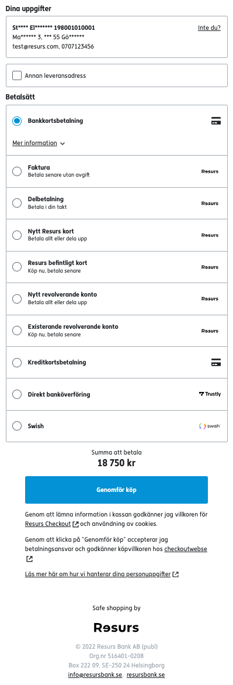

# Resurs Checkout Web 
Created by e-Commerce Support, last modified by Patric Johnsson on
2022-12-06
# Overview
Resurs Checkout is an iFrame-based payment gateway that can be used from
an online shop to process payments. 
  
IPv6
*Resurs Checkout has no IPv6 support.*

**What can I find here?**
- [Overview](#ResursCheckoutWeb-Overview)
  - [Sequence diagram](#ResursCheckoutWeb-Sequencediagram)
  - [Resurs Checkout
    Implementation](#ResursCheckoutWeb-ResursCheckoutImplementation)
  - [Prerequisites](#ResursCheckoutWeb-Prerequisites)
  - [Set up account](#ResursCheckoutWeb-Setupaccount)
  - [Authentication](#ResursCheckoutWeb-Authentication)
  - [End points (URLs)](#ResursCheckoutWeb-Endpoints(URLs))
  - [Errors](#ResursCheckoutWeb-Errors)
  - [API Overview](#ResursCheckoutWeb-APIOverview)
    - [1. Initiate payment](#ResursCheckoutWeb-1.Initiatepayment)
    - [2. Render Resurs Checkout
      snippet](#ResursCheckoutWeb-2.RenderResursCheckoutsnippet)
    - [3. Update ongoing
      payment](#ResursCheckoutWeb-3.Updateongoingpayment)
    - [3. Manage Order](#ResursCheckoutWeb-3.ManageOrder)
  - [API - HTTP Request](#ResursCheckoutWeb-API-HTTPRequest)
    - [POST
      /payments/{orderReference}](#ResursCheckoutWeb-initRcoPOST/payments/%7BorderReference%7D)
      - [orderLines](#ResursCheckoutWeb-orderLines)
      - [metaData](#ResursCheckoutWeb-metaData)
      - [successUrl](#ResursCheckoutWeb-successUrl)
      - [backUrl](#ResursCheckoutWeb-backUrl)
      - [paymentCreatedCallbackUrl](#ResursCheckoutWeb-paymentCreatedCallbackUrl)
      - [shopUrl](#ResursCheckoutWeb-shopUrl)
    - [Response](#ResursCheckoutWeb-Response)
    - [Errors](#ResursCheckoutWeb-Errors.1)
  - [PUT
    /payments/{orderReference}](#ResursCheckoutWeb-putRcoPUT/payments/%7BorderReference%7D)
    - [orderLines](#ResursCheckoutWeb-orderLines.1)
  - [Response](#ResursCheckoutWeb-Response.1)
  - [GET
    /payments/{orderReference}](#ResursCheckoutWeb-GET/payments/%7BorderReference%7D)
  - [PUT
    /payments/{orderReference}/updatePaymentReference](#ResursCheckoutWeb-PUT/payments/%7BorderReference%7D/updatePaymentReference)
  - [Interceptor notice](#ResursCheckoutWeb-Interceptornotice)
- [Callbacks](#ResursCheckoutWeb-Callbacks)
  - [POST
    /callbacks/{eventType}](#ResursCheckoutWeb-POST/callbacks/%7BeventType%7D)
  - [GET
    /callbacks/{eventType}](#ResursCheckoutWeb-GET/callbacks/%7BeventType%7D)
  - [GET /callbacks](#ResursCheckoutWeb-GET/callbacks)
  - [DELETE
    /callbacks/{eventType}](#ResursCheckoutWeb-DELETE/callbacks/%7BeventType%7D)
- [Order Administration](#ResursCheckoutWeb-OrderAdministration)
- [Resurs Checkout Cookies](#ResursCheckoutWeb-ResursCheckoutCookies)
- [Analytics and statistics
  usage](#ResursCheckoutWeb-Analyticsandstatisticsusage)
- [Restrictions](#ResursCheckoutWeb-Restrictions)
- [Terms and conditions of the
  shop](#ResursCheckoutWeb-Termsandconditionsoftheshop)
  
  
Resurs Checkout is responsive, it adapts automatically to desktops as
well as mobile devices.
Resurs Checkout provides an easy to use checkout for all the payment
methods that are configured in your PaymentAdmin/Merchant Portal
interface such as invoice, partial payments and credit cards. The user
can use a personal identity number (government ID) to retrieve address
details which will populate the address fields automatically. Users who
do not wish to enter their personal identity number may fill in their
address details manually. Returning customers are identified by a
browser cookie and will not need to re-enter the data into the checkout.
This means that there are three ways in which a user's address details
can be retrieved:
- Automatically by using a personal identity number (government ID)
- By the user manually entering the address details
- From a cookie stored in the user's browser
Supported payment methods (if enabled in the PaymentAdmin settings):
- Invoice
- Partial payment
- Credit cards
- Branded credit cards and application for a new credit card
- Swish
Note that all payment methods are to be discussed through the merchant
and Resurs account manager. Onboarding can never setup a payment method
without an order from the account manager.
Try Resurs Checkout for yourself
[Demo-shop](https://demoshop.resurs.com)
## Sequence diagram
The following image shows the interaction between the shop and the
Resurs Checkout server.

1)      The customer chooses to pay for items in the shoping cart in the
online shop.
2)      Your application server makes a POST to the REST-resource
*/payments* and receives a response consisting of:
1.  The PaymentId valid for this session.
2.  An HTML-snippet that should be inserted in the checkout-webpage
3)      The shop displays the checkout-page (where Resurs Checkout is
now included) to the customer. The customer can now look up his/her
address and select payment method.
4)      While viewing the checkout the user may choose to add/remove
articles from the shopping cart.
5\)      If the shopping cart is updated, your application must make a
PUT to the REST-resource */payments. *Resurs Checkout will then
automatically be updated with the new total amount.
6)      Customer selects to complete the payment.
7)      Customer is :
1.  Paying with Visa/MasterCard
8)      The customer is redirected to relevant pages to be able to
finalize payment details and or performing signing with bank ID.
9)      The customer browser is redirected to your ”Thank you”-page or
in case of failed payment, back to your checkout.
10)   Your application server receives a paymentStatus callback based on
the callback-url provided in step 2.
  
## Resurs Checkout Implementation
## Prerequisites
1.  A merchant ID from Resurs Bank
2.  An e-commerce system which can
    1.  make calls to the checkout service
    2.  render a checkout page containing the Resurs Checkout iframe.
        See [Iframe communication (v2API)](5570788.html) documentation
        for more information about how to fully communicate and handle
        the iframe.
    3.  display a payment confirmation page
HTTPS and certificate
Note that we only support HTTPS, both in test and production
environment. You must have a valid and issued (not self signed)
certificate for this.
TLS
Resurs Bank does not support Transport Layer Security (TLS) prior to
Version 1.2
## Set up account
To use Resurs Checkout you first have to set up an agreement with Resurs
bank. This is when you get your merchant ID and your credentials for the
webservice account.
## Authentication
The Resurs Checkout API uses Basic Auth. To call the services you need
to provide the credentials you received when setting up the agreement
with Resurs Bank. [Read
more..](Permissions-and-passwords---Platform-access_1475179.html).
## End points (URLs)
``` tw-data-text
        E-commerce:
```
- [https://checkout.resurs.com/checkout](https://checkout.resurs.com/checkout) -
  Production Environment
- [https://omnitest.resurs.com/checkout](https://omnitest.resurs.com/checkout) -
  Test Environment
  
Test Data
For testing of Resurs Checkout use the below test personal identity
numbers:
[Sweden](https://test.resurs.com/docs/x/aQAg)  
[Finland](https://test.resurs.com/docs/x/aQAg)  
[Norway](https://test.resurs.com/docs/x/aQAg)
## Errors
Resurs APIs use HTTP 4xx 5xx status codes together with error messages
to handle errors.
## API Overview
Some of those API rest calls can be used without the need of Resurs
Checkout. For example, if you need to get a full list of registered
callbacks, you can make the request even if you don't use the Checkout
itself.
  
[TABLE]
  
Want to run DELETE on payment session?
``` c-mrkdwn__pre
Running a POST with the same orderReference a second time will overwrite the first payment session, making the previous one obsolete.
```
### 1. Initiate payment
First you have to initiate the payment. For details about this see [POST
/checkout/payments/](#ResursCheckoutWeb-initRco) .  
When you initiate the payment you may choose to [pre-filling data about
the
customer](Pre-filling-customer-data-in-Resurs-Checkout_22183947.html). We
recommended this feature to optimize the Checkout for Returning
Customers.
The JSON response from the *POST payments* call contains HTML snippet
that allows the merchant to render the Checkout iframe. The JSON
response payload also contains a unique *paymentSessionId* generated by
Resurs Bank.  
### 2. Render Resurs Checkout snippet
From the *POST payments* call, get the *html* property and embed it into
your page where you would like the Resurs Checkout to be rendered.  
We recommend you to embed the HTML snippet server side.
### 3. Update ongoing payment
Whenever the content of your shopping cart is updated you need to notify
Resurs Checkout. For details about this see [PUT
/checkout/payments/](#ResursCheckoutWeb-putRco).
### 3. Manage Order
When the payment has been booked at Resurs - you can now choose to
manage the order by implementing APIs in [After Shop Service
API](After-Shop-Service-API_327799.html) or manually in Resurs
GUI [Manipulate Payments in Merchant
Portal](Manipulate-Payments-in-Merchant-Portal_16057107.html).  
Note SWISH payments are automatically finalized. Therefore the only
action available when payment is done is crediting (creditPayment in
AfterShopService).
You can use debiting (finalizePayment) and annulling (annullPayment) as
well as addition (additionalDebitOfPayment).  
Note that crediting (creditPayment) only can be done when the payment
has been finalized.
To see what actions you can take on a payment depending on its status,
[Read more
here...](https://test.resurs.com/docs/display/ecom/After+Shop+Service+API#AfterShopServiceAPI-Availableactions,dependingonstatusandamount.)  
To further understand what the Resurs-status means, [Read more
here...](https://test.resurs.com/docs/display/ecom/After+Shop+Service+API#AfterShopServiceAPI-GeneralsetupfororderstatusatResursBank.)
``` tw-data-text
```
**If you are to use Nets, a requirement from Nets is max 32 characters
for {orderReference}.  
If you are to use Swish, a requirement from Swish is max 35 characters
for {orderReference}.**
***Allowed characters are a-z A-Z 0-9 -***
##  API - HTTP Request
Some of those API rest calls can be used without the need of Resurs
Checkout. For example, if you need to get a full list of registered
callbacks, you can make the request even if you don't use the Checkout
itself.
### POST /payments/{orderReference} 
This service sets up the payment session and should be called whenever
you want to display the checkout. It will return the paymentId and html
to be included in the online shop.
  
**Request parameters**
``` syntaxhighlighter-pre
{
    "orderLines": [
        {              
                "artNo" : "1",     
                "description" : "Order line:1",     
                "quantity" : 1.0,                
                "unitMeasure" : "pcs",     
                "unitAmountWithoutVat" : 500.0,     
                "vatPct" : 25.0,
                "totalAmountWithVat": 625,
                "totalVatAmount": 125 
         },               
         {        
                "artNo" : "2",     
                "description" : "Order line:2",     
                "quantity" : 1.0,          
                "unitMeasure" : "pcs",            
                "unitAmountWithoutVat" : 10.0,     
                "vatPct" : 25.0,
                "totalAmountWithVat": 12.5,
                "totalVatAmount": 1.25,
                "type": "ORDER_LINE"
          },             
          {        
                "artNo" : "80",     
                "description" : "Discount",     
                "quantity" : 1.0,          
                "unitMeasure" : "pcs",            
                "unitAmountWithoutVat" : -5.0,     
                "vatPct" : 0.0,
                "totalAmountWithVat": -5.0,
                "totalVatAmount": 0.0,
                "type": "DISCOUNT"
          },             
          {        
                "artNo" : "90",     
                "description" : "Shipping & Handling",     
                "quantity" : 1.0,                 
                "unitMeasure" : "pcs",     
                "unitAmountWithoutVat" : 5.0,     
                "vatPct" : 0.0,
                "totalAmountWithVat": 5.0,
                "totalVatAmount": 0.0,
                "type": "SHIPPING_FEE"
           }  
    ],
  "metaData" : [
    {
        "key":"key1",
        "value":"value1"
    },
    {
        "key":"key2",
        "value":"value2"
    },
    {
        "key":"CustomerId",
        "value":"String 20 chars"
    },
    {
        "key":"invoiceExtRef",
        "value":"String 46 chars"
    }
       ],
    "customer": {
        "governmentId": "8305147715",
        "mobile": "0707123456",
        "email": "test@resurs.se",
        "deliveryAddress": {
            "firstName": "Daniel",
            "lastName": "Johnsson",
            "addressRow1": "Ekslingan 8",
            "addressRow2": null,
            "postalArea": "Helsingborg",
            "postalCode": "25467",
            "countryCode": "SE"
        }
    },
    "successUrl": "https://shop.representative.com/order/12345/success/",
    "backUrl": "https://shop.representative.com/order/12345/checkout/",
    "shopUrl": "https://mystore.test.com"
}
```
  
[TABLE]
  
#### Response
**Response body**
``` syntaxhighlighter-pre
{
    "paymentSessionId": "payment-session-id-as-uuid",
    "iframe": "<iframe id=\"rco-checkout-app-frame\" src=\"https:\/\/omnitest.resurs.com\/web\/dist\/omni-checkout.html?56e31e24-6e73-4dfc-8ab2-9413fbe8e173\" frameBorder=\"0\" width=\"100%\" scrolling=\"no\" ><\/iframe>",
    "script": "<script type=\"text\/javascript\" src=\"https:\/\/omnitest.resurs.com\/web\/dist\/js\/oc-shop.js\"><\/script>",
    "customer": {
        "governmentId": 8305147715,
        "mobile": "0701234567",
        "email": "test@example.com",
        "invoiceAddress": {
            "fullName": "Firstname Lastname",
            "firstName": "Firstname",
            "lastName": "Lastname",
            "addressRow1": "Addressrow1",
            "addressRow2": null,
            "postalArea": "postalArea",
            "postalCode": "12345",
            "countryCode": "SE"
        },
        "deliveryAddress": null,
        "customerType": "NATURAL",
        "mobileNotValidated": "0701234567",
        "emailNotValidated": "test@example.com"
    },
    "baseUrl": "https:\/\/omnitest.resurs.com\/web\/dist\/omni-checkout.html",
    "html": "<iframe id=\"rco-checkout-app-frame\" src=\"https:\/\/omnitest.resurs.com\/web\/dist\/omni-checkout.html?56e31e24-6e73-4dfc-8ab2-9413fbe8e173\" frameBorder=\"0\" width=\"100%\" scrolling=\"no\" ><\/iframe><script type=\"text\/javascript\" src=\"https:\/\/omnitest.resurs.com\/web\/dist\/js\/oc-shop.js\"><\/script>"
}
```
  
| Attribute        | Description                                                                                 |     |
|------------------|---------------------------------------------------------------------------------------------|-----|
| paymentSessionId | The ID for the payment session.                                                             |     |
| html             | The html snippet that must be displayed by the shop in order to display Resurs Checkout.    |     |
| iframe           | The html snippet to display the iframe only.                                                |     |
| script           | The script snippet that should be put in the header (for facelift, not the legacy version). |     |
| customer         | The customer object                                                                         |     |
| baseUrl          | The baseurl for RCO.                                                                        |     |
  
#### Errors
  
| HTTP status code | Type             | Example                                        |
|------------------|------------------|------------------------------------------------|
| 400              | Application/json | { "message": "OrderReference already exists" } |
| 401              | Application/json | { "message": "Bad credentials" }               |
| 500              | Application/json | { "message": "Internal error" }                |
  
### PUT /payments/{orderReference}
This service should be called whenever the content of the shopping cart
is updated. The iFrame's total sum, visible to the customer, is then
updated via websocket.
**Request parameters**
``` syntaxhighlighter-pre
{
    "orderLines": [
        {              
                "artNo" : "1",     
                "description" : "Order line:1",     
                "quantity" : 1.0,                
                "unitMeasure" : "pcs",     
                "unitAmountWithoutVat" : 500.0,     
                "vatPct" : 25.0
         },               
         {        
                "artNo" : "2",     
                "description" : "Order line:2",     
                "quantity" : 1.0,     
                "unitMeasure" : "pcs",
                "unitAmountWithoutVat" : 10.0,     
                "vatPct" : 25.0
          },
          {        
                "artNo" : "3",     
                "description" : "Order line:3",     
                "quantity" : 1.0, 
                "unitMeasure" : "pcs",
                "unitAmountWithoutVat" : 20.0,     
                "vatPct" : 25.0,
                "type": "ORDER_LINE"
          },             
          {        
                "artNo" : "80",     
                "description" : "Discount",     
                "quantity" : 1.0,
                "unitMeasure" : "pcs",
                "unitAmountWithoutVat" : -5.0,     
                "vatPct" : 0.0,
                "type": "DISCOUNT"
          },             
          {        
                "artNo" : "90",     
                "description" : "Shipping & Handling",     
                "quantity" : 1.0,
                "unitMeasure" : "pcs",
                "unitAmountWithoutVat" : 5.0,     
                "vatPct" : 0.0,
                "type": "SHIPPING_FEE"
           }  
    ]
}
```
  
[TABLE]
  
### Response
  
| HTTP status code | Type             | Example                                  |
|------------------|------------------|------------------------------------------|
| 200              | Application/json | OK                                       |
| 400              | Application/json | { "message": "Invalid paymentId." }      |
| 401              | Application/json | { "message": "Bad credentials" }         |
| 404              | Application/json | { "message": "The order does not exist"} |
| 500              | Application/json | { "message": "Internal error." }         |
  
### GET /payments/{orderReference} 
**Response**
``` syntaxhighlighter-pre
{
    "id": "Omni-Session_2342345",
    "totalAmount": 500,
    "metaData": [
        {
            "key": "advertisement",
            "value": "false"
        }
    ],
    "limit": 500,
    "paymentDiffs": [
        {
            "type": "AUTHORIZE",
            "transactionId": null,
            "created": "2020-04-09T08:41:09.000+0000",
            "createdBy": "SHOP_FLOW",
            "paymentSpec": {
                "specLines": [
                    {
                        "id": "0",
                        "artNo": "ART123",
                        "description": "Product description",
                        "quantity": 2,
                        "unitMeasure": "kg",
                        "unitAmountWithoutVat": 200,
                        "vatPct": 25,
                        "totalVatAmount": 100,
                        "totalAmount": 500
                    }
                ],
                "totalAmount": 500,
                "totalVatAmount": 100,
                "bonusPoints": 0
            },
            "orderId": null,
            "invoiceId": null,
            "documentNames": []
        }
    ],
    "customer": {
        "governmentId": "8305147715",
        "address": {
            "fullName": "William Williamsson Eliassson",
            "firstName": "William",
            "lastName": "Eliassson",
            "addressRow1": "Ekslingan 13",
            "addressRow2": null,
            "postalArea": "Helsingborg",
            "postalCode": "25024",
            "country": "SE"
        },
        "phone": "+46701234567",
        "email": "info@resurs.se",
        "type": "NATURAL"
    },
    "deliveryAddress": {
        "fullName": "Testsson Test",
        "firstName": "Test",
        "lastName": "Testsson",
        "addressRow1": "Ekslingan 9",
        "addressRow2": null,
        "postalArea": "Helsingborg",
        "postalCode": "254 67",
        "country": "SE"
    },
    "booked": "2020-04-09T08:41:17.000+0000",
    "finalized": null,
    "paymentMethodId": "VISA SUPER CARD",
    "paymentMethodName": "Mocked PSP",
    "fraud": false,
    "frozen": false,
    "status": [
        "DEBITABLE"
    ],
    "storeId": "107999",
    "paymentMethodType": "PAYMENT_PROVIDER",
    "totalBonusPoints": 0
}
```
  
| HTTP status code | Type             | Example                                  |
|------------------|------------------|------------------------------------------|
| 200              | Application/json | OK                                       |
| 401              | Application/json | { "message": "Bad credentials" }         |
| 404              | Application/json | { "message": "The order does not exist"} |
| 500              | Application/json | { "message": "Internal error." }         |
  
### PUT /payments/{orderReference}/updatePaymentReference
Changes the payment reference on an **existing payment reference**, the
old reference will be replaced. Observe that the payment must not be
booked in Resurs before this event.
### Interceptor notice
Interceptor
If your are using the javascript button-interceptor, you must wait for
acknowledge from this PUT event, before sending back the confirmation to
the iframe. Also, make sure you synchronize your cart with the order at
Resurs Bank side, to secure that no content has been changed in the cart
while running through the interceptor.
``` syntaxhighlighter-pre
PUT payments/{orderReference}/updatePaymentReference
{
        "paymentReference" : "newPaymentReference"
}
```
  
## Callbacks
Read more about callbacks 
**[here.](https://test.resurs.com/docs/display/ecom/Callbacks)**
### POST /callbacks/{eventType} 
When registering a callback with JSON, note that "/checkout" is to be
removed from the end-point.  
Additionally eventType is case sensitive.   
Example: https://omnitest.resurs.com/callbacks/{BOOKED}
If you use the parameter `digest` you must provide `paymentId` as digest
parameter like in the example below. Otherwise you will get a successful
registration but the callback won't be triggered and sent.
**Input**
``` syntaxhighlighter-pre
{
    "uriTemplate": "http://host.com/context/function.html?yourIDname={paymentId}&amp;hash={digest}",
    "basicAuthUserName": "user",
    "basicAuthPassword": "password",
    "digestConfiguration": {
        "digestAlgorithm": "MD5",
        "digestSalt": "SALT",
        "digestParameters": [
            "paymentId"
        ]
    }
}
```
  
[TABLE]
  
### GET /callbacks/{eventType}
Get a specific registered callback.
**Output**
``` syntaxhighlighter-pre
{
    "eventType": "UNFREEZE",
    "uriTemplate": "http://host.com/context/function.html"
}
```
### GET /callbacks
Get all registered callbacks
**Output**
``` syntaxhighlighter-pre
[
    {
        "eventType": "UNFREEZE",
        "uriTemplate": "http://host.com/context/function.html"
    },
    {
        "eventType": "BOOKED",
        "uriTemplate": "http://test.resurs.com"
    },
    {
        "eventType": "TEST",
        "uriTemplate": "http://test.resurs.com"
    }
]
```
### DELETE /callbacks/{eventType}
Delete a specific registered callback.
## Order Administration
For details on how to view and manage your payment see the following
documentation. 
[Merchant Portal](Merchant-Portal_16057099.html)
## Resurs Checkout Cookies
Resurs Checkout uses cookies to store customer name and address in order
to simplify the shopping process for returning customers. The user
always has the option to not use cookies in which case customer details
will have to be entered every time a payment is made (unless the
customer is logged in to the online shop and customer information is
included in the call to initiate the payment).
More details regarding our cookie policy:   
[https://test.resurs.com/omnicheckoutweb/cookie-policy.html](https://test.resurs.com/omnicheckoutweb/cookie-policy.html)
## Analytics and statistics usage
Resurs Bank collects information about users and user behavior. This is
done through e.g. Google analytics, cookies or similar services.  
## Restrictions
Payment is possible for persons, but not for companies
In integration with Nets, a requirement from Nets is max 32 characters
for {orderReference}
In integration with Swish, a requirement from Swish is max 36 characters
for {orderReference}
The orderReference-sequence is per webservice account, not per storeId.
As a solution, if you are running storeId, you can add the store number
as a prefix to the sequence
## Terms and conditions of the shop
The merchant will have to provide a link to the terms and conditions,
e.g. by email, to Resurs Bank that will put it into the Resurs Checkout
iFrame.
