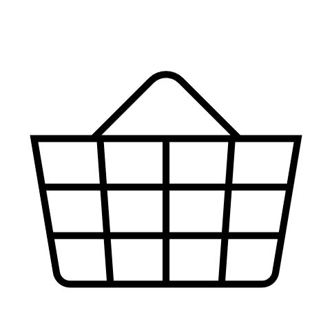

#   Resurs Bank e-Commerce Platform : The Resurs Bank E-Commerce Platform 

 

Search
### 
### [Resurs Checkout Web](Resurs-Checkout-Web_5014022.html)
Iframe based omni channel checkout for both retail stores and online

### **[Resurs Checkout POS](Resurs-Checkout-POS_24641672.html)**
Resurs Checkout POS is an iFrame browser-based payment gateway that can
be used in a Point of Sale-system (POS).
### 
### [Resurs Checkout PUSH](https://test.resurs.com/docs/display/ecom/Resurs+Checkout+PUSH)
Load card, Cancel card, Get balance, Annul balance
### 
### [Simplified Flow API](Simplified-Flow-API_1476359.html)
Integrate your checkout with our webservice API
### 
### [Plugins](Platform-Plugins_1476269.html)
Magento, WooCommerce, Prestashop and OpenCart plugins
### 
### [Payment administration GUI](Payment-administration-GUI_327748.html)
[After Shop Webservices](After-Shop-Service-API_327799.html)
### 
### [Gift Card Service](https://test.resurs.com/docs/display/ecom/Gift+Card+Service)
Load card, Cancel card, Get balance, Annul balance
 
  
  
