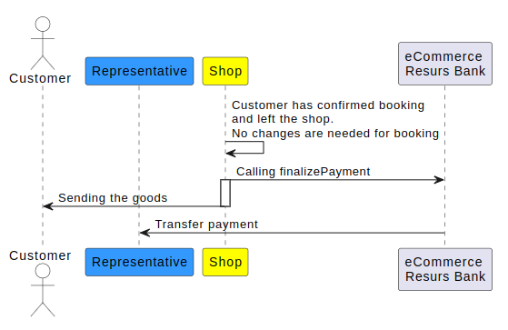

# Finalize Payment 

## finalizePayment
> Finalizes a payment. When a payment is finalized, the amount will be
> transferred from the customer's account to that of the representative.
> NB: For a payment to be finalized, it must be booked and it cannot be
> frozen.

**Input (Literal)**

| Name                    | Type                                                           | Occurs | Nillable? | Description                                                                                                                                                                                                                                                                                            |
|-------------------------|----------------------------------------------------------------|--------|-----------|--------------------------------------------------------------------------------------------------------------------------------------------------------------------------------------------------------------------------------------------------------------------------------------------------------|
| paymentId               |  [**id**](/development/api-types/simple-types/)                                     | 1..1   | No        | The identity of the payment.                                                                                                                                                                                                                                                                           |
| preferredTransactionId  | **id**                                                         | 0..1   | No        | Will be printed on the accounting summary. Can be used to track the transaction. If not set it will fallback on paymentId for this value. **NOT SUPPORTED** for external payment methods (VISA/Mastercard/SWISH/TRUSTLY etc)                                                                           |
| partPaymentSpec         |  [**paymentSpec**](/development/api-types/paymentspec/)                                | 1..1   | No        | If you are to finalize an invoice, you will need to supply the partPaymentSpec with \<specLines\>. Without the \<specLines\>, the customer won't see the orderrows that has been supplied in your bookPayment/POST.For any other payment method, using partPaymentSpec with \<specLines\> is optional. |
| createdBy               |  [**nonEmptyString**](/development/api-types/simple-types/)                         | 0..1   | No        | The username of the person performing the operation.                                                                                                                                                                                                                                                   |
| orderId                 | [**id**](/development/api-types/simple-types/)                                      | 0..1   | No        | The order number.                                                                                                                                                                                                                                                                                      |
| orderDate               | **date** | 0..1   | Yes       | The order date. For payment methods other than INVOICE, setting this will generate an error. Note: use the format "yyyy-MM-dd" for date.                                                                                                                                                               |
| invoiceId               | [**id**](/development/api-types/simple-types/)                                      | 0..1   | Yes       | The invoice number. This will be printed on the invoice. For payment methods other than INVOICE, setting this will generate an error. An alternative is to let Resurs Bank generate the invoice ID, in this case this field is omitted.                                                                |
| invoiceDate             | **date** | 0..1   | Yes       | The invoice date. This will be printed on the invoice. For payment methods other than INVOICE, setting this will generate an error.Note: use the format "yyyy-MM-dd" for date.                                                                                                                         |
| invoiceDeliveryType     | **[invoiceDeliveryType](/development/api-types/invoicedeliverytype/)**                 | 0..1   | Yes       | How the invoice should be delivered. **If used,** **put in: "EMAIL"**                                                                                                                                                                                                                                  |

> Find out if the payment method is an invoice by making a
> getPaymentMethods. If \<specificType\>INVOICE\</specificType\> in
> getPaymentMethodsResponse, payment methode is an invoice.

**Faults**

| Name                     | Content                                  | Description                                            |
|--------------------------|------------------------------------------|--------------------------------------------------------|
| ECommerceErrorException  | **[ECommerceError](/development/api-types/ecommerceerror/)**     | Failed to finalize the payment. See error for details. |

### Introduction
This method should be called just before the goods are delivered. When a
payment is finalized, the amount will be transferred from the customer's
account to the representative. For a payment to be finalized, it must be
booked and it cannot be frozen. You can see more about each parameter
above in the method box and what these parameters stands for.



### What if something need to change?
Does something on the order need to be changed due to the customer
contacting the web shop? This is achieved either via web services or the
**Merchant Portal.**
  
Does the whole order or only part of it need to be canceled? Or should
any more items be added? For more information and how this is done,
please see [**after shop
flow**](/after-shop-service-api/)
and / or **Merchant Portal**

### What is paymentSpec?

The payment details. In it's simplest form it's just sum, i.e.
totalAmount and totalVatAmount are set, but there are no specLines. If
nothing else is said you shall send specLines .  
Contains elements as defined in the following table.

| Component      | Type                                                                                     | Occurs | Nillable? | Description                                                                                                                                                                                                                  |
|----------------|------------------------------------------------------------------------------------------|--------|-----------|------------------------------------------------------------------------------------------------------------------------------------------------------------------------------------------------------------------------------|
| specLines      | **[specLine](/development/api-types/specline/)**                       | 0..\*  | No        | The list of payment lines. In the case you're sending a simple payment, without lines, this parameter should be left empty. Sending payment lines may, or may not, be mandatory, depending on the contract with Resurs Bank. |
| totalAmount    | **[positiveDecimal](/development/api-types/simple-types/)** | 1..1   | No        | The total payment amount. The sum of all line amounts (if there are lines supplied) including VAT. If this payment is without lines this is the only value to be set on the payment spec.                                    |
| totalVatAmount | decimal                                                                                  | 0..1   | Yes       | The total VAT amount of the payment when there are specification lines supplied. If there are no lines this fileld must be empty (null).                                                                                     |

### Paymentspec - speclines
> Observe that in order to have an invoice with specified order data,
> make sure to include the speclines in the web service call.

specLines are not mandatory for processing payments.

specLines can vary between start, finalize, credit and annul. It doesn't
matter. Only the sum matter.

specLines make better invoices and help the merchant

The code below shows an example of one paymentSpec row when calling
startPaymentSession method

**paymentSpec example in bookPayment**

### Paymentspec - rounding
[see Rounding](/development/rounding/)

### Finalize Payment for different payment methods
The finalize payment differs somewhat from payment methods, for example
if the payment method is an invoice, an invoice document will be created
in the finalization step. See the examples below to see the difference
between a card payment and an invoice.

### Finalize Payment - code example
Please be aware that the example below shows the simplest form of
finalization. It's also possible to finalize just a portion of the
payment, as would be required upon delivery of half of an order.

**finalizePayment**
```xml
<soapenv:Envelope xmlns:soapenv="http://schemas.xmlsoap.org/soap/envelope/" xmlns:aft="http://ecommerce.resurs.com/v4/msg/aftershopflow">
   <soapenv:Header/>
   <soapenv:Body>
      <aft:finalizePayment>
         <paymentId>Pay-1349186086946-3861</paymentId>
         <preferredTransactionId>TrD-12345</preferredTransactionId>
         <partPaymentSpec>
            <totalAmount>30.00</totalAmount>
         </partPaymentSpec>
         <createdBy>User</createdBy>
         <orderId>Ord-23456</orderId>
      </aft:finalizePayment>
   </soapenv:Body>
</soapenv:Envelope>
```
If you are finalizing an invoice you might want to specify the payment
more for a more detailed invoice. The example
below shows a more detailed form of finalization.

**Detailed finalizePayment invoice**
```xml
<soapenv:Envelope xmlns:soapenv="http://schemas.xmlsoap.org/soap/envelope/" xmlns:aft="http://ecommerce.resurs.com/v4/msg/aftershopflow">
   <soapenv:Header/>
   <soapenv:Body>
      <aft:finalizePayment>
         <paymentId>Pay-1349186086946-3861</paymentId>
         <preferredTransactionId>TrD-12345</preferredTransactionId>
         <partPaymentSpec>
          <specLines>
               <id>1</id>
               <artNo>NUT-001</artNo>
               <description>Nut (M8)</description>
               <quantity>21.00</quantity>
               <unitMeasure>st</unitMeasure>
               <unitAmountWithoutVat>0.80</unitAmountWithoutVat>
               <vatPct>25</vatPct>
               <totalVatAmount>4.2</totalVatAmount>
               <totalAmount>21.00</totalAmount>
           </specLines>
           <specLines>
               <id>2</id>
               <artNo>BOLT-002</artNo>
               <description>Bolt (M8x125mm)</description>
               <quantity>17.00</quantity>
               <unitMeasure>st</unitMeasure>
               <unitAmountWithoutVat>1.60</unitAmountWithoutVat>
               <vatPct>25</vatPct>
               <totalVatAmount>6.8</totalVatAmount>
               <totalAmount>34.00</totalAmount>
            </specLines>
            <totalAmount>55.00</totalAmount>
            <totalVatAmount>11.00</totalVatAmount>
        </partPaymentSpec>
        <orderId>Ord-23456</orderId>
        <orderDate>2012-10-02</orderDate>
        <invoiceId>DebInv-34567</invoiceId>
        <invoiceDate>2012-10-02</invoiceDate>
     </aft:finalizePayment>
  </soapenv:Body>
</soapenv:Envelope>
```
**Detailed finalizePayment invoice with discount**
```xml
<soapenv:Envelope xmlns:soapenv="http://schemas.xmlsoap.org/soap/envelope/" xmlns:aft="http://ecommerce.resurs.com/v4/msg/aftershopflow">
  <soapenv:Header/>
   <soapenv:Body>
    <aft:finalizePayment>
     <paymentId>finalizeexample1</paymentId>
     <partPaymentSpec>
      <specLines>
         <id>1</id>
         <artNo>1111</artNo>
         <description>Shoes</description>
         <quantity>1.00</quantity>
         <unitMeasure>st</unitMeasure>
         <unitAmountWithoutVat>800.00000</unitAmountWithoutVat>
         <vatPct>25</vatPct>
         <totalVatAmount>200.00</totalVatAmount>
         <totalAmount>1000.00</totalAmount>
      </specLines>
      <specLines>
          <id>2</id>
          <artNo>1112</artNo>
          <description>Socks</description>
          <quantity>1.00000</quantity>
          <unitMeasure>st</unitMeasure>
          <unitAmountWithoutVat>200.00000</unitAmountWithoutVat>
          <vatPct>25.00000</vatPct>
          <totalVatAmount>50.000000000000000</totalVatAmount>
          <totalAmount>250.0000000000</totalAmount>
      </specLines>
      <specLines>
          <id>3</id>
          <artNo>1113</artNo>
          <description>Rabatt</description>
          <quantity>1.00000</quantity>
          <unitMeasure>st</unitMeasure>
          <unitAmountWithoutVat>-120.00000</unitAmountWithoutVat>
          <vatPct>25.00000</vatPct>
          <totalVatAmount>-30.000000000000000</totalVatAmount>
          <totalAmount>-150.0000000000</totalAmount>
          </specLines>
          <totalAmount>1100</totalAmount>
          <totalVatAmount>220</totalVatAmount>
      </partPaymentSpec>
      </aft:finalizePayment>
    </soapenv:Body>
  </soapenv:Envelope>
</soapenv:Envelope>
```

> Note!When handling Visa/Mastercard-transcations, you must finalize
> 100% of the authorized amount

