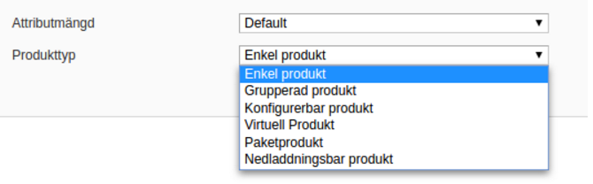

# General: Integration development 
Created by Thomas Tornevall, last modified on 2022-05-08
- [Shared plugins -
  Contribution](#general:integrationdevelopment-sharedplugins-contribution)
- [New shared plugin - step by step
  building](#general:integrationdevelopment-newsharedplugin-stepbystepbuilding)
- [What to keep in
  mind](#general:integrationdevelopment-whattokeepinmind)
- [Where to start](#general:integrationdevelopment-wheretostart)
  - [Configuration -
    Admin](#general:integrationdevelopment-configuration-admin)
    - [Sections to create in the admin control
      panel](#general:integrationdevelopment-sectionstocreateintheadmincontrolpanel)
      - [The payment methods
        section](#general:integrationdevelopment-thepaymentmethodssection)

  - [The checkout and forms that needs to be filled
    in](#general:integrationdevelopment-thecheckoutandformsthatneedstobefilledin)
  - [Callbacks](#general:integrationdevelopment-callbacks)

# Shared plugins - Contribution
The following text covers one way to create a shared plugin (meaning, a
plugin that everybody can use), from scratch. It may also change over
time as we find new ways to optimize our plugin-making. Our own goal
with making new e-commerce-plugins is to make them streamlined. This
means, we are trying to make all plugins act as much in the same way, in
all platforms, as possible.

If you want to contribute, you may want to take a look at
[Development](development) - this page summarizes our plugins and where
they are located.

# New shared plugin - step by step building
For example, when generating form fields for a checkout, we are always
trying to utilize the e-commerce platform's own form fields as much as
we can, so when a customer fills in address data, the parts of the
payment booking which is sent to Resurs e-commerce are inherited from
the primary store. This means that most of our form fields, except for
government ID and a few more fields can be kept hidden. The lesser
information customers has to fill in, the better.

> Testing in production?Never test anything in production mode unless
> you are really sure what you are doing. We do not offer any test data
> for our production environment, due to legal regulations.

# What to keep in mind
- If you're building your own checkout from scratch, where all payments
  are controlled by your checkout, make sure you'll handle both
  shipping, fees, discounts and article types that the shop provides.  
   

# Where to start
## Configuration - Admin
If you are already familiar with the platform where you are going to
create your plugin, our suggestion is to first prepare the
administration interface to handle, for example, the payment methods
that should be available for your customers. Our payment methods are
dynamic, which sometimes may differ how other platforms actually are
designed. In our "from scratch"-example, we start with no payment
methods at all, and aiming at responsive configuration at this point,
where we start with a very simple interface which initially always
points at our test environment. In the screen dump you see the initial
configuration from Prestashop.


As soon as the credentials are filled in, the example plugin are
starting to look for the current payment methods set up and the goal
with the plugin is to make it as optionless as possible.

### Sections to create in the admin control panel
> Generic plugins and country settingsAs our merchant credentials only
> supports one country per credential account, you need to set up
> configurations for the country the purchasing should be allowed in.
> This is especially important for merchants that allow shopping from
> multiple countries, where you have to define for which country our
> payment methods are allowed. Currently, our API's do not have any
> interface that tells which country the credentials belong to, so the
> country control must be done from the plugin. For example, a Norwegian
> customer can not show our payment methods in a Danish store.
> Therefore, this limitation must be set.

- URLs for where production and test environment are pointing  
  See below, for URLs to the shop flow
- Configurable URL, to a local place, for where callbacks are handled
  (Resurs Bank can send events to your shop, when payments are changed
  and this is where they are going to be handled)
- A toggler which by default always points at the test environment
  (Recommended)
- Login credentials for web services
- Section for payment methods
- Eventually a section for where each order status is set, depending on
  the webshop (An advice in this case is to have a status called
  "payment signing". At least in Magento this status is used to detect
  if a signing has been canceled by the customer or not)  
  **Example**:  
  *When using a payment from Resurs Bank, an order should initially be
  set to "Holded", since we are waiting for the fraud control to be
  done. When the fraud control is done, Resurs Bank is sending a
  callback signal to the store to accept the payment as accepted, which
  will set the order to "Processing". If the store supports this way to
  handle orders, you should let the store's own API's do the job for you
  as much as possible (like in the screenshot attached, from the Magento
  control panel).  
  ** *

Web services are based on SOAP. It's recommended from this point to
never add wsdl-parameters or URLs directly to each service provided by
Resurs Bank. Since there are different kind of services
(SimplifiedShopFlowService, AfterShopFlowService, etc), your plugin
should instead generate the rest of the URLs by itself so everything can
be called dynamically. In our PHP-based gateway each service are
pre-loaded like below, so each of them can be called if they exists.  
\$this-\>environment contains the above URL, depending on which is
chosen in the admin panel. By doing this, all calls to webservices will
be much easier to handle.

**Services loader class (Example)** Expand source
```xml
         if (class_exists('Resurs_SimplifiedShopFlowService')) {$this->simplifiedShopFlowService = new Resurs_SimplifiedShopFlowService($this->soapOptions, $this->environment . "SimplifiedShopFlowService?wsdl");}
         if (class_exists('Resurs_ConfigurationService')) {$this->configurationService = new Resurs_ConfigurationService($this->soapOptions, $this->environment . "ConfigurationService?wsdl");}
         if (class_exists('Resurs_AfterShopFlowService')) {$this->afterShopFlowService = new Resurs_AfterShopFlowService($this->soapOptions, $this->environment . "AfterShopFlowService?wsdl");}
         if (class_exists('Resurs_ShopFlowService')) {$this->shopFlowService = new Resurs_ShopFlowService($this->soapOptions, $this->environment . "ShopFlowService?wsdl");}
```
#### The payment methods section
Payment methods are dynamically transferred from Resurs Bank e-commerce,
so you need a small form where each payment method can be configured.
Later on, this information will be used to display the correct methods
in the checkout. This may differ from the "normal" behaviour in an
e-commerce platform where payment service providers normally offers one
(or a few) static payment methods and therefore only generates a simple
form with configuration settings for the methods. The image below shows
you the settings from Magento, and that's the primary configuration you
probably need, building your settings base a plugin - and the best
practice here is, as shown, to store data about them locally (cached),
so no queries has to be made to e-commerce for each checkout-request.

> Important notice about payment methodsYou should also be aware that
> payment methods can disappear, depending on how they are used. For
> example, there are a minimum and a maximum payment amount bound to a
> method, so when a customer exceeds those amounts, they should normally
> not be shown in a checkout. If a method exceeds the amount, or
> expires/gets disabled (i.e. a method may be set up for a limited usage
> time, etc), and they are still shown by mistake in a checkout, this
> generates an error from Resurs.


## The checkout and forms that needs to be filled in
> Important noticesWhen payment methods are shown to customers in a
> webshob, it is important that the "SEKKI" (Standardiserad Europeisk
> Konsumentkreditinformation) always is shown (the only exception is for
> an existing card, i.e. not a new one, where the customer most likely
> already has accepted an agreement).You should also consider making a
> "landing page" for your payment methods, when they require signing by
> the customer, where failed and successful signings should be
> handled.When creating payment forms, used for booking payments at
> e-commerce, make sure that you are also adding content validation to
> the fields (see here).

When configuration has been prepared in the administration panel, it's
time to create a checkout interface for customers. Resurs Bank is
building all plugins streamlined so they look and work, compared to each
other, as similar as possible (the same rules are applied to the
administration interface). Form fields that are offered by the webshop
should inherit to the plugin's form fields as much as possible. Normally
the fields we're thinking of are e-mail and phone numbers, but also (as
feature) contact person when the payment method type is bound to a
company. Payment methods should be shown or hidden depending on their
min and max payment amounts (if a payment method is shown when it should
not be, an error will occur).

Different payment methods require different kind of form form field
elements. They are listed below. Application full name is only used in
the really old flow and can be removed.

**Please take note on the optional phone number fields below. It is
strongly recommended to always force a phone number at some point when
calling the shopflow-API's even though they are not entirely required.
IF the numbers are left out of the payload, Resurs will redirect
customers to another page to fill in data that the customer has
forgotten to fill in. As Resurs in the end needs the phone number it is
better that you handle this in your codebase.**

| Payment Method SpecificType     | Applicant Government ID |   Applicant Telephone Number    |     Applicant Mobile Number     | Applicant Email Address | Contact Government ID | Card number | Applicant Full Name |
|---------------------------------|:-----------------------:|:-------------------------------:|:-------------------------------:|:-----------------------:|:---------------------:|:-----------:|:-------------------:|
| **INVOICE***Natural*** **       |        REQUIRED         | OPTIONAL**(Read the red note)** | OPTIONAL**(Read the red note)** |        REQUIRED         |                       |             |      OBSOLETE       |
| **INVOICE***Legal*** **         |        REQUIRED         | OPTIONAL**(Read the red note)** | OPTIONAL**(Read the red note)** |        REQUIRED         |       REQUIRED        |             |  REQUIRED/OBSOLETE  |
| **CARD***Existing card *        |        REQUIRED         |                                 |                                 |                         |                       |  REQUIRED   |      OBSOLETE       |
| **REVOLVING_CREDIT***New card*  |        REQUIRED         |                                 |            REQUIRED             |        REQUIRED         |                       |             |      OBSOLETE       |
| **PART_PAYMENT***Part payment*  |        REQUIRED         |            REQUIRED             |            REQUIRED             |        REQUIRED         |                       |             |      OBSOLETE       |

*When creating forms for payment, make sure that you are also adding
content validation (regex) to the fields ([see
here](customer-data---regular-expressions))*.

Address completion for filling in address data on an order page is
available through [Get
address](https://test.resurs.com/docs/pages/viewpage.action?pageId=5013938).
Currently, the service is only available for Sweden. Code examples for
PHP (Magento) can be found at the [OldFlow Plugin - Coding examples for
getAddress](oldflow-plugin---coding-examples-for-getaddress)-section.

## Callbacks
> Callback noticesCallbacks must be reachable externally. If you are
> testing your web store in a protected environment (which normally is
> something else than production) and you want to test callback
> functionality, you have to make sure that Resurs can reach the
> callback URLs.

An important thing, when building a plugin for Resurs Bank, is to make
sure you are creating support for callbacks, so that Resurs' e-commerce
services will be able to process the order after for example fraud
controls on Resurs' side, when orders normally should get thawed. 

