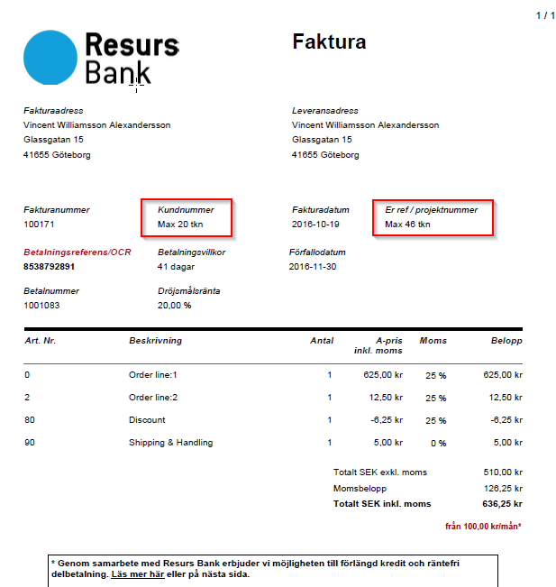

# Recognized metadata 
### What is metadata?
In short, it is key/value data piggybacked on the payment.

### Recognized keys and meaning
Generally we don't look at the metadata. Listed below are the exceptions
to that rule.

| Key name      | Expected format   | Description                                                                                                                                                                                                    |
|---------------|-------------------|----------------------------------------------------------------------------------------------------------------------------------------------------------------------------------------------------------------|
| invoiceExtRef | String. 46 chars. | In the case that the payment generates invoices and credit notes this value will be printed as 'Your reference', for example the sales person responsible. Mostly for company invoices. |
| CustomerId    | String. 20 chars. | In the case that the payment generates invoices and credit notes this value will be printed as 'Customer Id'                                                                            |

