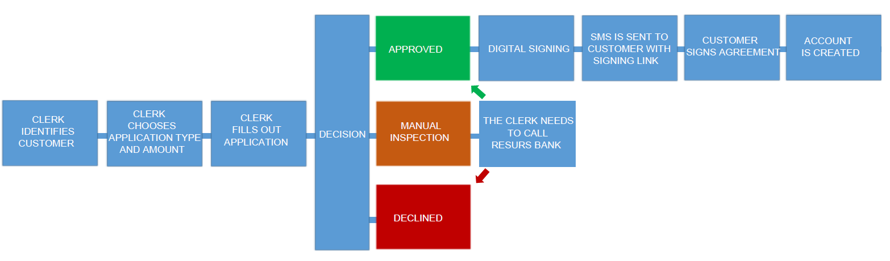

# Credit Application 
Created by Sara Wintherfrid Josefsson, last modified on 2022-08-18
The credit application flow is used when a customer wants to apply for
an account without making a purchase at the same time as the application
is made. 

## **Typical flow **
### **Authentication**
Every request requires an authorization header with a Bearer-token. A
token lasts for 3600 seconds (1 hour). To get a token you may use your
test-credentials received from Resurs Bank: 
client_id  
client_secret  
scope= mock-merchant-api
**Curl to get token**
``` syntaxhighlighter-pre
curl --location --request POST 'https://apigw.integration.resurs.com/api/oauth2/token' 
--header 'accept: application/json' \
--header 'Content-Type: application/x-www-form-urlencoded' \
--data-urlencode 'client_id= \
--data-urlencode 'client_secret= \
--data-urlencode 'scope=mock-merchant-api' \
--data-urlencode 'grant_type=client_credentials'
```
### Step-by-step for creating an account after authentication
**1.Get available stores  
**A client may have access to multiple stores, therefore we need to know
which store to make the application or payment for. This can be done by
getting the available stores. Each store has a store-id. This id will be
used in the next step to specify for which store we would like to get
the payment methods.
**Curl to get available stores**
``` syntaxhighlighter-pre
curl --location --request GET 'https://apigw.integration.resurs.com/api/mock_merchant_api_service/stores'
--header 'Authorization: Bearer <TOKEN>'
```
  
**2. Get available payment methods  
**A store may have multiple payment methods available. The list of
available payment methods will show what payment methods there are to
apply from at the chosen store. Each payment method has a paymentmethod
id, wich will be used in the next step, when the application is
created. 
**Curl to get available payment methods**
``` syntaxhighlighter-pre
curl --location --request POST 'https://apigw.integration.resurs.com/api/mock_merchant_api_service/stores/{store_id}/payment_methods'
--header 'Content-Type: application/json' \
--header 'Authorization: Bearer <TOKEN>' \
--data-raw '{
"countryCode": "SE, FI, NO, DK",
"customerType": "NATURAL"
}
```
  
**3. Create an application  
**ExternalId is will work as a searchable reference.
**Curl to create an application**
``` syntaxhighlighter-pre
curl --location --request POST 'https://apigw.integration.resurs.com/api/mock_merchant_credit_application_service/applications'
 --header 'Content-Type: application/json' \
--header 'Authorization: Bearer <TOKEN>' \
--data-raw '{
"applicationData": {},
"applicationType": "NEW_ACCOUNT",
"customer": {
"countryCode": "SE, FI, NO, DK",
"customerType": "NATURAL",
"governmentId": "",
"email": "test@test.com",
"mobile": "012345678",
"phone": "012345678"
},
"paymentMethodId": "",
"requestedAmount": "1200",
"storeId": "",
"externalId": "MyApplication_1"
}
```
  
**4. Complete application  
**In this step we are ready to complete the application. Creator is for
example the clerk filling out the application for the customer. It is
important to note the status after this completion;  
  
*APPROVED = the application was successful and are done*  
*REJECTED = the application could not be approved, the application is
unusable*  
*INSPECTION = the customer must contact Resurs Bank for a manual
inspection of the application*  
*SIGNING_REQUIRED = the customer needs to approve the application by a
digital signature*
**Curl to complete application**
``` syntaxhighlighter-pre
curl --location --request POST 'https://apigw.integration.resurs.com/api/mock_merchant_api
--header 'Content-Type: application/json' \
--header 'Authorization: Bearer <TOKEN>' \
--data-raw '{
"countryCode": "SE, FI, NO, DK",
"customerType": "NATURAL"
}
```
  
**5. Redirect to signature  
**The success- and fail-URLs will be called when the customer is done
and the application is approved or rejected. 
**Curl to redirect to signature**
``` syntaxhighlighter-pre
curl --location --request POST 'https://apigw.integration.resurs.com/api/mock_merchant_cre
--header 'Content-Type: application/json' \
--header 'Authorization: Bearer <TOKEN>' \
--data-raw '{
"failUrl": "https://google.com/search?q=fail",
"successUrl": "https://google.com/search?q=success"
}
```
**  
**
