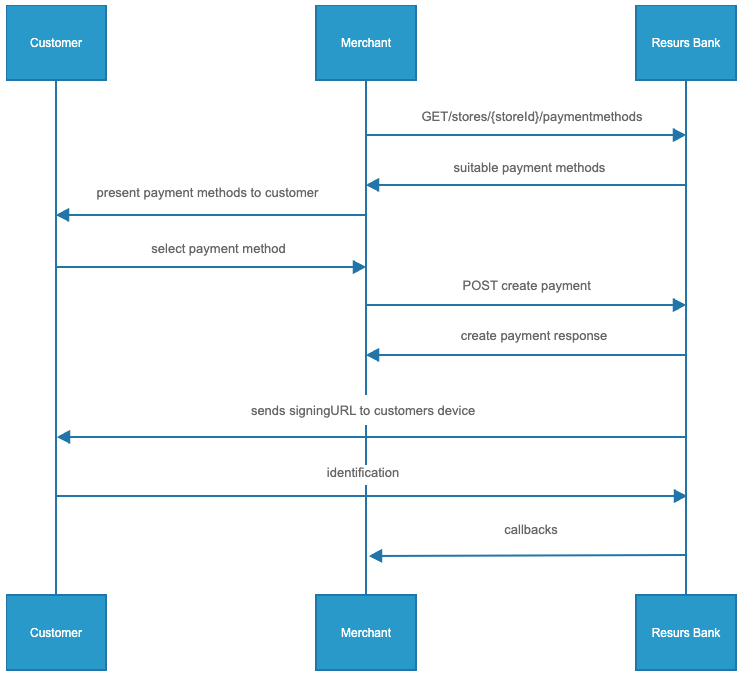

# Merchant API E-Commerce 


> Generic, explanational documentationPlease note that the flow and its
> requests below is an example and other flows or variations may exist.
> Please advice with onboarding@resurs.se regarding specific actions
> prior to mapping up any logic or beginning any coding.

**What can I find here?**
- [Basic API flow](#basic-api-flow)
  - [Authentication](#authentication)
  - [Get Store ID](#get-store-id)
  - [Get available payment
    methods](#get-available-payment-methods)

- [Create Payment](#create-payment)
  - [Create payment](#create-payment)
    - [Create payment-responses and what to do
      next](#create-payment-responses-and-what-to-do-next)

- [Postman-collection of the requests
  above](#postman-collection-of-the-requests-above)



## Basic API flow
### Authentication
Every request requires an authorization header with a Bearer-token. A
token lasts for 3599 seconds. To get a token you may use your
test-credentials received from Resurs Bank.

URL to get token:
[https://merchant-api.integration.resurs.com/oauth2/token](https://merchant-api.integration.resurs.com/oauth2/token)

- Client ID
- Client Secret
- Scope= merchant-api

Link to the call in swagger documentation: **[Get
Token](https://merchant-api.integration.resurs.com/docs/oauth2#/Oauth2%20token%20resource/authorizeObject_1_1)**

**Curl to get token**

> curl --location --request POST
> 'https://merchant-api.integration.resurs.com/oauth2/token'--header
> 'accept: application/json' \\-header 'Content-Type:
> application/x-www-form-urlencoded' \\-data-urlencode 'client_id=fill
> out client_id' \\-data-urlencode 'client_secret=fill out
> client_secret' \\-data-urlencode 'scope=merchant-api'
> \\-data-urlencode 'grant_type=client_credentials'

### Get Store ID
Get available stores

A client may have access to multiple stores, therefore we need to know
which store to make the application or payment for.  
This can be done by getting the available stores. Each store has a
store-id. This id will be used in the next step to specify for which
store we would like to get the payment methods.

URL to get available stores:
[https://merchant-api.integration.resurs.com/v2/stores](https://merchant-api.integration.resurs.com/v2/stores?sort=popularName,asc&sort=nationalStoreId,desc&size=2000)

Link to the call in swagger documentation: **[Get
Stores](https://merchant-api.integration.resurs.com/docs/v2/merchant_stores_v2#/Store%20information/getStores)**

**Curl to get available stores**

> curl --location --request GET
> 'https://merchant-api.integration.resurs.com/v2/stores'--header
> 'Authorization: Bearer \<TOKEN\>'

### Get available payment methods
A store may have multiple payment methods available. The list of
available payment methods will show what payment methods there are to
use from at the chosen store. Do not forget to sort out the payment
methods which min-/max purchase limit are outside the cart value. If you
input an amont in the request, the API will automatically not show the
unavailable payment methods for you - you do not need to sort out
payment methods yourselves.  
Each payment method has a paymentmethod id, which will be used in the
next step, when the payment is created.  
When presenting the payment methods to the customer, please note that by
law you are required to display our terms/link to our terms regarding
the credit payment methods. The link is found in this same request with
"*type: PRICE_INFO*"

URL to get available payment methods:
[https://merchant-api.integration.resurs.com/v2/stores/{store_id}/payment_methods](https://merchant-api.integration.resurs.com/v2/stores/%7Bstore_id%7D/payment_methods)

Link to the call in swagger documentation**: [Get Payment
Methods](https://merchant-api.integration.resurs.com/docs/v2/merchant_stores_v2#/Payment%20methods%20information/getPaymentMethodsByStore)**

**Curl to get available payment methods**

> curl --location --request POST
> 'https://merchant-api.integration.resurs.com/v2/stores/{store_id}/payment_methods'--header
> 'Content-Type: application/json' \\-header 'Authorization: Bearer
> \<TOKEN\>'

## Create Payment
### Create payment
The call below is used to create a new payment and authorize the
payment.

- orderReference = your internal order reference, if it's not provided
  by you it will be set by Resurs Bank. Will be provided in accounting
  file if not another value is provided in capture-request later on.

- initiatedOnCustomersDevice = true becuase the payment in the webshop's
  checkout is initiated on the customers device
- handleFrozenPayments = payments may be frozen for a short time due to
  fraud controls. When a payment is frozen the customer is informed that
  the purchase is ready, but the goods shall not be shipped until the
  payment is captured

For further information regarding initiatedOnCustomersDevice and
handleFrozenPayments, please go to "Schema" → "CreatePaymentRequest" →
"Options" ; [Create Payment
Options](https://merchant-api.resurs.com/docs/v2/merchant_payments_v2#/Payment+authorization/createPayment)

URL to create payment:
[https://merchant-api.integration.resurs.com/v2/payments](https://merchant-api.integration.resurs.com/v2/payments)

Link to the call in swagger documentation: **[Create
Payment](https://merchant-api.integration.resurs.com/docs/v2/merchant_payments_v2#/Payment%20authorization/createPayment)**

**Curl to create payment**

> curl --location --request POST
> 'https://merchant-api.integration.resurs.com/v2/payments' \\-header
> 'Authorization: Bearer \<TOKEN\>' \\-header 'Content-Type:
> application/json' \\-data-raw { "storeId": "{{store_id}}",
> "paymentMethodId": "{{payment_method_id}}", "order": { "orderLines":
> \[ { "description": "Book", "quantity": 1, "quantityUnit": "pcs",
> "vatRate": 25, "totalAmountIncludingVat": 500.0 } \],
> "orderReference": "orderref-12345" }, "customer": { "customerType":
> "NATURAL", "governmentId": "xxxxx", "email": "xxx@yyy.com",
> "mobilePhone": "xxxxx"   }, "options": { "initiatedOnCustomersDevice":
> true, "handleFrozenPayments": true, "callbacks": { "authorization": {
> "url": "{{callback_url_authorization}}" }, "management": { "url":
> "{{callback_url_management}}" } }, "redirectionUrls": { "customer": {
> "failUrl": "{{fail_url_customer}}", "successUrl":
> "{{success_url_customer}}" }, "timeToLiveInMinutes": 120 } }

### Create payment responses and what to do next
status:
TASK_REDIRECTION_REQUIRED → redirect customer to "customerUrl" and await callback. 
Callbacks with callback-status AUTHORIZED, REJECTED, FROZEN or CAPTURED can be received before or after redirection is performed. 

### Postman collection of the requests above
```json
{
	"info": {
		"_postman_id": "10fc11e6-0311-4312-8c77-d942622280d6",
		"name": "Merchant API 2 - Ecommerce",
		"schema": "https://schema.getpostman.com/json/collection/v2.1.0/collection.json"
	},
	"item": [
		{
			"name": "Get token",
			"event": [
				{
					"listen": "test",
					"script": {
						"exec": [
							"const response = pm.response.json();",
							"pm.globals.set(\"myTokenPaymentV2\", response.access_token);",
							"pm.test(\"Status code is 200\", function () {",
							"    pm.response.to.have.status(200);",
							"});"
						],
						"type": "text/javascript"
					}
				},
				{
					"listen": "prerequest",
					"script": {
						"exec": [
							"console.log('Create Token');",
							"",
							"        ",
							"        ",
							"        "
						],
						"type": "text/javascript"
					}
				}
			],
			"request": {
				"method": "POST",
				"header": [],
				"body": {
					"mode": "raw",
					"raw": "{\n    \"client_id\": \"see testaccount\",\n    \"client_secret\": \"see test account\",\n    \"scope\": \"merchant-api\",\n    \"grant_type\": \"client_credentials\"\n}\n",
					"options": {
						"raw": {
							"language": "json"
						}
					}
				},
				"url": {
					"raw": "https://merchant-api.integration.resurs.com/oauth2/token",
					"protocol": "https",
					"host": [
						"merchant-api",
						"integration",
						"resurs",
						"com"
					],
					"path": [
						"oauth2",
						"token"
					]
				}
			},
			"response": []
		},
		{
			"name": "Get available stores",
			"event": [
				{
					"listen": "test",
					"script": {
						"exec": [
							""
						],
						"type": "text/javascript"
					}
				},
				{
					"listen": "prerequest",
					"script": {
						"exec": [
							"console.log('Hämta StoreId');",
							"pm.globals.unset(\"myaddressRow2PaymentV2\");",
							"pm.globals.unset(\"mycountryCodePaymentV2\");",
							"pm.globals.unset(\"myfirstNamePaymentV2\");",
							"pm.globals.unset(\"mylastNamePaymentV2\");",
							"pm.globals.unset(\"mycustomerTypePayment2\");",
							"pm.globals.unset(\"mypostalCodePaymentV2\");",
							"pm.globals.unset(\"mygovernmentIdPayment2\");",
							"pm.globals.unset(\"myfindPaymentIdPaymentV2\");",
							"pm.globals.unset(\"myPaymentMethodPaymentV2\");",
							"pm.globals.unset(\"myOrderReferencePayment2\");",
							"pm.globals.unset(\"myPaymentIdPaymentV2\");",
							"pm.globals.unset(\"mysearchPaymentIdPaymentV2\");",
							"",
							""
						],
						"type": "text/javascript"
					}
				}
			],
			"request": {
				"auth": {
					"type": "bearer",
					"bearer": [
						{
							"key": "token",
							"value": "",
							"type": "string"
						}
					]
				},
				"method": "GET",
				"header": [],
				"url": {
					"raw": "https://merchant-api.integration.resurs.com/v2/stores?sort=popularName,asc&sort=nationalStoreId,desc&size=2000",
					"protocol": "https",
					"host": [
						"merchant-api",
						"integration",
						"resurs",
						"com"
					],
					"path": [
						"v2",
						"stores"
					],
					"query": [
						{
							"key": "sort",
							"value": "popularName,asc",
							"description": "Sorting criteria in the format: property(,asc|desc). Default sort order is ascending. Multiple sort criteria are supported."
						},
						{
							"key": "sort",
							"value": "nationalStoreId,desc",
							"description": "Sorting criteria in the format: property(,asc|desc). Default sort order is ascending. Multiple sort criteria are supported."
						},
						{
							"key": "page",
							"value": "0",
							"description": "Zero-based page index (0..N)",
							"disabled": true
						},
						{
							"key": "size",
							"value": "2000"
						}
					]
				}
			},
			"response": []
		},
		{
			"name": "Get available payment methods by store and purchase amount",
			"event": [
				{
					"listen": "test",
					"script": {
						"exec": [
							""
						],
						"type": "text/javascript"
					}
				},
				{
					"listen": "prerequest",
					"script": {
						"exec": [
							"console.log('Get PaymentMethodId');"
						],
						"type": "text/javascript"
					}
				}
			],
			"request": {
				"auth": {
					"type": "bearer",
					"bearer": [
						{
							"key": "token",
							"value": "{{myTokenPaymentV2}}",
							"type": "string"
						}
					]
				},
				"method": "GET",
				"header": [],
				"url": {
					"raw": "https://merchant-api.integration.resurs.com/v2/stores/{{store_id}}/payment_methods",
					"protocol": "https",
					"host": [
						"merchant-api",
						"integration",
						"resurs",
						"com"
					],
					"path": [
						"v2",
						"stores",
						"{{store_id}}",
						"payment_methods"
					]
				}
			},
			"response": []
		},
		{
			"name": "Data for \"pay from\"-module",
			"event": [
				{
					"listen": "test",
					"script": {
						"exec": [
							""
						],
						"type": "text/javascript"
					}
				},
				{
					"listen": "prerequest",
					"script": {
						"exec": [
							"console.log('Get Monthly Cost');"
						],
						"type": "text/javascript"
					}
				}
			],
			"request": {
				"auth": {
					"type": "bearer",
					"bearer": [
						{
							"key": "token",
							"value": "{{myTokenPaymentV2}}",
							"type": "string"
						}
					]
				},
				"method": "GET",
				"header": [],
				"url": {
					"raw": "https://merchant-api.integration.resurs.com/v2/stores/{{store_id}}/payment_methods/{{paymentMethodId}}/price_signage?amount=9999",
					"protocol": "https",
					"host": [
						"merchant-api",
						"integration",
						"resurs",
						"com"
					],
					"path": [
						"v2",
						"stores",
						"{{store_id}}",
						"payment_methods",
						"{{paymentMethodId}}",
						"price_signage"
					],
					"query": [
						{
							"key": "amount",
							"value": "9999"
						}
					]
				}
			},
			"response": []
		},
		{
			"name": "Create payment",
			"event": [
				{
					"listen": "test",
					"script": {
						"exec": [
							"const response = pm.response.json();",
							"pm.globals.set(\"myPaymentIdPaymentV2\", response.id);",
							""
						],
						"type": "text/javascript"
					}
				},
				{
					"listen": "prerequest",
					"script": {
						"exec": [
							"console.log('Create payment v2');",
							"",
							"pm.globals.set(\"myOrderReferencePayment2\", _.random(000001, 999999));"
						],
						"type": "text/javascript"
					}
				}
			],
			"request": {
				"auth": {
					"type": "bearer",
					"bearer": [
						{
							"key": "token",
							"value": "{{myTokenPaymentV2}}",
							"type": "string"
						}
					]
				},
				"method": "POST",
				"header": [],
				"body": {
					"mode": "raw",
					"raw": "{\n  \"storeId\": \"{{store_id}}\",\n  \"paymentMethodId\": \"{{payment_method_id}}\",\n  \"order\": {\n    \"orderLines\": [\n      {\n        \"description\": \"Test product\",\n        \"quantity\": 1,\n        \"quantityUnit\": \"pcs\",\n        \"vatRate\": 25,\n        \"totalAmountIncludingVat\": 5000.0\n      }\n    ],\n    \"orderReference\": \"orderref-12345\"\n  },\n  \"customer\": {\n    \"customerType\": \"NATURAL\",\n    \"governmentId\": \"8305147715\",\n    \"email\": \"testing@domain.com\",\n    \"mobilePhone\": \"0707123456\"   \n    },    \n  \"options\": {\n    \"initiatedOnCustomersDevice\": true,\n    \"handleFrozenPayments\": true,\n    \"callbacks\": {\n      \"authorization\": {\n        \"url\": \"https://webhook.site/orderref-12345\"\n      },\n      \"management\": {\n        \"url\": \"https://webhook.site/orderref-12345\"\n      }\n    },\n    \"redirectionUrls\": {\n      \"customer\": {\n        \"failUrl\": \"https://merchant-api.integration.resurs.com/\",\n        \"successUrl\": \"https://www.resursbank.se/\"\n    },\n    \"timeToLiveInMinutes\": 120\n  }\n}\n}",
					"options": {
						"raw": {
							"language": "json"
						}
					}
				},
				"url": {
					"raw": "https://merchant-api.integration.resurs.com/v2/payments",
					"protocol": "https",
					"host": [
						"merchant-api",
						"integration",
						"resurs",
						"com"
					],
					"path": [
						"v2",
						"payments"
					]
				}
			},
			"response": []
		},
		{
			"name": "Get Payment",
			"event": [
				{
					"listen": "test",
					"script": {
						"exec": [
							""
						],
						"type": "text/javascript"
					}
				},
				{
					"listen": "prerequest",
					"script": {
						"exec": [
							"console.log('Get PaymentMethodId');"
						],
						"type": "text/javascript"
					}
				}
			],
			"request": {
				"auth": {
					"type": "bearer",
					"bearer": [
						{
							"key": "token",
							"value": "{{myTokenPaymentV2}}",
							"type": "string"
						}
					]
				},
				"method": "GET",
				"header": [],
				"url": {
					"raw": "https://merchant-api.integration.resurs.com/v2/payments/{{payment_Id}}",
					"protocol": "https",
					"host": [
						"merchant-api",
						"integration",
						"resurs",
						"com"
					],
					"path": [
						"v2",
						"payments",
						"{{payment_Id}}"
					]
				}
			},
			"response": []
		}
	]
}
```
