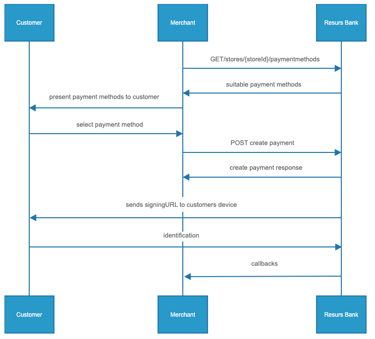

# Merchant API POS 

> Generic, explanational documentationPlease note that the flow and its
> requests below is an example and other flows or variations may exist.
> Please advice with onboarding@resurs.se regarding specific actions
> prior to mapping up any logic or beginning any coding.

**What can I find here?**
- [Basic API flow](#basic-api-flow)
  - [Authentication](#authentication)
  - [Get Store ID](#get-store-id)
  - [Get available payment
    methods](#get-available-payment-methods)

- [Create Payment](#create-payment)
  - [Create payment](#create-payment)
    - [Create payment-responses and what to do
      next](#create-payment-responses-and-what-to-do-next)

- [Postman-collection of the requests
  above](#postman-collection-of-the-requests-above)



## Basic API flow
### Authentication
Every request requires an authorization header with a Bearer-token. A
token lasts for 3599 seconds. To get a token you may use your
test-credentials received from Resurs Bank.

URL to get token:
[https://merchant-api.integration.resurs.com/oauth2/token](https://merchant-api.integration.resurs.com/oauth2/token)

- Client ID
- Client Secret
- Scope= mock-merchant-api

Link to the call in swagger documentation: **[Get
Token](https://merchant-api.integration.resurs.com/docs/oauth2#/Oauth2%20token%20resource/authorizeObject_1_1)**

**Curl to get token**

> curl --location --request POST
> 'https://merchant-api.integration.resurs.com/oauth2/token'--header
> 'accept: application/json' \\-header 'Content-Type:
> application/x-www-form-urlencoded' \\-data-urlencode 'client_id=fill
> out client_id' \\-data-urlencode 'client_secret=fill out
> client_secret' \\-data-urlencode 'scope=mock-merchant-api'
> \\-data-urlencode 'grant_type=client_credentials'

### Get Store ID
**Get available stores**

A client may have access to multiple stores, therefore we need to know
which store to make the application or payment for.  
This can be done by getting the available stores. Each store has a
store-id. This id will be used in the next step to specify for which
store we would like to get the payment methods.

URL to get available stores:
[https://merchant-api.integration.resurs.com/v2/stores](https://merchant-api.integration.resurs.com/v2/stores?sort=popularName,asc&sort=nationalStoreId,desc&size=2000)

Link to the call in swagger documentation: **[Get
Stores](https://merchant-api.integration.resurs.com/docs/v2/merchant_stores_v2#/Store%20information/getStores)**

**Curl to get available stores**

> curl --location --request GET
> 'https://merchant-api.integration.resurs.com/v2/stores'--header
> 'Authorization: Bearer \<TOKEN\>'

### Get available payment methods
A store may have multiple payment methods available. The list of
available payment methods will show what payment methods there are to
apply from at the chosen store.  
Each payment method has a paymentmethod id, wich will be used in the
next step, when the application is created. 

URL to get available payment methods:
[https://merchant-api.integration.resurs.com/v2/stores/{store_id}/payment_methods](https://merchant-api.integration.resurs.com/v2/stores/%7Bstore_id%7D/payment_methods)

Link to the call in swagger documentation: **[Get Payment
Methods](https://merchant-api.integration.resurs.com/docs/v2/merchant_stores_v2#/Payment%20methods%20information/getPaymentMethodsByStore)**

**Curl to get available payment methods**

> curl --location --request POST
> 'https://merchant-api.integration.resurs.com/v2/stores/{store_id}/payment_methods'--header
> 'Content-Type: application/json' \\-header 'Authorization: Bearer
> \<TOKEN\>'

## Create Payment
### Create payment
The body below is an example used to create a new payment and authorize
the payment. Note that more fields exist and options can vary depending
on user-case. See the Swagger-documentation linked below for more
information.

- orderReference = your internal order reference, if it's not provided
  by you it will be set by Resurs Bank

- initiatedOnCustomersDevice = if clerk has asked for, investigated and
  confirmed that customer ID is OK, this setting can be set as *false*.
  If not, or you want Resurs to be responsible for ID'ing the customer,
  set this option as *true*.
- deliverLinks = instructs whether or not to deliver links to the
  customer in case customer interaction like consents or contract
  signing is required
- handleFrozenPayments = payments may be frozen for a short time due to
  fraud controls. When a payment is frozen  the goods shall not be
  delivered to the customer until the payment is captured
- handlemanualinspection = if handling manual inspection, the flow may
  be stopped and the customer must talk to Resurs Bank personnel before
  the credit can be approved

For further information about orderReference, InitiatedOnCustomersDevice
and handleFrozenPayments, please go to "Schema" → "CreatePaymentRequest"
→ "Options" [Create Payment
Options](https://merchant-api.resurs.com/docs/v2/merchant_payments_v2#/Payment%20authorization/createPayment)

URL to create payment:
[https://merchant-api.integration.resurs.com/v2/payments](https://merchant-api.integration.resurs.com/v2/payments)

Link to the call in swagger documentation: **[Create
Payments](https://merchant-api.integration.resurs.com/docs/v2/merchant_payments_v2#/Payment%20authorization/createPayment)**

**Curl to create payment**

> curl --location --request POST
> 'https://merchant-api.integration.resurs.com/v2/payments' \\-header
> 'Authorization: Bearer \<TOKEN\>' \\-header 'Content-Type:
> application/json' \\-data-raw { "storeId": "{{store_id}}",
> "paymentMethodId": "{{payment_method_id}}", "order": { "orderLines":
> \[ { "description": "Book", "quantity": 1, "quantityUnit": "pcs",
> "vatRate": 25, "totalAmountIncludingVat": 500.0 } \],
> "orderReference": "{{orderref}}" }, "customer": { "customerType":
> "NATURAL", "governmentId": "xxxxx", "email": "test@resurs.com",
> "mobilePhone": "xxxxx"   }, "options": { "initiatedOnCustomersDevice":
> true, "deliverLinks": true, "handleManualInspection":
> false,"automaticCapture": true, "callbacks": { "authorization": {
> "url": "{{callback_url_authorization}}" }, "management": { "url":
> "{{callback_url_management}}" } }, "redirectionUrls": { "customer": {
> "failUrl": "{{fail_url_customer}}", "successUrl":
> "{{success_url_customer}}" }, "timeToLiveInMinutes": 120 } }

### Create payment responses and what to do next
TASK_REDIRECTION_REQUIRED → The customer is to be redicreted to
"customerUrl" either sent by you or by Resurs (depending whether
options.deliverLinks is true/false). Callbacks with callback-status
AUTHORIZED, REJECTED, FROZEN or CAPTURED can be received before or after
redirection is performed. 

If you want to check if the payment has been *Authorized* without
redirecting (it may be that successUrl is shown directly in the
*customerUrl* and an authentification is not needed), then call GET
/v2/payments/{payment_id} and check for *status: ACCEPTED*

If paper signing is to be used (For Finland only) for signing an
application/payment, see [Physical Agreement
Finland](physical-agreement-finland)

### Postman collection of the requests above
```json
{
	"info": {
		"_postman_id": "1059649d-edb4-4985-a114-6000f25b1f2f",
		"name": "MAPI2-POS for partners",
		"schema": "https://schema.getpostman.com/json/collection/v2.1.0/collection.json"
	},
	"item": [
		{
			"name": "Get token",
			"event": [
				{
					"listen": "test",
					"script": {
						"exec": [
							"const response = pm.response.json();",
							"pm.globals.set(\"myTokenPaymentV2\", response.access_token);",
							"pm.test(\"Status code is 200\", function () {",
							"    pm.response.to.have.status(200);",
							"});"
						],
						"type": "text/javascript"
					}
				},
				{
					"listen": "prerequest",
					"script": {
						"exec": [
							"console.log('Create Token');",
							"",
							"        ",
							"        ",
							"        "
						],
						"type": "text/javascript"
					}
				}
			],
			"request": {
				"method": "POST",
				"header": [],
				"body": {
					"mode": "raw",
					"raw": "{\n    \"client_id\": \"see testaccount\",\n    \"client_secret\": \"see test account\",\n    \"scope\": \"merchant-api\",\n    \"grant_type\": \"client_credentials\"\n}\n",
					"options": {
						"raw": {
							"language": "json"
						}
					}
				},
				"url": {
					"raw": "https://merchant-api.integration.resurs.com/oauth2/token",
					"protocol": "https",
					"host": [
						"merchant-api",
						"integration",
						"resurs",
						"com"
					],
					"path": [
						"oauth2",
						"token"
					]
				}
			},
			"response": []
		},
		{
			"name": "Get available stores",
			"event": [
				{
					"listen": "test",
					"script": {
						"exec": [
							""
						],
						"type": "text/javascript"
					}
				},
				{
					"listen": "prerequest",
					"script": {
						"exec": [
							"console.log('Hämta StoreId');",
							"pm.globals.unset(\"myaddressRow2PaymentV2\");",
							"pm.globals.unset(\"mycountryCodePaymentV2\");",
							"pm.globals.unset(\"myfirstNamePaymentV2\");",
							"pm.globals.unset(\"mylastNamePaymentV2\");",
							"pm.globals.unset(\"mycustomerTypePayment2\");",
							"pm.globals.unset(\"mypostalCodePaymentV2\");",
							"pm.globals.unset(\"mygovernmentIdPayment2\");",
							"pm.globals.unset(\"myfindPaymentIdPaymentV2\");",
							"pm.globals.unset(\"myPaymentMethodPaymentV2\");",
							"pm.globals.unset(\"myOrderReferencePayment2\");",
							"pm.globals.unset(\"myPaymentIdPaymentV2\");",
							"pm.globals.unset(\"mysearchPaymentIdPaymentV2\");",
							"",
							""
						],
						"type": "text/javascript"
					}
				}
			],
			"request": {
				"auth": {
					"type": "bearer",
					"bearer": [
						{
							"key": "token",
							"value": "",
							"type": "string"
						}
					]
				},
				"method": "GET",
				"header": [],
				"url": {
					"raw": "https://merchant-api.integration.resurs.com/v2/stores?sort=popularName,asc&sort=nationalStoreId,desc&size=2000",
					"protocol": "https",
					"host": [
						"merchant-api",
						"integration",
						"resurs",
						"com"
					],
					"path": [
						"v2",
						"stores"
					],
					"query": [
						{
							"key": "sort",
							"value": "popularName,asc",
							"description": "Sorting criteria in the format: property(,asc|desc). Default sort order is ascending. Multiple sort criteria are supported."
						},
						{
							"key": "sort",
							"value": "nationalStoreId,desc",
							"description": "Sorting criteria in the format: property(,asc|desc). Default sort order is ascending. Multiple sort criteria are supported."
						},
						{
							"key": "page",
							"value": "0",
							"description": "Zero-based page index (0..N)",
							"disabled": true
						},
						{
							"key": "size",
							"value": "2000"
						}
					]
				}
			},
			"response": []
		},
		{
			"name": "Get available payment methods by store and purchase amount",
			"event": [
				{
					"listen": "test",
					"script": {
						"exec": [
							""
						],
						"type": "text/javascript"
					}
				},
				{
					"listen": "prerequest",
					"script": {
						"exec": [
							"console.log('Get PaymentMethodId');"
						],
						"type": "text/javascript"
					}
				}
			],
			"request": {
				"auth": {
					"type": "bearer",
					"bearer": [
						{
							"key": "token",
							"value": "{{myTokenPaymentV2}}",
							"type": "string"
						}
					]
				},
				"method": "GET",
				"header": [],
				"url": {
					"raw": "https://merchant-api.integration.resurs.com/v2/stores/{{store_id}}/payment_methods",
					"protocol": "https",
					"host": [
						"merchant-api",
						"integration",
						"resurs",
						"com"
					],
					"path": [
						"v2",
						"stores",
						"{{store_id}}",
						"payment_methods"
					]
				}
			},
			"response": []
		},
		{
			"name": "Create payment",
			"event": [
				{
					"listen": "test",
					"script": {
						"exec": [
							"const response = pm.response.json();",
							"pm.globals.set(\"myPaymentIdPaymentV2\", response.id);",
							""
						],
						"type": "text/javascript"
					}
				},
				{
					"listen": "prerequest",
					"script": {
						"exec": [
							"console.log('Create payment v2');",
							"",
							"pm.globals.set(\"myOrderReferencePayment2\", _.random(000001, 999999));"
						],
						"type": "text/javascript"
					}
				}
			],
			"request": {
				"auth": {
					"type": "bearer",
					"bearer": [
						{
							"key": "token",
							"value": "{{myTokenPaymentV2}}",
							"type": "string"
						}
					]
				},
				"method": "POST",
				"header": [],
				"body": {
					"mode": "raw",
					"raw": "{\n  \"storeId\": \"{{store_id}}\",\n  \"paymentMethodId\": \"{{payment_method_id}}\",\n  \"order\": {\n    \"orderLines\": [\n      {\n        \"description\": \"Test product\",\n        \"quantity\": 1,\n        \"quantityUnit\": \"pcs\",\n        \"vatRate\": 25,\n        \"totalAmountIncludingVat\": 5000.0\n      }\n    ],\n    \"orderReference\": \"orderref-12345\"\n  },\n  \"customer\": {\n    \"customerType\": \"NATURAL\",\n    \"governmentId\": \"8305147715\",\n    \"email\": \"testing@domain.com\",\n    \"mobilePhone\": \"0707123456\"   \n    },    \n  \"options\": {\n    \"initiatedOnCustomersDevice\": false,\n    \"deliverLinks\": true,\n    \"handleManualInspection\": false,\n    \"callbacks\": {\n      \"authorization\": {\n        \"url\": \"https://webhook.site/orderref-12345\"\n      },\n      \"management\": {\n        \"url\": \"https://webhook.site/orderref-12345\"\n      }\n    },\n    \"redirectionUrls\": {\n      \"customer\": {\n        \"failUrl\": \"https://merchant-api.integration.resurs.com/\",\n        \"successUrl\": \"https://www.resursbank.se/\"\n    },\n    \"timeToLiveInMinutes\": 120\n  }\n}\n}",
					"options": {
						"raw": {
							"language": "json"
						}
					}
				},
				"url": {
					"raw": "https://merchant-api.integration.resurs.com/v2/payments",
					"protocol": "https",
					"host": [
						"merchant-api",
						"integration",
						"resurs",
						"com"
					],
					"path": [
						"v2",
						"payments"
					]
				}
			},
			"response": []
		},
		{
			"name": "Get Payment",
			"event": [
				{
					"listen": "test",
					"script": {
						"exec": [
							""
						],
						"type": "text/javascript"
					}
				},
				{
					"listen": "prerequest",
					"script": {
						"exec": [
							"console.log('Get PaymentMethodId');"
						],
						"type": "text/javascript"
					}
				}
			],
			"request": {
				"auth": {
					"type": "bearer",
					"bearer": [
						{
							"key": "token",
							"value": "{{myTokenPaymentV2}}",
							"type": "string"
						}
					]
				},
				"method": "GET",
				"header": [],
				"url": {
					"raw": "https://merchant-api.integration.resurs.com/v2/payments/{{payment_Id}}",
					"protocol": "https",
					"host": [
						"merchant-api",
						"integration",
						"resurs",
						"com"
					],
					"path": [
						"v2",
						"payments",
						"{{payment_Id}}"
					]
				}
			},
			"response": []
		}
	]
}
```

