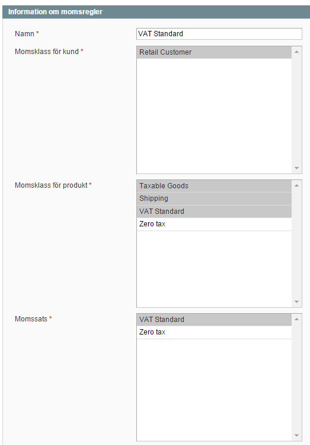
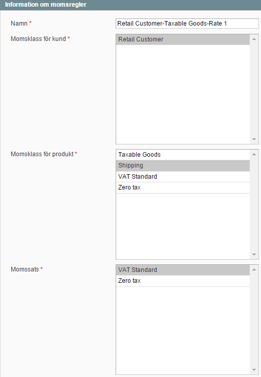
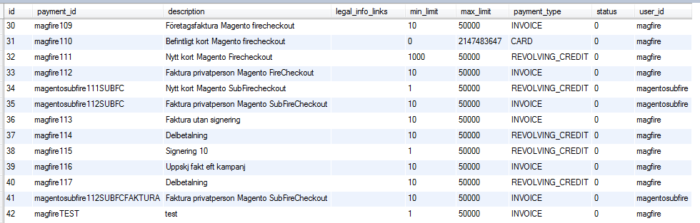

# Release- and installation notes, error logging and development for Magento OldFlow 
Created by Thomas Tornevall, last modified by Benny on 2017-02-20
# **Developing Magento**
## Cache
Make sure that as much as possible of Magento's caching features are
disabled. Old caches may be heavy showstoppers when things normally
works ok and suddenly stops. This is especially occuring when many
things are changing shortly after each after. A good thing otherwise, is
to clear caches often.

# **After installation notices**
## Older plugin releases and test environments
For older releases, make sure that test environment are pointed
to [https://test.resurs.com/ecommerce-test/ws/V4/](https://test.resurs.com/ecommerce-test/ws/V4/)

## Test versus production
Data in test environment may differ from data that can be found in
production environment. For example, getCostOfPurchaseHtml may present
more information on payments in production, depending on chosen payment
method, than it normally does in test.

## Configuration
Don't forget to check out settings and configurations below, since there
are things that has to be done before the plugin works properly, like
setting up merchant credentials.  
Make sure that you are really setting this to what is preferred usage
for your store.  

## Error handling in production environments
For a production environment: Make sure that **MAGE_IS_DEVELOPER_MODE =
"true"** is disabled (in .htaccess) if enabled, together with
display_errors (php.ini) - unless you don't want it to be very verbose.
Other plugins (including this) may generate errors that makes the plugin
stop working properly, since the AJAX routines are depending on correct
returned values. For example, plugins that contains pre-undefined
variables, may create log-notices this way, that may halt scripts before
they are finished. Those settings may also cause same kind of errors in
a test environment.

# **Release notes**
## Version 1.2.9
The form for which the customers can enter their own SSN to confirm
their home address has been removed and is now put into code examples
which can be found here

## Version 1.2.5
This version contains a major change of how payment-methods are saved in
configuration. When upgrading a reconfiguration of your old payment
methods may be needed. We've also added patch files to manually patch up
newer versions of Firecheckout (look in the patch-path in the
zip-file). **The new format (in the Model-path) is
Resurspayment\<representativeId\>\<paymentMethodId\>.php **

**  
**

# **Bugs, etc**
## Pricing bugs
**Discover dates:**

2014-02-03, Klarna   
2015-02-23, Payson 

There may be problems with shopping cart price rules, when running our
plugin together with Klarna, Payson and possibly more plugins, due to
misconfiguration. Especially shipping and order sums may fail in the
final order.

**How to fix:**

Make sure etc/config.xml (in Klarna's plugin) have shipping included in
the \<before\>-tag under \<sales\>\<quote\>\<totals\>\<klarna_fee\>  
Likewise, there may be problems with the shopping cart information
(confirmed with Magento 1.9) when working together with Payson plugin
(Discovered 2015-02-23).  
Add shipping,subtotal at the \<before\>-tag
at \<sales\>\<quote\>\<totals\>\<payson_invoice\> (etc/config.xml in
Payson's plugin)

There is however not a guarantee that the fix is completely solved this
way; problems with other miscalculations (like double taxes) has been
reported to us.

## Technical issues on tax classes
Found 2015-03-24

Some tax classes may cause technical issues with webservices, and some
settings in Magento's own configuration may give double taxes.
Currently, there is no fix for this, since it's configurable outside the
space of Resurs Bank.

## Payment method thresholds, min and max boundaries
Technical issues should normally not occur, when a price is too low or
too high for a payment method, since the payment method automatically
checks the boundaries during the payment. However, if it happens, it may
be caused by an older cached payment method. To fix this, you need
database access, so you can remove the misconfigured payment methods
from the table ***resursbank_payment_methods***.

