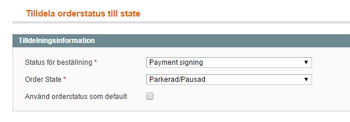

# MagentoPlugin - Important notices, features, information 
Created by Thomas Tornevall, last modified by Benny on 2017-02-20
# Tax calculation methods (and discounts)
Issues with tax calculation, especially when applying tax to products
with giftcards/discount, has been reported to magentocommerce. [Magento
themselves](http://merch.docs.magento.com/ce/user_guide/Magento_Community_Edition_User_Guide.html#tax/warning-messages.html) strongly
recommends that you - from administration - apply tax **after
discount** and using tax on catalog prices to avoid calculation issues.
# My payment methods are showing up, even when the allowed amount are too high or too low
Problem: When you are trying to check out with an amount - higher or
lower than the payment method normally accepts - and the payment still
shows up in the checkout.
Cause: Starts in the table *resursbank_payment_methods* where all
payment methods are stored. They sometimes need to be emptied to sync
properly, especially in test environments where min/max amount are
changed often.
Solution: Running apache? Add this row to your .htaccess-file:
**SetEnv RESURS_CLEAN_METHODS_CACHE "true"**
Then update your payment methods again. By doing this, you will clean up
the payment methods cache and add the new proper settings. This variable
is limited to the current representative id, so if you have more than
one store, the cleanup will only occur for the current representative.
If you want to do a full clean-up with this method, in all (if you have
this configured) stores, you should also add the
variable **RESURS_CLEAN_METHODS_CACHE_EXTEND** to .htaccess
# Credit cards and payment methods that requires payment signing
If your store needs payment signing in some of the payment steps, make
sure you assign "Signing status" correct status. This is made by
creating a custom order status in magento like this:

When the status is created, you have to assign it to a state. In our
example, we use "Hold/Holded" ("Parkerad/Pausad") like this:

When the status has been created, assign it to the assignment rules in
our payment method configuration:

The reason is to mark the order to indicate that it is in a "Payment
signing"-state if something goes wrong during the payment signing.
