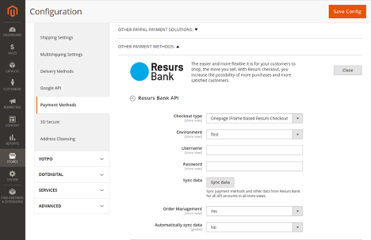
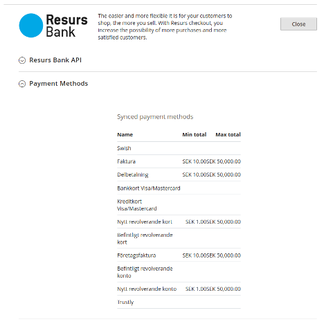
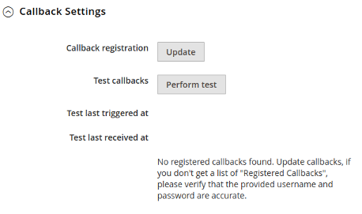

# Resurs Bank Magento 2.4+ Installation Instruction 

# System Requirements
Outside of Magento’s own requirements you will need the PHP SOAP and
JSON extensions. The iframe based checkout solution (RCO) will not
function properly without SSL.

# Packages
The module consists of five separate packages, which can all be
installed at once through the metapackage **resursbank/magento-all**, or
installed separately if preferred. Resurs Bank recommends you install
the module using the supplied metapackage. Each of the packages are
briefly described below.

## Core
*resursbank/magento-core*

Basic functionality required by all other packages such as API
libraries, payment method specifications and functionality to
synchronize metadata from the API to your local database. Please note
that this is the only required package, all other packages are optional
but recommended.

## Order Management
*resursbank/magento-ordermanagement*

Command integration against the API to capture, refund and void
payments. Supports partial refunds / capture. Integrates remote
callbacks to modify order status and perform other actions as the
payment changes state. Includes a feature to track events related to the
payment.

## Simplified
*resursbank/magento-simplified*

Provides integration with Magento’s native checkout process. This module
enables payment methods from Resurs Bank to be displayed and utilized in
the checkout process, it also enables a widget to fetch the customer
address information from a remote service.

## RCO
*resursbank/magento-rco*

Provides a custom single-page checkout solution based on an iframe for
quicker conversions. This module replaces the native checkout page.

## Part Payment
*resursbank/magento-partpayment*

Implements a widget on product pages to calculate estimated part payment
prices

# Installation Procedure
Download extensions from [Magento
marketplace.](https://marketplace.magento.com/resursbank-magento-all.html)

Assuming you are installing the metapackage as recommended, the complete
installation procedure is as follows.

```xml
cd [magento_root_directory]
composer require resursbank/magento-all
bin/magento module:enable Resursbank_Core Resursbank_Simplified Resursbank_Rco Resursbank_Ordermanagement Resursbank_Partpayment
bin/magento setup:upgrade
bin/magento setup:di:compile
bin/magento cache:flush
```
Open the administration panel and navigate to **Stores -\>
Configuration** followed by **Sales -\> Payment Methods -\> Other
Payment Methods** and click on the **Open** button displayed on the
**Resurs Bank** section.



Select your preferred **Checkout type** and supply your **Username** and
**Password** for the API. Note that if you do not have these credentials
you will need to contact Resurs Bank to have an account setup for you
before you can proceed any further.

Save the configuration and then proceed by clicking on the **Sync data**
button to sync payment methods and annuity factors from the API (annuity
factors are metadata for the part payment package and will only be
synchronized if you’ve installed said package).

When the synchronization process has completed your payment methods will
be listed under the **Payment Methods** section as illustrated by the
image below.



Finally, expand the **Callback Settings** section (only available if
you’ve installed the **Order Management** package) and click on the
**Update** button to register callback URLs. We also recommended that
you then click on the **Perform test** button to ensure that the API can
reach your website. Please note that in order for any callbacks to
function at all, including the test callback, your website **must be
exposed to the Internet**, otherwise the API can’t reach it.

 

**Upgrading from the resursbank/checkout module**

When upgrading from the resursbank/checkout module you should remove the
old module before installing the new one.

You may encounter an SQL error when executing the setup:upgrade command,
a constraint error caused by a duplicate foreign key in
the **resursbank_checkout_account_method_annuity **table. This can be
resolved by executing the following query:

alter table **\[DATABASE\]**.resursbank_checkout_account_method_annuity
drop foreign key **\[FOREIGN_KEY\]**;

- Replace **\[DATABASE\] **with the name of your database.
- Replace **\[FOREIGN_KEY\] **with the name of the present foreign key
  as supplied by the error message (normally this would
  be **method_id**)."

You can then re-run the **setup:upgrade **command to proceed with the
upgrade.  
**Please remember to always backup your database before executing any
queries manually! **

**  
**

