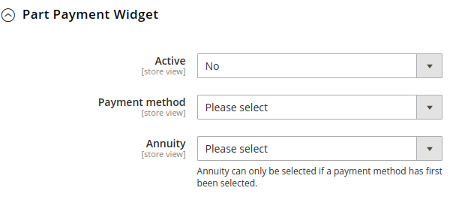
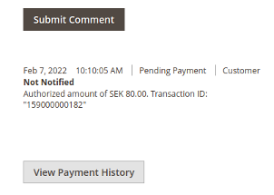

# Resurs Bank Magento 2 CE 2.4+ payment gateway documentation 

# Installation
Start by reading through the separate document detailing our
[installation instructions](/platform-plugins/magento-modules/magento24-installation-instruction/).  
This document also covers system requirements, a brief description of
each individual module package and instructions for initial settings.

Please keep in mind that if you are missing any settings or features
described in this document it’s likely because your developer(s) have
not installed the appropriate packages,  
all of which are freely available and can be installed by following the
separate installation guide.

# Settings

All our settings are located in the **Payment Methods** section of the
configuration, under the subsection labeled **Other Payment Methods**.  
The various packages our module is composed of provide their own
settings and may affect settings specified by other packages. For
example, the **Simplified** and **RCO** modules will both append a
**Checkout type** selection value to specify the respective API
implementation.  
Below we will cover all settings provided by all packages. The
illustrations are supplied from an environment which has all packages
enabled.  

## **Resurs Bank API**

These settings are supplied by the **core** module and provide
integration with the API.

 

### **Checkout type**
Which API integration to utilize. The values are supplied by the
**Simplified** and **RCO** modules, and thus one of these is required
for a checkout integration. The various checkout types are described in
more detail below in a later section.

### **Environment**
A choice between **Test** and **Production**.

### **Username**
API account username, supplied by Resurs Bank. There is a separate
username field for each **Environment** value, we display the related
one depending on your selection. This allows you to quickly swap between
environments upon need.

### **Password**
API account password, supplied by Resurs Bank. There is a separate
password field for each **Environment** value, we display the related
one depending on your selection. This allows you to quickly swap between
environments upon need. 

Please note that the value will become encrypted when you save the
configuration.

### **Sync Data**
When you click this button the module will;

1.  Disable all payment methods recorded in the
    **resursbank_checkout_account_method** table.
2.  Fetch payment methods from the API (and all associated metadata).
3.  Record this data to the **resursbank_checkout_account_method**
    table.
4.  Enable the payment methods that were available at Resurs Bank
    (leaving methods which no longer exist disabled).
 Please note that: 

-  This process is executed once for each API account you have specified
  in your various websites / stores / store views.
-  This process will also synchronize your part payment metadata if the
  **Part Payment** package has been installed.
-  It’s advisable to refresh your cache after this procedure has been
  completed.

### **Order management**
*Requires the Order Management module package
(resursbank/magento-ordermanagement).*

### **Automatically sync data**
Whether or not to automatically execute the procedure to synchronize
payment methods and their metadata at set intervals (defined by your
cronjob). By default the module specifies to execute this procedure once
a day at **00:00** (12 AM).

## **Payment Methods**
This section contains a list of all **active** payment methods currently
recorded in your local database. The list also details the **min** /
**max** purchase value for each payment method.


## **Callback Settings**
*Requires the Order Management module package
(resursbank/magento-ordermanagement).*** **

This section provides buttons to register and test your callbacks. The
section also details when a test was last dispatched / completed as well
as a list of all registered callback URLs.

Please note that the illustration below is intentionally cleared of all
data since some of the listed values should be considered private, but
not sensitive.


### **Callback registration**
Clicking the **update** button will execute a process to update the
registered callback URLs at Resurs Bank for the configured API account.
Note that unlike syncing data from the API this action will only affect
the contextual API account and not all API accounts specified in your
installation.

The module registers the following callback types (their functionality
is described in detail in a later section of this document).

- UNFREEZE
-  BOOKED
-  UPDATE
-  TEST

 While there are more callback types available, UPDATE will be executed
alongside them, and thus these other callbacks are considered needless
overhead.

### **Test callbacks**
Clicking this button will trigger an API call that forces Resurs Bank to
execute the **TEST** callback. Essentially this means Resurs Bank will
submit a request to the **TEST** callback registered for your configured
API account.

### **Test last triggered at**
Displays the time when you last initiated a test.

### **Test last received at**
Displays the time when the last **TEST** callback URL was requested by
Resurs Bank.

## **Part Payment Widget**
*Requires the Part Payment module package
(resursbank/magento-partpayment).  
*

This section contains settings affecting the behavior of the part
payment widget. This widget itself is described in detail later in this
document.



### **Active**
Whether to display the widget on your product pages.

### **Payment method**
Method to extract annuity factors from (these are listed in the
**Annuity** setting described below).

### **Annuity**
Annuity factor (payment interval) to utilize as a basis for part payment
price calculations.

## **Advanced Settings**
### **General**
This section contains useful though not necessary settings which may be
applied at will to suit your specific needs.


#### **Logging**
 Whether or not to enable logging. There is a separate log for each
package, and that package will only write information to its own log.
The logs contain metadata, errors and any information relevant to debug
problems.

The log files are named with the following scheme:
**resursbank\_\[package\].log** for example, **resursbank_core.log** or
**resursbank_ordermanagement.log**

Some packages may produce additional log files. Log files are detailed
in their own section later in this document.

We recommend you leave logging enabled but adjust the `Log Level` 
setting to fit your requirements (e.g. only log `ERROR`  and
`EXCEPTION`  messages in production).

It is also advisable to rotate the log files regularly to avoid disk
space issues developing over time, especially if `Log Level` is set to
`INFO` or `DEBUG`.

#### Log Level
Sets the lowest level of message that will be logged. So for example if
set to the default `INFO` level then `DEBUG`  level messages will not be
logged while `INFO`, `WARNING`, `ERROR` and `EXCEPTION`  messages are
logged while if set to `ERROR` no messages with a level of `DEBUG`,
`INFO` and `WARNING`  will be logged.

#### **Delete aborted orders**
Magento will produce an order prior to payments being completed, which
may leave incomplete orders in your system if the payment fails for any
reason. The natural events are as follows:

1.  Magento creates the order.
2.  Magento redirects the customer to Resurs Bank to fulfill their
    payment.
3.  The client completes / fails to complete the payment (payment might
    for example fail if the customer lacks money in their account,
    enters a code incorrectly, or is otherwise not eligible for their
    choice of payment method).
4.  The client is returned to Magento (either the success or failure
    page, depending on the outcome of the payment process).

In the event the client reaches the failure page the order will become
canceled and the client will be redirected back to the checkout page
where they are allowed to attempt payment once again. We automatically
re-create their cart and supply all information we can based on their
previous attempt (such as addresses, shipping method etc.).  

Sometimes a client will try over and over to complete an order using a
payment method they are not eligible for, as a result you may naturally
end up with many canceled orders in your system.

By enabling this setting you can prevent this. We will delete the last
order placed by the same client that wasn’t completed / canceled, if
any. This does of course not apply if the same client completes multiple
orders in succession.

#### **Round item tax**
Depending on how you’ve configured your prices, taxes, products and
shipping you may naturally end up with VAT values like **25.007%**

Resurs Banks API is very particular about what VAT values are allowed,
and submitting an illegal value will cause an error resulting in a
terminated purchase.

To avoid this, you can enable this setting which will round the values
to the nearest integer.

Normally you should not need to use this setting, it’s designed for
complex setups utilizing irregular tax application procedures in
combination with percentage based prices and discounts.

Note that the reason tax percentages appear accurate in Magento is due
to how Magento rounds values in combination with its tax calculation, a
procedure which is not matched by Resurs Banks API.

### **Onepage iFrame based Resurs Checkout**
*Requires the RCO module package (resursbank/magento-rco).*

This section contains additional settings for the iframe based checkout
solution (RCO).


#### **Alert customers when shipping methods update**
Shipping methods are not selected within the iframe itself, they are
rendered in a separate list above the iframe on the checkout page.

Since customers often use a phone to place orders they will need to
scroll through the checkout page, and since parameters such as address
or method of payment may affect the list of available shipping methods,
the list may update without the customer noticing (since they have
scrolled passed the element), giving them an error as they attempt to
place their order in case the shipping method they originally chose no
longer is available when they attempt to complete their order.

By enabling this setting you will notify the customer when the list of
shipping methods is updated, ensuring they do not miss important
information.

Please note that this setting may annoy clients since it will produce a
message every time the shipping method list is update. Therefore it
should only be used if you’ve dynamic shipping methods that become
available depending on parameters supplied through the iframe (such as
delivery / billing address or method of payment).

### **Two step Magento Checkout with Resurs payment methods**
*Requires the Simplified Flow module package
(resursbank/magento-simplified).*

This section contains settings applicable to the native checkout
procedure included in Magento.


#### **Swish maximum order total**
 The maximum cart value allowed to utilize the **Swish** payment method
where applicable.

#### **Wait for fraud control**
Modifies the behavior of the procedure to handle payments at Resurs
Bank. Simply put, by enabling this setting you ensure that *all* fraud
checks and investigations are completed before accepting the payment.
This grants higher security of payment, but it may also cause payments
to take longer to process for natural reasons. Therefore it’s advised
this setting is only enabled after consulting Resurs Bank to discuss
whether it’s applicable for your specific circumstances.

Please note that while this setting is enabled in the illustration above
it’s actually disabled by default, it’s been enabled in order to display
the setting **Cancel automatically**, described below.

#### **Cancel automatically**
Cancel the payment at Resurs Bank automatically if it attains the status
**FROZEN**. Please note that there are several legitimate reasons for a
payment to become **FROZEN**, usually it means the payment requires
further scurantany to ensure it isn’t fraudulent.

This setting requires **Wait for fraud control** to be activated (it
won’t be available otherwise).

Please note that this setting should only be applied after consultation
with Resurs Bank.

#### **Debit automatically**
Whether or not to automatically debitize payments that have been
accepted by Resurs Bank. Please note that this setting should only be
applied after consulting Resurs Bank.

# Simplified Flow
*Requires the Simplified Flow module package
(resursbank/magento-simplified).*

Simplified Flow is one of the API integrations which you may utilize to
communicate with Resurs Bank. This integration uses the native checkout
process in Magento and you can thus combine this option with other
payment solutions.

It prepends a widget to resolve customer address using their civic
number or phone number (depending on country).


Phone number validation is also manipulated to make it match the
expectation of the API. An inappropriately formatted phone number will
cause the API requests, and ultimately the purchase, to fail.


Payment methods function the same as for any other gateway.

 Some methods require the customer to supply additional information
(this depends on the method in question, and whether the customer is a
company or private citizen). This is the case with invoices, as
illustrated below.

 The **Read More** link displayed with each payment method will open a
dialog with additional information about the payment method.


# Resurs Bank Checkout (RCO)

*Requires the RCO module package (resursbank/magento-rco).*

> Please note you must disable terms and conditions in Magento to
> utilize this checkout method.

Resurs Bank Checkout (shortened RCO) is an API integration which
provides a custom iframe based checkout, replacing the native checkout
process.


Checkout agreements are supplied through Resurs Bank **Disable** the
native Magento checkout agreements can not coexist with RCO.

# Part Payment widget
*Requires the Part Payment module package
(resursbank/magento-partpayment).*

The widget is displayed on your product pages to reflect an estimated
part payment price of the product. When it’s displayed on a product page
containing options that affect pricing (like configurable or bundled
products), the price estimation is updated automatically as the customer
modify their option selection.


Clicking the **Read More** link (illustrated in the image above) will
open a dialog with information.


# Order management
*Requires the Order Management module package
(resursbank/magento-ordermanagement).*

### **Payment information** 
On the order, invoice and credit memo views, we append a block
reflecting the current state of the payment at Resurs Bank.


### **Payment History**
At the bottom of the order view you will find a button labeled **View
Payment History**.



Clicking this button will open a dialog window displaying all the events
that have occurred for the payment associated with the order.


### **Callbacks**
 Callbacks are essentially notifications submitted to your website from
Resurs Bank whenever something happens to a payment, for example when it
becomes debited or annulled.

 The provided callback integration will update the state and status of
the order in Magento to reflect the current state of the payment at
Resurs Bank. It will also record the events in your logs and within the
**payment history** (described above).

 Note that if a payment is annulled at Resurs Bank the corresponding
order in Magento will be canceled.

 Callbacks are designed to be adaptable and your developers will easily
be able to execute any number of custom actions whenever you receive
these notifications without needing to modify the module itself.

### **AfterShop API integration**
This API lets you manipulate payments at Resurs Bank. This module
includes implementations to debit, credit and void payment at Resurs
Bank when the corresponding action is performed in Magento. Please note
the following.

- The module supports partial invoices / credit memos.
-  If you wish to capture a credit memo remember you must create it from
  the **invoice view**, since using the button available on the order
  view will forcibly create an offline credit memo.
-  If you edit an order the changes are not synchronized to the payment,
  you will need to modify it manually to match the changes you applied
  on the order.
-  The actions performed against the payment are transcribed within
  **payment history** (described above).

Please note that this integration can be disabled in the configuration
using the **Order Management** option in the **Resurs Bank API**
section.

## Order confirmation email
The **Order Management** module will affect how the order confirmation
email is dispatched.

 The module will prevent the email from being submitted during the
checkout process (by setting the flag **can_send_new_email** to
**false**). The module calls the method to submit the email when the
callback **BOOKED** is received from Resurs Bank.

 Under normal circumstances this callback will be submitted from Resurs
Bank moments after the purchase has been accepted regardless of method
of payment.

 This may however be affected by the flags to modify the payment process
(see the section **Advanced Settings - Two step Magento Checkout with
Resurs payment methods** above for more details), or by settings applied
on the payment methods at Resurs Bank.

 When using **asynchronous** emails please be aware of the time limit
imposed by Magento in **vendor/magento/module-sales/etc/di.xml**

** **Magento will dismiss order confirmations which have not been
submitted within **24 hours** of order placement. This means that if the
**BOOKED** callback would take longer than **24 hours** to be submitted
the order confirmation emails would not be processed by Magento.

 This is an unlikely scenario, but depending on your specific
configuration and circumstances you may wish to increase this time
limit. For your convenience we have included the code extract below
which applies the limit explained above (from Magento 2.4.3).

```xml
<type name="Magento\Sales\Model\EmailSenderHandler">
    <arguments>
        <argument name="modifyStartFromDate" xsi:type="string">-1 day</argument>
    </arguments>
</type>
```
If your order confirmation emails do not appear to be submitting
properly please review the information in the **debug** section below
before initiating contact with our support team. As an emergency
solution, you could disable the plugin responsible for preventing the
original email submission:
**vendor/resursbank/magento-ordermanagement/Plugin/Order/StopConfirmationEmail.php**
(**resursbank_ordermanagement_stop_order_confirmation_email**) specified
in **vendor/resursbank/magento-ordermanagement/etc/di.xml**

** **

# Problems, debugging and support
### **Orders**
 Before suspecting a problem with the module due to unexpected behavior
with your orders you should consult the **payment history** (please see
the **Order Management** section above).

 This information will let you know what actions have been taken by the
client and / or module. It will also detail when the order state and
status have been modified by the module, and whether the module has
canceled the order.

 A few relevant notes regarding this information:

- If your order has been canceled, but it’s not detailed in the payment
  history, then our module **did not** cancel the order. Remember that
  there are other systems which may cancel orders in Magento, for
  example the native cleaning process which automatically cancels orders
  that are left with the status **pending_payment** when they expire.
-  If there is no information after the client was redirected to the
  gateway it’s most likely because the client decided to close their
  browser window and thus not complete their purchase.
-  If your order has obtained an unexpected state or status, but this
  change is not detailed in our payment history, then the module **did
  not** apply said state / status to your order directl 

### **Discount tax** 
There are multiple ways to define tax calculations in Magento and Resurs
Bank supports most use cases. The only use case which isn’t supported is
a combination of **Apply customer tax** set to **After discount** in
combination with **Catalog / Shipping Prices** set to **Excluding tax**
(see the image below).


To understand why this doesn’t work we must first consider that Resurs
Bank will calculate all prices itself, using prices without VAT and a
VAT percentage. Resurs Bank will calculate each row individually and
then add them together. In the scenario illustrated above, Magento would
subtract the discount **before** calculating the taxes, while Resurs
Bank will do the opposite and there is no setting available at Resurs
Bank to manipulate this behavior.

If you really must apply your settings in this way your only option is
to create a plugin that modifies the data compiled for the payloads
here:
vendor/resursbank/magento-core/Model/Api/Payment/Converter/AbstractConverter.php
:: getDiscountData()

### **Contacting the support staff**
 Before you contact our support staff please consider the following: 

-  Magento is a modular system and most setups have hundreds of modules
  and modifications to make the system fit your specific needs. Ask your
  developers if the problem you are experiencing could be caused by an
  incompatibility with another module or modification on your system.
  Even if we can apply a fix for it, knowing about it in advance saves a
  great deal of time for both parties, and if it’s a customisation by
  your own development team we cannot provide a fix anyway since it’s
  specific to your setup.
-  While we certainly will help with an investigation if necessary it
  will take far more time compared to letting your own team handle it,
  because every setup is unique, and so is every server configuration.
  Only your own team has complete knowledge of the configuration for
  your server and website, and they will likely have a local development
  copy of your website, letting them utilize tools to speed up the
  process which cannot be utilized by us since we would investigate the
  problem on your remote server.
-  All of our modules are open source, and regardless of whether we can
  supply a solution to a problem within the module, your developers can
  apply a solution outside of it while investigating. This means you can
  have a solution implemented much faster while awaiting a potential
  patch from us. If no patch is made, for whatever reason, it’s at least
  already fixed on your end.

 For these reasons it’s advisable you start by reporting problems to
your development team and let them investigate the problem before they
engage us. It’s always better for us to discuss technical problems
directly with a developer since it will speed up the process. The
developer can then relay any relevant information back to you.

 Below follows technical information for your developer(s) to assist
them when researching problems, as well as guidelines for what
information to include when contacting us to speed up the process.

### **Logs**
 For log files to be created you will need to enable the **Debug**
setting in the module configuration (see the **Advanced Settings -
General** described earlier in this document).

 The module writes log files directly to **var/log** within the Magento
directory, named according to the following scheme:
**resursbank\_\[package_name\].log**

** **For example, the **Simplified Flow (simplified)** module will
create a log named **resursbank_simplified.log** containing all
information produced specifically by the **Simplified Flow** module
package.

 Some packages will produce additional log files with information
related to specific operations, at the time of writing the only
implemented example of this can be found in the **Order Management**
module which produces a separate log detailing incoming callbacks.

 If you have the **Order Management** package installed we also track
information about the payment process to the database
(**resursbank_checkout_payment_history**) and you can later view this
directly from the order view in the administration panel by clicking on
the **View Payment History** button located at the bottom of the order
view.

 Remember to always consult your normal error logs since we do not /
cannot log all exceptions, errors and other information directly in our
own logs.

### **Disable unnecessary modules**
A common mistake for Magento 2 developers is leaving modules enabled
unknowingly if these include an option within their configuration to be
disabled.

Remember that unless you disable a module using the Magento binary its
files will still be loaded and can cause unexpected behavior. To
properly disable a module, drop into your shell and execute the
following commands:  

```xml
cd [magento_root]
php bin/magento module:disable Vendor_Module
```

### **Callbacks**
** **Callbacks are implemented through the **Order Management** package.
These are URLs invoked by Resurs Bank whenever an event occurs for a
payment. For example, when a payment is **booked** (accepted by Resurs
Bank) the **BOOKED** callback URL will be triggered.

 If you suspect callbacks aren’t working properly for you please do the
following: 

-  Check that your registered URLs are accurate through the
  corresponding section in the configuration (see **Callback Settings**
  for more information).
-  Check the payment history using the button **View Payment History**
  from the order view. Every callback is tracked when it arrives and
  when it completes, so there should be two entries for each callback
  (please note that sometimes callbacks arrive at almost the same time,
  so two callbacks can technically be processed simultaneously).
-  Check the **log** log file for detailed information about every
  incoming callback (if you suspect an error is occurring, please check
  your exception / system log using the timestamp from the payment
  history / callback log as reference).
-  If no data exists to indicate callbacks are being received at all you
  can test that callbacks work using the **Test callbacks** button from
  the configuration.
-  If the test callback doesn’t seem to work either check with your
  server administrator that callbacks aren’t being blocked by a
  firewall.

 Whenever the module accepts a callback we manipulate the state / status
of the order to match the status of the payment at Resurs Bank (please
note you can see what state / status an order has obtained from any
given callback through the **Payment History** feature described above).

Callbacks are meant to be adaptable, for example you might need to
execute some action to manipulate data in an ERP system when something
happens to the payment associated with an order. You can easily achieve
this by creating plugins for
**vendor/resursbank/magento-ordermanagement/Model/Callback.php** ::
**unfreeze** / **update** / **booked**

### **Payment methods**
Payment methods from Resurs Bank are dynamic, meaning that each separate
API account has their own unique set of payment methods, each of which
may specify a unique ruleset. This means great flexibility, but it also
means that unlike most other gateways we cannot specify our payment
methods statically in an XML file. Instead, we fetch a list of all
available payment methods and their metadata and store this information
in your local database (our tables are prefixed **resursbank\_**). We
later inject our payment methods in places where payment methods are
collected and utilized (see
**vendor/resursbank/magento-core/Plugin/Payment/Helper/Data.php**).

It should be noted that our payment methods follow the new gateway
design, specifying a command pool and value handlers in the **Core** and
**Order Management** packages. The **Simplified Flow** package
manipulates the **Authorize** command using a plugin (see
**vendor/resursbank/magento-simplified/Plugin/Gateway/Command/Authorize.php**).
Commands affecting the order post creation are defined in the **Order
Management** package.

If payment methods do not appear to be functioning correctly you should
first attempt to sync them and proceed by investigating the
**resursbank_checkout_account_method** table. Please note the
**activate** column, indicating whether a method is active and will
appear in the checkout.

If you are using the iframe checkout (**RCO**) it’s important to note
that payment methods are listed by Resurs Bank and so they will be
listed even if they aren’t synced to your local database. In that event
you will receive an exception when you attempt to place an order
however, since Magento cannot find the payment method corresponding to
the choice you made within the iframe.

### **Information to include with problem reports to the support staff**
When reporting a problem to our support staff it’s appreciated if you
include the following.

- A description of the problem.
-  Log files. Remove all log files from your log directory within
  Magento (var/log), reproduce the problem and then pack up the entire
  log directory in a tar / zip file. This is to avoid submitting us
  unrelated information which will needlessly slow us down.
-  A guest account to your administration panel (alternatively
  screenshots of your configuration (both of the store view and default
  configuration)). If the problem concerns an order we would also
  appreciate screenshots from the order view of the payment information
  (the blue section at the top of the page) as well as the payment
  history (accessible through the **View Payment History** button at the
  bottom of the page).
-  A list of modules you’ve installed that may affect your orders or
  checkout process (you may exclude modules which have been properly
  disabled using the Magento binary).

