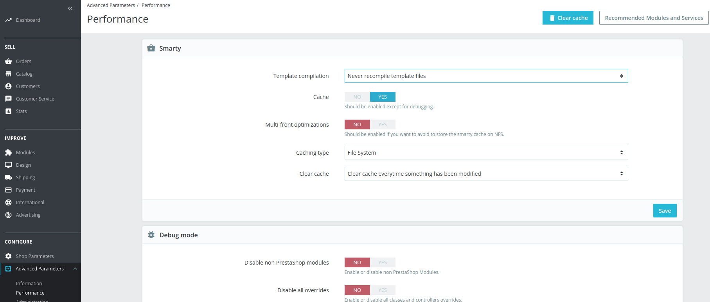
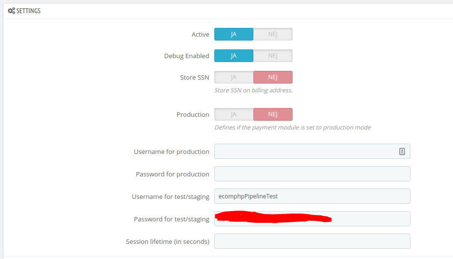
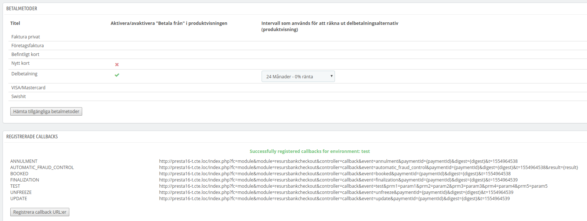
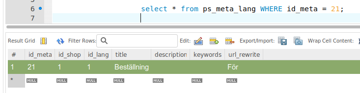

# Prestashop Resurs Checkout 

> Problem solvingThere are a few known problems in the core functions of
> Prestashop, some of them are not related to our module at all. Take a
> look at the bottom at this page for more information.

> Before installationCUSTOMIZABLE PRODUCTSIn PrestaShop 1.7, the store
> offers customizable products (for example, you can add custom texts on
> your products; in the sample store, it is possible to add custom text
> to a mug).This is not yet (june 2020) supported by the module for
> version 1.7.6.

This extension helps merchants to integrate Resurs Bank Payment Gateway
to their PrestaShop based e-commerce stores. There are two versions of
this plugin and they are currecntly only supporting Resurs Checkout.

## Compatibility
This plugin is tested in "vanilla environments", which means that the
plugin is installed with a default installed store. If there are plugins
installed, they are usually installed from for example a marketplace. We
can not fully guarantee functionality if you have other plugins
installed, that uses overriders and such.

## Plugin versions

| Name                                                        | Tested with    | PHP     | Details                                                                                                                                                                                             | Country        | Repos                                                                                                                                                                                                                                                                                                                                                | Download                                                                                                          | Dev Tracking                                                                                                       | Status              |
|-------------------------------------------------------------|----------------|---------|-----------------------------------------------------------------------------------------------------------------------------------------------------------------------------------------------------|----------------|------------------------------------------------------------------------------------------------------------------------------------------------------------------------------------------------------------------------------------------------------------------------------------------------------------------------------------------------------|-------------------------------------------------------------------------------------------------------------------|--------------------------------------------------------------------------------------------------------------------|---------------------|
| **[Resurs Checkout Web](resurs-checkout-web)** - PrestaShop | 1.6            | \>= 5.4 | [Resurs Checkout Docs](resurs-checkout-web)                                                                                                                                                         | SE (Confirmed) | [Master branch (1.6)](https://bitbucket.org/resursbankplugins/resurs-checkout-prestashop16/src/master/)                                                                                                                                                                                                                                              | [Release-tags for v1.6](https://bitbucket.org/resursbankplugins/resurs-checkout-prestashop16/downloads/?tab=tags) | [JIRA for v1.6](https://resursbankplugins.atlassian.net/projects/PRESTA16/issues/?filter=allopenissues)            | NO LONGER SUPPORTED |
| **[Resurs Checkout Web](resurs-checkout-web)** - PrestaShop | 1.7.6.x1.7.7.x | \>= 5.4 | [Resurs Checkout Docs](resurs-checkout-web)                                                                                                                                                         | SE (Confirmed) | [Master branch (1.7)](https://bitbucket.org/resursbankplugins/resurs-checkout-prestashop17/src/master/)                                                                                                                                                                                                                                              | [Release-tags for v1.7](https://bitbucket.org/resursbankplugins/resurs-checkout-prestashop17/downloads/?tab=tags) | [JIRA for v1.7](https://resursbankplugins.atlassian.net/projects/PRESTA17/issues/PRESTA17-64?filter=allopenissues) | MAINTENANCE         |
| **Resurs Simplified Flow (SOAP)**                           | \>= 1.7.7      | \>= 7.4 | INSTALL WITH COMPOSER[Using Simplified Flow](https://test.resurs.com/docs/display/ecom/Simplified+Flow+API)[Documentation](https://test.resurs.com/docs/display/ecom/PrestaShop+SimplifiedShopFlow) | SE (Confirmed) | [Core](https://bitbucket.org/resursbankplugins/psrbcore/src/master/)[Simplified Addon](https://bitbucket.org/resursbankplugins/psrbsimplified/src/master/)[Partpayment Widget](https://bitbucket.org/resursbankplugins/psrbpartpayment/src/master/)[Order Management Addon](https://bitbucket.org/resursbankplugins/psrbordermanagement/src/master/) |                                                                                                                   |                                                                                                                    | NEWLY RELEASED      |

The above RCO-1.6/1.7 was splitted into separate modules when the
development of the module for Prestashop v1.7 was initiated. The module
for v1.6 went up to 2.6.5 with some updates that was brought into the
v1.7-module - and the 1.7 module became 2.7.0

### END OF LIFE (EOL)
The status flag above indicates how our support works and when there's
eventually an **E**nd **O**f **L**ife for each plugin. As for the
maintenance flag, we tend to stop supporting PrestaShop 1.6 in the
future as development for both PrestaShop 1.7.5 and 1.7.6 (april 2019)
is moving foward. Leaving older deprecated versions is a way to maintain
stability with fewer glitches than if we supported long range versions.

## Requirements
- Supported platforms should follow the PrestaShop requirements.
  However, as of april 2019, none of those plugins supports PHP 5.3
  anymore.
- Merchant credentials from Resurs Bank (ID and Password).
- Full SSL support for communicating with Resurs Bank.
- PHP module activated to support curl.
- PHP module activated to support soapclient and XML .

## Upgrading
For each upgrade you do, make sure you clear all cache data in
PrestaShop admin (Via the Advanced-\>Performance tab). As there are
front end scripts that may require extra cleanups, this is also
necessary.



## Installation
*The below instruction is based on a basic installation, where you have
direct access to the server. By means, you probably have ssh access at
the hosting provider or something similar. If you're using ftp, it's
probably best to extract the zip (described below) at your local
computer first - rename the folder, and then upload the file structure
to the modules-directory at your shop.*

There are other ways, which is in this case unsupported. There is also a
"Prestashop Marketplace" where the plan is to get our modules
distributed. When this part is fulfilled, it may be possible to install
it directly from there. Unfortunately, as of april 2019, this is
currently not possible yet.

1.  **For both Prestashop 1.6 and 1.7, grab a tagged release** from our
    repos (**do not use the master-branch** as this usually is a
    development branch - and even if it's for the moment stable, we
    can't guarantee full production support at this level).
2.  Unzip the downloaded file into \<primary folder of your
    shop\>/modules (the downloaded file may look like
    this: **resursbankplugins-resurs-checkout-prestashop16-ff8652e77e83.zip**)
3.  Make sure you rename the primary directory that you unzipped to the
    modules directory.  
    If the zip looks like above
    (resursbankplugins-resurs-checkout-prestashop16-ff8652e77e83.zip),
    the directory that the module will land under may look like
    this: *resursbankplugins-resurs-checkout-prestashop16-ff8652e77e83*
4.  Make sure your cloned or extracted directory under modules is
    renamed to ***resursbankcheckout***, or the module won't be found by
    prestashop therefore not work.
5.  Activate the module and configure it through the admin module panel.
    Do not forget to put the username and password in the credentials
    field.
6.  **Also do not forget to register payment methods and callbacks (see
    screen dump below)!**
7.  **Before going production mode, make sure you test the module so you
    know it covers your needs!**
### Module configuration example


### Registered payment methods and callbacks
**  
**

## Known problems and (eventually) the solutions
### Handling unfinished orders
Sometimes, customers decide to not fullfill their payments and shuts
down their payment session/browsers faster than we can handle the
cancellation. This means that some orders may look active, but in
reality they are cancelled. In Prestashop, we have added an adapted
shellscript written in PHP that is supposed to handle this kind of
problems. It is not really supported, and is more to consider an extra
addin-tool than something that really belongs to the plugin. It is
located under **modules/resursbankcheckout/shell/Cleaner.php**, if you
want to try it out. It is usually not recemmended to install this to run
under the Prestashop internal cron handler, but externally like a
shellscript. For shelled-cronjob, the crontab should look like below and
it is fine running it once per hour:

```xml
0 * * * * /bin/php /var/www/prestashop/modules/resursbankcheckout/shell/Cleaner.php
```
From /etc/cron.d it could also be added as a generic cronjob:

```xml
0 * * * * <owner> /bin/php /var/www/prestashop/modules/resursbankcheckout/shell/Cleaner.php
```
Do not forget to change the paths, binaries and the ownership for both
above examples.

### SSN/Government ID's and direct debiting methods (like SWISH)
If a customer chooses to change their billing/delivery address in the
checkout without using the getPayment-features (meaning there may be
some missing government id's through the checkout), Prestashop will be
unable to catch this information on the payment. If you use features in
the plugin that collects data for insurances, the module will be unable
to store this data for you. By means, it may be "bad for business"
especially insurance-features, if the customer somehow are not required
to enter this information during the payment.

### Going from cart to checkout has weird URL
[PRESTA17-68](https://resursbankplugins.atlassian.net/browse/PRESTA17-68?src=confmacro) -
(Not a bug) Problems with /För in cart-to-checkout-url (Documentation
only) Done

When you use swedish translations the url, depending on your platform,
may show up as "[https://your-site/](https://your-site/)**För**". The
"För" link is a typo related to a redirect_url that went wrong when it
was installed in the database. It looks ugly but is normally not
destroying anything.



Solution:

If you want to report this as a bug to Resurs Bank - don't. We can't
solve it from our side. Instead, update your database. If you are unsure
of what to look for, the above query could probably be changed to
something like this:

```xml
SELECT * FROM ps_meta_lang WHERE url_rewrite = 'För'
```
If you find a row that contains "För" in the url_rewrite-field, change
it to "order". If you only have access to prestashop admin and the sql
editor there, you could run something that looks like the query below.

**Best practice is to look for the correct "wrong row" and change it,
just so nothing else is changed by mistake.**

```xml
UPDATE ps_meta_lang SET url_rewrite = 'order' WHERE url_rewrite = 'För'
```
Just make sure your tables are not prefixed as something else.

