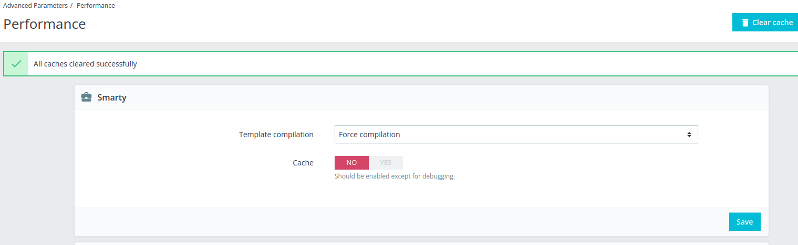

# Presta-Simplified: Frequently Discussed Issues and Important Notes 
Created by Thomas Tornevall, last modified on 2022-06-09
- [Notes about
  nginx](#prestasimplified:frequentlydiscussedissuesandimportantnotes-notesaboutnginx)
- [getApiFunctions()](#prestasimplified:frequentlydiscussedissuesandimportantnotes-getapifunctions())
- [Resurs Bank plugin needs own statuses for pending/processing orders -
  why?](#PrestaSimplified:FrequentlyDiscussedIssuesandImportantNotes-ResursBankpluginneedsownstatusesforpending/processingorders-why?)
- [When are the order/payment considered
  paid?](#PrestaSimplified:FrequentlyDiscussedIssuesandImportantNotes-Whenaretheorder/paymentconsideredpaid?)
- [Language and
  translations](#prestasimplified:frequentlydiscussedissuesandimportantnotes-languageandtranslations)
- [Commits and merges not taking effect in development
  mode](#prestasimplified:frequentlydiscussedissuesandimportantnotes-commitsandmergesnottakingeffectindevelopmentmode)
- [Are we using session data at any point in the
  modules?](#prestasimplified:frequentlydiscussedissuesandimportantnotes-areweusingsessiondataatanypointinthemodules?)

## Notes about nginx
When the PrestaShop development started, we noted a few moments that
nginx could cause errors unrelated to the plugin.

As stated in
[P17-231](https://resursbankplugins.atlassian.net/browse/P17-231?src=confmacro) -
Köp med "Faktura företag" får 502 Bad gateway. Done , requests to
prestashop can sometimes render errors due to big headers:

    upstream sent too big header while reading response header from upstream
This could be solved by adding similar rows to your server
configuration:

```xml
    fastcgi_buffers 16 16k;
    fastcgi_buffer_size 32k;
```
## getApiFunctions()
In (simplifiedshopflow)-Checkout.php, an implementation of the ecom
instance is currently present. The method is not fully instantiating the
ecom engine, but makes internal functions available that might be good
to have. For example features to discover proper form fields, card/PSP
type, annuityfactors etc. In its current state it is getApiFunctions is
used to validate that a price lies within the min-max-value range for a
payment method, but can be use for so much more. Especially if/when it
gets centralized for example down to core (if possible).

## Resurs Bank plugin needs own statuses for pending/processing orders - why?
Because we are mostly working with orders.This topic returns to us
frequently when it comes to PrestaShop, since PrestaShop is said to work
with *payments*, not *orders.* This also means that many of the default
states used by PrestaShop is very much handling the payment
automatically by default through as the "paid" value in the database is
set to do this (see the screen dump below). At Resurs we're often
working with unpaid orders until it is really paid, which means that the
initial callbacks sent from Resurs Bank is **only** confirming the order
status, not the payment itself. It is not until we get a true
finalization signal from Resurs Bank (commonly via **UPDATE** or a
**FINALIZATION**) we can actually confirm that the payment is completed.

This also makes the default states in PrestaShop, initially, entirely
unusable for us. **If** a callback arrives and eventually forces the
order to be pushed into a processing state, this also means that the
payment will double for each time the plugin successfully does this (by
means, it will look like the customer has *overpaid the invoice*). This
behaviour is as of today expected, since the callback services sometimes
is sending several callback the same second to the shop platforms, which
will cause the race conditions that is doubling the invoice amount.

***Best practice*** to avoid this is to simply **create separate order
statuses** where the "paid" value is set to 0.

the 

## When are the order/payment considered paid?
When you choose an order state that is considering an order/payment as
paid and finished, it is important that you choose the state based on
what PrestaShop considers as a debited paid state. You should unless you
have practical reasons not to do this, stay with the default settings
used when the modules (order management) are installed. In our screen
dump below we use "Payment accepted", which is a "paid state". The state
itself will be triggered as soon as you use the capture feature in
PrestaShop or in any other way makes Resurs finalize the order. For
example, direct debiting payment methods like SWISH/VIPPS/etc are
normally instantly finalized via the UPDATE callback this way.


## Language and translations
[P17-222](https://resursbankplugins.atlassian.net/browse/P17-222) and
[P17-258](https://resursbankplugins.atlassian.net/browse/P17-258) covers
som key notes about how translations are automatically handled by our
Ecom library instead of using local translations. There are also notes
about how we used currentLocale in an early development state to decide
which language that is considered as "correct" with checkout
translations (I.E. "Read more", etc). Those translations are not
centralized by the Prestashop language phrases, but instead using a "RCO
Template" so the text in use can be centralized.

## Commits and merges not taking effect in development mode
Make sure you do not cache anything. Caching and compilation of sources
can be disabled from the performance section in the advanced admin
configuration and is nearly a requirement for newly committed data to
work properly.



## Are we using session data at any point in the modules?
As of march 2022, the only place known to use a session_start() is
during our own leaf-point features in the payments. With early knowledge
from our prior RCO module we also know that session_start() generally
can generate problems depending on how other modules are built. We used
to start our own sessions by checking if it was started or not, before
starting it. This however led us to conflicts with other modules, which
is why we try to avoid using the session at all. The only exception
occurs in parts of the payment/order creation phase where we want to
catch Resurs Bank API problems in an early state.

If an error occurs before the redirect to our validation script takes
over the process, all error messages catched in the errors\[\] variable
will be lost, unless we re-initiate the session once more in the
validate section. If errors occurred in the prior action, we can now
forwarad them to the next section where either successful payments takes
over, or the payment failure redirect. It is in the lastly mentioned
functions we need the error messages at most.

