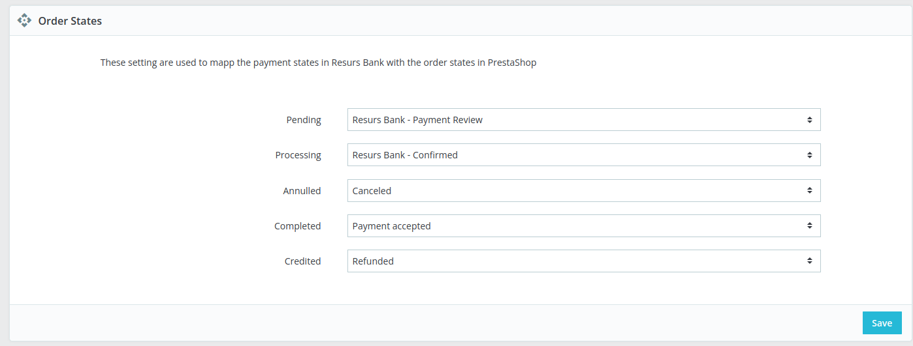

# Status updates and callbacks 
Created by Thomas Tornevall, last modified on 2022-06-07
Orders are very much handled through [callbacks](callbacks) from Resurs.
The way callbacks works has less meaning as of today, even if PrestaShop
has some exceptions for them. When Resurs is sending out a callback, the
order management module will check for the current order status (via
getPayment) instead of the callback type sent from Resurs and set a
order state based on the response. The states are customizable from the
administration panel (as long as you include order management as a
module).

Each of the above states can freely be customized, but is always
installed with preferred defaults. When a callback are received from
Resurs, the libary EComPHP will set an internal state integer, that is
mapped to a state configured from PrestaShop.

