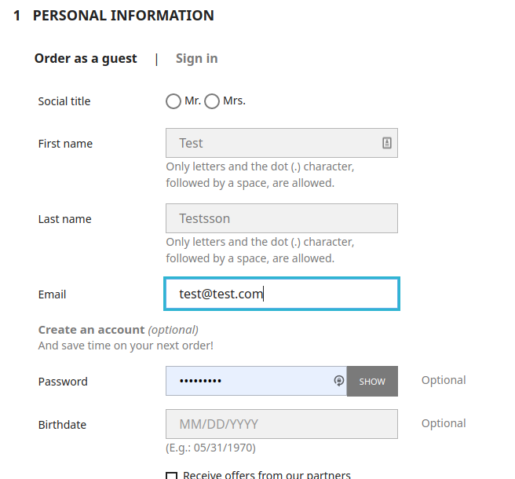

# PrestaShop SimplifiedShopFlow 

*Simplified ShopFlow for PrestaShop is intended to be built as a
stand-alone checkout module for PrestaShop 1.7.7 and above. It is
delivered partially with the help from composer, and it is highly
preferred to install the module with composer. Please see below for
instructions.*

# System requirements
- **PHP 7.3  
  Note: Prior prestashop instances may try to enforce a lower
  requirement than this, so running the plugin with 7.1 will crash your
  site.**
- SSL (preferrably OpenSSL)
- **ext-soap  
  ***XML (SoapClient)*
- Curl or php streams for other communications, regarding rest etc.
- **Are you using nginx? Make sure that you configure the
  buffers/buffer_size to something appropriate (see below) or there may
  be trouble at some point.** We haven't seen this issue in apache
  environments (yet) but in case you see similar problems there, make
  sure that you use the same setup there.
- **Customer phone number is a mandatory** field for payments, so that
  field must be properly configured, so it cannot be ignored**.**

# Installing and uninstalling
Modules can be installed / uninstalled / disabled / enabled separately.
No module can be installed / enabled without Core being installed and
enabled. Any action invoked on the Core module (such as installing it)
will automatically be invoked on all other available Resurs Bank modules
(such as Order Management, Part Payment or Simplified).

### Preferred Installation Method
The preferred installation method is based on PrestaShop composer
builds.

1.  Go to your prestashop root folder.
2.  Depending on your packages you want, run the following commands
    (depends on that you have composer installed!). The package psrbcore
    is required for all the others to work properly. Just keep in mind,
    that you can't just only install the core module.  

    **composer require resursbank/psrbcore**  
    composer require resursbank/psrbordermanagement  
    composer require resursbank/psrbsimplified  
    composer require resursbank/psrbpartpayment
3.  Jump into the prestashop module catalog, choose to install the core
    module. The process is as described in this document very much
    automatic and will - if they are present - also activate
    psrbsimplified, psrbpartpayment and psrbordermanagement.
### Unsupported Installation Method
This is the manual way, which is also stated by PrestaShop as
kind-of-deprecated. As PrestaShop is moving forward to 1.7.8 and beyound
they are also leaving manually unzipping modules, and instead using the
same installation mehod as our above preferred. This method is
unsupported and may not be guaranteed to work properly,

The method though is straight forward.

1.  Start with downloading the bundle package from
    [https://bitbucket.org/resursbankplugins/psrbbundle](https://bitbucket.org/resursbankplugins/psrbbundle)
    (git clone) or
    [https://bitbucket.org/resursbankplugins/psrbbundle/downloads/?tab=downloads](https://bitbucket.org/resursbankplugins/psrbbundle/downloads/?tab=downloads)
    (download zip-package).
2.  Unzip the package and make sure the modules- and vendor package is
    put into your prestashop root. In the end you should have
    \[prestaroot\]/modules/psrbcore, etc and a
    \[prestaroot\]/vendor/resursbank, etc.
3.  Jump into the prestashop module catalog, choose to install the core
    module. The process is as described in this document very much
    automatic and will - if they are present - also activate
    psrbsimplified, psrbpartpayment and psrbordermanagement.

# Upgrading and other "self helping" support
- When upgrading our module, make sure you really run the upgrade
  process (or reset, even if this requires you to reconfigure some parts
  of the modules). By a proper upgrade/reset procedure you will also get
  to register eventually new hooks and features that has been
  implemented since the last release. Without this, your newly upgraded
  plugin will run without all such features.

  
# Developer Notes 

## Forwarding specific errors to front end
The below pull request may be a perfect example of how to forward
specific errors to front page. This makes the plugin, instead of
notifying customers about "something went wrong", render a proper error
message on screen. The excptions being made is API error, which is a bit
more verbose than the standard problems.

[https://bitbucket.org/resursbankplugins/psrbsimplified/pull-requests/54](https://bitbucket.org/resursbankplugins/psrbsimplified/pull-requests/54)

The errors that we want to push forward to screen is the moment where
customers forget or do not enter government id's on the checkout page
for Resurs Bank internal payment methods, which is a requirement. This
starts with [InvalidGovIdException on row
316](https://bitbucket.org/resursbankplugins/psrbsimplified/pull-requests/54#Lsrc/Service/Api.phpT316).
At this moment, we throw a specific exception that can later be
identified as a "verbose point" in the module. We also throws an error
code on each exception so the plugin will be able to handle all errors
(if necessary) based on the code. However, for this case we only pick up
the exeption classname at [the OrderHandler from
getProperOrderException](https://bitbucket.org/resursbankplugins/psrbsimplified/pull-requests/54#Lsrc/Service/OrderHandler.phpT156)
where we can define which of the exceptions that should be handled
specifically eas "customer messages".

## Customer Data Fields
As of 
[P17-226](https://resursbankplugins.atlassian.net/browse/P17-226?src=confmacro) -
Få ordning på setCustomer Done we are changing the way customer data
fields are behaving in the checkout. We usually don't have to collect
both phone and mobile in the checkout steps, and as phone number is the
absolute default in a newly installed PrestaShop store we use the
internal phone-field as the primary target. 
[P17-223](https://resursbankplugins.atlassian.net/browse/P17-223?src=confmacro) -
Do we really need 2 phone numbers on validation? Done and 
[P17-225](https://resursbankplugins.atlassian.net/browse/P17-225?src=confmacro) -
RCO streamline phone numbers Done also includes requests for being more
streamlined in the checkout, the same way as Resurs Checkout.

Instead of always fetching [all required
fields](https://test.resurs.com/docs/display/ecom/General%3A+Integration+development#General:Integrationdevelopment-Thecheckoutandformsthatneedstobefilledin),
we instead try to centralize one of the two requirements by simply
cloning the best value from phone and mobile:

- If phone is empy, use mobile and vice versa.
- If both fields are empty, initiate the checkout form with phone only -
  and ask the customer for this part.
- When running next step (validate.php), we will now set higher priority
  on the entered phone number in the final checkout step and use the one
  entered as both phone and mobile since Resurs still requires a phone
  number. Since shipping tracking is very common today, a majority of
  customers is also said to be using mobile numbers.

To properly handle phone numbers as mandatory, it is highly recommended
to configure the fields in PrestaShop to be enforcing, not optional.


# PrestaShop Simplified: Changes and updates 

## About the RCO module
The prior module that handled Resurs Checkout will over time be replaced
with this new module and is therefore no longer maintained the same way
it has been. There's a few things to think of if you plan to upgrade in
the future.

### Will government ID's be stored in the new module the way it was handled in the old module?
***Yes, but there are changes in the prior behaviour.***

According to
[P17-169](https://resursbankplugins.atlassian.net/browse/P17-169?src=confmacro) -
Hantering av personnummer (möjlighet att fånga dessa med en hook för
försäkringsbolag) Done , the same hook that handled the ability to store
government id's in the platform is still there. It is mostly - as in the
old version - not supported more than by an execution. The hook trigger
itself looks like this and can be found in the rco-module too, the same
way:

```xml
                    Hook::exec(
                        'UpdateResursSsn',
                        [
                            'order' => $order,
                            'vat_number' => $currentResursPayment->customer->governmentId,
                        ]
                    );
```
In the simplified module, this trigger can be triggered multiple times,
depending on the "way in". The trigger itself is placed in one method
that has always a guarantee to run - getSynchronizedAddress(). This
method is called from the moment when bookPayment gets "BOOKED" as
response from Resurs and the moment after bookSignedPayment has been
running. If both events happens to occur, there will also be two calls
to the hook.

Note: Auto debited and finalized orders are only handled on the
UPDATE-callback since there is high risk of race conditions when several
callbacks are sent simultaneously and there's currently no solution for
handle them in order (queue by cron for example), since this method is
more or less a non-standard solution.


# PrestaShop Simplified Described 

The simplified shopflow is from an integration perspective much more
friendlier to apply to PrestaShop than Resurs Checkout since the payment
flow itself does not require much frontend editing. When credentials and
payment methods are in place, it is very much straight forward and this
page explains how. The described flow is based on a multi-step checkout.

1.  Initiallly (at least as guest) you will reach a checkout page where
    you fill in some of your own basic customer information. If you are
    logged in, you will instead of a form to fill in get a list of
    addresses to choose between. At this moment, the plugin is idle.  
    
2.  Next page is a bigger form field where you are entering (and if you
    become a customer also saving) the customer data to use to confirm
    your order.  
    
3.  As a third step you pick a preferred shipping method for where you
    want your products (could be different do digital orders).
4.  At the final step the customer is now about to choose which payment
    method to use in the payment.  
      
    This is where the plugin activates at the first time. In
    psrbsimplified.php, a first hook named paymentOptions is executed
    (as hookPaymentOptions()). This method renders an array with the
    available payment methods in the checkout. The renderer is preparing
    everything necessary to proceed with the payment, like the payment
    method name, action link (validate.php, which very much translates
    to "validate cart to order"). It also renders additional information
    (through setAdditionalInformation() which is used by PaymentOption()
    in prestashop). This function renders the form data that is required
    at Resurs to fulfill the order. The final result of this is, as you
    can see in the screen dump a complete list of payment methods with
    the required form data for each method. There are different forms
    depending on which payment method you are using.
## Placing the order
When customers are placing the order, it redirects the customer to
controllers/front/validate.php, where the purchase process starts. From
the above perspective, the validate.php-link is set in the
PaymentOption() with set setAction()-method.

The first thing that happens in the validation process, is that we
validate all data that is required for an order to be completed in
PrestaShop. There are several exceptions in this part of the code, with
different exception codes depending on what went wrong. If everything
works fine in the postProcess-method, we will pick up the current order
created and extract the order reference from it. This is the reference
being used to create the order within Resurs simplified API.


# Presta-Simplified and translations 

The translation segment of PrestaShop is somehow complex. We are
currently using ecomphp to fetch necessary translations for where they
can be automated. 

The summary is based on
[P17-307](https://resursbankplugins.atlassian.net/browse/P17-307?src=confmacro) -
Synka betalmetodernas texter del 3 Done .


# Status updates and callbacks 
Orders are very much handled through callbacks from Resurs.
The way callbacks works has less meaning as of today, even if PrestaShop
has some exceptions for them. When Resurs is sending out a callback, the
order management module will check for the current order status (via
getPayment) instead of the callback type sent from Resurs and set a
order state based on the response. The states are customizable from the
administration panel (as long as you include order management as a
module).


Each of the above states can freely be customized, but is always
installed with preferred defaults. When a callback are received from
Resurs, the libary EComPHP will set an internal state integer, that is
mapped to a state configured from PrestaShop.


