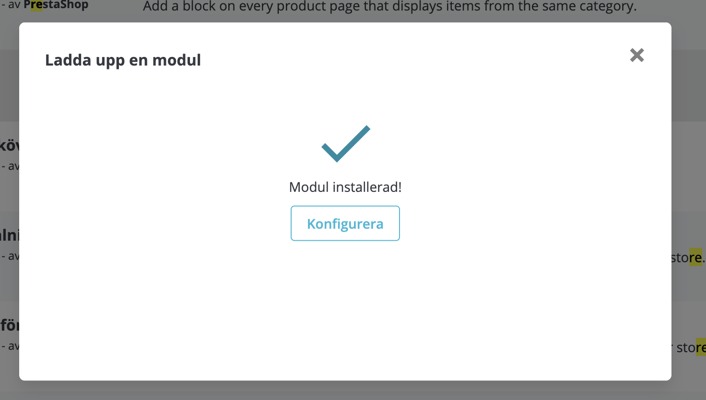
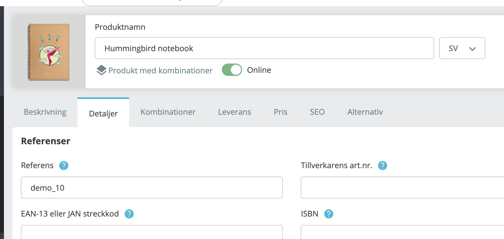
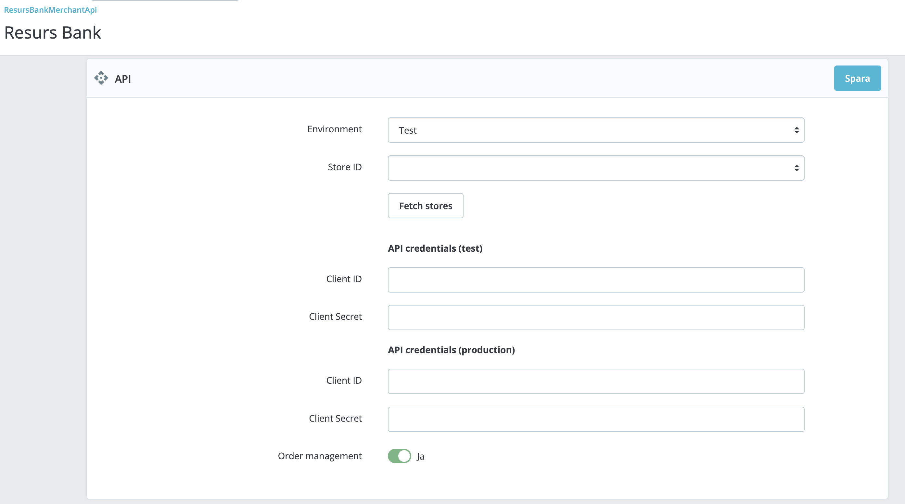
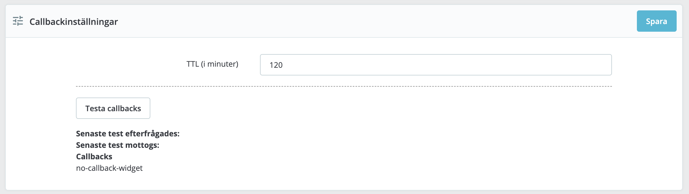
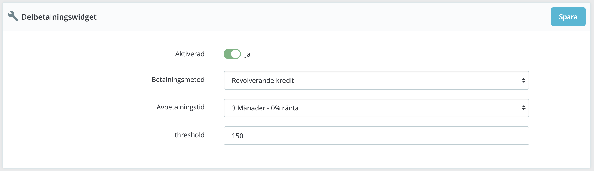
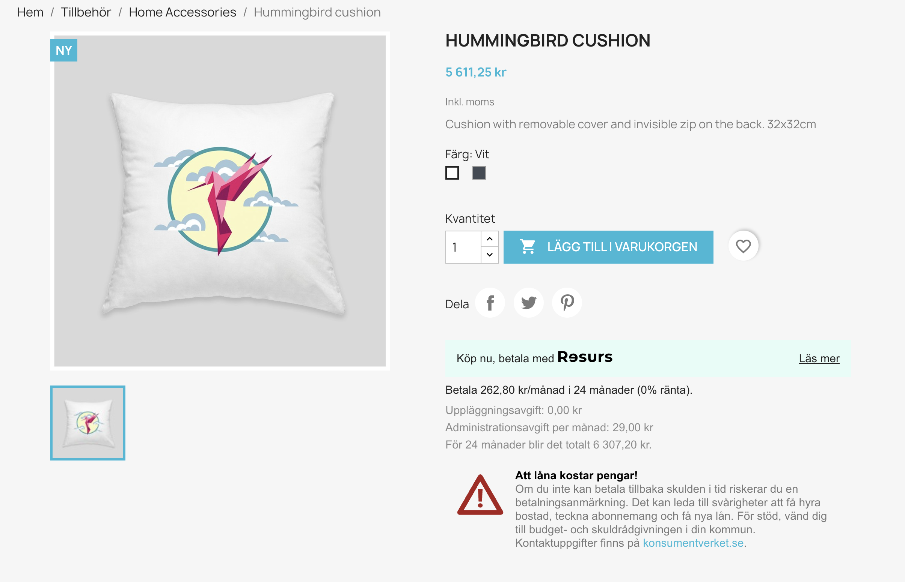
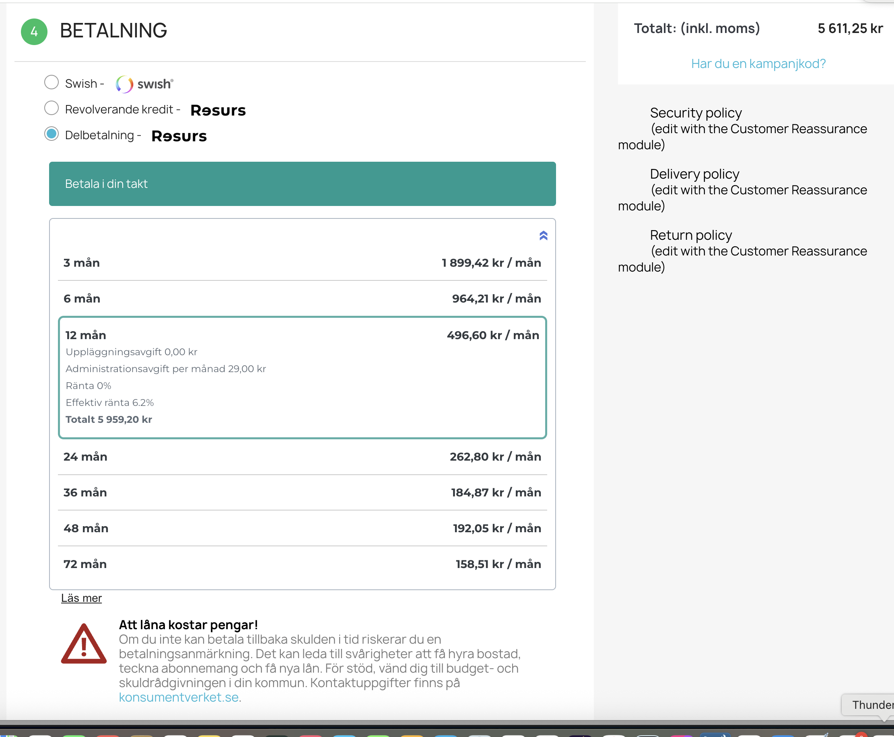
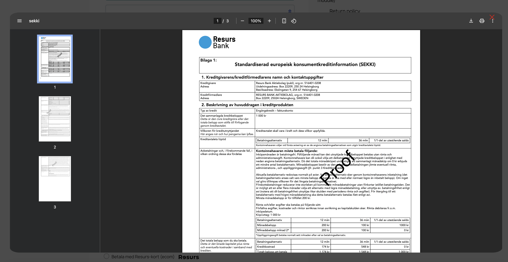

# Resurs Merchant API 2.0 for PrestaShop

## Table of Contents

- [Requirements](#requirements)
- [Installation](#installation)
- [Configuration](#configuration)
- [Usage](#usage)
- [Troubleshooting](#troubleshooting)
- [Support](#support)

## Requirements

- **PHP version:** Minimum PHP 8.1 (note: PrestaShop allows down to PHP 7.2, but this plugin does not support anything
  below 8.1)
- **PrestaShop version:** Tested with PrestaShop 8.2.0 and compatible with versions 8.x and above
- **SSL connectivity:** Required (preferably using OpenSSL)
- **CURL:** ext-curl must be enabled with a minimum version of 7.61.0
- **CURLAUTH_BEARER support:** Required for token-based authentication
- **Decimal precision:** PHP’s default precision setting (`precision=14` in php.ini) is typically sufficient. Raising
  this value too high may result in floating-point rounding errors. It is recommended to use the default setting to
  ensure proper two-decimal rounding behavior.

  **Important for rounding:** Resurs Bank does not support more than two decimal places. Setting your shop to use 0
  decimals (e.g., rounding to whole numbers) may result in critical inconsistencies between displayed totals and amounts
  actually sent to the API. This may cause failed transactions. PrestaShop, like WooCommerce, allows configuration of
  decimal precision - make sure this is set to exactly two decimals for all currencies to ensure compatibility.

## Important Notes

This plugin is currently in active development. It is tested primarily with PrestaShop 8.2.0, which marks a new major
release line following the 1.7.8.x series. PrestaShop chose to move directly to version 8.0.0 to reflect a break in
backwards compatibility and adoption of modern PHP features. Older versions below 1.7 are not supported. Ensure your
environment matches the above requirements, as we do not provide support for legacy configurations.

## Installation and upgrade instructions

There is currently no public PrestaShop Addons marketplace listing for this module. Installation is therefore handled
manually.

To update the plugin, upload a new ZIP file via the same upload interface. PrestaShop will
automatically replace the existing version without needing a manual uninstall. Configuration is preserved unless
breaking changes are introduced. Do not use ZIP archives directly generated by Bitbucket unless you know they contain
all required dependencies - the directory structure in a bitbucket zip is also normally not correctly set up. Only use
the officially provided deployment packages.

The below installation does not cover installation over composer, but uploading the plugin as a zip package. In future
releases, we hope to be able to use PrestaShop marketplace.

### Installation

1. Download the latest prepackaged release of the Resurs Merchant API plugin for PrestaShop (including all dependencies
   and correct folder structure). A dedicated download link will be made available soon.
2. Upload the downloaded ZIP file directly via the PrestaShop Back Office → Modules → Module Manager → "Upload a
   module".
   
3. Once uploaded, the module will appear in the list and can be installed via the "Install" button.
   
4. Start configuring the plugin.

After installation, the module will appear under the "Payment" or "Resurs Bank" section depending on your PrestaShop
version and theme.

# FAQ & General questions

## Detailed configuration information and store configuration

## Figuring out remote ip for whitelisting in firewalls

In test, we sometimes need to whitelist your server's IP address, for example when your server is located in a country
outside the Nordic region.

Normally, it is not very difficult to figure out which IP address needs to be whitelisted. Several online services can
fetch your public IP address, or you can use this command from your server terminal. Example:

```bash
curl https://api.ipify.org/?format=txt
91.198.202.76
```

### Stock Keeping Unit (SKU)

In order for the order management functionality built into the plugin to work as intended, all products sold in your
shop should have a **Product Reference** (SKU equivalent in PrestaShop) configured.

The reference is used as a unique identifier for products and is important when communicating order data to external
systems, including Resurs Bank. Without it, the module may not be able to link order lines correctly.

You can configure the Product Reference by editing a product in the back office:

1. Go to **Catalog → Products**.
2. Click on a product to edit it.
3. Under the **Details** tab, locate the **Reference** field.
4. Enter a unique reference code for the product (e.g., `SKU12345`).



Make sure this field is populated for **all** products, including product variants if applicable.

### Number of decimals

Resurs Bank does not support more than two decimal places in monetary transactions. To ensure API compatibility, all
pricing in your PrestaShop installation should be configured to use exactly two decimals.

While PrestaShop allows modification of currency formatting, setting the decimal count to `0` (whole numbers) can result
in **critical rounding discrepancies**. In particular, inconsistencies may occur between what the customer sees and what
is actually sent to Resurs Bank's API. This can cause:

* Mismatched totals between frontend and backend
* Rejected or failed transactions from the payment gateway
* Incorrect tax or discount applications due to accumulated rounding errors

To avoid this:

1. Go to **International → Localization → Currencies**
2. Edit each active currency
3. Set **Decimals** to `2` and save

In addition to this, PrestaShop allows you to configure **how** values are rounded. You should validate the rounding
behavior used in your shop by going to:

1. **Shop Parameters → General**
2. Scroll to the **Rounding mode** setting
3. Select **Round up away from zero when the value is ≥ 0.5** (or equivalent wording in your language)

This rounding mode ensures that a value like `42.555` becomes `42.56`, which aligns with Resurs Bank’s expectations.

> **Note:** Even if you configure PrestaShop to show prices with 0 decimals, internal calculations often still use float
> values. Locale rendering (via CLDR) and the selected rounding mode can introduce unexpected behavior – especially in
> shops with tax-inclusive pricing.

Ensure your store is consistently using **two decimals** and an appropriate **rounding mode** to maintain predictable
and Resurs-compliant payment behavior.

## API Settings

This manual provides detailed instructions on how to manage credentials in the PrestaShop admin view for seamless
functionality between environments and to ensure proper handling of user credentials.

### Managing API Credentials in PrestaShop



To connect your PrestaShop store to Resurs Bank, you must enter valid API credentials. These credentials are environment-specific (Test or Production) and required for communication with the Resurs API.

#### 1. Choosing Environment

Use the **Environment** dropdown to select either `Test` or `Production`. This determines which credentials will be active and where API requests are sent.

#### 2. Entering and Saving Credentials

> **Note:** For security reasons, the Client Secret field will never display the entered value – neither as plain text nor as masked characters. You will need to re-enter it each time you change credentials.

Each environment has its own **Client ID** and **Client Secret** fields. Before you can fetch any store data, you **must save** the credentials:

- Copy credentials exactly as provided by Resurs
- Enter both **Client ID** and **Client Secret**
- Click the **Save** button in the top-right corner

Failure to save before proceeding could result in connection errors when attempting to fetch store data.

#### 3. Fetching Store Data

Once your credentials have been saved successfully, click the **Fetch Stores** button to retrieve available **Store IDs** from the selected environment. In most cases, only one store will be listed. Select the appropriate store, then save again.

If the connection is successful, the configuration will expand to show available payment methods for the selected store. It should look something like this:


#### 4. Switching Between Environments

When switching environments:

1. Select the target environment (`Test` or `Production`)
2. Enter and save the respective credentials
3. Use **Fetch Stores** to retrieve valid store data

Store IDs are scoped per environment and must be fetched anew after each switch.

#### 5. Order Management Toggle

The **Order management** toggle enables the plugin's internal handling of order statuses, including:

- Automatic annulments
- Captures
- Refunds

Set this to "Yes" if you want PrestaShop to communicate with the Resurs API during the full order lifecycle.

### Callback Handling and Order States

Callbacks are server-to-server notifications sent by Resurs Bank whenever a payment changes state (e.g., captured, frozen, cancelled). These are essential for synchronizing the current order status in PrestaShop with the actual state of the transaction in the Resurs system.



#### Order status mapping

The Resurs PrestaShop plugin introduces several **custom order statuses**, installed directly into the database during module installation. These include:

- `PS_OS_RESURSBANK_REDIRECTED`: Customer was redirected to Resurs Bank.
- `PS_OS_RESURSBANK_PENDING`: Payment is initiated but not yet authorized.
- `PS_OS_RESURSBANK_PAYMENT_REVIEW`: Payment is frozen or placed under manual review.
- `PS_OS_RESURSBANK_PAID`: Payment was successfully captured and the order is marked as paid.

In addition to these, the plugin also utilizes native PrestaShop statuses:

- `PS_OS_CANCELED`: Payment cancelled or order manually aborted.
- `PS_OS_REFUND`: Order was refunded via the Resurs API.

These status codes are mapped programmatically based on Resurs payment states such as `isCancelled`, `isFrozen`, `isCaptured`, and `canCapture`.

#### Persistence of custom statuses

Even if the module is uninstalled, the custom statuses (those beginning with `PS_OS_RESURSBANK`) are **not removed** from the database. This ensures consistency and prevents orphaned status references in historical orders.

When reinstalling the module, existing statuses will be reused rather than duplicated.

This behavior guarantees safe uninstallation and reinstallation without corrupting order history or status integrity.

#### Testing callback handling

If callbacks are not received, order states will not update correctly, which can result in stuck transactions, unconfirmed payments, or missed refunds. This step is critical to verify the communication path between Resurs Bank and your store.

Clicking the **Test Callbacks** button triggers a simulated callback request. The system will provide visual confirmation:

The configuration panel includes a **Test Callbacks** button, which simulates a callback request. It logs timestamps for:

- When the callback test was initiated
- When (or if) a response was received

Ensure your shop is externally accessible if you're testing from a local environment. Tools like Ngrok can help expose your local server to receive callbacks correctly.


If the callback is successfully received, the timestamp will appear under “Senaste test mottogs”:


If the received-field remains empty after initiating the test, the callback could not be delivered or processed – and order handling may fail as a result. if you're testing from a local environment. Tools like Ngrok can help expose your local server to receive callbacks correctly.

For full details on callback types and expected payloads, refer to the [Resurs Merchant API documentation](https://merchant-api.integration.resurs.com/docs/v2/merchant_payments_v2/options#callbacks). You can also take a look on the [FAQ, regarding firewall settings for callbacks](https://developers.resurs.com/faq/#how-do-i-configure-my-firewallnetwork).

### Part Payment Widget

This feature allows your store to display a **part payment calculator widget** on individual product pages. The widget provides customers with a visual preview of estimated monthly installments based on the selected terms.

Once enabled, the widget will show the selected installment method and duration, along with an optional threshold to control display behavior.

#### Settings Overview



- **Aktiverad**: Enables or disables the widget globally.
- **Betalningsmetod**: The specific payment method from Resurs (e.g., Delbetalning) that should be used for widget calculation.
- **Avbetalningstid**: Defines the installment period (in months or predefined intervals).
- **Threshold**: Minimum cart amount required for the widget to appear. If the product price is below this threshold, the widget is not shown.

#### Frontend Behavior

Once configured and enabled, the widget will:

- Appear on product pages where the price exceeds the set threshold
- Include a clickable modal element that opens detailed terms and pricing (via iframe)

#### Part Payment Widget Examples

##### Product page



##### In the checkout



#### When the modal is opened:



> **Note:** The modal iframe is provided by Resurs Bank and is localized based on your customer’s language and region settings.
