# Resurs Merchant API 2.0 for PrestaShop

## Table of Contents

- [Requirements](#requirements)
- [Installation](#installation)
- [Configuration](#configuration)
- [Usage](#usage)
- [Troubleshooting](#troubleshooting)
- [Support](#support)

## Requirements

- **PHP version:** Minimum PHP 8.1 (note: PrestaShop allows down to PHP 7.2, but this plugin does not support anything
  below 8.1)
- **PrestaShop version:** Tested with PrestaShop 8.2.0 and compatible with versions 8.x and above
- **SSL connectivity:** Required (preferably using OpenSSL)
- **CURL:** ext-curl must be enabled with a minimum version of 7.61.0
- **CURLAUTH_BEARER support:** Required for token-based authentication
- **Decimal precision:** PHP’s default precision setting (`precision=14` in php.ini) is typically sufficient. Raising
  this value too high may result in floating-point rounding errors. It is recommended to use the default setting to
  ensure proper two-decimal rounding behavior.

  **Important for rounding:** Resurs Bank does not support more than two decimal places. Setting your shop to use 0
  decimals (e.g., rounding to whole numbers) may result in critical inconsistencies between displayed totals and amounts
  actually sent to the API. This may cause failed transactions. PrestaShop, like WooCommerce, allows configuration of
  decimal precision - make sure this is set to exactly two decimals for all currencies to ensure compatibility.

## Important Notes

This plugin is currently in active development. It is tested primarily with PrestaShop 8.2.0, which marks a new major
release line following the 1.7.8.x series. PrestaShop chose to move directly to version 8.0.0 to reflect a break in
backwards compatibility and adoption of modern PHP features. Older versions below 1.7 are not supported. Ensure your
environment matches the above requirements, as we do not provide support for legacy configurations.

## Installation and upgrade instructions

There is currently no public PrestaShop Addons marketplace listing for this module. Installation is therefore handled
manually.

To update the plugin, upload a new ZIP file via the same upload interface. PrestaShop will
automatically replace the existing version without needing a manual uninstall. Configuration is preserved unless
breaking changes are introduced. Do not use ZIP archives directly generated by Bitbucket unless you know they contain
all required dependencies - the directory structure in a bitbucket zip is also normally not correctly set up. Only use
the officially provided deployment packages.

The below installation does not cover installation over composer, but uploading the plugin as a zip package. In future
releases, we hope to be able to use PrestaShop marketplace.

### Installation

1. Download the latest prepackaged release of the Resurs Merchant API plugin for PrestaShop (including all dependencies
   and correct folder structure). A dedicated download link will be made available soon.
2. Upload the downloaded ZIP file directly via the PrestaShop Back Office → Modules → Module Manager → "Upload a
   module".
   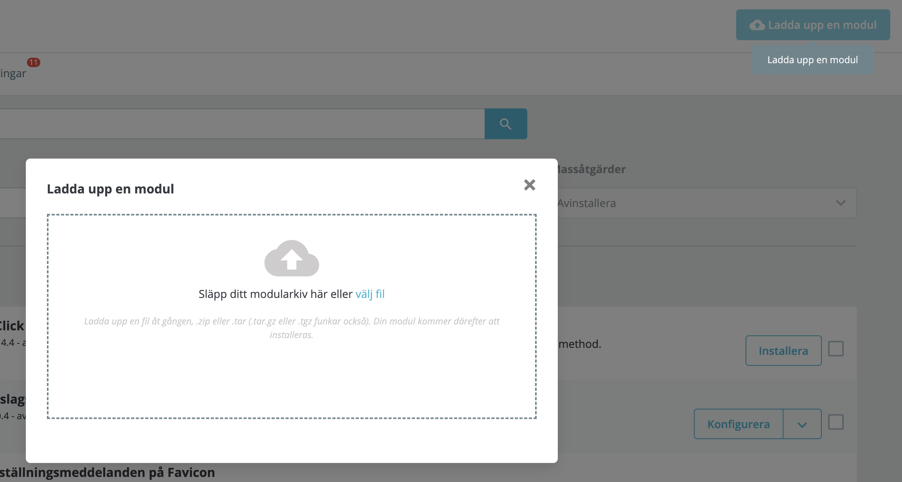
3. Once uploaded, the module will appear in the list and can be installed via the "Install" button.
   
4. Start configuring the plugin.

After installation, the module will appear under the "Payment" or "Resurs Bank" section depending on your PrestaShop
version and theme.

# FAQ & General questions

## Detailed configuration information and store configuration

## Figuring out remote ip for whitelisting in firewalls

In test, we sometimes need to whitelist your server's IP address, for example when your server is located in a country
outside the Nordic region.

Normally, it is not very difficult to figure out which IP address needs to be whitelisted. Several online services can
fetch your public IP address, or you can use this command from your server terminal. Example:

```bash
curl https://api.ipify.org/?format=txt
91.198.202.76
```

### Stock Keeping Unit (SKU)

In order for the order management functionality built into the plugin to work as intended, all products sold in your
shop should have a **Product Reference** (SKU equivalent in PrestaShop) configured.

The reference is used as a unique identifier for products and is important when communicating order data to external
systems, including Resurs Bank. Without it, the module may not be able to link order lines correctly.

You can configure the Product Reference by editing a product in the back office:

1. Go to **Catalog → Products**.
2. Click on a product to edit it.
3. Under the **Details** tab, locate the **Reference** field.
4. Enter a unique reference code for the product (e.g., `SKU12345`).


Make sure this field is populated for **all** products, including product variants if applicable.

### Number of decimals

Resurs Bank does not support more than two decimal places in monetary transactions. To ensure API compatibility, all
pricing in your PrestaShop installation should be configured to use exactly two decimals.

While PrestaShop allows modification of currency formatting, setting the decimal count to `0` (whole numbers) can result
in **critical rounding discrepancies**. In particular, inconsistencies may occur between what the customer sees and what
is actually sent to Resurs Bank's API. This can cause:

* Mismatched totals between frontend and backend
* Rejected or failed transactions from the payment gateway
* Incorrect tax or discount applications due to accumulated rounding errors

To avoid this:

1. Go to **International → Localization → Currencies**
2. Edit each active currency
3. Set **Decimals** to `2` and save

In addition to this, PrestaShop allows you to configure **how** values are rounded. You should validate the rounding
behavior used in your shop by going to:

1. **Shop Parameters → General**
2. Scroll to the **Rounding mode** setting
3. Select **Round up away from zero when the value is ≥ 0.5** (or equivalent wording in your language)

This rounding mode ensures that a value like `42.555` becomes `42.56`, which aligns with Resurs Bank’s expectations.

> **Note:** Even if you configure PrestaShop to show prices with 0 decimals, internal calculations often still use float
> values. Locale rendering (via CLDR) and the selected rounding mode can introduce unexpected behavior – especially in
> shops with tax-inclusive pricing.

Ensure your store is consistently using **two decimals** and an appropriate **rounding mode** to maintain predictable
and Resurs-compliant payment behavior.

## API Settings

This manual provides detailed instructions on how to manage credentials in the PrestaShop admin view for seamless
functionality between environments and to ensure proper handling of user credentials.

### Managing API Credentials in PrestaShop


To connect your PrestaShop store to Resurs Bank, you must enter valid API credentials. These credentials are
environment-specific (Test or Production) and required for communication with the Resurs API.

#### 1. Choosing Environment

Use the **Environment** dropdown to select either `Test` or `Production`. This determines which credentials will be
active and where API requests are sent.

#### 2. Entering and Saving Credentials

> **Note:** For security reasons, the Client Secret field will never display the entered value – neither as plain text
> nor as masked characters. You will need to re-enter it each time you change credentials.

Each environment has its own **Client ID** and **Client Secret** fields. Before you can fetch any store data, you **must
save** the credentials:

- Copy credentials exactly as provided by Resurs
- Enter both **Client ID** and **Client Secret**
- Click the **Save** button in the top-right corner

Failure to save before proceeding could result in connection errors when attempting to fetch store data.

#### 3. Fetching Store Data

Once your credentials have been saved successfully, click the **Fetch Stores** button to retrieve available **Store IDs
** from the selected environment. In most cases, only one store will be listed. Select the appropriate store, then save
again.

If the connection is successful, the configuration will expand to show available payment methods for the selected store.
It should look something like this:

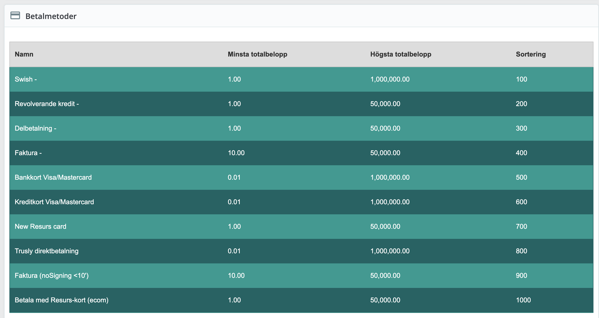

#### 4. Switching Between Environments

When switching environments:

1. Select the target environment (`Test` or `Production`)
2. Enter and save the respective credentials
3. Use **Fetch Stores** to retrieve valid store data

Store IDs are scoped per environment and must be fetched anew after each switch.

#### 5. Order Management Toggle

The **Order management** toggle enables the plugin's internal handling of order statuses, including:

- Automatic annulments
- Captures
- Refunds

Set this to "Yes" if you want PrestaShop to communicate with the Resurs API during the full order lifecycle.

### Callback Handling and Order States

Callbacks are server-to-server notifications sent by Resurs Bank whenever a payment changes state (e.g., captured,
frozen, cancelled). These are essential for synchronizing the current order status in PrestaShop with the actual state
of the transaction in the Resurs system.


#### Order status mapping

The Resurs PrestaShop plugin introduces several **custom order statuses**, installed directly into the database during
module installation. These include:

- `PS_OS_RESURSBANK_REDIRECTED`: Customer was redirected to Resurs Bank.
- `PS_OS_RESURSBANK_PENDING`: Payment is initiated but not yet authorized.
- `PS_OS_RESURSBANK_PAYMENT_REVIEW`: Payment is frozen or placed under manual review.
- `PS_OS_RESURSBANK_PAID`: Payment was successfully captured and the order is marked as paid.

In addition to these, the plugin also utilizes native PrestaShop statuses:

- `PS_OS_CANCELED`: Payment cancelled or order manually aborted.
- `PS_OS_REFUND`: Order was refunded via the Resurs API.

These status codes are mapped programmatically based on Resurs payment states such
as `isCancelled`, `isFrozen`, `isCaptured`, and `canCapture`.

#### Persistence of custom statuses

Even if the module is uninstalled, the custom statuses (those beginning with `PS_OS_RESURSBANK`) are **not removed**
from the database. This ensures consistency and prevents orphaned status references in historical orders.

When reinstalling the module, existing statuses will be reused rather than duplicated.

This behavior guarantees safe uninstallation and reinstallation without corrupting order history or status integrity.

#### Testing callback handling

If callbacks are not received, order states will not update correctly, which can result in stuck transactions,
unconfirmed payments, or missed refunds. This step is critical to verify the communication path between Resurs Bank and
your store.

Clicking the **Test Callbacks** button triggers a simulated callback request. The system will provide visual
confirmation:

The configuration panel includes a **Test Callbacks** button, which simulates a callback request. It logs timestamps
for:

- When the callback test was initiated
- When (or if) a response was received

Ensure your shop is externally accessible if you're testing from a local environment. Tools like Ngrok can help expose
your local server to receive callbacks correctly.

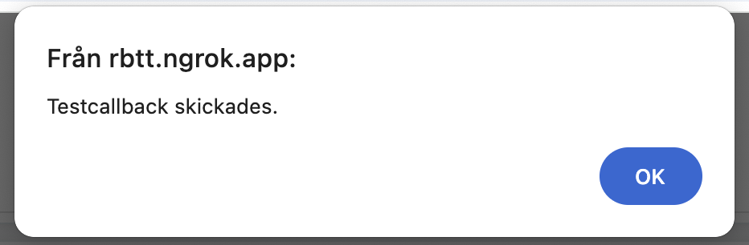

If the callback is successfully received, the timestamp will appear under “Senaste test mottogs”:

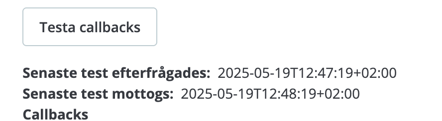

If the received-field remains empty after initiating the test, the callback could not be delivered or processed – and
order handling may fail as a result. if you're testing from a local environment. Tools like Ngrok can help expose your
local server to receive callbacks correctly.

For full details on callback types and expected payloads, refer to
the [Resurs Merchant API documentation](https://merchant-api.integration.resurs.com/docs/v2/merchant_payments_v2/options#callbacks).
You can also take a look on
the [FAQ, regarding firewall settings for callbacks](https://developers.resurs.com/faq/#how-do-i-configure-my-firewallnetwork).

### Part Payment Widget

This feature allows your store to display a **part payment calculator widget** on individual product pages. The widget
provides customers with a visual preview of estimated monthly installments based on the selected terms.

Once enabled, the widget will show the selected installment method and duration, along with an optional threshold to
control display behavior.

#### Settings Overview


- **Aktiverad**: Enables or disables the widget globally.
- **Betalningsmetod**: The specific payment method from Resurs (e.g., Delbetalning) that should be used for widget
  calculation.
- **Avbetalningstid**: Defines the installment period (in months or predefined intervals).
- **Threshold**: Minimum cart amount required for the widget to appear. If the product price is below this threshold,
  the widget is not shown.

#### Frontend Behavior

Once configured and enabled, the widget will:

- Appear on product pages where the price exceeds the set threshold
- Include a clickable modal element that opens detailed terms and pricing (via iframe)

#### Part Payment Widget Examples

##### Product page


##### In the checkout


#### When the modal is opened:


> **Note:** The modal iframe is provided by Resurs Bank and is localized based on your customer’s language and region
> settings.

### Purchasing with the new Merchant API

The Merchant API provides a robust and structured sequence, designed to align with platform behavior while introducing
tighter control of payment and status flow.This ensures reliable transaction tracking, both client- and server-side.

The purchase procedure, as handled through the PrestaShop module, follows this order:

1. **Order Initiation**

- Customer selects a payment method and clicks the final **Place Order** button.
- The initial order is created in PrestaShop with a temporary status (usually "redirected" or "pending").

2. **Resurs Integration Begins**

- The Resurs plugin takes over: stock validation is confirmed, and the API request to Resurs is initiated.
- Customer is redirected to Resurs’ authentication/signing portal, where identity verification or credit scoring may
  take place depending on method and risk level.

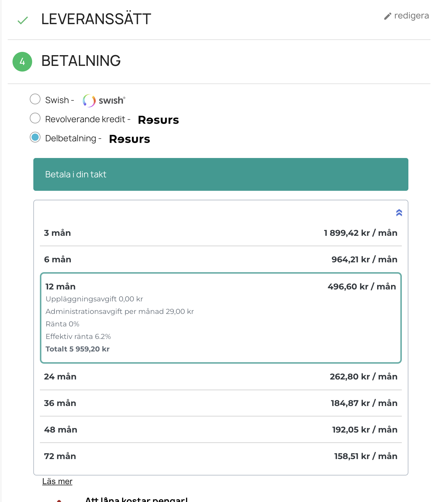
3. **Payment Confirmation**

- Upon completing the external flow, Resurs either:
  - Accepts the payment (order moves to *Paid* status)
  - Rejects the payment (order is *Cancelled*)
  - Freezes the payment for later manual or automatic decision (order becomes *Under Review*)

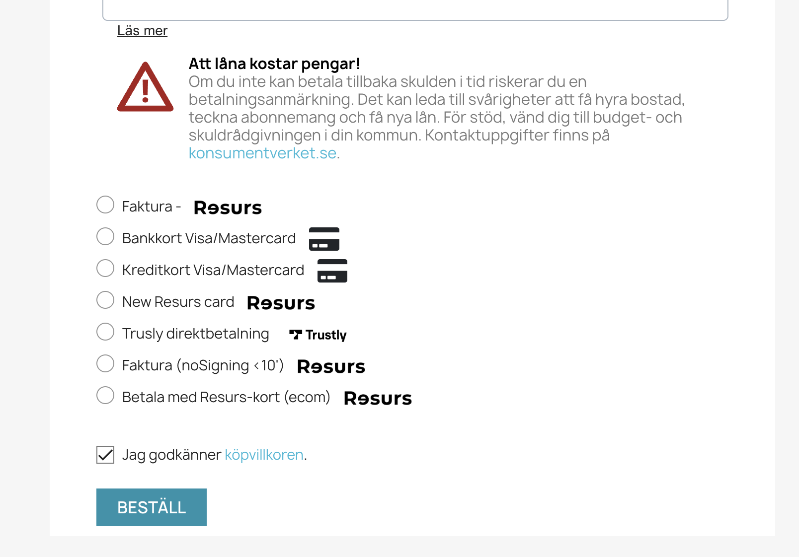
4. **Redirect & Finalization**

- Customer is sent back to the shop’s **order confirmation** page (thank you page) or to a **failure** page.
- The PrestaShop module finalizes local order data (payment info, invoice references, etc).

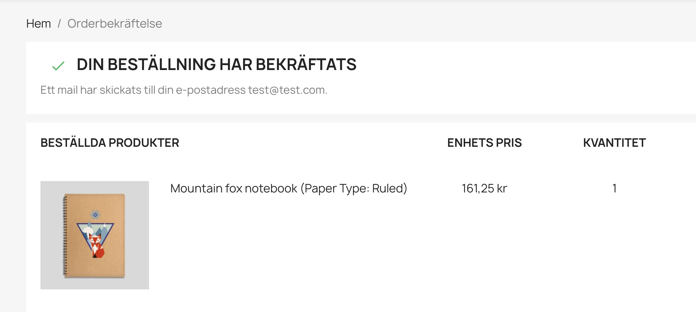
5. **Callbacks for Failover Safety**

- Even if the customer closes the browser or loses connection, **callbacks** from Resurs ensure that the correct order
  state is enforced.
- The order may be updated after redirect based on the callback state, preventing inconsistency.

> **Note:** All status transitions are driven by a combination of real-time events and Resurs callbacks, and are mapped
> to the PrestaShop custom states described in
> the [Callback Handling and Order States](#callback-handling-and-order-states) section.

This flow guarantees that order creation, payment initiation, and confirmation remain synchronized—even if the customer
never returns to the store after authorization.

### Order Management

When an order is placed and processed through the Resurs plugin, it becomes visible in the PrestaShop order editor interface. The interface is divided into multiple sections, with the Resurs-specific payment information highlighted in green to differentiate it from native order details.

#### Order Overview (Top Section)

The top section of the interface displays core order information:

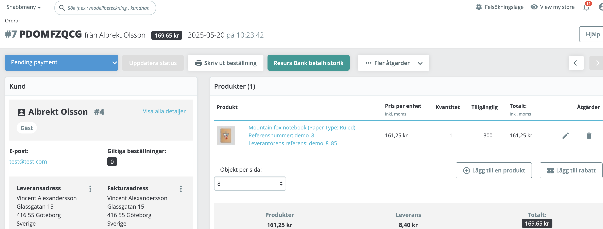

- Order number and customer identity
- Total order amount
- Order creation date and current status (e.g., *Pending Payment*)
- Order controls including "Update Status", "Print", and the Resurs Bank history button

#### Payment Details (Bottom Section)

Scroll down to access the payment data retrieved directly from Resurs Bank:

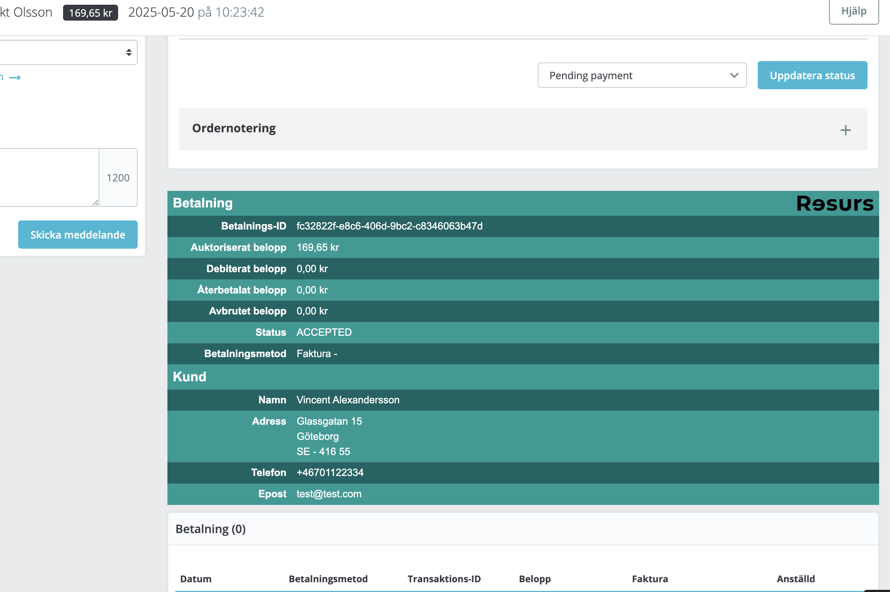

This area includes:

- Payment ID from Resurs
- Authorized amount, captured amount, and refunded/voided totals
- Current Resurs payment status (e.g., *ACCEPTED*)
- Payment method used (e.g., Faktura, Delbetalning, etc.)
- Customer billing data synchronized from the payment

If discrepancies occur (e.g., payment accepted at Resurs but still shown as pending in PrestaShop), always start by checking the status in this panel.

> **Note:** Clicking the "Resurs Bank betalhistorik" button will open detailed payment history including capture/refund events, where applicable.

#### Managing Orders

From the PrestaShop order editor, additional actions related to Resurs orders are available under the **Fler åtgärder** (More actions) dropdown menu:

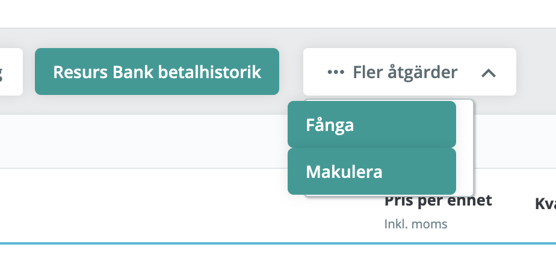

Here, you will typically find:

- **Fånga** – Used to capture an authorized payment. This is relevant for payment methods that support delayed capture (e.g., invoice or part payment).
- **Makulera** – Used to cancel a payment that has been authorized but not yet captured. Canceling sends a void request to Resurs and updates the order status accordingly.

> **Note:** Partial capture is not supported in this version of the plugin. The entire order amount must be captured at once.

> **However:** You can still modify the order through the Merchant API using a "modify" operation (PSMAPI-26), which performs a workaround by canceling the entire original order and re-creating it with adjusted order lines. This approach allows for flexibility but is not a true partial capture.

Only orders with the correct current status (such as *Pending Payment* or *Authorized*) will show these options. Once an order is captured or canceled, these actions will be disabled or removed from the list.

After capturing the payment, the order view will reflect the updated state and display a confirmation banner:

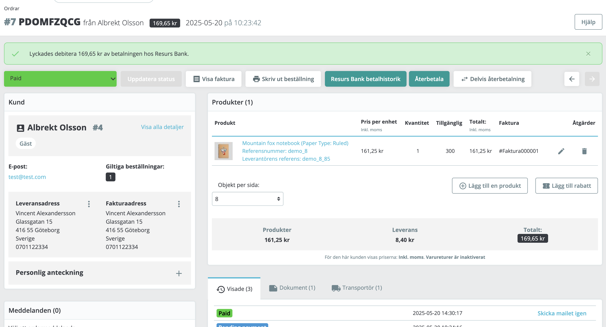

If a full or partial refund is performed successfully, it will be reflected in the same interface:

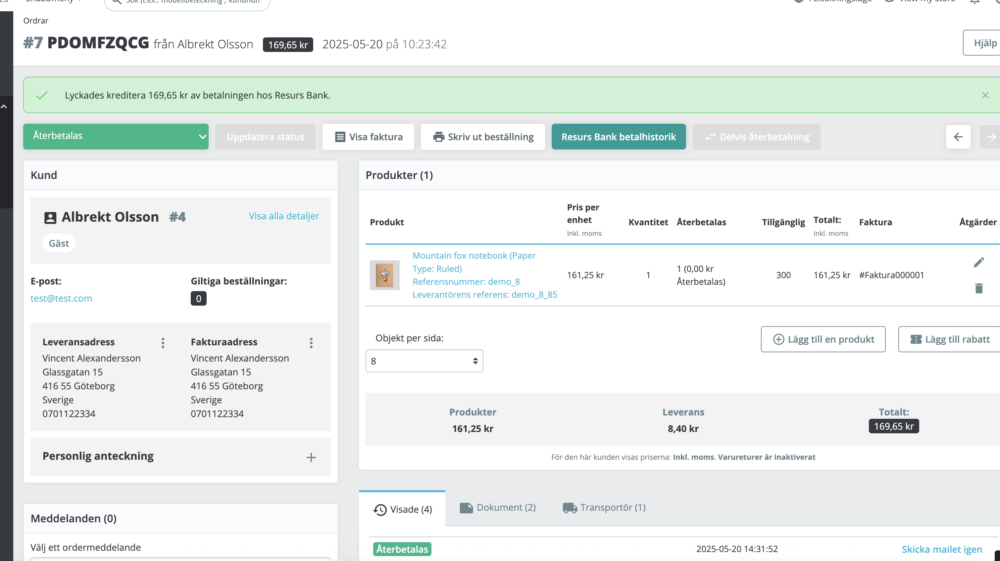

Each payment operation is logged and made available in the payment lifecycle view. For example, a successful refund flow will be recorded and shown:

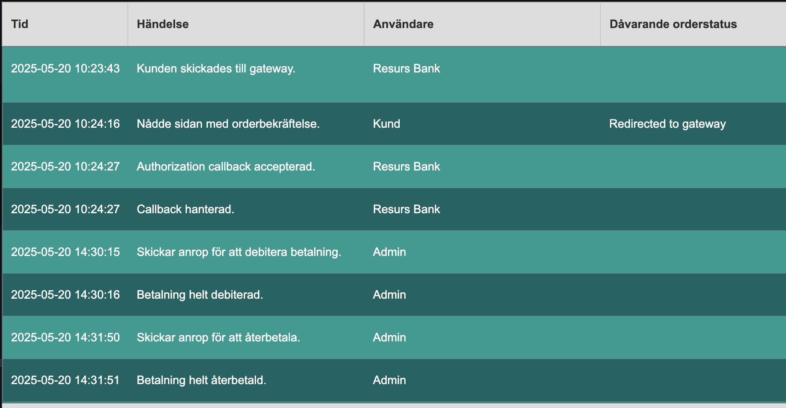

> Always ensure that the order status is synchronized with Resurs Bank before taking manual actions.

If an order is cancelled successfully using the **Makulera** function, the editor will reflect the updated status and show a confirmation message:

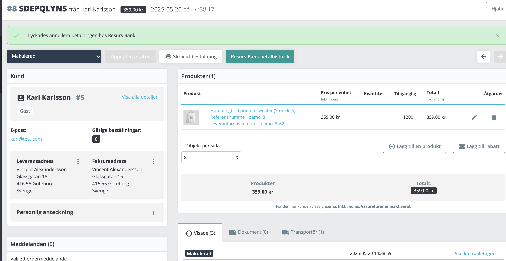

---

#### Resurs Payment History

By clicking the **Resurs Bank betalhistorik** button from the order view, you can access a detailed log of each event in the payment lifecycle:

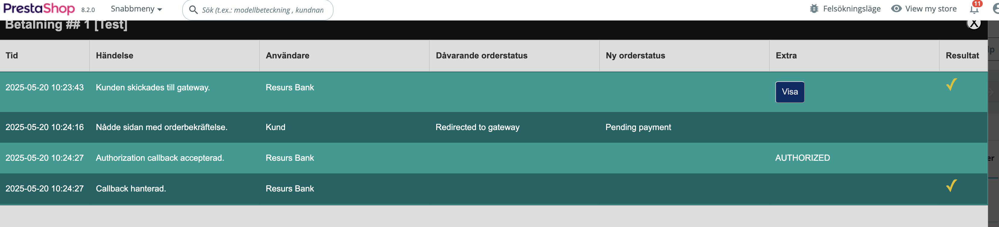

Each row includes:

- Timestamp of the event
- Description of the action (e.g., customer redirected, callback accepted)
- Actor (e.g., customer, Resurs Bank, admin)
- Status transition (previous → new order status)
- Technical flags such as "AUTHORIZED" for payment status

This log is helpful when debugging flow issues, such as orders stuck in incorrect states or unreceived callbacks.

> **Note:** If the callback is missing here or appears late, check the callback configuration and verify that your shop is reachable externally via HTTPS.

# Troubleshooting and error handling

From time to time, you'll need to handle problems with the plugin. Before contacting support, verify that your
environment meets the expected requirements and that the configuration is complete.

## Support Information Panel

The module includes a **Support Information** panel that gives you an overview of your technical environment:

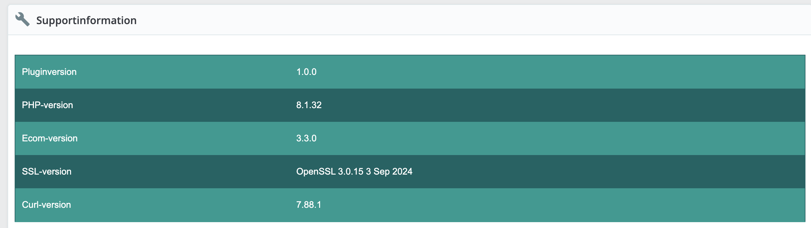

It displays:

- Plugin version
- PHP version
- Resurs Ecom library version
- OpenSSL version (used for encrypted communications)
- cURL version (used for API transport)

If you're reporting a bug or issue, always include a screenshot or text dump of this section.

## Enabling Logging in PrestaShop

The Resurs plugin also includes built-in logging functionality specifically for PrestaShop. Logging is **disabled by
default** to avoid issues on systems where file writing permissions may be restricted.

To enable logging:

1. Go to the **Advanced Settings** section of the plugin configuration.
2. Toggle **Loggning aktiverad** to "Ja".
3. The default log file path is:

   `_PS_ROOT_DIR_/var/logs/ecom.log`

   Ensure that this path is writable by the PHP process running your store.

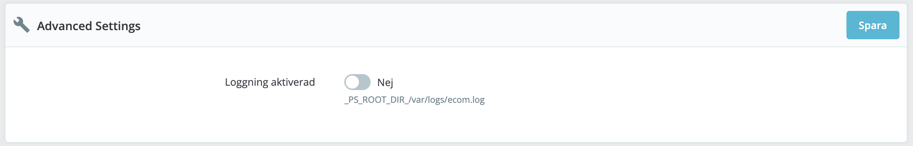

> Once activated, logs will be written to the specified file. These logs contain information about API communication,
> errors, and callbacks.

If no logs appear after enabling logging, double-check file permissions and verify that errors are actually occurring
that would trigger entries.** On PrestaShop, logs are usually directed to the filesystem or error logs, depending on
server setup. Make sure PHP has permission to write to the target directory.

Always verify that the log file is writable and regularly rotated if used in production environments.
