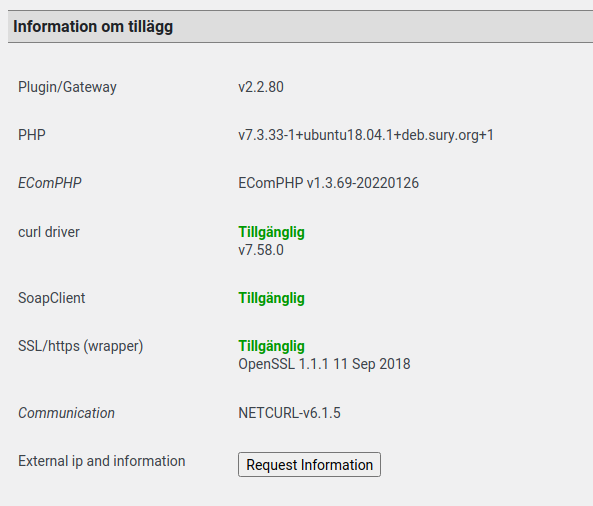
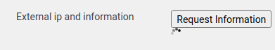
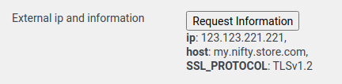

# Figuring out remote ip for whitelisting 
In test we sometimes need to whitelist your server ip address, for
example when your server resides in a country that is not based in the
nordic regions.

Normally it is not very hard to figure out which ip address that has to
be whitelisted. There are many services you can use on the internet to
fetch the proper address, or you could simply run a console base command
like this from your server:

```xml
curl https://ipv4.netcurl.org/ip.php
192.168.1.198
```
And your server's ip address will reveal instantly.

> Feature is for v2.2-series onlyThe MAPI plugin don't have the
> described features below included.

## Version 2.2-series
From plugin version 2.2.80 we've added a feature that handles this
resolving for you. Go to your Resurs Bank main admin panel (the one
where you enter your credentials) and scroll to the bottom of the page.
You will see something like this:



As you can see, there's a button saygin "Request Information". Doing
this will enable (unless there is javascript problems on your page, or
your server has blocked access to the internet) a spinner:



Shortly after this something like this will reveal in that section:



The data that shows up on the screen is the data we need, to whitelist
your ip address in our end.

