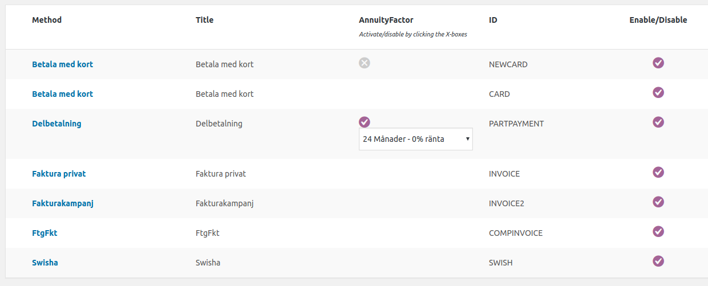
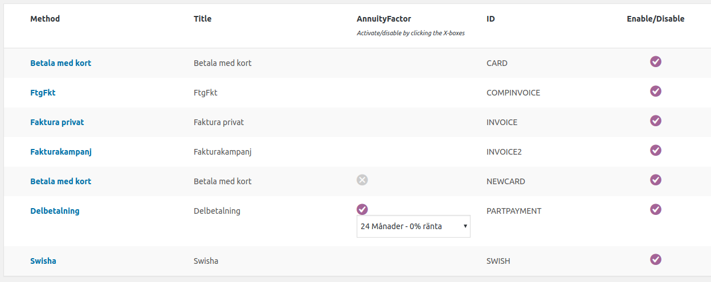

# Hooks/filters v2.2 (and core tweaks) 
Created by Thomas Tornevall, last modified on 2022-04-07
- [Filter: Sending storeId into the
  payload](#Hooks/filtersv2.2(andcoretweaks)-Filter:SendingstoreIdintothepayload)
- [Filter: Handling of payment methods prefix
  paths](#Hooks/filtersv2.2(andcoretweaks)-Filter:Handlingofpaymentmethodsprefixpaths)
- [Filter: Sort order of payment methods in
  wp-admin](#Hooks/filtersv2.2(andcoretweaks)-Filter:Sortorderofpaymentmethodsinwp-admin)
- [Filter: Part payment widget
  string](#Hooks/filtersv2.2(andcoretweaks)-Filter:Partpaymentwidgetstring)
- [Action: Order
  info](#Hooks/filtersv2.2(andcoretweaks)-Action:Orderinfo)
- [Action: Handling
  sessions](#Hooks/filtersv2.2(andcoretweaks)-Action:Handlingsessions)
- [Partial refunds (on price level) -
  resurs_refund_price_override](#Hooks/filtersv2.2(andcoretweaks)-Partialrefunds(onpricelevel)-resurs_refund_price_override)
- [Front end hooks for country
  changes](#Hooks/filtersv2.2(andcoretweaks)-Frontendhooksforcountrychanges)

[Core Tweaks](#Hooks/filtersv2.2(andcoretweaks)-CoreTweaks)
- [The old row editor for partial annul/crediting is no longer
  available](#Hooks/filtersv2.2(andcoretweaks)-Theoldroweditorforpartialannul/creditingisnolongeravailable)
- [Performance issues and plugin breaks within wp-admin
  (2.2.24+)](#Hooks/filtersv2.2(andcoretweaks)-Performanceissuesandpluginbreakswithinwp-admin(2.2.24+))

[Settable advanced
flags](#Hooks/filtersv2.2(andcoretweaks)-Settableadvancedflags)
- [GIT_BIN](#Hooks/filtersv2.2(andcoretweaks)-GIT_BIN)
- [ECOM_CACHE_TIME](#Hooks/filtersv2.2(andcoretweaks)-ECOM_CACHE_TIME)
- [CURL_TIMEOUT](#Hooks/filtersv2.2(andcoretweaks)-CURL_TIMEOUT)
- [DISABLE_SSL_VALIDATION](#Hooks/filtersv2.2(andcoretweaks)-DISABLE_SSL_VALIDATION)

[Miscellaneous](#Hooks/filtersv2.2(andcoretweaks)-Miscellaneous)
- [FEE_EDITOR](#Hooks/filtersv2.2(andcoretweaks)-FEE_EDITOR)
- [DEBUG](#Hooks/filtersv2.2(andcoretweaks)-DEBUG)
- [NONCE_ERRORS](#Hooks/filtersv2.2(andcoretweaks)-NONCE_ERRORS)
- [SKIP_DIGEST_VALIDATION](#Hooks/filtersv2.2(andcoretweaks)-SKIP_DIGEST_VALIDATION)
- [XDEBUG_SESSION_START](#Hooks/filtersv2.2(andcoretweaks)-XDEBUG_SESSION_START)
- [PTEUSERS](#Hooks/filtersv2.2(andcoretweaks)-PTEUSERS)

The filters described on this page always requires that you keep our
plugin updated.

## Filter: Sending storeId into the payload
As of the release of v2.1.x we not only deliver the plugin with EComPHP
1.1.x, we also support storeids in the shop, via the filter
**resursbank_set_storeid**-filter.

```xml
function setResursStoreId() {
    $return = 107999;  // Enter your code here, to fetch or generate the storeId to return.
    return $return;
}
add_filter( 'resursbank_set_storeid', 'setResursStoreId', 10, 1 );
```
A sample plugin for testings, including (almost) the above example can
be found
at [https://bitbucket.org/resursbankplugins/resurs-storeid-test/overview](https://bitbucket.org/resursbankplugins/resurs-storeid-test/overview)

## Filter: Handling of payment methods prefix paths
As of 2.2.18 we have changed the path structure for where payment method
models are stored. From now on, since they are files, the are stored in
subpaths within the includes structure and the directories are created
based on WordPress database table_prefix names. However, if this method
is not good enough, you have a small chance to fix such "errors", by
using the filter **resurs_bank_model_prefix**. For example, if you wish
to keep those directories numeric only, you can add something like this
to an external plugin for your site:

```xml
function altPrefix($return) {
    global $table_prefix;
    $return = preg_replace('/[^0-9]/', '', $table_prefix);
    return $return;
}
add_filter('resurs_bank_model_prefix', 'altPrefix');
```
The function example could actually contain whatever you need to adapt a
multisite solution. In newer versions, we do not use models like this so
this should not be a problem for future versions.

## Filter: Sort order of payment methods in wp-admin
The filer **resurs_admin_sort_methods_by_value** makes it possible to
change the content of  the default payment method "name" in the
WP-admin. Since version 2.2.17.

```xml
/**
 * @param string $description
 * @param stdClass $paymentMethodContent
 * @return mixed
 */
function resursMethodValue($description, $paymentMethodContent)
{
 return $paymentMethodContent->id;
}
add_filter('resurs_admin_sort_methods_by_value', 'resursMethodValue', 10, 2);
```
The above example will change the output from the default description
order:



to sort methods by their id names:



The way this is handled should not affect anything but the list itself.

## Filter: Part payment widget string
We have seen moments where the part payment widget text data is not
translated properly. In earlier versions (\< 2.2.18) this data had to be
hard coded if you had to replace the string in the widget (in cases
where translations don't work). The below plugin-filter might help you
with this, without the necessary hard coding. This filter works from
2.2.18+

**Part payment text replacer**
```xml
/**
 * @param $defaultString The html content string created by the plugin.
 * @param $annuityData The data values from annuity factors.
 * @return string Your new string.
 */
function resursPartPaymentStringReplace($defaultString, $annuityData){
    return sprintf("Pröjsa från %s spänn", $annuityData);
}
add_filter('resursbank_custom_annuity_string', 'resursPartPaymentStringReplace', 10, 2);
```
## Action: Order info
In version 2.0 of our WooCommerce plugin you are able to integrate with
a few hooks in our plugin. The hooks are recently introduced and
therefore considered experimental, and there might be more of them in
the future. For the moment, we support some hooks in the callbacks,
which means for each received callback from Resurs Ecommerce there will
be a forwarding hook, that is able to registered what happaned in the
callback.

**Coding example**
```xml
function resurs_hook_orderinfo($paymentInfo) {

/*
    What we get from here:

    Array
    (
        [id] => resursOrderReference
        [fraud] => 1
        [frozen] => 1
        [status] => IS_ANNULLED
        [booked] => time()
        [finalized] => time()
        [callback] => ANNULMENT
    )
*/

    // Do what you need to do here
}
add_action('resurs_hook_callback', 'resurs_hook_orderinfo', 1, 1);
```
The example above is very simple - the callback hook takes one argument
and contains data about the received callback in an array (See the
example).

| Field       | Type        | Explained                                                                               |
|-------------|-------------|-----------------------------------------------------------------------------------------|
| *id*        | **string**  | The order reference id, booked at Resurs Bank                                           |
| *fraud*     | **boolean** | If the booked order is flagged possible fraud (will change on "not suspected" to false) |
| *frozen*    | **boolean** | If the order is frozen                                                                  |
| *status*    | **string**  | [paymentStatus](paymentstatus) from Resurs Bank                                         |
| *booked*    | **integer** | Unix timestamp for when the order was booked                                            |
| *finalized* | **integer** | Unix timestamp for when the order was finalized (if it was)                             |
| *callback*  | **string**  | If the hook was triggered by a [callback](callbacks), this is the name of the callback  |

## Action: Handling sessions
In very rare cases, there might be a need of controlling how the session
is handled. There are two new filters in the latest version that handles
whether session_start() should be invoked by the plugin, or not.

| Filter name                                 | Description                                                                                                                                                                                                                                            |
|---------------------------------------------|--------------------------------------------------------------------------------------------------------------------------------------------------------------------------------------------------------------------------------------------------------|
| resursbank_start_session_before             | Using this filter and setting return value to true will be the same as disabling the session during this phase.This filter can disable the session creation completely. Use at your own risk, if you believe that you need to handle this by yourself. |
| resursbank_start_session_outside_admin_only | Disable session creation when in admin if true (will make a !is_admin()-check).Activation of this filter will turn session_start() off, when in admin.                                                                                                 |

## Partial refunds (on price level) - resurs_refund_price_override
Normally, partial refunds in woocommerce are supported on quantity level
(as of 2.2.21). This means that you now only can remove entire rows from
an order, you can also for example change the quantity (i.e. if you by
mistake ordered a product with 2 pieces in quantity, you can
annul/credit one of them). However, when it comes to manipulation of
pricing per row, we usually do not allow such things. But there is a
override filter for this, if you want to take further risks with the
partial annullment/refunding
functions; **resurs_refund_price_override**. Doing something like below,
with your own plugin you can make our plugin override the price
manipulation protection.

```xml
function refundFunction() {
    return true;
}
add_filter('resurs_refund_price_override', 'refundFunction');
```

## Front end hooks for country changes
In prior versions of the plugin there had been no relations between the
getAddress-form and the country changes, if the store has several
delivery countries, mostly due to the codebase. As the codebase is not
included in WooCommerce own triggers (which they should, see example
[here](https://github.com/Tornevall/tornevalls-resurs-bank-payment-gateway-for-woocommerce/blob/master/src/Service/WordPress.php#L217)
and
[here](https://github.com/Tornevall/tornevalls-resurs-bank-payment-gateway-for-woocommerce/blob/master/src/Service/WooCommerce.php#L1411)
for a proper implementation with payment review fragments - in that
example, instead of exclude the getAddress-forms from a natural flow it
is instead included in it - and renders fields when WooCommerce itself
requests to do so). In this specific case, nothing will happen unless
the scripts gets notified on the country changes.

This commit adds a new trigger, handled from the plugin as long as
billing_country can be bound to an onChange-event via jQuery:

```xml
$('#billing_country').on('change', function () {
    $('body').trigger('resursCountryChange', {newCountry: this.value});});
```
**How it is catched:**

```xml
$RB(document).on('resursCountryChange', function(e, data) {});
```
This specific event is used internally by our own plugin on the
condition that the government id field is forced to be shown in the last
parts of the checkout, mostly to demonstrate how it works. This setting
can be found in the “advanced”-section:

The event triggering is likely to depend on how templates are set up to
show the billing data fields, and the importance lies within that
\#billing_country must be present at the document-ready event.

# Core Tweaks
## The old row editor for partial annul/crediting is no longer available
It actually is. But for a while this function is moved into the status
type of the order. By means, editing order to partially credit/annul
rows on an order is only available as long as WooCommerce has a pending
order. In older releases of WooCommerce, this editor has always been
active. But don't feel sorry. You can still re-activate this function,
even if it's probably not recommended. What you need is a plugin that
loads after ours - or if you edit the core (**resursbankmain.php**) and
add the code below. Note: In future 2.2-releases, this function will be
added to the plugin.

**Editable order code**
```xml
/**
 * @param bool $isEditable
 * @param $that WC_Admin_Order
 *
 * @return bool
 */
function resurs_order_is_editable($isEditable, $that)
{
    $resursOrderId = wc_get_payment_id_by_order_id($that->get_id());
    if (!empty($resursOrderId)) {
        return true;
    }
    return $isEditable;
}
add_filter('wc_order_is_editable', 'resurs_order_is_editable', 10, 2);
```
## Performance issues and plugin breaks within wp-admin (2.2.24+)
There are rare moments when our plugin may interfere with parts of
wp-admin which causes strange untraceable errors. As long as we can't
find error logs that indicates what's wrong, we've added an extremely
odd filter that controls the major activity for the plugin, and where it
is allowed to act. In the beginning of this plugin's era it was built in
a way too fragile way, so it is normally active in each "browser
session" (where one page reload here is counted as a single session).
This means that the plugin are running on pages (like the template
editor) even if it has no role there. Normally, this works fine, as the
plugin should be idle. We've been working on the same behaviour in the
frontend parts, where filters and actions restricts usage where it does
not belong. But the road is quite long to make this perfect.

For wp-admin, this is where the filter comes in. If works like this -
and you can build your own plugin that lifts or restricts access in the
same way we did. The filter itself is called **allow_resurs_run** and is
activated by a setting in the control panel. As we have a lot more store
managers than just you, we don't want to ruin life for them by always
having this feature active.


If this setting is enabled, the filter is triggered after the plugin has
checked if it is located on the admin-pages. As this feature is
experimental, it should be ***considered activated as a last resort
only***. The setting makes sure that the plugin is active in a few
scenarios only, at wp-admin-stage. For the moment, this happens in the
shop-order-editor and woocommerce settings only. However, it CAN be
extended by something like below. In the example, the filter always
returns true, so it will become permanently active in wp-admin. However,
if you know there's a section in wp-admin you need to reach and you
believe that the plugin is the showstopper, you can adapt this part to
just prevent activity on that page. But don't forget to activate the
feature first!

```xml
add_filter('allow_resurs_run', 'wp_admin_resurs_limitations', 10, 2);
/**
 * @param $allow Current inbound allow state.
 * @param $info Very basic requests from _REQUEST and _POST parameters that could easily be analyzed.
 * @return bool If true, the plugin is allowed to proceed.
 */
function wp_admin_resurs_limitations($allow,$info) {
   return true;
}
```
# Settable advanced flags
In some cases we think it is not necessary to have a setting for each
detailed setting that can be done. In v2 there are also, unfortunayely,
a very limited count hooks and filters so when it is really necessary to
change the regular behaviour of the plugin some flags can be set. We
however, do not take any resposibility over such actions. Below is a
list of some of them. They can be set in to ways: **FLAG_KEY** and
**FLAG_KEY=VALUE**, where only the flag without a value will be
considered a boolean while the other way is considered a key with a
value.

[TABLE]

