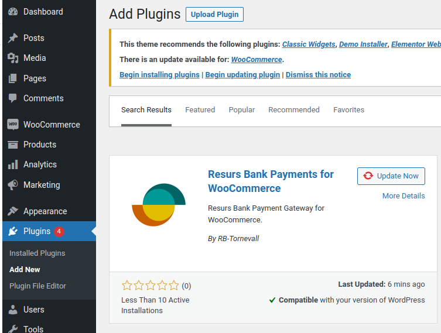

# Installation from WordPress plugin repository 
This page contains information about how to install the plugin properly.

The official release is located at
[https://www.wordpress.org/plugins/resurs-bank-payments-for-woocommerce/](https://www.wordpress.org/plugins/resurs-bank-payments-for-woocommerce/)
and can be installed directly from the plugin installation system in
WordPress.

