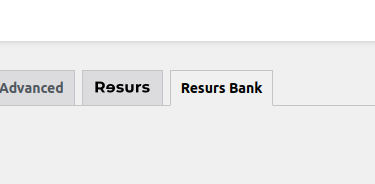
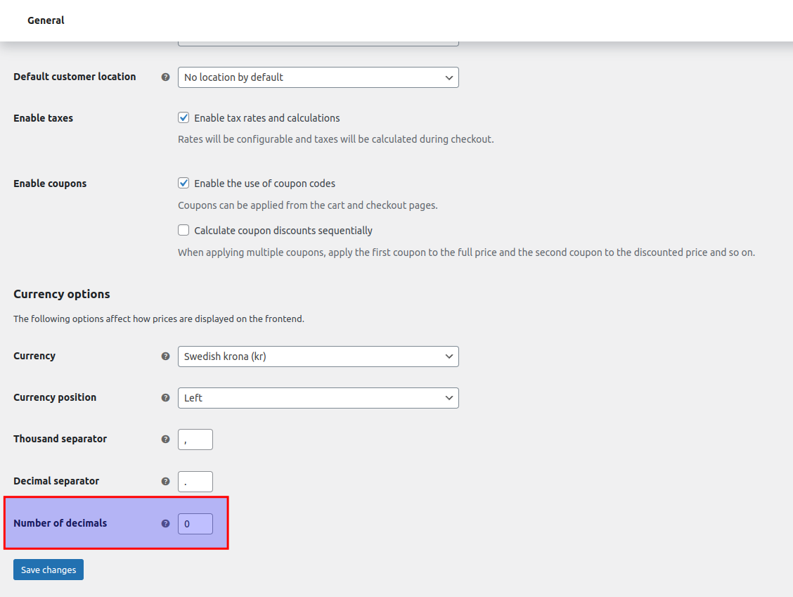

# Plugin basics and information 
This is planned space for Resurs for WooCommerce MAPI Release v1.0. The
MAPI-Commerce package is a rebuild of Resurs for WooCommerce that is
adapted into the latest Resurs API (MAPIv2, as of 2022). All old flows
has been disconnected from this plugin and since it will be a huge
breaking change due to this among other features, it will be released
separately from the old plugin.

- [Old plugin vs new plugin (side by
  side/migration)](#Pluginbasicsandinformation-Oldpluginvsnewplugin(sidebyside/migration))
- [Zero decimals in
  WooCommerce](#pluginbasicsandinformation-zerodecimalsinwoocommerce)
- [Changing the payment method
  configuration](#pluginbasicsandinformation-changingthepaymentmethodconfiguration)

# Old plugin vs new plugin (side by side/migration)

As of the latest master branch it is possible to run both the new
version and old version side by side. It is however **not** recommended
to do so as both modules are fetching and handling payment methods
differently. Best practice is to never run the plugins simultaneous, to
avoid problems such as duplicate getAddress-fields and/or payment
methods in the checkout. You can not only set the old plugin disabled by
the "Enabled"-checkbox.

# Zero decimals in WooCommerce
In newer installs of WooCommerce the setting for number of decimals to
use in the checkout may be set to 0 as the default value. This is
usually what you *do not want*, due to problems with roundings. If you
are new to WooCommerce, make sure to look this up and change it if
necessary. The recommended settings here is 2 decimals (***Resurs do not
fully support more than 2***).

If you want to run with 0 decimals regardless of the warnings, you can
[check out this page](0-decimals-in-woocommerce) for a proper solution.

# Changing the payment method configuration
When making any changes to payment methods at Resurs Bank it is strongly
recommended that you clear the cache in the [Plugin
configuration](plugin-configuration) to avoid potential problems.

