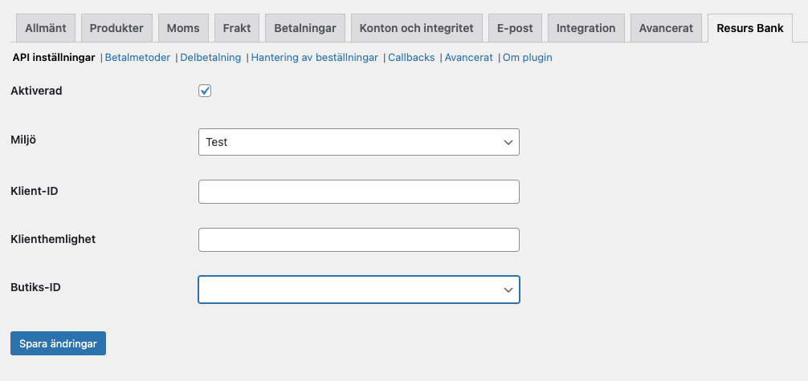
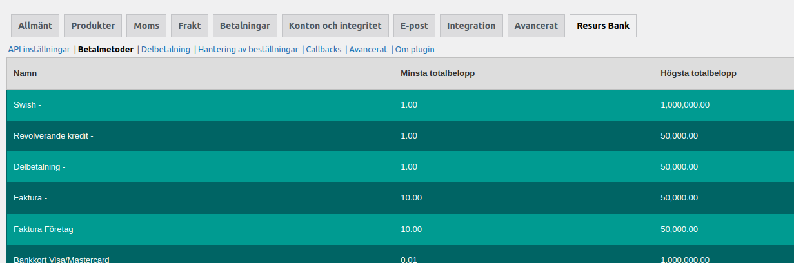
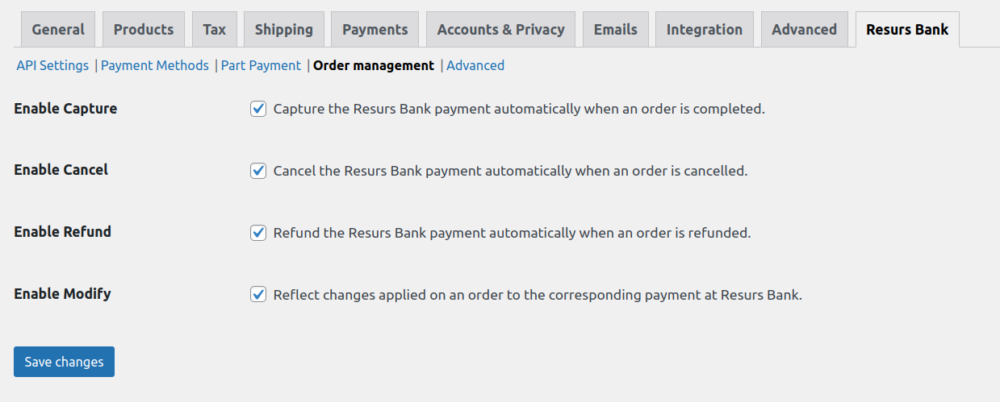

# Plugin configuration 
Created by Mikael Jacobson, last modified by Thomas Tornevall on
2024-01-25
This page contains information on the configuration of the plugin.

# Basic configuration
1.  Go to `WooCommerce` → `Settings` and click on the `Resurs Bank` tab

2.  Enter your credentials in the `API Settings`  tab
3.  Choose the correct Store ID for your store from the dropdown 

4.  Save the settings
# Detailed configuration information
## API Settings
This tab is for basic connection settings and is where you enter your
credential from Resurs Bank, whether to use the Production or Test API.

## Payment Methods
This tab has no settings on it but allows you to see which payment
methods have been configured for your account. Example:

## Part Payment
[Part payment widget](part-payment-widget)

## Order Management
Here you can enable/disable the different order management features of
the plugin.

## Callbacks
Callbacks are notifications sent to a specified URL when a payment
reaches a certain status, such as authorization or rejection.

## Advanced
This tab contains more advanced settings such as logging and cache
settings. As a general rule it is recommended to keep the cache enabled
as it significantly reduces the number of requests made to the API (and
thus improves performance under most circumstances).

