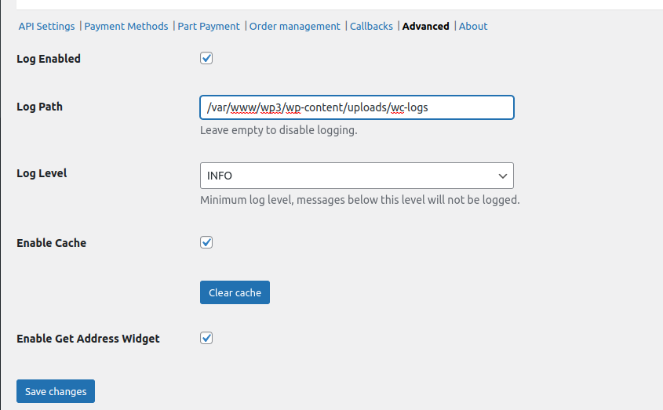

# Trouble shooting and error handling 
Created by Thomas Tornevall, last modified on 2023-05-08
From time to time, you'll need to handle problems with the plugin.
Before you contact us with error reporting, make sure the below settings
tab are correctly filled in. To avoid us to break your platform, the
field for **log path** is by default empty. If your system can't write
logs to the log path defined there, it may not work at all (which is why
logging is disabled by default). Best practice here is to use you
**path-to-wordpress/wp-content/uploads/wc-logs** which is where
WooCommerce is normally writing their ownlogs. You can look at the
example screen dump below.

By using the same path as your wc-logs directory, you will be able to
look at the log files the same way that you browse WooCommerce logs.

When logging is enabled with the above "practices", you will be able to
see the logs inside the wordpress platform under WooCommerce logs
section like this:

