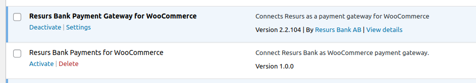
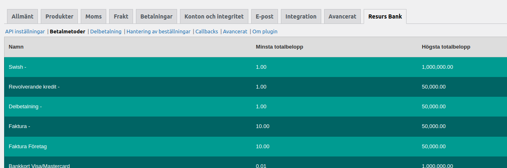
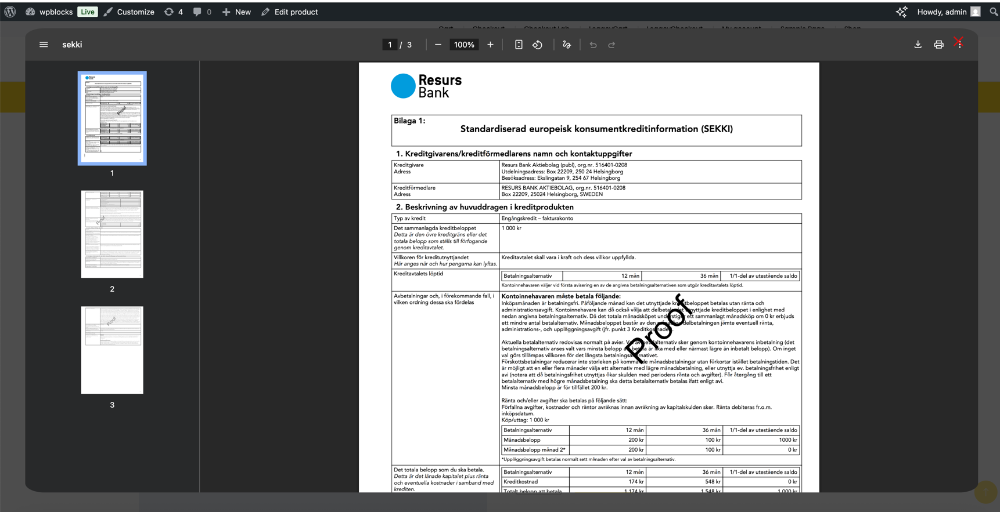
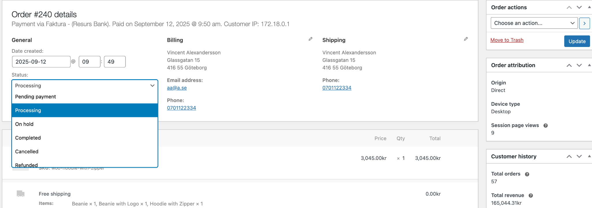
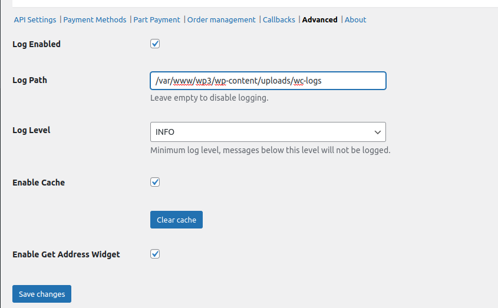

# Resurs Merchant API 2.0 for WooCommerce

## Table of Contents

* [Requirements](#requirements)
* [Download/Install the Plugin](#downloadinstall-the-plugin)
    * [Installing from WordPress Plugin Repository](#installing-from-wordpress-plugin-repository)
    * [Manually Installing the Plugin](#manually-installing-the-plugin)
* [Basic Configuration](#basic-configuration)
* [FAQ & General Questions](#faq--general-questions)
    * [Can I Change the Order Number Sequence?](#can-i-change-the-order-number-sequence)
    * [Figuring Out Remote IP for Whitelisting in Firewalls](#figuring-out-remote-ip-for-whitelisting-in-firewalls)
    * [Detailed Configuration Information and Store Configuration](#detailed-configuration-information-and-store-configuration)
        * [Stock Keeping Unit (SKU)](#stock-keeping-unit-sku)
        * [Decimals and Rounding](#decimals-and-rounding)
            * [Zero Decimals in WooCommerce](#zero-decimals-in-woocommerce)
            * [Solving Too Many Decimals Issues](#solving-too-many-decimals-issues)
            * [Rounding to Nearest Quarter](#rounding-to-nearest-quarter)
    * [Understanding Customer Link Expiration (TTL)](#understanding-customer-link-expiration-ttl)
* [API Settings](#api-settings)
    * [Changing the Payment Method Configuration](#changing-the-payment-method-configuration)
    * [Accessing the Credentials Section](#accessing-the-credentials-section)
        * [Inputting Credentials](#inputting-credentials)
        * [Handling Errors with Credentials](#handling-errors-with-credentials)
        * [Switching Between Environments](#switching-between-environments)
        * [Remember!](#remember)
        * [Summary of Workflow](#summary-of-workflow)
    * [Payment Methods](#payment-methods)
    * [Part Payment](#part-payment)
        * [Configuration](#configuration)
        * [Part Payment Widget Enabled](#part-payment-widget-enabled)
        * [Payment Method](#payment-method)
        * [Annuity Period](#annuity-period)
        * [Limit](#limit)
* [Order Management](#order-management)
    * [Enable Capture](#enable-capture)
    * [Enable Cancel](#enable-cancel)
    * [Enable Refund](#enable-refund)
    * [Enable Modify](#enable-modify)
    * [Order Management with Resurs Bank Plugin](#order-management-with-resurs-bank-plugin)
        * [Order Line Handling](#order-line-handling)
        * [Administrative Considerations](#administrative-considerations)
    * [External Integrations and Hook Requirements](#external-integrations-and-hook-requirements)
        * [Conditions Required for Capturing Payments](#conditions-required-for-capturing-payments)
        * [Additional HPOS Handling](#additional-hpos-handling)
* [Callbacks](#callbacks)
* [Advanced Settings](#advanced)
* [Resurs Mail Flow Explained](#resurs-mail-flow-explained)
    * [Normal Scenario](#normal-scenario)
    * [Alternative Scenario](#alternative-scenario)
    * [Third Scenario Based on Merchant Errors](#third-scenario-based-on-merchant-errors)
* [Purchasing with the New Merchant API](#purchasing-with-the-new-merchant-api)
* [Order Status Flow](#order-status-flow)
    * [Status::update Process](#statusupdate-process)
* [Troubleshooting and Error Handling](#troubleshooting-and-error-handling)
    * [Tracing Errors and Logging](#tracing-errors-and-logging)
    * [Handling Free Shipping Cost Values Requiring Numeric Casting](#handling-free-shipping-cost-values-requiring-numeric-casting)

# Requirements

- **At least** PHP 8.1
- **At least** WooCommerce 7.6.0
- SSL-connectivity (preferably OpenSSL)
- CURL (ext-curl with necessary libraries) 7.61.0 or higher
- **Curl with CURLAUTH_BEARER-support**
- **Decimal precision:** PHP’s default precision (php.ini default precision = 14) is usually sufficient. Increasing this
  value too high may cause unexpected rounding errors due to floating point representation issues. Recommended to keep
  precision at standard levels to ensure correct two-decimal rounding.

# Download/Install the Plugin

Install the plugin via WordPress plugin repository (the plugin manager
in wp-admin). It is NOT recommended to install the plugin manually since
you will miss all automatic upgrades.

Url to the plugin itself is
[https://wordpress.org/plugins/resurs-bank-payments-for-woocommerce /](https://wordpress.org/plugins/resurs-bank-payments-for-woocommerce/)

# Installation

## Installing from WordPress plugin repository

This page contains information about how to install the plugin properly.

The official release is located at
[https://www.wordpress.org/plugins/resurs-bank-payments-for-woocommerce/](https://www.wordpress.org/plugins/resurs-bank-payments-for-woocommerce/)
and can be installed directly from the plugin installation system in
WordPress.


# Manually Installing the Plugin

Manually installing WordPress plugins can be risky because changing the plugin slug can prevent crucial updates from
being applied. This opens up vulnerabilities that hackers can exploit, potentially giving them access to your site
through outdated versions. You should avoid this if possible.

1. Download the plugin from a trusted source.
2. Extract the ZIP file locally.
3. Upload the plugin folder to `wp-content/plugins/` via FTP.
4. Activate the plugin via the WordPress dashboard.
5. Verify the plugin slug to ensure updates work correctly.

# Basic configuration

1. Go to `WooCommerce` → `Settings` and click on the `Resurs Bank` tab
2. Enter your credentials in the `API Settings`  tab
3. Choose the correct Store ID for your store from the dropdown
4. Save the settings

# FAQ & General questions

## Can I change the order number sequence?

Yes!

To update the order number sequence, modify the database auto-increment number like this

```mysql
ALTER TABLE `[WP_DATABASE]`.`wp_posts`
    AUTO_INCREMENT = 200000000;
```

Change **[WP_DATABASE]** to your database name and set the
**AUTO_INCREMENT** number to something that suits you.

## Figuring out remote ip for whitelisting in firewalls

In test, we sometimes need to whitelist your server's IP address, for example when your server is located in a country
outside the Nordic region.

Normally, it is not very difficult to figure out which IP address needs to be whitelisted. Several online services can
fetch your public IP address, or you can use this command from your server terminal. Example:

```bash
curl https://api.ipify.org/?format=txt
91.198.202.76
```



## Detailed configuration information and store configuration

### Stock Keeping Unit (SKU)

In order for the order management functionality built into the plugin to
work as intended all products sold in your shop need to have a SKU
configured.

The setting for this can be found in the `Inventory`  tab in the
`Product data`  box on each product.


### Decimals and rounding

In some platforms WooCommerce is configured to show prices with zero decimals.
For certain technical reasons this can occasionally cause rounding
errors, so we **strongly recommend that you change this setting so to two
decimals**.

This setting can be changed by going to `WooCommerce` → `Settings`  →
`General`  and scrolling to the `Currency options`  section. It's called
`Number of decimals`  and should be at the very bottom of the section.


See [woocommerce-self-service](woocommerce-self-service) for more information about all issues with decimals and
roundings

## Understanding Customer Link Expiration (TTL)

Customer links expire by default after 120 minutes. If a customer tries to complete a payment after this period, the
transaction will be rejected. This expiration can be handled through WooCommerce's stock management system,
specifically using the **Hold Stock (minutes)** setting.

When stock management is enabled, WooCommerce reserves the product for the specified time in the **Hold Stock** setting,
preventing others from purchasing the item while the order remains unpaid. Once the set time (e.g., 120 minutes)
elapses, WooCommerce automatically cancels the unpaid order and releases the reserved stock back into inventory.

If stock management is **not** enabled, the system defaults to 120 minutes. This ensures that the reserved stock doesn't
remain indefinitely held for unpaid orders, providing a balanced and controlled inventory management system.

The default TTL can be configured between 1 and 43200 minutes (up to 30 days), depending on the store’s requirements.

This setting can be found under:
**WooCommerce > Settings > Products > Inventory > Hold Stock (minutes)**.


## API Settings

This manual provides detailed instructions on how to manage credentials in the WooCommerce admin view for seamless
functionality between environments and to ensure proper handling of user credentials.


### Changing the payment method configuration

When making any changes to payment methods at Resurs Bank it is strongly
recommended that you clear the cache in the [Plugin
configuration](plugin-configuration) to avoid potential problems.

### Accessing the Credentials Section

To manage credentials in WooCommerce:

1. Navigate to the Resurs API section.
2. Locate the **Credentials** section, where you will be able to input, update, and verify your credentials.
3. The credentials fields include **API Key**, **API Secret**, and **Store ID**. These are essential for connecting the
   WooCommerce store to the external system.

### INPUTTING CREDENTIALS

When entering your credentials:

1. **Fill in the API Key, API Secret, and Store ID** fields.

    - Ensure that the credentials you enter are correct and valid, as incorrect credentials will prevent the store from
      functioning properly.
2. **Fetching Store Data**:

    - After entering the credentials, click the **Fetch Stores** button to retrieve the store list associated with the
      entered credentials.
    - The store list will appear if the credentials are valid. If the credentials are invalid, an error message will
      display, and no stores will be fetched.

### HANDLING ERRORS WITH CREDENTIALS

If you enter incorrect credentials:

1. **Fetching Store Failure**:

    - An error message will display, indicating that the credentials are incorrect.
    - The store list will not appear.
2. **Session Handling**:

    - Incorrect credentials may also impact session handling. If the session fails due to invalid credentials, the admin
      view will alert you, and no further actions can be taken until the correct credentials are entered.
3. **Invalid Scope Warnings**:

    - If you switch between environments (Test and Production), there may be warnings about scope. These occur when
      WooCommerce tries to use previously saved data that conflicts with the current environment.
    - Fetching the store list again with the correct credentials will resolve these issues, ensuring that the correct
      environment data is stored.

### SWITCHING BETWEEN ENVIRONMENTS

When switching from **Test** to **Production** or vice versa:

1. You must fetch the store data again using the **Fetch Stores** button.
2. Ensure that the correct environment credentials are entered before fetching the store data.
3. Once the store list is successfully retrieved, you can proceed to save the credentials for the new environment.
4. The store list for the previous environment will no longer be available, and you must fetch new store data before
   proceeding.

### REMEMBER!

1. **Always Verify Credentials**: Ensure that the credentials you enter are accurate before attempting to fetch store
   data. This avoids unnecessary errors and ensures smooth functionality.
2. **Fetch Stores After Environment Switch**: Whenever you switch between environments, remember to fetch the store data
   again to ensure that the credentials are properly updated for the selected environment.
3. **Check Error Messages**: If you encounter any issues while saving or fetching stores, check for error messages
   related to invalid credentials or session handling. Address these issues before proceeding.

### SUMMARY OF WORKFLOW

1. Enter credentials in the appropriate fields.
2. Fetch store data to verify the credentials.
3. Once the store list is retrieved, save the credentials.
4. If switching environments, fetch the store data for the new environment before saving.
5. Ensure no "invalid scope" or "bad credentials" warnings appear after saving. If these occur, re-enter credentials and
   fetch the store data again.

By following these guidelines, the credentials management process in WooCommerce will be streamlined, ensuring smooth
transitions between environments and avoiding common credential-related errors.

### Payment Methods

This tab has no settings on it but allows you to see which payment
methods have been configured for your account. Example:



### Part Payment

This feature of the plugin allows your store to display a small widget
on individual product pages with information about available part
payment options including a modal iframe popup with more detailed
information.

See widget appearance below (they may differ a bit from each other respectively - the examples are taken from Sweden,
where "Att låna pengar" is included).

#### Widget Appearance


#### Modal "Read More" Appearance



### Configuration

The widget configuration options can be found on the `Part payment` tab
*under* `WooCommerce → Settings → Resurs Bank`.

Before configuring the widget you need to set the global plugin
configuration on the `API` Settings tab.


### Part payment widget enabled

Toggle this setting to enable or disable the widget.

### Payment method

This option allows you to choose which of your payment method to use for
the widget.

Only payment methods that support part payment will be available here.

### Annuity period

Controls how long of a payment period to calculate the monthly cost for.

Like with the payment method setting only supported periods will be
shown.

### Limit

Sets a lower monthly installment limit under which the widget will not
be displayed.

If you set the limit higher than the payment method's maximum configured purchase price, you will see a warning message
after saving your settings.

You should set this value high enough that the monthly cost is at least
SEK 150 (Sweden) or EUR 15 (Finland).

## Order Management

Here you can enable/disable the different order management features of
the plugin.


The plugin has functionality built into it for automatically updating
the payment at Resurs Bank when the order is manually edit/updated in
WooCommerce order view.

By default all of these features are enabled when the plugin is enabled
but can be disabled in the settings under
`WooCommerce → Settings → Resurs Bank → Order Management`.

*Please read below about ERP's.*


### Enable Capture

When this setting is enabled the payment will be automatically captured
when the order status is set to `Completed` in WooCommerce.

Once an order has been set to Completed it can no longer be reverted to
another status.

*The module does not support partial captures.*

An order which has been partially captured using the Merchant Portal can
still have the remaining order amount captured from WooCommerce.

### Enable Cancel

This feature works much like the `Enable Capture `setting in that it
automatically cancels the payment when an order is cancelled in
WooCommerce. Similarly, once an order has been cancelled it can't be
reverted to another status but a payment that's been partially cancelled
through the Merchant Portal can still have its remaining order lines
cancelled through the order view.

### Enable Refund

Like the `Enable Capture `and `Enable Cancel `features this feature will
both automatically handle refunds of the payment when a refund is
applied to the order in WooCommerce and once an order has been refunded
it can't be reverted to another status and allow complete refunds of the
payment when a partial refund has already been applied through the
Merchant Portal.

### Enable Modify

With this feature enabled changes you make to an order will be reflected
on the payment.

However, there are some caveats. First of all, this only works if the
payment can be captured, cancelled or if it has been fully cancelled.
Furthermore, if the sum total for the changed order are equal to what
they were before changing the order no call will be made to Resurs Bank.
E.g. if you substitute one product for another with the exact same price
then the change will not be transmitted to the payment.

One workaround for this issue is to cancel the payment through the
Merchant Portal before editing the order in WooCommerce as this changes
the authorized amount on the order to 0.

It should also be noted that it's not possible to exceed the credit
limit which has been authorized for the payment. Instead the customer
should place a new order.

Should the modify action fail it can sometimes result in the payment
being cancelled despite the order not being cancelled. If this happens
you can click the `Recalculate `button to update the order state as this
also pushes the order update to the payment at Resurs.

> Please also note that changes made from Resurs Merchant Portal will
> not reflect back to the WooCommerce system and have to be made there
> as well.

### Order Management with Resurs Bank Plugin

When handling WooCommerce orders paid through Resurs Bank, the order editor provides a simple but powerful way of
synchronizing order status and payment handling directly with Resurs.

The order status dropdown is directly connected to Resurs Bank’s payment handling. The following actions are supported:



* **Completed** → Performs a *full capture*. This means the payment is finalized and captured at Resurs Bank. Once a
  capture has been made, the order can no longer be cancelled.
* **Refunded** → Performs a *full credit*. The order is refunded completely in Resurs Bank. Partial refunds via the
  dropdown are not supported.
* **Cancelled** → Performs a *full cancellation*. This is only possible if the order has not yet been captured. You
  cannot cancel an order that is already captured.

The workflow is straightforward: choose the correct status in the dropdown and click **Update** to trigger the action
towards Resurs Bank. Each action performed is also logged in the order notes, ensuring that administrators have a clear
audit trail of what has been done.


#### Order Line Handling

Resurs Bank also supports changes at the order line level:

* If you **remove items** from the order, the plugin updates Resurs Bank by first cancelling the entire order and then
  recreating it with the updated set of order lines (excluding the removed item).
* **Adding new items** is *not supported*. This limitation exists due to credit limits and authorization rules from
  Resurs Bank. Orders can only be reduced in value after authorization, not increased.


Administrative Considerations

We rely on administrators handling orders interactively through the WooCommerce admin panel. Managing these processes
externally using custom plugins or hooks is not recommended, since there is a risk that the business logic will not
execute correctly.

For example, if you manually trigger hooks such as update_status and the order is frozen, it is up to the integrator to
ensure that frozen status checks are handled properly. The plugin has built-in mechanisms to prevent frozen orders from
being mishandled (for example in suspected fraud cases), but there is always a risk of errors when bypassing the
intended workflow.

### External integrations and hook requirements

The automatic capture, modification and refund logic depends entirely on WooCommerce’s own action and filter hooks. The
plugin subscribes to the following hooks and uses them to keep the Resurs Bank payment state in sync:

* `transition_post_status` – invoked just before WooCommerce changes an order’s
  status ([developer.wordpress.org](https://developer.wordpress.org/reference/hooks/transition_post_status/))
* `woocommerce_before_order_object_save` – invoked when a High‑Performance Order Storage (HPOS) order is about to be
  persisted ([developer.woocommerce.com](https://developer.woocommerce.com/2022/09/12/high-performance-order-storage/))
* `woocommerce_order_status_changed` – invoked immediately after the status change has been
  committed ([wp-kama.com](https://wp-kama.com/plugin/woocommerce/hook/woocommerce_order_status_changed))
* `woocommerce_update_order` – invoked when an order is saved after being edited in the admin
  interface ([wp-kama.com](https://wp-kama.com/plugin/woocommerce/hook/woocommerce_update_order))

If an external system such as an ERP, POS or warehouse management platform updates orders directly in the database, via
direct REST calls or any other pathway that bypasses the hooks above, the plugin will not receive the events it needs
and the order management features (capture, refund, cancellation, modification) will not be executed against Resurs
Bank.

**To ensure reliable synchronisation you must either:**

1. Extend the external integration so that it uses the official WooCommerce APIs, calling `$order->update_status()`
   and `$order->save()` (or equivalent) so that WooCommerce dispatches its hooks, or
2. Disable "Automatic capture", "Automatic refund" and "Allow order modifications" under the plugin’s Order Management
   settings and carry out these actions manually in Resurs Bank’s Merchant Portal.

Leaving the integration unchanged will lead to mismatches between WooCommerce and Resurs Bank that may prevent future
captures or refunds and require manual intervention.

#### Conditions required for capturing payments

The plugin only allows capturing a Resurs Bank payment if certain conditions are met:

* The order must have an attached `Payment` object with a valid `Order` structure.
* The payment must **not** be in a `REJECTED`, `FROZEN`, or `INSPECTION` state.
* The list of `possibleActions` provided by Resurs Bank must contain either `CAPTURE` or `PARTIAL_CAPTURE`.
* The payment must not yet be fully captured.

These rules are enforced through the Resurs Bank API. If the payment fails any of the checks above, capture
functionality will not be available through the plugin and must instead be handled manually in the Resurs Bank Merchant
Portal.

#### Additional HPOS handling

With WooCommerce’s High‑Performance Order Storage (HPOS), status transitions may bypass the
legacy `transition_post_status` hook. To ensure full compatibility, the plugin also subscribes to:

* `woocommerce_before_order_object_save` – This hook is used to validate state changes before they are persisted. For
  example, attempts to complete an order that is in a frozen state will be blocked and result in an error
  message (`unable-to-capture-frozen-order`).

The HPOS handler loads the persisted order, compares the old and new status, and enforces Resurs Bank’s business rules
before allowing the status transition. This prevents illegal captures or cancellations from being attempted even in HPOS
environments.

### Callbacks

Callbacks are notifications sent to a specified URL when a payment
reaches a certain status, such as authorization or rejection.

Also see [Order Status Flow](#order-status-flow) for more information about how statuses are updated during callbacks
and payments.


1. When a purchase is completed and the payment is ready to be handled
   at Resurs side a few callbacks are executed synchronously from
   Resurs. You can see the flow and more information [about the
   callbacks
   here](https://merchant-api.integration.resurs.com/docs/v2/merchant_payments_v2/options#callbacks).
2. To verify callback accuracy, the plugin makes a secure request to Resurs before processing the order in WooCommerce.
3. When an order is synchronized with Resurs, the order status will
   update to either *processing, on-hold* or *failed*. If t he order is
   set to *on-hold*, this means that more actions could follow. For
   example, an order at Resurs can be temporarily frozen (which is the
   cause of on-hold) and will be pushed further (to *processing*) when
   ready to handle.

### Advanced

This tab contains more advanced settings such as logging and cache
settings. As a general rule it is recommended to keep the cache enabled
as it significantly reduces the number of requests made to the API (and
thus improves performance under most circumstances).


### Resurs Mail Flow Explained

This section explains how the mail flow is integrated with the plugin. The plugin itself does not trigger or manipulate
emails but relies on WooCommerce order status updates to control when emails are sent. These updates help prevent issues
such as orders being canceled if left in "Pending Payment" for too long, depending on how WooCommerce is configured. For
example, stock handling may automatically cancel orders in pending status after a set period. We also avoid using the
"On Hold" status to pause orders while waiting for customer action, ensuring a smoother and more reliable order flow.
Here's an outline of what happens during a payment:

1. **Customer initiates checkout and completes the payment:**

   The order is first created in WooCommerce.
2. **Customer is redirected to an external page:**

   On this page, the customer completes tasks such as signing or confirming the payment. During this process, the order
   is already created in WooCommerce and is automatically set to "Pending Payment", which is the default initial status
   for an order.
3. **No further action occurs until the payment is completed:**

   Once the customer returns to the "Thank You" page, the WooCommerce order is updated to "Processing". At this point,
   WooCommerce automatically sends the first confirmation email to the customer.

### Alternative Scenario:

1. **Customer is redirected to an external page:**

   On this page, the customer completes signing, payment via credit card (e.g., Visa/Mastercard), etc.
2. **Customer exits the browser before returning to the success page:**

   If the customer closes their browser before being redirected back to the "Thank You" page, Resurs Bank initiates a
   callback to the shop.
3. **Callback process and status update instead of customer success page:**

   A callback registers the payment completion in the system but is delayed briefly to avoid conflicts with the
   customer's actions. This cooldown ensures that if the customer reaches the "Thank You" page during this time, the
   callback and customer actions do not interfere, allowing the order status to update correctly and the confirmation
   email to send without errors. This system is built to prevent duplicate email sending without the use
   of [WC Worker Queue](https://github.com/woocommerce/woocommerce/wiki/WC_Queue---WooCommerce-Worker-Queue).

### A Third Scenario Based on Merchant Errors:

1. **Customer begins the process as described above:**

   The customer is redirected to an internal page but decides to abandon the process without explicitly canceling the
   payment. As a result, the payment remains in a "Pending" state in the system.
2. **Merchant manually changes the order status incorrectly:**

   If the merchant mistakenly updates the order status to "Processing" in the WooCommerce order editor, WooCommerce will
   send a confirmation email to the customer. However, since the payment remains incomplete, the transaction is not
   finalized until the customer confirms and completes the payment.

### Purchasing with the new Merchant API.

The Merchant API is, like the former simplified shopflow, made to go
with a platform default rules but with some improvements. The WooCommerce order will (as before) first be created in
*Pending* status, then the Resurs order will be placed, and finally-depending on the result-updated to *Processing*. The
procedure looks like this:

1. Purchase button is clicked. WooCommerce starts handling the order,
   setting the first Pending status.
2. When WooCommerce checks (stock count, etc) are finished, Resurs
   plugin takes over to create the payment. During this process,
   signing the payment also occurs.
3. When Resurs is done, the order can be either accepted
   (*processing*), rejected (*failed*) or paused (*on-hold*). Depending
   on the outcome, Resurs will redirect customers back, either to the
   final order received-page ("thank you") or a failure-page (if Resurs
   rejects the order, customers redirected to a fail-page will render
   the order to be *canceled*). Take a look at the [order status flow](#order-status-flow) for more information about .
   how this is set up.
4. Side by side with the above steps, callbacks are also sent from
   Resurs, in case that the customer fails to return to the thank you
   page. This makes sure that the statuses are properly set.

# Order Status Flow

The order status flow is a crucial part of the plugin. Statuses are primarily updated during callbacks and customer
payments. The order status flow is as follows:

- The customer initiates checkout and completes the payment.
- Callbacks are initiated after the customer's interactions are either complete or abandoned. Abandonment can occur, for
  example, when payments are initiated but authorization/signing with third parties are incomplete or cancelled.

Callbacks may be triggered at the same time the customer completes the payment. This could potentially cause conflicts,
like race conditions where the order status changes incorrectly. This is easily prevented by ensuring that the plugin's
callbacks are not allowed to respond to requests from Resurs Bank until after a certain period of time has passed.
Meanwhile, the customer is given the opportunity to reach the thank-you page in time. The period is set to 60 seconds
from the moment the order was created or updated. Thereafter, status updates for Resurs are executed as follows:

```
Status::update(order: $order);
```

## Status::update Process

The status control process ensures that order statuses are correctly updated based on payment statuses returned from
Resurs Bank. The implementation follows these steps:

1. **Validation Check:**

    - Before any processing, the plugin checks if the payment is a valid Resurs Payment (`isValidResursPayment`).
2. **Fetching Payment Details:**

    - The payment details are fetched from the repository (`getPayment`).
3. **Order Status Validation & Validation Control:**

    - The plugin verifies if the current payment status matches the expected order
      status (`BeforeOrderStatusChange::validatePaymentAction`), provided that the existing order status is
      not `pending`. If the criteria are not met, the plugin will not proceed with any further actions.
    - `validatePaymentAction` is demonstrated in the following steps.
    - The plugin checks if the payment status at Resurs Bank is `ACCEPTED` or `REJECTED` and if the order status
      is `pending`. If these criteria are not met, the plugin will not proceed with any further actions.
    - During the validation process, the plugin determines through `orderStatusFromPaymentStatus` which status the order
      should receive if everything is correct.
        - For `ACCEPTED` status, the order is marked as `processing`.
        - For `REJECTED`, a check determines whether the status should be `failed` or `cancelled` based on task status
          details.
        - Otherwise, the status is set to `on-hold` (Other statusen can
          be `TASK_REDIRECTION_REQUIRED`, `INSPECTION`, `SUPPLEMENTING_REQUIRED`, `FROZEN`).
4. **Order Status Update (from `match ($payment->status) {`):**

    - The plugin updates the order status based on the payment status from Resurs Bank.
        - If the payment status is `ACCEPTED`, the order status is set to `processing`.
        - If the payment status is `REJECTED`, the order status is set to `failed` or `cancelled` based on task status
          details (this will be triggered from the `updateRejected` method).
        - If any other status than expected is found in `$payment->status`, the order status is set to `on-hold`.
5. **The `updateRejected` Method:**

    - This method determines the appropriate status for all `REJECTED` orders, which will be set to either `failed`
      or `cancelled` depending on task status details retrieved from:
      ```
      Repository::getTaskStatusDetails(paymentId: $payment->id)
      ```
    - The task status details from Resurs are examined for the `completed` flag (refer
      to [Resurs API Documentation](https://merchant-api.resurs.com/docs/v2/merchant_payments_v2#/Payment%20information/getTaskStatuses)).
    - If the `completed` flag is set to true, the order status will be set to `failed`.
    - If the `completed` flag is set to false, the order status will be set to `cancelled`.
    - We acknowledge that the above method is not ideal and will be improved in future updates. Currently, we can take
      advantage of the `rejectedReason`
      in [MAPI's getPayment request](https://merchant-api.resurs.com/docs/v2/merchant_payments_v2#/Payment%20information/getPayment)
      to assist in providing better feedback or error logging. At a very basic level, however, all orders marked
      as `REJECTED` by Resurs Bank should be treated as pure `cancelled`.
6. **Error Handling:**

    - If an error occurs during the status determination process, it is logged, and a default status is returned.

# Troubleshooting and error handling

## Tracing errors and logging

From time to time, you'll need to handle problems with the plugin.
Before you contact us with error reporting, make sure the below settings
tab are correctly filled in. To avoid us to break your platform, the
field for **log path** is by default empty. If your system can't write
logs to the log path defined there, it may not work at all (which is why
logging is disabled by default). Best practice here is to use you
**path-to-wordpress/wp-content/uploads/wc-logs** which is where
WooCommerce is normally writing their ownlogs. You can look at the
example screen dump below.

By using the same path as your wc-logs directory, you will be able to
look at the log files the same way that you browse WooCommerce logs.



When logging is enabled with the above "practices", you will be able to
see the logs inside the wordpress platform under WooCommerce logs
section like this:


## Payment failure messages in WooCommerce Blocks (Cart & Checkout)

When using WooCommerce’s **block-based Cart and Checkout**, the way system messages are rendered differs significantly
from classic (PHP-template based) WooCommerce pages.

### Important note about failure messages

WooCommerce Blocks do **not** automatically render WooCommerce notices (`wc_add_notice()`) unless the page explicitly
contains the **Store Notices** block.

This means that payment failure messages (for example, rejected or cancelled Resurs payments) may not be visible to the
customer if:

- The store uses the block-based Cart or Checkout, and
- The **Store Notices** block is not present on those pages

This behavior is a limitation of WooCommerce Blocks and is not specific to the Resurs Bank plugin.

### Recommended solution

To ensure that customers always see important payment-related messages:

1. Edit the Cart and Checkout pages using the WordPress block editor
2. Add the **WooCommerce → Store Notices** block
3. Place it near the top of the page for best visibility

Once the Store Notices block is present, all standard WooCommerce notices, including Resurs payment failure messages,
will be displayed correctly.

### Fallback behavior

In environments where block notices are not rendered, the plugin may fall back to alternative rendering strategies to
ensure that critical information reaches the customer. The exact placement of such fallback messages can vary depending
on theme and layout.

### Summary

- Classic WooCommerce themes render notices automatically
- WooCommerce Blocks require the **Store Notices** block
- This is a WooCommerce architectural design choice
- No plugin can fully override this behavior using PHP alone

## Handling free shipping cost values requiring numeric casting

WooCommerce usually returns the shipping cost as a decimal string, but there are edge cases
where `WC_Order_Item_Shipping::get_total()` yields an empty string (or an invalid numeric), most commonly when the Free
Shipping method has been applied (by default, free shipping don't behave like this and this far it hasn't been
reproduceable) or when a legacy order was created before cost fields were normalised. Attempting to convert that empty
string directly to `float` via `Order::convertFloat()` triggers an `IllegalValueException`. Developers should therefore
normalise the value before it reaches the converter:

```php
$rawCost = $item->get_total();
$cost    = is_numeric($rawCost) ? (float) $rawCost : 0.0;
```

By explicitly casting non‑numeric or empty values to `0.0`, the implementation remains forward compatible and avoids
PHP‑8 type errors. For context, see WooCommerce core issue Legacy order data PHP 8 compatibility #39489 which documents
the empty string
behaviour. [GitHub issue #39489](https://github.com/woocommerce/woocommerce/issues/39489) ([github.com](https://github.com/woocommerce/woocommerce/issues/39489?utm_source=chatgpt.com))

> **Tip** – If you maintain third‑party shipping extensions, ensure that they always return a numeric cost so the plugin
> can rely on strict typing.
