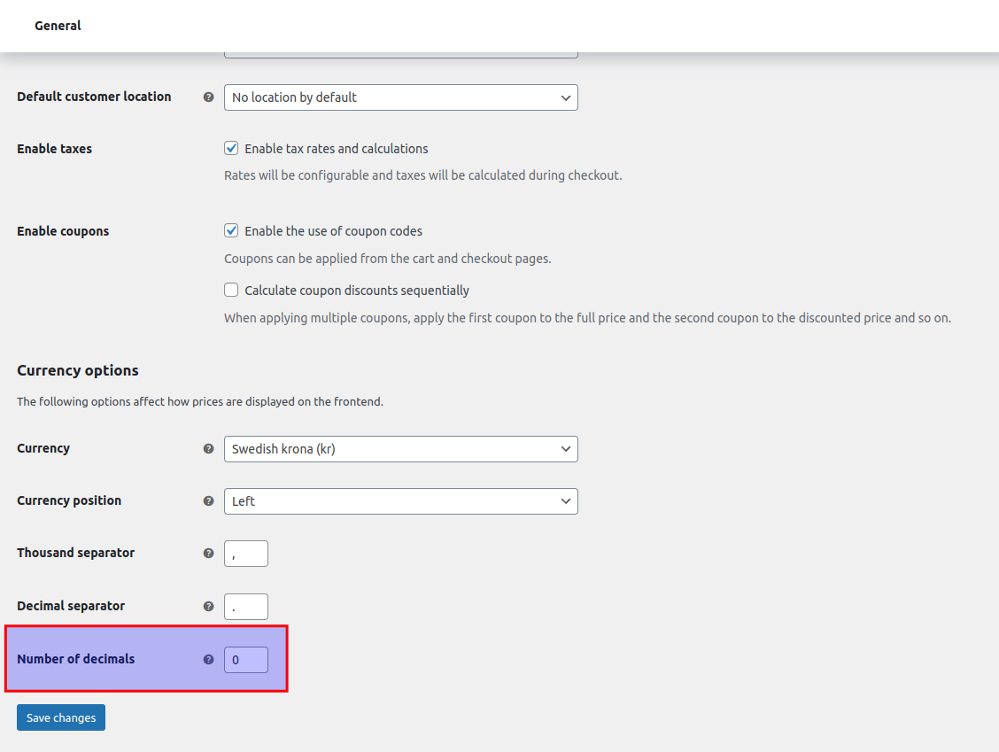

# Disclaimer

This section of the documentation is not formally endorsed or supported by Resurs Bank. The content is provided strictly
for informational purposes, and the examples included should be regarded as potential workarounds rather than official
implementation guidance.

While this documentation contains code samples that are generally outside the scope of Resurs Bank’s official support,
it demonstrates how developers may independently take action where necessary. In some cases, filters and similar
mechanisms have been deliberately implemented to allow developers to address specific issues without modifying the
plugin’s core code. These instances are clearly indicated within the documentation to distinguish them from unsupported
examples.

## Table of Contents

* [Disclaimer](#disclaimer)
* [Custom pricing in part payment widget logic using filters](#custom-pricing-in-part-payment-widget-logic-using-filters)
* [Decimal issues and rounding in WooCommerce](#decimal-issues-and-rounding-in-woocommerce)
  * [Rounding with decimals in WooCommerce](#rounding-with-decimals-in-woocommerce)
  * [How quantity and discounts impact rounding](#how-quantity-and-discounts-impact-rounding)
  * [What if I don’t want to display decimals in my store—how can I achieve this?](#what-if-i-dont-want-to-display-decimals-in-my-storehow-can-i-achieve-this)
  * [Example plugin implementation](#example-plugin-implementation)
  * [Solving too many decimals issues](#solving-too-many-decimals-issues)
    * [Alternative: Rounding to nearest quarter](#alternative-rounding-to-nearest-quarter)
* [Rounding issues with high PHP precision settings](#rounding-issues-with-high-php-precision-settings)
  * [Why is PHP precision a problem here?](#why-is-php-precision-a-problem-here)
  * [Example workaround: Rounding prices to the nearest quarter](#example-workaround-rounding-prices-to-the-nearest-quarter)
  * [Example plugin implementation](#example-plugin-implementation-1)
  * [Important notes](#important-notes)
* [ERP integration examples for Resurs + WooCommerce](#erp-integration-examples-for-resurs--woocommerce)
  * [Overview: ERP as master for order data](#overview-erp-as-master-for-order-data)
  * [Sync between ERP, e-commerce and payment](#sync-between-erp-e-commerce-and-payment)
  * [Order status, changes and deviations](#order-status-changes-and-deviations)
  * [Example integration pattern from a known merchant setup](#example-integration-pattern-from-a-known-merchant-setup)
  * [Code example: trigger-safe ERP import](#code-example-trigger-safe-erp-import)
  * [Common pitfalls](#common-pitfalls)
  * [Development helper: manual status tool](#development-helper-manual-status-tool)

# Custom pricing in part payment widget logic using filters

In some environments, product page pricing may differ from the checkout total if external sources or custom logic are
involved. For example, a product widget might show a lower or outdated price compared to the checkout, creating
confusion for end users.

To address this, the plugin provides a filter that lets developers override how prices are calculated before they are
passed into part payment widgets. This approach allows the implementation of external price sources, adjustments for
tax, or other custom logic without modifying the plugin core.

**Generic example:**

```php
add_filter('resursbank_pp_price_data', function($price, $product) {
    // Example: Fetch a custom external price or run validation logic
    $custom_price = my_custom_price_lookup($product->get_sku());

    if ($custom_price > 0) {
        // Calculate tax if needed
        $tax_rates = wc_get_product_tax_class($product)
            ? WC_Tax::get_rates($product->get_tax_class())
            : WC_Tax::get_rates('');
        $taxes = WC_Tax::calc_tax($custom_price, $tax_rates, false);
        return $custom_price + array_sum($taxes);
    }

    return $price; // fallback to default logic
}, 10, 2);
```

By using this filter, partners can ensure that the part payment calculations remain consistent between product pages
and checkout, while also preserving plugin compatibility across future updates.

# Decimal issues and rounding in WooCommerce

## Rounding with decimals in WooCommerce

In *General settings* under *Currency options*, WooCommerce lets you set the store currency and decimal precision. While
it may seem cosmetic, setting decimals to 0 can cause issues.

WooCommerce rounds prices using its internal rules, but Resurs Bank doesn't support more than 2 decimals. If values are
rounded too high or too low, order totals may not match, leading to incorrect tax calculations and potential payment
failures.

For example, a product priced at 49 EUR (including 25% VAT) has a net price of 39.2 EUR and a tax of 9.8 EUR. If
decimals are set to 0, WooCommerce rounds it to 39 EUR net and 10 EUR tax, which may cause discrepancies with the
payment.

Now, let's consider a payment provider that requires each order row to be sent with the product price excluding tax
along with the applicable tax rate. In this case, it would be 39 EUR and 25%. However, adding 25% tax to 39 EUR results
in a total price of 48.75 EUR.

In many cases, when each order line is sent to the payment provider, the order total is also sent as a parameter. When
the sum of the order rows is compared to the order total, these two figures don't match. Usually, the payment provider
responds with an error message, and the purchase can't be finalized.

## How quantity and discounts impact rounding

In some cases, this type of rounding will work. However, problems might occur if the customer buys multiple units of a
specific product. The payment provider usually expects the unit price and quantity separately, whereas WooCommerce
applies rounding after the entire order row has been calculated. Similar discrepancies can also arise when using
coupons.

## What if I don’t want to display decimals in my store—how can I achieve this?

Fortunately, there are ways to avoid displaying decimals as long as prices remain whole numbers. Set the decimal points
to 2 in the currency settings and then add this code snippet to your theme's `functions.php` or in a separate plugin.

```php
/**
 * Trim zeros in price decimals
 **/
add_filter( 'woocommerce_price_trim_zeros', '__return_true' );
```

This ensures that 49.00 appears as 49. However, some currencies (e.g., JPY, IDR) use large numerical values, making
small rounding differences significant. When comparing EUR to SEK, minor decimal shifts in EUR can result in larger
rounding differences due to exchange rates.

## Example plugin implementation

Here's an example of how the plugin could be structured. A file like this can be placed directly
in `wp-content/plugins/` and then activated via the plugin manager.

**Example: `<WP-root>/wp-content/plugins/woocommerce-price-trim-zeros.php`**

```php
<?php
/*
Plugin Name: WooCommerce price trim zeros
*/

/**
 * Trim zeros in price decimals
 **/
add_filter( 'woocommerce_price_trim_zeros', '__return_true' );
```

## Solving too many decimals issues {#solving-decimal-issues}

One issue that may occur in some cases with the plugin is not directly caused by the plugin itself, but still affects
the outcome of what is sent to our API. For instance, you may receive an error in the checkout related
to `totalAmountIncludingVat` being too high or, as shown in our example image, resulting in an "out of bounds" message.
When the decimal precision of a field like `totalAmountIncludingVat` is too high, it can trigger validation errors from
Resurs Bank’s API.

A value that looks visually correct may, for example, still be submitted to us like this:

"totalAmountIncludingVat":1310.259999999999990905052982270717620849609375

This is a typical floating-point precision issue that originates from how PHP handles decimal numbers internally. Even
if WooCommerce is set to 2 decimals, if your server environment uses an overly high `precision` value in `php.ini`,
numbers can be serialized with an excessive number of decimals when encoded into JSON. In addition, it's possible that
other plugins, filters or theme functions in your WooCommerce installation are affecting the final precision of price or
tax fields by altering them before the payload is constructed.

If this happens, you may see errors such as:

**{"order.orderLines[1].totalAmountIncludingVat":"numeric value out of bounds (<10 digits>.<2 digits> expected)"}**

This is not caused by the plugin itself but rather by the environment or platform surrounding WooCommerce. Here’s what
you should check:

1. **WooCommerce Decimal Setting**

- Navigate to *WooCommerce > Settings > General > Number of decimals* and verify that the value is set to 2.
2. **PHP Precision**

- Check the `precision` directive in your PHP configuration (php.ini). A common default is `14`, but for
  WooCommerce/Resurs integrations we recommend lowering it to something like `10` to avoid these edge cases.

Example in php.ini:

   ```ini
   precision = 10
   ```
3. **Custom Filters or Themes**

- Ensure no plugins or themes are manipulating price or tax values before they're sent. Some themes hook into price
  display and can inadvertently tamper with raw totals.

Once corrected, the numeric output should fall within the accepted decimal limits supported by Resurs Bank. If you
continue to experience issues, enable WooCommerce logging and inspect the order payloads closely for floating point
anomalies.

If you still feel that you are unable to follow the instructions above, i.e., you can't lower the precision in PHP core,
you can try another solution.

### Alternative: Rounding to nearest quarter {#rounding-to-nearest-quarter}

**Please note:** Since this is a non-standard solution and not part of the official plugin features, we do not actively
provide support for it. However, we have documented the method in detail for those who wish to implement it at their own
discretion.

If you are unable to lower the PHP core precision as recommended above, another solution is to round product prices
directly before WooCommerce calculates the totals.

This workaround targets floating-point artifacts by rounding prices to the nearest quarter, specifically when using the
Resurs Bank payment method. The approach helps prevent mismatches between WooCommerce totals and what the Resurs API
expects.



# Rounding issues with high PHP precision settings

**This section is written for those that are unable, due to business logic, to change the precision settings
in php.ini (for which the default precision is 14 decimals).**

When working with WooCommerce integrations and certain payment gateways like Resurs Bank, you might encounter rounding
problems due to PHP's internal floating-point precision. In particular, if the `precision` value in PHP is set too
high (e.g., 30), it can result in floating-point artifacts such as `199.98999999999998` instead of the
expected `199.99`. These minor differences can cause mismatches between the order total in WooCommerce and the values
expected by the payment provider.

## Why is PHP precision a problem here?

The PHP `ini_set('precision', ...)` setting controls how many significant digits are used for floating-point numbers. If
this is set too high, floating-point calculations might introduce small rounding errors that become problematic when
totals are validated by external systems. Payment APIs like Resurs Bank often expect two decimal places, no more, no
less.

WooCommerce's default behavior may not handle this perfectly if your PHP configuration allows for higher precision. Even
if WooCommerce itself limits price display to two decimals, the underlying calculations may still retain floating-point
inaccuracies.

## Example workaround: Rounding prices to the nearest quarter

In order to avoid these rounding issues and comply with the requirements of the Resurs Bank API, we recommend rounding
prices in the cart to the nearest quarter (0.25) **before** totals are calculated. This workaround is especially useful
when rounding discrepancies prevent the payment from being processed successfully.

The following example demonstrates how to implement this logic using a WooCommerce hook combined with a Resurs Bank
payment method check.

## Example plugin implementation

Add a plugin file under your `wp-content/plugins/` with the content below.
[Or download this snippet file and install it](nearest-quarter.php)

```php
<?php
/**
 * Plugin Name: WooCommerce Quarter Decimal Rounding for Resurs Bank
 * Description: Rounds product prices in the cart to the nearest quarter (0.25) before totals are calculated.
 * Version: 1.0.0
 */

add_action('plugins_loaded', function () {
    if (!class_exists('Resursbank\\Ecom\\Lib\\Attribute\\Validation\\FloatValue')) {
        return; // Do nothing if FloatValue class does not exist
    }

    // Used for testing.
    // ini_set('precision', 30);

    if (!defined('ABSPATH')) {
        exit; // Exit if accessed directly
    }

    function round_cart_item_prices($cart)
    {
        $precision = ini_get('precision');

        if ((is_admin() && !defined('DOING_AJAX')) || $precision <= 14) {
            return;
        }

        if (!is_object($cart) || !$cart->get_cart_contents_count()) {
            return;
        }

        $chosen_gateway = WC()->session->get('chosen_payment_method');
        $methodTest = null;

        try {
            $methodTest = Resursbank\Ecom\Module\PaymentMethod\Repository::getById(
                paymentMethodId: $chosen_gateway
            );
        } catch (Throwable) {
            $methodTest = null;
        }

        if (!$methodTest instanceof \Resursbank\Ecom\Lib\Model\PaymentMethod) {
            return;
        }

        $floatValue = new Resursbank\Ecom\Lib\Attribute\Validation\FloatValue();

        foreach ($cart->get_cart() as $cart_item_key => $cart_item) {
            $price = $cart_item['data']->get_price();

            try {
                $floatValue->validate(name: 'test', value: $price);
            } catch (Throwable $e) {
                $quantity = $cart_item['quantity'] ?? 1;
                $quantity = max(1, intval($quantity));

                $line_total     = $price * $quantity;
                $rounded_total  = round($line_total * 4) / 4;
                $rounded_price  = $rounded_total / $quantity;

                $cart_item['data']->set_price($rounded_price);
            }
        }
    }

    add_action('woocommerce_before_calculate_totals', 'round_cart_item_prices', 20, 1);
});
```

## Important notes

- This solution does not universally fit all systems and should be tested thoroughly in your environment.
- The rounding logic specifically targets the Resurs Bank payment gateway. Other gateways might require different
  adjustments.
- The plugin validates whether the Resurs Bank integration is present before executing the rounding logic.
- Use of `ini_set('precision', 30)` is only for testing purposes. In production, ensure your PHP configuration aligns
  with your gateway's requirements.

# ERP integration examples for Resurs + WooCommerce

This section documents one partner-specific integration example.

> **Important:** The Resurs plugin does **not** expose an inbound API for receiving ERP payloads directly.

## Overview: ERP as master for order data

In this documented partner case, ERP decided *what* changed, while WooCommerce (with the Resurs plugin) handled *how*
changes were applied through native hooks and status transitions.

## Sync between ERP, e-commerce and payment

In this partner case, the integration flow was:

1. ERP exports order updates to a file payload.
2. File is transferred to the WooCommerce environment (for example SFTP).
3. A scheduled import job (WP-Cron) reads rows and applies status/refund updates in WooCommerce.
4. Resurs reacts through existing plugin hooks and executes payment-side actions.

Other ERP integration patterns may exist, but they are outside the scope of this example.
For this documented case, the important part is that updates were applied through WooCommerce methods that fire normal
triggers.

## Order status, changes and deviations

For standard status changes, use `WC_Order::update_status()`. For refund scenarios, create a WooCommerce refund object.
These two paths ensure the expected triggers are fired in the same way as native WooCommerce operations.

If ERP sends exceptional events (partial delivery, compensation, retry, correction), map them to WooCommerce-compatible
actions first, then apply through the same flow. Avoid custom shortcuts that skip triggers.

## Example integration pattern from a known merchant setup

1. ERP exports status data (CSV/XML/JSON).
2. Import bridge (for example server cron or WP-Cron) reads the payload.
3. Bridge resolves WooCommerce order id and desired action.
4. Bridge calls `update_status()` or `wc_create_refund()`.
5. Resurs plugin handles payment lifecycle behavior (including capture eligibility checks such as `canCapture`).

## Code example: trigger-safe ERP import

`resursbank-erp-emulation.php` is primarily a **manual admin test harness** (form submit + debug output).
For ERP imports, one can use the same core transition logic but without the admin/request UI parts.

Using the same transition logic when applying imported ERP updates is what makes the required triggers run in the
natural WooCommerce flow.

```php
<?php
/**
 * Plugin Name: Resurs Bank ERP Emulation for WooCommerce
 * Description: Provides an admin interface for manually triggering WooCommerce order status changes,
 *              demonstrating how ERP systems can integrate with WooCommerce's native order status flow
 *              via $order->update_status(). The Resurs Bank plugin hooks into standard WooCommerce
 *              status actions and handles the payment lifecycle (e.g. capture, annulment) automatically —
 *              no custom capture logic is required here. Note: the Resurs Bank plugin has no inbound API
 *              for receiving data from external systems. Real ERP integrations must deliver order data
 *              via SFTP (or similar file transfer) and process it with a scheduled cron job that calls
 *              update_status() on each affected WooCommerce order.
 * Version: 1.0.0
 */

add_action('plugins_loaded', function () {
    add_action('admin_menu', 'resursbank_erp_register_status_menu');

    function resursbank_erp_register_status_menu()
    {
        add_menu_page(
            'Order Status Change',
            'Order Status',
            'manage_woocommerce',
            'resursbank-erp-status-change',
            'resursbank_erp_render_status_page',
            'dashicons-update',
            56
        );
    }

    function resursbank_erp_render_status_page()
    {
        ?>
        <div class="wrap">
            <h1>Resurs Bank &ndash; Order Status Manual Change</h1>
            <p>
                This tool demonstrates how an ERP system can update WooCommerce order statuses using
                the native <code>$order->update_status()</code> method. The Resurs Bank plugin listens
                to WooCommerce's standard status hooks and handles the payment lifecycle (such as capture
                or annulment) automatically &mdash; no custom capture logic is required here.
            </p>
            <div class="notice notice-info inline">
                <p><strong>ERP Integration Architecture &mdash; Important Notes</strong></p>
                <p>
                    The Resurs Bank plugin does <strong>not</strong> expose an inbound HTTP API for receiving
                    data from external systems. All ERP-driven order management must therefore be initiated
                    from the WooCommerce side.
                </p>
                <p>The recommended integration pattern is:</p>
                <ol>
                    <li>
                        <strong>Data export from ERP:</strong> The ERP system exports order status updates
                        (e.g. as CSV, XML, or JSON) and transfers the file to the WooCommerce server via
                        <strong>SFTP</strong> (or a shared network path with appropriate access controls).
                    </li>
                    <li>
                        <strong>Scheduled processing via cron:</strong> A <strong>server-side cron job</strong>
                        (or WP-Cron for low-volume sites) runs at a regular interval, reads the exported file,
                        and calls <code>$order->update_status()</code> for each order. This is the same
                        mechanism this tool uses manually.
                    </li>
                    <li>
                        <strong>Resurs Bank reacts automatically:</strong> Once the WooCommerce status changes,
                        the Resurs Bank plugin picks it up via standard WooCommerce hooks and performs the
                        corresponding payment action (capture, annulment, refund) &mdash; no additional
                        integration code is needed.
                    </li>
                </ol>
                <p>
                    <strong>Example cron entry</strong> (runs every 5 minutes, processes an import script):
                </p>
                <pre style="background:#f6f7f7;padding:8px;border-left:4px solid #ccd0d4;">*/5 * * * * php /var/www/html/wp-content/plugins/your-erp-bridge/import.php</pre>
                <p>
                    The import script should read the SFTP-delivered file and, for each row, look up the
                    WooCommerce order and call <code>wc_get_order( $id )->update_status( $newStatus )</code>.
                    This tool can be used to test that the status transitions work correctly before deploying
                    the automated cron-based bridge.
                </p>
            </div>
            <?php
            if ($_SERVER['REQUEST_METHOD'] === 'POST' && isset($_POST['resursbank_erp_status_change'])) {
                $result    = false;
                $orderNr   = intval($_REQUEST['resursbank_erp_order_nr']);
                $newStatus = strtolower((string)$_REQUEST['resursbank_erp_new_status']);

                // Normalize status: strip "wc-" prefix if present
                $newStatus = preg_replace('/^wc-/', '', $newStatus);

                echo "<strong>Processing request</strong><br/>";
                echo "Order: " . esc_html($orderNr) . "<br />";
                echo "New status: " . esc_html($newStatus) . "<br />";

                $wcOrder = wc_get_order($orderNr);

                if ($wcOrder instanceof WC_Order) {
                    echo "Valid order found.<br />";

                    if ($newStatus === 'refunded') {
                        // Refund status requires a WooCommerce refund object.
                        // The Resurs Bank plugin will handle the actual payment refund
                        // through its own hook on wc_create_refund / refund_payment.
                        $existingRefunds = $wcOrder->get_refunds();

                        if (is_array($existingRefunds) && count($existingRefunds) > 0) {
                            echo "Refund object already exists. Skipping refund creation.<br />";
                        } else {
                            $total     = (float)$wcOrder->get_total();
                            $refunded  = (float)$wcOrder->get_total_refunded();
                            $remaining = max(0.0, $total - $refunded);

                            echo "No refund object found. Remaining refundable amount: " . esc_html($remaining) . "<br />";

                            if ($remaining > 0) {
                                $refund = wc_create_refund([
                                    'amount'         => $remaining,
                                    'reason'         => 'Refund triggered via ERP emulation tool',
                                    'order_id'       => $wcOrder->get_id(),
                                    'refund_payment' => false, // Set true to trigger gateway refund
                                    'restock_items'  => false,
                                ]);

                                if (is_wp_error($refund)) {
                                    echo "Refund creation failed: " . esc_html($refund->get_error_message()) . "<br />";
                                } else {
                                    echo "Refund object created. Refund ID: " . esc_html($refund->get_id()) . "<br />";
                                }
                            } else {
                                echo "Nothing left to refund (remaining amount is 0).<br />";
                            }
                        }
                    } else {
                        // For all other statuses, use the native update_status() method.
                        // This fires woocommerce_order_status_changed and all related hooks,
                        // allowing the Resurs Bank plugin to react (e.g. capture on completed).
                        $result = $wcOrder->update_status($newStatus, 'Status changed via ERP emulation tool.');
                        echo "Update result: " . ($result ? 'Updated' : 'Not updated') . ".<br />";
                    }
                } else {
                    echo "Order not found.<br />";
                }
                echo "<hr>";
            }
            ?>
            <form method="post" action="">
                <input type="hidden" name="resursbank_erp_status_change" id="resursbank_erp_status_change" value="true"/>
                <table class="form-table">
                    <tr>
                        <th scope="row"><label for="resursbank_erp_order_nr">Order number</label></th>
                        <td><input type="text" name="resursbank_erp_order_nr" id="resursbank_erp_order_nr"
                                   class="regular-text"/></td>
                    </tr>
                    <tr>
                        <th scope="row"><label for="resursbank_erp_new_status">New status</label></th>
                        <td>
                            <select name="resursbank_erp_new_status" id="resursbank_erp_new_status">
                                <option value="on-hold">on-hold</option>
                                <option value="processing">processing</option>
                                <option value="completed">completed</option>
                                <option value="refunded">refunded</option>
                                <option value="cancelled">cancelled</option>
                            </select>
                        </td>
                    </tr>
                </table>
                <?php submit_button('Change status'); ?>
            </form>
        </div>
        <?php
    }
});
```

## Common pitfalls

- Writing directly to `wp_posts` / `wp_postmeta` for status changes.
- Creating custom "fast paths" that bypass `update_status()` and refund objects.
- Re-implementing capture/refund logic in the ERP bridge instead of relying on Resurs hooks.
- Treating test/admin helper tools as production integration architecture.

Choosing a different path than the built-in trigger flow is a common source of missing callbacks, missed captures, and
state drift between ERP, WooCommerce, and payment state.
