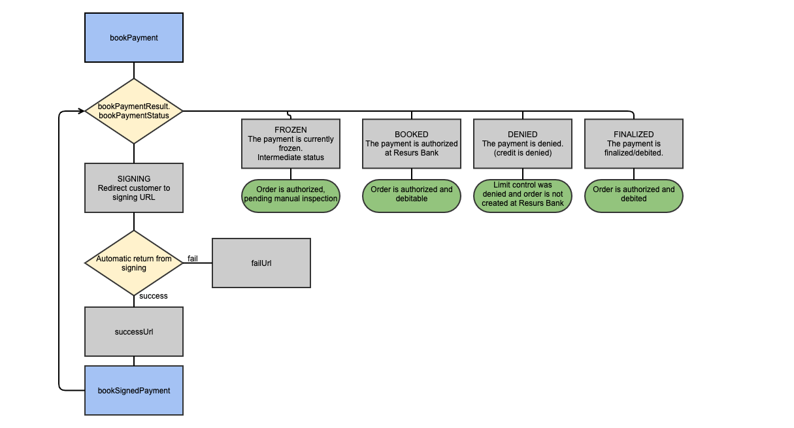
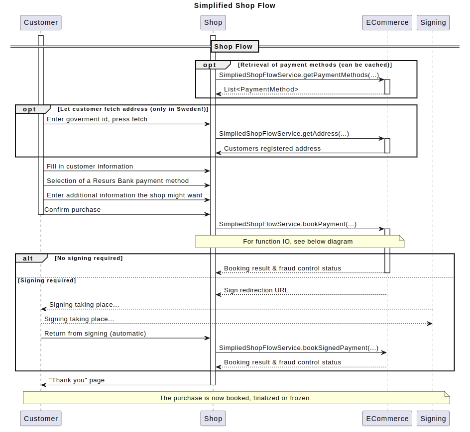

# Simplified Flow API 

### Get started
1.  Get [Test URLs](/testing/test-urls/)

2.  Download soapUI and run some of the tests.
3.  Figure out what functionality you'll need.
4.  Setup your [development environment](/development/)
5.  Start coding the [Shop flow](/simplified-flow-api/).
6.  Implement callbacks.
> HTTPS and certificateNote that we only support HTTPS, both in test and
> production environment. You must have a valid and issued (not self
> signed) certificate for this.

## Implement Shop flow.
The examples below demonstrates how to interact with the Application
Service.

Authentication is done by using the ***http basic authentication***.

### 1. Get all available payment methods - [getPaymentMethods](/simplified-flow-api/getpaymentmethods/)
This call can be cached for 24 hours.

#### Request and Response for API getPaymentMethodes
Request: getPaymentMethodes
```xml
<soapenv:Envelope xmlns:soapenv="http://schemas.xmlsoap.org/soap/envelope/" xmlns:sim="http://ecommerce.resurs.com/v4/msg/simplifiedshopflow">
    <soapenv:Header/>
    <soapenv:Body>
        <sim:getPaymentMethods>
            <!--Optional:-->
            <language>?</language>
            <!--Optional:-->
            <customerType>?</customerType>
            <!--Optional:-->
            <purchaseAmount>?</purchaseAmount>
        </sim:getPaymentMethods>    
    </soapenv:Body>  
</soapenv:Envelope> 
```
Response: getPaymentMethodsResponse
```xml
<soap:Envelope xmlns:soap="http://schemas.xmlsoap.org/soap/envelope/">
   <soap:Body>
      <ns3:getPaymentMethodsResponse xmlns:ns3="http://ecommerce.resurs.com/v4/msg/simplifiedshopflow" xmlns:ns2="http://ecommerce.resurs.com/v4/msg/exception">
         <return>
            <id>INVOICE</id>
            <description>Faktura via e-post</description>
            <legalInfoLinks>
               <appendPriceLast>false</appendPriceLast>
               <endUserDescription>Allmänna villkor</endUserDescription>
               <url>https://test.resurs.com/documenthandler/Dokument.pdf?customerType=natural&amp;docType=commonTerms&amp;land=SE&amp;language=sv</url>
            </legalInfoLinks>
            <legalInfoLinks>
               <appendPriceLast>true</appendPriceLast>
               <endUserDescription>Standardiserad europeisk konsumentkreditinformation (SEKKI)</endUserDescription>
               <url>https://test.resurs.com/sekki-mock/sekki?bankProductId=LG686069&amp;chainId=107&amp;countryCode=SE&amp;storeId=1000&amp;amount=</url>
            </legalInfoLinks>
            <legalInfoLinks>
               <appendPriceLast>true</appendPriceLast>
               <endUserDescription>Prisinformation</endUserDescription>
               <url>https://test.resurs.com/priceinfo-mock/prisskyltning.html?countryCode=SE&amp;authorizedBankproductId=LG686069&amp;cardType=&amp;storeId=265&amp;representativeId=107&amp;creditAmount=</url>
            </legalInfoLinks>
            <minLimit>10.00</minLimit>
            <maxLimit>50000.00</maxLimit>
            <type>INVOICE</type>
            <customerType>NATURAL</customerType>
            <specificType>INVOICE</specificType>
         </return>
         <return>
            <id>PARTPAYMENT</id>
            <description>Delbetalning via post</description>
            <legalInfoLinks>
               <appendPriceLast>false</appendPriceLast>
               <endUserDescription>Allmänna villkor</endUserDescription>
               <url>https://test.resurs.com/documenthandler/Dokument.pdf?customerType=natural&amp;docType=commonTerms&amp;land=SE&amp;language=sv</url>
            </legalInfoLinks>
            <legalInfoLinks>
               <appendPriceLast>true</appendPriceLast>
               <endUserDescription>Standardiserad europeisk konsumentkreditinformation (SEKKI)</endUserDescription>
               <url>https://test.resurs.com/sekki-mock/sekki?bankProductId=LG686069&amp;chainId=107&amp;countryCode=SE&amp;storeId=1000&amp;amount=</url>
            </legalInfoLinks>
            <legalInfoLinks>
               <appendPriceLast>true</appendPriceLast>
               <endUserDescription>Prisinformation</endUserDescription>
               <url>https://test.resurs.com/priceinfo-mock/prisskyltning.html?countryCode=SE&amp;authorizedBankproductId=LG686069&amp;cardType=&amp;storeId=265&amp;representativeId=107&amp;creditAmount=</url>
            </legalInfoLinks>
            <minLimit>10.00</minLimit>
            <maxLimit>50000.00</maxLimit>
            <type>REVOLVING_CREDIT</type>
            <customerType>NATURAL</customerType>
            <specificType>PART_PAYMENT</specificType>
         </return>
         <return>
            <id>CARD</id>
            <description>Kortköp</description>
            <minLimit>0</minLimit>
            <maxLimit>2147483647</maxLimit>
            <type>CARD</type>
            <customerType>NATURAL</customerType>
            <specificType>CARD</specificType>
         </return>
      </ns3:getPaymentMethodsResponse>
   </soap:Body>
</soap:Envelope>
```
Get all available payment methodes by using getPaymentMethodes with
language, customerType and purchaseAmount parameters.  
By using this parameters for each booking you will only get the payment
methods applicable.  
In your application, present Resurs Bank payment methodes with the
corresponding price information links.  
For each payment methode a "[read
more...](https://test.resurs.com/priceinfo-mock/prisskyltning.html?countryCode=SE&authorizedBankproductId=LG686069&cardType=&storeId=107&representativeId=107&creditAmount=4995)"
is required. Use the price information links from getPaymentMethodes or
present html from  [getCostOfPurchaseHtml](/simplified-flow-api/getcostofpurchasehtml/) in a
pop-up.  
Present the Payment Methods in the same order as in response from
getPaymentMethodes.

### 2. Fetch customer address: - [getAddress (SE)](/simplified-flow-api/getaddress/)
Enter goverment id.

#### Request and Response for API getAddress
Request: getAddress
```xml
<soapenv:Envelope xmlns:soapenv="http://schemas.xmlsoap.org/soap/envelope/" xmlns:sim="http://ecommerce.resurs.com/v4/msg/simplifiedshopflow">
   <soapenv:Header/>
   <soapenv:Body>
      <sim:getAddress>
         <governmentId>198305147715</governmentId>
         <customerType>NATURAL</customerType>
      </sim:getAddress>
   </soapenv:Body>
</soapenv:Envelope> 
```
Response: getAddress
```xml
<soap:Envelope xmlns:soap="http://schemas.xmlsoap.org/soap/envelope/">
   <soap:Body>
      <ns2:getAddressResponse xmlns:ns3="http://ecommerce.resurs.com/v4/msg/exception" xmlns:ns2="http://ecommerce.resurs.com/v4/msg/simplifiedshopflow">
         <return>
            <fullName>Vincent Williamsson Alexandersson</fullName>
            <firstName>Vincent</firstName>
            <lastName>Alexandersson</lastName>
            <addressRow1>Glassgatan 15</addressRow1>
            <postalArea>Göteborg</postalArea>
            <postalCode>41655</postalCode>
            <country>SE</country>
         </return>
      </ns2:getAddressResponse>
   </soap:Body>
</soap:Envelope> 
```

### 3. Book a payment - [bookPayment](/simplified-flow-api/bookpayment/)
Book payment flow


All the data concerning the payment is entered through this method.  
If a customer wants to deliver the order to a different address than the
billing address the field deliveryAddress is used. This will trigger a
customer authentication.

- Enter customer information. (See our [Customer data - Regular
  expressions](/development/customer-data---regular-expressions/) for different
  fields.)
- Select a Resurs Bank payment method.
- Enter additional information the shop might want.
- Confirm purchase.

#### Request and Response for API bookPayment
Request: bookPayment
```xml
<s:Envelope xmlns:s="http://schemas.xmlsoap.org/soap/envelope/">
  <s:Body xmlns:xsi="http://www.w3.org/2001/XMLSchema-instance" xmlns:xsd="http://www.w3.org/2001/XMLSchema">
    <bookPayment xmlns="http://ecommerce.resurs.com/v4/msg/simplifiedshopflow">
      <paymentData xmlns="">
        <preferredId>210000002</preferredId>
        <preferredTransactionId xsi:nil="true"/>
        <paymentMethodId>PARTPAYMENT</paymentMethodId>
        <customerIpAddress>127.0.0.1</customerIpAddress>
        <waitForFraudControl>true</waitForFraudControl>
        <annulIfFrozen>false</annulIfFrozen>
        <finalizeIfBooked>false</finalizeIfBooked>
      </paymentData>
      <orderData xmlns="">
        <specLines>
          <id>10</id>
          <artNo>255121</artNo>
          <description>HDMI 3m</description>
          <quantity>1</quantity>
          <unitMeasure>pcs</unitMeasure>
          <unitAmountWithoutVat>199.2</unitAmountWithoutVat>
          <vatPct>25.0</vatPct>
          <totalVatAmount>49.80</totalVatAmount>
          <totalAmount>249.00</totalAmount>
        </specLines>
        <specLines>
          <id>20</id>
          <artNo>101622</artNo>
          <description>Slim Case</description>
          <quantity>1</quantity>
          <unitMeasure>pcs</unitMeasure>
          <unitAmountWithoutVat>159.2</unitAmountWithoutVat>
          <vatPct>25.0</vatPct>
          <totalVatAmount>39.80</totalVatAmount>
          <totalAmount>199.00</totalAmount>
        </specLines>
        <specLines>
          <id>30</id>
          <artNo>FREIGHT</artNo>
          <description>Shipping and Handling</description>
          <quantity>1</quantity>
          <unitMeasure>pcs</unitMeasure>
          <unitAmountWithoutVat>39.2</unitAmountWithoutVat>
          <vatPct>25</vatPct>
          <totalVatAmount>9.80</totalVatAmount>
          <totalAmount>49.00</totalAmount>
        </specLines>
        <totalAmount>497.00</totalAmount>
        <totalVatAmount>99.40</totalVatAmount>
      </orderData>
      <metaData xmlns="">
        <key>Express Shipping</key>
        <value>True</value>
      </metaData>
      <customer xmlns="">
        <governmentId>198305147715</governmentId>
        <address>
          <fullName>Vincent Williamsson</fullName>
          <firstName>Vincent</firstName>
          <lastName>Williamsson</lastName>
          <addressRow1>Glassgatan 15</addressRow1>
          <postalArea>Göteborg</postalArea>
          <postalCode>41655</postalCode>
          <country>SE</country>
        </address>
        <phone>070112233</phone>
        <email>test@resurs.se</email>
        <type>NATURAL</type>
        <cellPhone>070112233</cellPhone>
        <yourCustomerId>321456987</yourCustomerId>
        <deliveryAddress>
          <fullName>Vincent Williamsson</fullName>
          <firstName>Vincent</firstName>
          <lastName>Williamsson</lastName>
          <addressRow1>Glassgatan 15</addressRow1>
          <postalArea>Göteborg</postalArea>
          <postalCode>41655</postalCode>
          <country>SE</country>
        </deliveryAddress>
        <contactGovernmentId/>
      </customer>
      <card xmlns="" xsi:nil="true"/>
      <signing xmlns="">
        <successUrl>http://www.mysite.se/Checkout/ResursDone?orderNumber=210000001</successUrl>
        <failUrl>http://www.mysite.se/Checkout/ResursFailed</failUrl>
      </signing>
      <invoiceData xmlns="" xsi:nil="true"/>
    </bookPayment>
  </s:Body>
</s:Envelope>
```
Response: bookPaymentResponse
```xml
<soap:Envelope xmlns:soap="http://schemas.xmlsoap.org/soap/envelope/">
   <soap:Body>
      <ns3:bookPaymentResponse xmlns:ns3="http://ecommerce.resurs.com/v4/msg/simplifiedshopflow" xmlns:ns2="http://ecommerce.resurs.com/v4/msg/exception">
         <return>
            <paymentId>210000002</paymentId>
            <bookPaymentStatus>SIGNING</bookPaymentStatus>
            <signingUrl>https://test.resurs.com/mock-mock/authenticate?resursToken=4f017bc9-07ec-45b4-b4c5-f6d206766393</signingUrl>
            <approvedAmount>497</approvedAmount>
            <customer>
               <governmentId>8305147715</governmentId>
               <address>
                  <fullName>Vincent Williamsson Alexandersson</fullName>
                  <firstName>Vincent</firstName>
                  <lastName>Alexandersson</lastName>
                  <addressRow1>Glassgatan 15</addressRow1>
                  <postalArea>Göteborg</postalArea>
                  <postalCode>41655</postalCode>
                  <country>SE</country>
               </address>
               <phone>+4670112233</phone>
               <email>test@resurs.se</email>
               <type>NATURAL</type>
            </customer>
         </return>
      </ns3:bookPaymentResponse>
   </soap:Body>
</soap:Envelope>
```
When you submit the bookPayment the response will be one of these
bookPaymentStatus:

- FINALIZED - The payment is finalized. Notify the customer and continue
  with the normal flow.
- BOOKED - The payment is booked and you will have to finalize it on
  your own. To finalize booked payments automatically you can set a flag
  in the bookPayment.
- FROZEN - The payment is currently frozen. This typically means that
  there is something that needs further investigation before the payment
  can be finalized.
- SIGNING - The payment requires Signing. Redirect customer to signing
  URL. After a successful signing the order needs to be booked with
  bookSignedPayment.
- DENIED - The payment is denied. The payment method can't be used for
  the customer and the flow stops. Another payment method without
  credit might work for the customer.

### 4. Book signed payment - [bookSignedPayment](/simplified-flow-api/booksignedpayment/)
After a successful signing the order needs to be booked:

#### Request and response for bookSignedPayment
Request: bookSignedPayment
```xml
<soapenv:Envelope xmlns:soapenv="http://schemas.xmlsoap.org/soap/envelope/" xmlns:sim="http://ecommerce.resurs.com/v4/msg/simplifiedshopflow">    
   <soapenv:Header/>    
   <soapenv:Body>       
      <sim:bookSignedPayment>          
    <paymentId>210000002</paymentId>       
      </sim:bookSignedPayment>    
   </soapenv:Body> 
</soapenv:Envelope>
```
Response: bookPaymentResponse
```xml
<soap:Envelope xmlns:soap="http://schemas.xmlsoap.org/soap/envelope/">
   <soap:Body>
      <ns2:bookPaymentResponse xmlns:ns3="http://ecommerce.resurs.com/v4/msg/exception" xmlns:ns2="http://ecommerce.resurs.com/v4/msg/simplifiedshopflow">
         <return>
            <paymentId>210000002</paymentId>
            <bookPaymentStatus>BOOKED</bookPaymentStatus>
            <signingUrl xsi:nil="true" xmlns:xsi="http://www.w3.org/2001/XMLSchema-instance"/>
            <approvedAmount>497</approvedAmount>
            <customer>
               <governmentId>8305147715</governmentId>
               <address>
                  <fullName>Vincent Williamsson Alexandersson</fullName>
                  <firstName>Vincent</firstName>
                  <lastName>Alexandersson</lastName>
                  <addressRow1>Glassgatan 15</addressRow1>
                  <postalArea>Göteborg</postalArea>
                  <postalCode>41655</postalCode>
                  <country>SE</country>
               </address>
               <phone>+4670112233</phone>
               <email>test@resurs.se</email>
               <type>NATURAL</type>
            </customer>
         </return>
      </ns2:bookPaymentResponse>
   </soap:Body>
</soap:Envelope>
```
### The purchase is now booked, finalized, frozen or denied.
You can choose to manage the order in Resurs Merchant
Portal gui, or by using Resurs Order Management API [After Shop Service](/after-shop-service-api/) .

### Implement Callbacks



